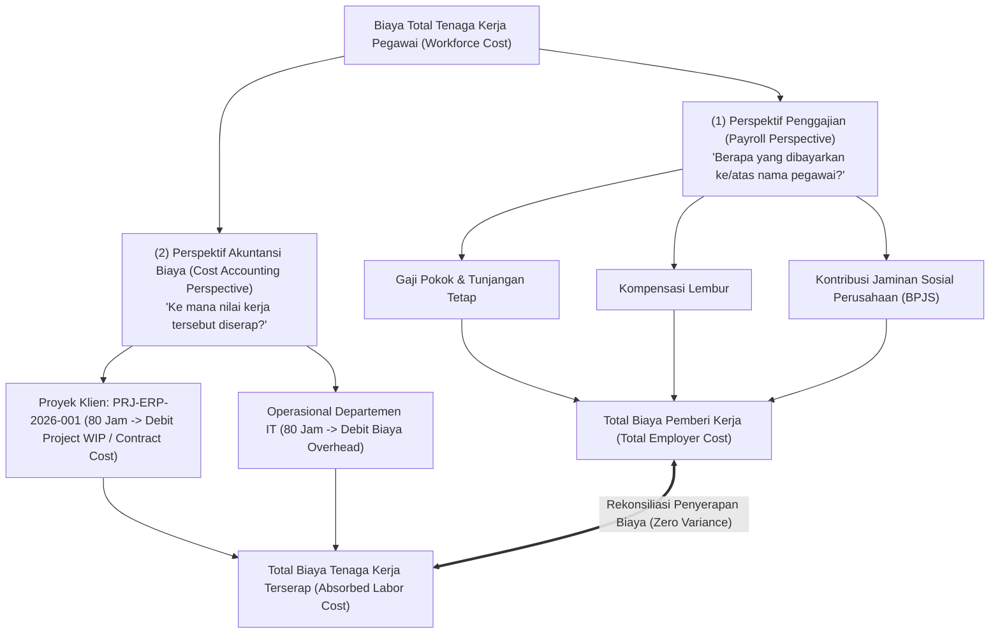
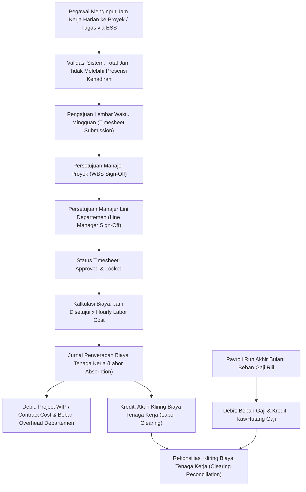

# Employee Timesheet and Labor Cost

## Definition

**Employee Timesheet and Labor Cost** adalah mekanisme integrasi strategis di dalam Enterprise Resource Planning (ERP) yang mencatat, memvalidasi, dan mengalokasikan jam kerja produktif pegawai ke dalam objek biaya manajerial (*cost objects*)—seperti elemen rincian kerja proyek (*Project WBS*), pesanan manufaktur (*Manufacturing Orders*), atau pusat biaya departemen (*Department Cost Centers*)—guna menghitung penyerapan biaya tenaga kerja riil (*labor cost absorption*).

Di dalam arsitektur ERP enterprise, lembar waktu kerja (*Timesheet*) bertindak sebagai **jembatan penghubung antara domain Sumber Daya Manusia (HR) dengan Akuntansi Biaya (Cost Accounting)**:
1. Mengubah waktu kerja intelektual dan fisik pegawai menjadi nilai moneter yang dapat diatribusikan ke harga pokok produksi atau harga pokok jasa.
2. Memisahkan secara tegas antara biaya penggajian yang dibayarkan kepada individu (*Payroll Compensation*) dengan biaya tenaga kerja yang diserap oleh aktivitas bisnis (*Absorbed Labor Cost*).

---

## Purpose

Tujuan penerapan Employee Timesheet and Labor Cost di dalam ERP adalah:

1. **Atribusi Biaya Tenaga Kerja Presisi (*Accurate Cost Attribution*)**: Menghilangkan pembebanan gaji secara merata (*arbitrary flat overhead*) dan menggantikannya dengan pembebanan berbasis pemicu aktivitas riil (*Activity-Based Costing*).
2. **Kalkulasi Biaya Pokok Proyek & Manufaktur**: Memasukkan komponen biaya tenaga kerja langsung (*Direct Labor*) ke dalam akumulasi biaya proyek (*Project WIP / Contract Cost*) pada modul [[09-project/timesheet-and-effort-tracking|Project Management (Phase 10)]] atau pesanan manufaktur pada modul [[06-manufacturing/production-costing-and-wip|Manufacturing (Phase 7)]] sesuai kriteria kapitalisasi biaya kontrak dan standar akuntansi yang berlaku.
3. **Pengukuran Produktivitas & Utilisasi Kerja**: Menganalisis perbandingan antara jam kerja yang dapat ditagihkan ke pelanggan (*billable hours*) terhadap jam kerja operasional internal (*non-billable overhead*).
4. **Rekonsiliasi Biaya Penggajian vs Penyerapan Biaya (*Labor Cost Reconciliation*)**: Memastikan pengeluaran kompensasi pegawai di modul HR terserap secara tertib ke objek biaya yang tepat tanpa meninggalkan saldo varians yang tidak terjelaskan pada akun kliring.
5. **Pondasi Penagihan Komersial (*T&M Billing Engine*)**: Menyediakan bukti jam kerja terverifikasi untuk penerbitan faktur tagihan proyek bernilai waktu dan material (*Time & Materials*).

---

## Dua Perspektif Biaya Tenaga Kerja di ERP

ERP enterprise memisahkan biaya pegawai ke dalam dua sudut pandang yang berbeda:

### 1. Perspektif Penggajian (Payroll Perspective)
Berfokus pada pemenuhan hak legal dan kontraktual individu:
$$\text{Total Employer Cost} = \text{Gross Salary} + \text{Employer Statutory Contributions}$$

### 2. Perspektif Akuntansi Biaya (Cost Accounting Perspective)
Berfokus pada nilai penyerapan waktu kerja pegawai ke aktivitas penghasil pendapatan atau aset perusahaan:
$$\text{Tarif Tenaga Kerja Per Jam (Hourly Rate)} = \frac{\text{Total Employer Cost Per Bulan}}{\text{Standar Jam Kerja Produktif Per Bulan (e.g. 160 Jam)}}$$

---

## Attendance vs Timesheet: Pembedaan Sistemik

| Dimensi Evaluasi | Modul Kehadiran (Attendance) | Modul Lembar Waktu (Timesheet) |
| :--- | :--- | :--- |
| **Pertanyaan Inti** | *"Apakah pegawai hadir di tempat kerja?"* | *"Aktivitas apa yang dikerjakan oleh pegawai?"* |
| **Tujuan Bisnis** | Disiplin presensi, kelayakan tunjangan kehadiran, kepatuhan shift. | Alokasi biaya proyek (*Costing*), penagihan klien (*Billing*), penyerapan biaya tenaga kerja. |
| **Objek Pencatatan** | Stempel jam masuk dan pulang (*Clock-in / Clock-out*). | Objek biaya: Kode Proyek WBS, Nomor MO Pabrik, Kode Tugas. |
| **Sifat Data** | Ditangkap otomatis via terminal biometrik atau mobile GPS. | Diinput mandiri oleh pegawai berdasarkan porsi jam kerja riil. |
| **Dampak Finansial** | Potongan absensi mangkir pada slip gaji. | Jurnal pembebanan biaya ke buku pembantu proyek atau manufaktur. |

---

## Business Process: Alur Pelaporan dan Alokasi Lembar Waktu

Alur alokasi jam kerja dari pengisian lembar waktu hingga pembukuan akuntansi biaya:

---

## Business Rules

1. **Batas Plafon Jam Kehadiran Fisik (*Attendance Cap Rule*)**: Total jam kerja yang dialokasikan dalam seluruh baris timesheet harian dilarang melebihi durasi jam kehadiran fisik efektif yang tercatat pada modul presensi (*Attendance*) pada hari yang sama.
2. **Pencegahan Alokasi Waktu Ganda (*No Double Booking*)**: Pegawai dilarang mencatat alokasi waktu pada dua aktivitas atau proyek yang berbeda pada rentang waktu jam yang sama.
3. **Penguncian Lembar Waktu Pasca-Persetujuan (*Timesheet Lockdown*)**: Lembar waktu yang telah disetujui (*Approved*) oleh Project Manager dikunci permanen dari pengeditan atau penghapusan manual. Setiap koreksi jam kerja wajib melalui alur *Timesheet Adjustment Request*.
4. **Keterikatan Validitas Siklus Proyek**: Sistem menolak pencatatan jam kerja timesheet pada kode WBS proyek yang berstatus *Closed*, *On Hold*, atau belum dirilis (*Unreleased*).
5. **Basis Standar Jam Produktif Bulanan**: Standar jam kerja produktif bulanan dikonfigurasi berdasarkan kalender kerja normal (misalnya 20 hari kerja $\times$ 8 jam = 160 jam kerja produktif per bulan).

---

## Accounting & Financial Impact

Integrasi timesheet dan biaya tenaga kerja melibatkan akun-akun perantara kliring akuntansi biaya (*Secondary Cost Allocation*):

### 1. Jurnal Alokasi Biaya Tenaga Kerja dari Timesheet (Cost Allocation Entry - J4)
Ketika 160 jam kerja Andi Pratama dialokasikan ke proyek dan operasional:

$$\begin{array}{llrr}
\text{Debit:} & \text{Project WIP / Contract Cost (PRJ-ERP-2026-001)} & \text{Rp6.400.000} & \\
\text{Debit:} & \text{Departmental Overhead Expense (CC-TECH-01)} & \text{Rp6.400.000} & \\
\text{Kredit:} & \text{Direct Labor Absorption / Clearing Account} & & \text{Rp12.800.000}
\end{array}$$

### 2. Jurnal Reklasifikasi Akun Kliring Tenaga Kerja (Clearing Reclassification Entry - J5)
Pada penutupan siklus penggajian, akun kliring ditutup terhadap beban gaji pokok dan tunjangan yang telah diakrualkan:

$$\begin{array}{llrr}
\text{Debit:} & \text{Direct Labor Absorption / Clearing Account} & \text{Rp12.800.000} & \\
\text{Kredit:} & \text{Salary & Allowance Expense} & & \text{Rp11.500.000} \\
\text{Kredit:} & \text{Overtime Expense} & & \text{Rp500.000} \\
\text{Kredit:} & \text{Employer Statutory Contribution Expense (BPJS Kantor)} & & \text{Rp800.000}
\end{array}$$

*Hasil Rekonsiliasi*: Saldo akun *Direct Labor Absorption / Clearing Account* menjadi **Rp0 (Nihil)**. Beban operasional tenaga kerja telah dipindahkan secara tertib ke objek biaya proyek (Rp6.400.000) dan overhead departemen (Rp6.400.000).

> [!NOTE]
> **Kebijakan Akuntansi & Pola Arsitektur Biaya**:
> 1. **Kriteria Kapitalisasi Proyek**: Biaya tenaga kerja proyek tidak otomatis menjadi aset persediaan/WIP dalam setiap kondisi. Biaya tenaga kerja yang memenuhi kriteria kapitalisasi biaya kontrak (misalnya *costs to fulfil a contract* di bawah IFRS 15 / PSAK 72) dapat dialokasikan ke *Project WIP / Contract Cost*. Biaya proyek lainnya dapat langsung diakui sebagai beban periode berjalan (*Project Labor Expense*) sesuai standar akuntansi dan kebijakan organisasi.
> 2. **Pola Kliring (J4 + J5)**: Penggunaan akun kliring penyerapan tenaga kerja (*clearing account*) merupakan salah satu pola arsitektur alokasi biaya (*cost allocation architecture pattern*). Pola alternatif pada sebagian ERP adalah memposting biaya langsung ke akun proyek saat entri timesheet disahkan tanpa melalui akun perantara kliring.

---

## Skenario Kanonikal: Alokasi Jam Kerja Andi Pratama

Meneruskan skenario kanonikal pegawai `Andi Pratama` (`EMP-2026-0042`) di `PT Maju Bersama` sebagai asumsi pembelajaran:

- **Standar Jam Kerja Produktif Bulan April 2026**: 160 Jam
- **Total Biaya Pemberi Kerja (Total Employer Cost)**:
  - Gaji Pokok: Rp10.000.000
  - Tunjangan Tetap: Rp1.500.000
  - Upah Lembur Sah: Rp500.000
  - Kontribusi Jaminan Sosial Perusahaan: Rp800.000
  - **Total Biaya Riil**: **Rp12.800.000**
- **Tarif Biaya Tenaga Kerja Per Jam (*Hourly Labor Cost*)**:
  $$\text{Hourly Rate} = \frac{\text{Rp12.800.000}}{160\text{ Jam}} = \mathbf{Rp80.000/\text{Jam}}$$

### Distribusi Alokasi Jam Kerja Bulanan:

| Objek Biaya Penerima | Rincian Aktivitas Kerja | Jam Kerja | Tarif / Jam | Total Nilai Beban | Perlakuan Akuntansi |
| :--- | :--- | :--- | :--- | :--- | :--- |
| **Proyek PRJ-ERP-2026-001** | Kustomisasi Modul Keuangan & Integrasi API | 80 Jam | Rp80.000 | **Rp6.400.000** | Debit Akun Project WIP / Contract Cost (WBS PRJ-02) |
| **Departemen Technology** | Pemeliharaan Server Internal & Pelatihan Tim | 80 Jam | Rp80.000 | **Rp6.400.000** | Debit Akun Beban Overhead (CC-TECH-01) |
| **Total Terserap** | | **160 Jam** | | **Rp12.800.000** | **Penyerapan Penuh, Saldo Kliring Rp0** |

*Korelasi ke Phase 10*: Nilai Rp6.400.000 ini berkontribusi langsung pada akumulasi biaya tenaga kerja proyek implementasi ERP pelanggan `PT Maju Bersama` pada modul [[09-project/project-cost-management|Project Cost Management]].

---

## ERP Implementation

Penerapan integrasi timesheet dan biaya tenaga kerja pada platform ERP terkemuka:

### Odoo Implementation
- **Timesheets App (`hr.timesheet`)**: Terintegrasi langsung dengan modul *Project* dan *Analytic Accounting*.
- **Employee Cost on Timesheet**: Odoo menyimpan field `timesheet_cost` pada formulir pegawai; setiap kali jam kerja diposting, baris *Analytic Item* terbentuk secara otomatis mendebit akun analitik proyek.
- **Grid View & Mobile Time Tracking**: Memudahkan pengguna menginput jam kerja per hari atau per minggu dalam bentuk tabel matriks.

### ERPNext Implementation
- **Timesheet DocType**: Mencatat tabel rincian aktivitas (*Time Logs*) dengan referensi `Project`, `Activity Type`, dan `Task`.
- **Billing and Costing Rates**: Membedakan field `billing_rate` (untuk menagih klien via *Sales Invoice*) dengan `costing_rate` (untuk menghitung beban biaya tenaga kerja riil pada *Project*).
- **Salary Slip from Timesheet**: ERPNext mendukung pembuatan slip gaji berbasis lembar waktu kerja untuk tenaga kerja honorer atau konsultan lepas.

### Dynamics 365 Implementation
- **Project Operations Time Entry**: Menyediakan antarmuka pendaftaran waktu multi-dimensi yang terhubung ke WBS proyek dan profil peran (*Resource Role*).
- **Dual-Rate Matrix Architecture**: Menerapkan matriks tarif biaya (*Cost Price Matrix*) dan matriks tarif jual (*Sales Price Matrix*) independen berbasis dimensi keahlian dan lokasi.
- **Labor Absorption Journal**: Menggunakan jurnal akuntansi proyek untuk memindahkan biaya lembar waktu ke akun WIP neraca atau langsung ke laporan laba rugi.

---

## Naventra Consideration

Dalam perancangan modul lembar waktu dan biaya tenaga kerja Naventra ERP:

1. **Rekonsiliasi Otomatis Jam Presensi vs Jam Proyek**: Antarmuka lembar waktu Naventra menampilkan bilah indikator kehadiran fisik secara berdampingan. Sistem memperingatkan pengguna jika lembar kerja yang diinput melebihi jam presensi kantor pada hari bersangkutan.
2. **Dynamic Blended Rate Engine**: Naventra menyediakan mesin kalkulasi tarif per jam yang secara dinamis memperhitungkan komponen gaji pokok dan tunjangan aktual bulan berjalan, memastikan nilai penyerapan biaya tenaga kerja mencerminkan biaya finansial riil.
3. **One-Click Approval by WBS Manager**: Manajer proyek dapat menyetujui seluruh lembar kerja tim dalam satu tampilan matriks terpadu dengan validasi sisa anggaran jam kerja (*Effort Baseline*) secara *real-time*.

---

## References

- Kaplan, R. S., & Atkinson, A. A. (2015). *Advanced Management Accounting* (3rd ed.). Pearson.
- Project Management Institute (PMI). (2021). *A Guide to the Project Management Body of Knowledge (PMBOK Guide)* (7th ed.). Project Management Institute.
- SAP Help Portal. *Cross-Application Time Sheet (CATS) in SAP S/4HANA*.
- Microsoft Learn. *Time Entry and Labor Costing in Dynamics 365 Project Operations*.
- ERPNext Documentation. *Timesheet and Labor Costing*.
- Odoo 17.0 Documentation. *Timesheets and Analytic Accounting Integration*.
