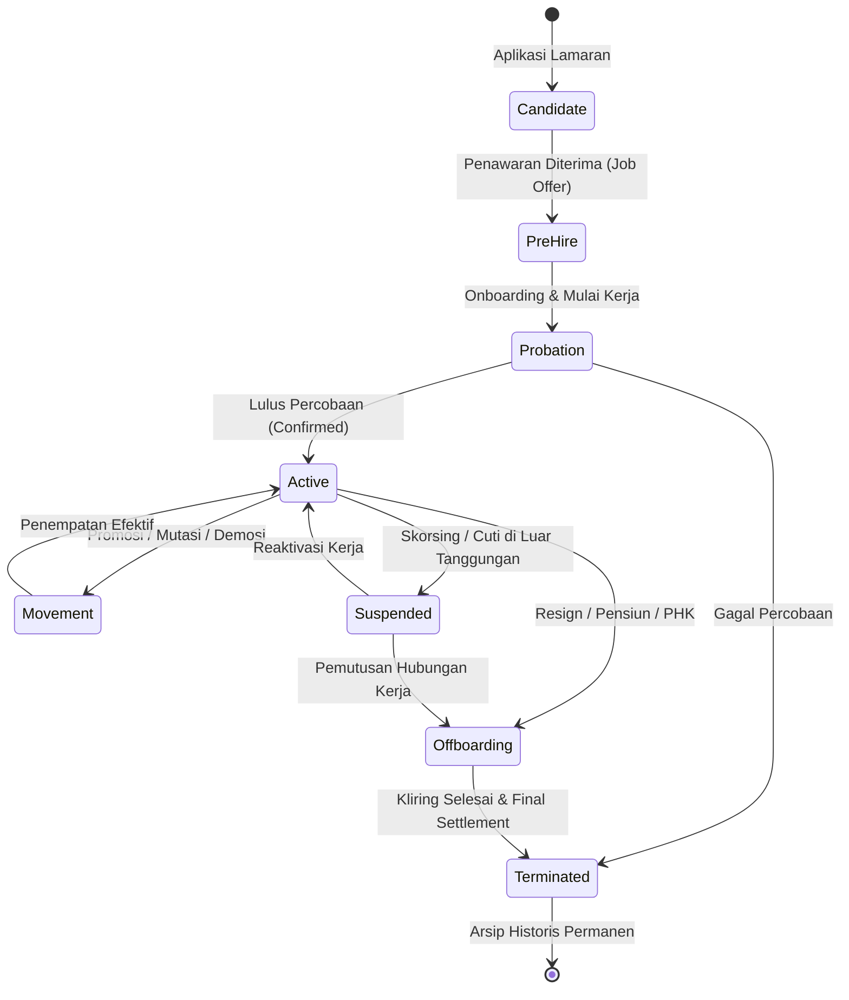

# Employment Lifecycle

## Definition

**Employment Lifecycle** (Siklus Hidup Hubungan Kerja) di dalam Enterprise Resource Planning (ERP) adalah pemodelan status transisi dan manajemen peristiwa kepegawaian (*human resource life events*) yang dialami oleh seorang tenaga kerja sejak tahap pra-kerja (*pre-hire*), masa orientasi (*onboarding*), status kerja aktif (*active employment*), mutasi dan promosi (*movements*), hingga pemutusan hubungan kerja (*offboarding & separation*).

Di dalam ERP, siklus hidup hubungan kerja dioperasikan sebagai sebuah **Mesin Status (*State Machine*) yang terintegrasi secara lintas fungsi**. Setiap perpindahan status (*status transition*) bukan sekadar perubahan label teks pada profil pegawai, melainkan memicu aksi sistemik otomatis pada hak akses sistem (*RBAC*), kelayakan proses penggajian (*payroll eligibility*), penugasan kustodian aset, dan kewajiban pelaporan hukum statutori.

---

## Purpose

Tujuan pengelolaan Employment Lifecycle yang terstruktur di dalam ERP adalah:

1. **Tata Kelola Status Tenaga Kerja Terpadu**: Memberikan kepastian status hukum operasional pegawai pada setiap titik waktu untuk keperluan operasional dan audit.
2. **Pencegahan Akses Ilegal (*Zero-Trust Security Offboarding*)**: Memastikan seluruh akun sistem, email, dan hak otorisasi finansial dinonaktifkan secara instan pada tanggal efektif pemutusan hubungan kerja.
3. **Otomatisasi Hak dan Kewajiban Finansial**: Mengaktifkan atau menonaktifkan keterlibatan pegawai dalam proses *payroll run*, akumulasi hak cuti tahunan, dan hak tunjangan kesehatan secara akurat.
4. **Kliring Aset & Kewajiban (*Asset & Liability Clearance*)**: Mengunci penyaluran uang pesangon atau gaji terakhir (*Final Settlement*) hingga seluruh aset kantor yang dipinjamkan telah dikembalikan ke departemen logistik.
5. **Rekam Jejak Karir Berkelanjutan (*Comprehensive Career Timeline*)**: Menyimpan riwayat perubahan status, kepangkatan, dan evaluasi kinerja secara kronologis tanpa menghapus jejak historis.

---

## Tahapan Siklus Hidup Hubungan Kerja

Siklus hidup pegawai di dalam ERP mencakup delapan tahapan transisi status:

### 1. Candidate / Applicant (Kandidat Rekrutmen)
- Data pelamar berada di modul rekrutmen; belum memiliki NIP dan belum berstatus sebagai pegawai resmi perusahaan.

### 2. Pre-Hire & Offer Acceptance (Pra-Kerja)
- Kandidat menerima surat penawaran kerja (*Job Offer Letter*).
- Sistem mencatat estimasi tanggal mulai kerja (*Target Hire Date*) dan menyiapkan formulir kelengkapan data pribadi.

### 3. Onboarding & Probation (Orientasi & Masa Percobaan)
- Master data pegawai resmi (`EMP-ID`) diterbitkan.
- Pegawai menjalani masa percobaan (biasanya 3 bulan untuk PKWTT sesuai regulasi umum ketenagakerjaan). Akun pengguna sistem dan perangkat kerja diserahkan.

### 4. Active Employment (Pegawai Aktif Tetap)
- Pegawai berstatus penuh (*Confirmed Employee*); berhak atas seluruh fasilitas tunjangan, akumulasi kuota cuti tahunan, dan evaluasi kinerja berkala.

### 5. Workforce Movements (Mutasi, Promosi & Demosi)
- **Promotion**: Kenaikan jenjang kepangkatan (*Job Grade*) yang diikuti penyesuaian skala upah dan wewenang otorisasi.
- **Transfer / Relocation**: Perpindahan penempatan antar departemen, cabang fisik, atau entitas anak perusahaan grup (*Intercompany Transfer*).
- **Demotion**: Penurunan jenjang jabatan akibat evaluasi disiplin atau restrukturisasi organisasi.

### 6. Suspended / Inactive Status (Skorsing atau Penangguhan Sementara)
- Pegawai cuti di luar tanggungan (*Unpaid Sabbatical Leave*) atau menjalani sanksi skorsing disipliner. Hak akses sistem dibekukan sementara, dan status kelayakan gaji dihentikan atau disesuaikan.

### 7. Offboarding (Proses Pemutusan Hubungan Kerja)
- Pegawai mengajukan pengunduran diri (*Resignation*), memasuki masa pensiun, berakhirnya jangka waktu kontrak PKWT, atau mengalami pemutusan hubungan kerja (PHK).
- Sistem mengaktifkan lembar kliring digital (*Exit Clearance Checklist*): serah terima tugas operasional, pengembalian aset, dan pelunasan pinjaman karyawan.

### 8. Terminated & Archived (Terminasi Final & Arsip)
- Pegawai resmi keluar dari sistem aktif. Perusahaan membayarkan penyelesaian hak akhir (*Final Settlement* / Uang Penggantian Hak / Uang Pisah / Pesangon). Seluruh akun diblokir permanen.

---

## Business Rules

1. **Integritas Mesin Status (*State Transition Validation*)**: Pegawai tidak dapat langsung melompat dari status *Candidate* menjadi *Active* tanpa melalui tahapan *Onboarding*. Status *Terminated* tidak dapat diubah kembali menjadi *Active* tanpa melalui prosedur penerimaan kembali (*Re-hiring Workflow*).
2. **Pola Pemutusan Hubungan Kerja (*Termination Lock Pattern*)**: Sistem dapat mengotomatisasi pencabutan hak akses login akun ERP pegawai berdasarkan tanggal efektif keluar (*Effective Termination Date*) dan kebijakan keamanan akses organisasi.
3. **Prasyarat Final Settlement (Zero Liability & Asset Check)**: Pembayaran hak akhir dan pesangon dapat disyaratkan menunggu persetujuan formulir kliring aset (*Asset Clearance*) oleh Departemen IT dan Bagian Umum (GA).
4. **Validasi Evaluasi Masa Percobaan (*Probation Decision Deadline*)**: Sistem dapat mengonfigurasi batas waktu bagi manajer atasan untuk memasukkan penilaian konfirmasi (*Confirmation Review*) sebelum masa percobaan berakhir guna memicu tindak lanjut status kontrak.
5. **Pencatatan Riwayat Non-Destruktif (*Non-Destructive History*)**: Rekaman data pegawai yang pernah menerima pembayaran gaji atau menandatangani transaksi operasional dipertahankan dengan status *Terminated / Inactive* untuk integritas jejak audit keuangan tanpa menghapus baris historis (*soft-delete/archive pattern*).

---

## Accounting & Financial Impact

Perubahan status siklus hidup pegawai secara langsung mengendalikan modul keuangan dan akuntansi:

1. **Penyelesaian Hak Akhir (*Final Settlement & Severance Pay*)**:
   - Pemutusan hubungan kerja memicu penerbitan slip pembayaran akhir yang mencakup: sisa gaji prorata hari kerja terakhir, kompensasi sisa hak cuti tahunan yang belum gugur (*leave encashment*), serta uang pesangon atau uang penghargaan masa kerja (UPMK) sesuai kebijakan perusahaan dan regulasi ketenagakerjaan.
2. **Jurnal Penyelesaian Pembayaran Akhir (Contoh Skenario Offboarding)**:
   - Pengakuan kewajiban pesangon dan hak sisa:

$$\begin{array}{llrr}
\text{Debit:} & \text{Severance & Separation Expense (Beban Pesangon)} & \text{Rp20.000.000} & \\
\text{Debit:} & \text{Salaries Expense (Beban Gaji Prorata)} & \text{Rp5.000.000} & \\
\text{Kredit:} & \text{Withholding Tax Payable (Hutang PPh 21 Final Pesangon)} & & \text{Rp1.000.000} \\
\text{Kredit:} & \text{Employee Final Settlement Payable (Hutang Akhir Pegawai)} & & \text{Rp24.000.000}
\end{array}$$

3. **Rekonsiliasi Pinjaman Pegawai (*Employee Advance / Loan Deduction*)**:
   - Jika pegawai memiliki sisa saldo pinjaman pribadi atau uang muka dinas (*cash advance*) yang belum dipertanggungjawabkan pada modul [[07-finance/payment-and-cash-disbursement|Finance (Phase 8)]], saldo tersebut secara otomatis dipotongkan dari nilai bersih *Final Settlement*.

---

## Skenario Kanonikal: Jejak Karir Andi Pratama

Rekam jejak transisi siklus hidup hubungan kerja pegawai kanonikal `Andi Pratama` di `PT Maju Bersama`:

| No | Tanggal Peristiwa | Status Awal | Status Tujuan | Jenis Peristiwa Kepegawaian | Dokumen Referensi |
| :--- | :--- | :--- | :--- | :--- | :--- |
| 1 | 15 Des 2023 | *Candidate* | *Pre-Hire* | Penerimaan Surat Penawaran Kerja | `OFF-2023-1102` |
| 2 | 01 Jan 2024 | *Pre-Hire* | *Probation* | Onboarding Resmi & Mulai Kerja | `EMP-2026-0042` |
| 3 | 01 Apr 2024 | *Probation* | *Active* | Lulus Evaluasi & Pengangkatan PKWTT | `CONF-2024-0035` |
| 4 | 01 Jan 2026 | *Active* | *Active* | Promosi Jabatan (Grade 3 $\rightarrow$ Grade 4) | `PROM-2026-0012` |
| 5 | *Masa Kini* | *Active* | *Active* | Eksekusi Implementasi Proyek ERP Naventra | `PRJ-ERP-2026-001` |

*Keterangan Skenario*: Andi Pratama saat ini berstatus *Active* dengan performa stabil, menempati formasi posisi `POS-TECH-042` pada *Grade 4* dengan gaji pokok Rp10.000.000. Seluruh tahapan durasi masa percobaan 3 bulan, tanggal pengangkatan, dan siklus promosi di atas merupakan asumsi skenario pembelajaran (*illustrative learning scenario*) dan bukan ketentuan universal seluruh organisasi.

---

## ERP Implementation

Pola pengelolaan siklus hidup pegawai pada software ERP enterprise:

### Odoo Implementation
- **Employee Lifecycle via Kanban Stages**: Odoo mengelola kandidat di modul *Recruitment*, memindahkannya ke *Employee* via aksi *Create Employee*.
- **Contract End & Archiving**: Saat pegawai berhenti, status kontrak kerja diubah menjadi *Expired* atau *Cancelled*, dan profil pegawai diarsipkan (*Archived*). Pengarsipan otomatis memblokir login pengguna terkait.
- **Departure Reasons**: Odoo menyediakan wizard *Departure Reason* (Resign, Fired, Retired) yang memandu penutupan kontrak dan penonaktifan akun secara simultan.

### ERPNext Implementation
- **Employee Lifecycle DocTypes**: Menyediakan dokumen formal terpisah: `Employee Onboarding`, `Employee Transfer`, `Employee Promotion`, dan `Employee Separation`.
- **Employee Status**: Memiliki opsi status baku: *Active*, *Left*, *Suspended*.
- **Exit Interview & Full and Final Statement**: Memiliki fitur `Full and Final Statement` yang secara otomatis mengumpulkan sisa hari cuti, aset yang belum dikembalikan, dan hutang pinjaman pegawai sebelum menerbitkan slip pembayaran akhir.

### Dynamics 365 Implementation
- **Personnel Actions**: Setiap mutasi, kenaikan gaji, atau perubahan posisi wajib diproses melalui dokumen persetujuan formal bertanggal efektif (*Personnel Actions*).
- **Worker Lifecycle States**: Membedakan status *Past Worker*, *Current Worker*, dan *Future Worker*.
- **Task Checklists**: Menyediakan mesin *Onboarding & Offboarding Checklist* yang secara otomatis menugaskan tugas lintas departemen (IT menyerahkan laptop, GA menyiapkan meja kerja, Finance mendaftarkan rekening).

---

## Naventra Consideration

Dalam perancangan modul siklus hidup pegawai Naventra ERP:

1. **State Machine Terotomatisasi Penuh**: Mesin transisi status Naventra mengunci perubahan status manual di basis data. Perubahan dari *Active* ke *Terminated* wajib melalui alur *Offboarding Wizard* yang memvalidasi persetujuan atasan dan kliring logistik.
2. **Instant Deprovisioning Webhook**: Penandatanganan dokumen pemutusan hubungan kerja memicu *webhook* otomatis yang secara instan mencabut token sesi login web/mobile pegawai dan membekukan kartu akses RFID gedung kantor.
3. **Automated Final Settlement Engine**: Sistem secara otomatis menghitung kalkulasi hak pesangon dan kompensasi cuti berdasarkan masa kerja historis yang tercatat sejak tanggal *Hire Date*, menghasilkan usulan voucher pembayaran (*Payment Proposal*) yang siap dieksekusi oleh bagian *Treasury*.

---

## References

- Society for Human Resource Management (SHRM). (2020). *Managing the Employee Lifecycle: Onboarding to Separation*. SHRM.
- Armstrong, M., & Taylor, S. (2020). *Armstrong's Handbook of Human Resource Management Practice* (15th ed.). Kogan Page.
- SAP Help Portal. *Personnel Administration and Employee Life Events in SAP S/4HANA*.
- Microsoft Learn. *Manage Employee Lifecycle and Worker Actions in Dynamics 365 Human Resources*.
- ERPNext Documentation. *Employee Lifecycle Management*.
- Odoo 17.0 Documentation. *Recruitment and Employee Offboarding*.
