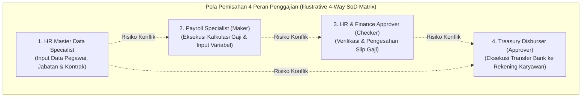

# HR Controls and Governance

## Definition

**HR Controls and Governance** (Pengendalian Internal dan Tata Kelola SDM) di dalam Enterprise Resource Planning (ERP) adalah kerangka kerja tata kelola risiko, kepatuhan, dan keamanan data yang menegakkan pemisahan tugas (*Segregation of Duties - SoD*), hierarki delegasi wewenang (*Delegation of Authority*), perlindungan informasi data pribadi sensitif (*Personally Identifiable Information - PII*), serta pemeliharaan jejak audit tak terbantahkan (*Immutable Audit Trail*) di seluruh siklus hidup ketenagakerjaan dan penggajian.

Di dalam arsitektur ERP enterprise, modul HR dan Payroll merupakan **area dengan risiko kecurangan finansial (*fraud*) dan pelanggaran privasi data tertinggi**:
1. Menampung data pengeluaran kas terbesar perusahaan (biaya gaji dan kompensasi) yang rentan terhadap manipulasi rekening bank atau penciptaan pegawai fiktif (*ghost employees*).
2. Menyimpan data pribadi rahasia pegawai yang tunduk pada regulasi perlindungan data pribadi dan sanksi hukum berat bila terjadi kebocoran informasi.

---

## Purpose

Penerapan HR Controls and Governance di dalam ERP bertujuan untuk:

1. **Pencegahan Kecurangan Finansial (*Payroll Fraud Prevention*)**: Memblokir potensi kolusi pencairan gaji ke rekening fiktif melalui pemisahan kewenangan mutlak antara pembuat data, pengkalkulasi gaji, penyetuju, dan eksekutor perbankan.
2. **Perlindungan Data Pribadi Sensitif (*PII & Privacy Protection*)**: Menerapkan enkripsi tingkat kolom (*column-level encryption*) dan pembatasan akses berbasis peran (*Least Privilege RBAC*) pada nomor identitas, riwayat medis, dan rekening bank.
3. **Akuntabilitas Jejak Rekam Perubahan (*Complete Auditability*)**: Memastikan setiap modifikasi terhadap nilai kompensasi, penempatan jabatan, atau nomor rekening bank tercatat stempel waktu, identitas pengubah, dan dokumen otorisasi pendukungnya.
4. **Penegakan Matriks Delegasi Wewenang (*Delegation of Authority Enforcement*)**: Mengunci proses penerimaan pegawai, promosi, dan penyesuaian gaji agar selalu mematuhi batas kewenangan persetujuan manajerial.
5. **Kepatuhan Terhadap Regulasi dan Retensi Data**: Mengelola masa retensi dokumen ketenagakerjaan dan prosedur penghapusan data aman pasca-hubungan kerja sesuai ketentuan undang-undang ketenagakerjaan dan perlindungan data pribadi.

---

## Analisis Kombinasi Akses Berisiko (Toxic Segregation of Duties Analysis)

Pada organisasi dengan kebutuhan tata kelola (*governance*) yang lebih tinggi, analisis kombinasi wewenang berisiko (*toxic role combinations / SoD conflict analysis*) dapat digunakan sebagai kontrol untuk mendeteksi dan mencegah benturan kepentingan:



### Matriks Potensi Benturan Kepentingan (*Illustrative Toxic Combinations Matrix*):

| Kombinasi Peran Berisiko | Potensi Risiko Kecurangan / Fraud | Mitigasi Kontrol Sistem ERP |
| :--- | :--- | :--- |
| **Pembuat Master Pegawai + Pengkalkulasi Payroll** | Risiko menciptakan pegawai fiktif (*ghost employee*) dan memproses pembayaran gaji ke rekening pribadi pelaku. | Sistem dapat membatasi pengguna yang memiliki hak *Create Employee* agar tidak merangkap aksi *Process Payroll Run*. |
| **Penyetuju Payroll + Eksekutor Transfer Kas Bank** | Risiko mengubah draf pembayaran gaji dan langsung mentransfer dana ke rekening pribadi tanpa pemeriksaan pihak lain. | Otorisasi pengesahan payroll dipisahkan secara sistemik dari token otorisasi rilis pembayaran pada modul [[07-finance/payment-and-cash-disbursement|Treasury/Cash Management]]. |
| **Editor Rekening Bank + Pembuat Berkas Pembayaran Bank** | Risiko memanipulasi nomor rekening bank pegawai sah menjadi nomor rekening penipu sesaat sebelum transfer massal diekspor. | Setiap perubahan nomor rekening bank memicu alur verifikasi ganda dari petugas kepatuhan independen. |

---

## Perlindungan Data Pribadi dan Informasi Sensitif (PII & Data Privacy)

Data ketenagakerjaan memuat informasi berklasifikasi rahasia (*Confidential*):

1. **Prinsip Hak Akses Terkecil (*Principle of Least Privilege*)**:
   - Manajer lini lazimnya hanya dapat melihat data yang relevan dengan fungsi supervisi (nama, departemen, jadwal kehadiran, dan sasaran kinerja bawahannya); nilai gaji pokok, nomor rekening bank, dan riwayat medis disamarkan (*masked*).
2. **Pola Enkripsi Data (*Data Encryption at Rest & in Transit*)**:
   - Data HR dapat dilindungi menggunakan *encryption at rest* atau *field-level encryption* (seperti AES-256 atau standar industri terkait) pada kolom data sensitif (NIK, NPWP, nomor rekening perbankan, dan nominal upah) serta ditransmisikan via protokol aman (seperti TLS). Algoritma dan metode implementasinya bergantung pada standar keamanan dan arsitektur organisasi.
3. **Data Anonymization upon Post-Employment Retention**:
   - Setelah melewati batas masa retensi hukum ketenagakerjaan, data identitas pribadi mantan pegawai dapat dianonimkan (*anonymized*) untuk menjaga agregasi laporan analitik historis tanpa menyimpan identitas fisik individu.

---

## Jejak Audit Digital dan Pola Integritas Log (Audit Trail Patterns)

*Immutable* atau *tamper-evident audit trail* dapat digunakan sebagai salah satu pola untuk meningkatkan integritas log audit pada proses HR yang sensitif. Setiap transaksi penting (penambahan, perubahan data kompensasi, mutasi posisi) menghasilkan rekaman jejak audit yang memuat atribut:

```text
================================================================================
                    REKAMAN JEJAK AUDIT SISTEM (HR AUDIT LOG)
================================================================================
Log ID        : AUD-HR-20260101-00842
Stempel Waktu : 01 Januari 2026 09:14:22 WIB
Pengguna (ID) : user.hr_specialist (NIP: EMP-2020-0012)
Alamat IP     : 192.168.10.45 (Workstation HR-04)
Entitas Target: Employee Master Data (EMP-2026-0042 / Andi Pratama)
Aksi Sistem   : UPDATE RECORD (Compensation Adjustment)
--------------------------------------------------------------------------------
Atribut Diubah : Basic Salary (Gaji Pokok)
Nilai Lama     : Rp 8.500.000 (Delapan Juta Lima Ratus Ribu Rupiah)
Nilai Baru     : Rp 10.000.000 (Sepuluh Juta Rupiah)
Dokumen Acuan  : Surat Keputusan Promosi Direksi No. PROM-2026-0012
Penyetuju Sah  : EMP-2020-0001 (Chief Human Resources Officer)
Status Log     : COMMITTED & LOCKED (Hash: e3b0c44298fc1c149afbf4c8996fb92427ae41e4)
================================================================================
```

---

## Business Rules

1. **Penegakan Matriks Maker-Checker Mandatori**: Tidak ada perubahan gaji pokok, kenaikan tunjangan, atau penambahan komponen bonus yang dapat berlaku efektif tanpa melewati proses persetujuan ganda (*Two-Person Rule*) dari pejabat berwenang.
2. **Pencatatan Alasan Perubahan Wajib (*Mandatory Reason for Change*)**: Setiap perubahan data sensitif pada formulir master pegawai mewajibkan pengisian kolom catatan alasan perubahan (*Business Justification*) dan lampiran dokumen acuan resmi.
3. **Pemberitahuan Perubahan Rekening Bank ke Pegawai (*Account Change Alert*)**: Jika nomor rekening bank penyalur gaji seorang pegawai diubah di sistem, ERP secara otomatis mengirimkan notifikasi peringatan via email kantor dan SMS/WhatsApp resmi ke pegawai bersangkutan untuk mencegah pembajakan akun.
4. **Pemeriksaan Integritas Pegawai Fiktif Berkala (*Ghost Employee Detection*)**: Sistem menjalankan modul audit otomatis bulanan yang memindai master pegawai untuk mendeteksi:
   - Pegawai tanpa riwayat presensi/timesheet selama 30 hari berturut-turut namun tetap menerima gaji.
   - Rekening bank duplikat yang digunakan oleh lebih dari satu pegawai aktif dengan nomor NIK berbeda.
5. **Pencabutan Akses Instan pada Hari Terminasi**: Hak login sistem pengguna (*User Account*) dan hak otorisasi transaksi wajib dicabut secara otomatis pada tanggal efektif pemutusan hubungan kerja (*Zero Day Revocation*).

---

## Skenario Kanonikal: Tata Kelola Promosi Andi Pratama

Penerapan kontrol internal pada penyesuaian kompensasi pegawai kanonikal `Andi Pratama` (`EMP-2026-0042`) di `PT Maju Bersama`:

1. **Pengajuan Perubahan Kompensasi**:
   - Manajer Lini Budi Santoso (`EMP-2026-0010`) mengajukan kenaikan grade dan penyesuaian gaji pokok dari Rp8.500.000 menjadi Rp10.000.000 berdasarkan hasil evaluasi kinerja tahunan.
2. **Pemisahan Tugas Persetujuan (SoD Check)**:
   - Manajer lini tidak memiliki hak untuk mengubah tabel kompensasi secara langsung. Formulir dialihkan ke HR Manager untuk validasi kesesuaian rentang skala upah *Grade 4*.
   - Direktur SDM (*CHRO*) memberikan otorisasi akhir digital (`PROM-2026-0012`).
3. **Pencatatan Audit Trail**:
   - Stempel audit merekam perubahan nilai gaji efektif 01 Januari 2026 lengkap dengan identitas seluruh pihak yang menyetujui.
4. **Verifikasi Payroll Run April 2026**:
   - Saat proses penggajian April 2026 dijalankan, mesin payroll menarik nilai gaji pokok Rp10.000.000 yang telah tervalidasi tanpa ada celah manipulasi angka oleh staf payroll.

---

## ERP Implementation

Penerapan pengendalian internal dan tata kelola HR pada software ERP enterprise:

### Odoo Implementation
- **Access Rights & User Groups**: Odoo memisahkan hak akses menjadi *Officer* dan *Administrator* pada modul *Employees*, *Time Off*, dan *Payroll*.
- **Chatter Tracking**: Setiap perubahan field pada formulir pegawai (seperti departemen atau manajer) otomatis tercatat pada panel komunikasi bawah (*Chatter*) lengkap dengan nama pengguna dan waktu perubahan.
- **Rule-based Record Access**: Membatasi visibilitas kontrak kerja dan slip gaji hanya untuk pemilik data dan manajer penggajian (*Record Rules*).

### ERPNext Implementation
- **Role Permissions Manager**: Menyediakan kontrol hak akses tingkat dokumen (*DocType Level*) dan tingkat kolom (*Field Level Permissions*) yang membatasi hak baca/tulis kolom gaji.
- **Track Changes Feature**: Merekam setiap modifikasi field dokumen dalam tabel log versi (*Version DocType*) dengan pencatatan nilai sebelum dan sesudah.
- **Workflow State Controls**: Mengunci dokumen slip gaji dan klaim pengeluaran pada status *Submitted* sehingga tidak dapat diedit tanpa otorisasi pembatalan resmi.

### Dynamics 365 Implementation
- **Security Roles & Duties**: Memisahkan secara ketat peran keamanan *Compensation and Benefits Manager*, *Payroll Administrator*, dan *HR Operations Clerk*.
- **Database Logging & Auditing**: Fitur audit terpusat pada tingkat tabel (*Table-Level Database Logging*) yang mencatat setiap peristiwa penyisipan, pembaruan, dan penghapusan data master pegawai.
- **Segregation of Duties Analysis**: Dynamics 365 menyediakan mesin penganalisis benturan peran (*SoD Conflict Rules Engine*) yang memperingatkan administrator jika seorang pengguna diberikan dua hak akses yang bertentangan.

---

## Naventra Consideration

Dalam perancangan modul kontrol dan tata kelola HR Naventra ERP:

1. **Role Conflict Block Engine**: Mesin otorisasi Naventra secara otomatis memblokir penugasan peran ganda beracun (misalnya pengguna yang memiliki peran *Payroll Operator* dilarang menerima penugasan peran *Treasury Cash Disburser*).
2. **Cryptographic Field-Level Security**: Kolom data sensitif (gaji pokok, nomor rekening bank, dan nomor KTP) dienkripsi menggunakan kunci enkripsi independen (*Envelope Encryption*). Data ditampilkan dalam format bertopeng (*Masked* - misalnya `123-XX-XXXX543-2`) kecuali dibuka secara eksplisit oleh pengguna berotoritas audit.
3. **Automated Ghost Employee Screening**: Setiap sebelum menjalankan *Payroll Run*, Naventra menjalankan skrip pemindaian otomatis untuk mendeteksi nomor rekening duplikat, pegawai aktif tanpa atasan, atau pegawai yang tidak memiliki rekaman kehadiran selama periode berjalan.

---

## References

- Committee of Sponsoring Organizations of the Treadway Commission (COSO). (2013). *Internal Control — Integrated Framework*.
- Information Systems Audit and Control Association (ISACA). *Segregation of Duties in ERP Systems and HR Auditing*.
- SAP Help Portal. *Security and Data Privacy in SAP SuccessFactors & ERP HCM*.
- Microsoft Learn. *Security and Data Protection in Dynamics 365 Human Resources*.
- ERPNext Documentation. *Role-Based Permissions and Audit Trails*.
- Odoo 17.0 Documentation. *Access Rights and Record Rules in HR*.
