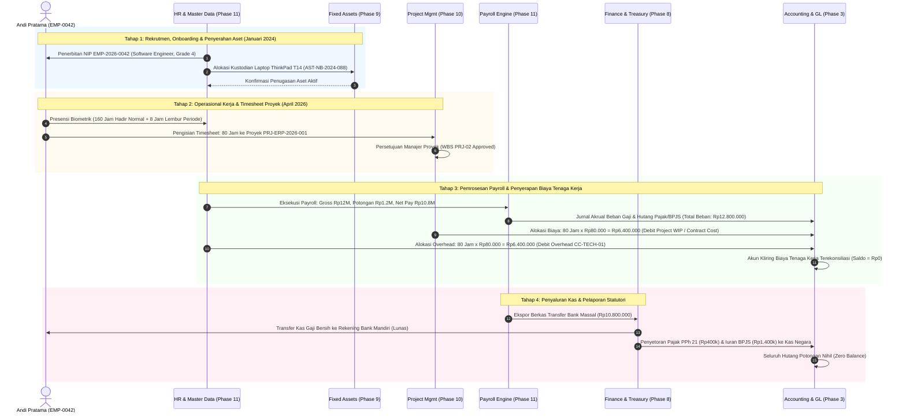

# HR Integration

## Definition

**HR Integration** adalah arsitektur integrasi komprehensif di dalam Enterprise Resource Planning (ERP) yang memposisikan manajemen sumber daya manusia (*Human Resources Management*) sebagai penyedia data induk tenaga kerja (*workforce master data provider*), pendorong kapasitas operasional (*capacity driver*), dan penghasil beban biaya operasional utama (*workforce cost generator*) yang terhubung secara mulus dengan modul Keuangan, Akuntansi, Penjualan, Pengadaan, Persediaan, Manufaktur, Aktiva Tetap, dan Manajemen Proyek.

Di dalam arsitektur ERP enterprise, modul HR bukan merupakan aplikasi pulau (*siloed system*), melainkan **fondasi penopang operasional lintas disiplin**:
1. Menentukan *siapa* yang mengeksekusi aktivitas bisnis, menandatangani dokumen transaksi, dan memegang tanggung jawab fisik atas aset perusahaan.
2. Mengonversi waktu kerja dan kompensasi pegawai menjadi nilai moneter yang diserap secara matematis ke dalam beban pokok penjualan, harga pokok produksi, dan aset dalam pengerjaan.

---

## Purpose

Tujuan integrasi modul HR lintas sistem ERP meliputi:

1. **Penghapusan Fragmentasi Data Karyawan (*Single Source of People Data*)**: Memastikan seluruh modul merujuk pada profil pegawai, rantai komando manajerial, dan pusat biaya yang sama secara *real-time*.
2. **Kesesuaian Akuntansi Biaya Berbasis Aktivitas (*Activity-Based Labor Costing*)**: Menyalurkan beban gaji dan manfaat perusahaan ke objek biaya penerima manfaat (proyek pelanggan, lini pabrik, atau departemen pendukung) secara objektif.
3. **Pengendalian Likuiditas dan Pengeluaran Kas Terpadu**: Memberikan kepastian jadwal pengeluaran kas penggajian bulanan kepada bagian perbendaharaan (*Treasury*) dan pengawasan pagu anggaran belanja tenaga kerja (*Workforce Budgeting*).
4. **Pencegahan Kehilangan Aset Perusahaan (*Cross-Module Offboarding Clearance*)**: Menjamin tidak ada pegawai yang dapat menyelesaikan pemutusan hubungan kerja (*Final Settlement*) tanpa mengembalikan inventaris laptop, kendaraan dinas, atau pelunasan uang muka kasbon.
5. **Visibilitas Kinerja dan Profitabilitas Menyeluruh**: Menyajikan laporan profitabilitas proyek dan operasional yang memperhitungkan biaya tenaga kerja riil secara akurat.

---

## Matriks Integrasi Lintas Modul (Cross-Module Integration Matrix)

Tabel berikut merangkum matriks integrasi mendalam antara Human Resources Management dengan domain modul ERP lainnya (Fase 1 hingga Fase 10):

| Domain / Modul Terkait | Titik Integrasi Teknis (*Integration Touchpoint*) | Dokumen / Transaksi Terlibat | Arah Aliran Data | Dampak Operasional & Finansial |
| :--- | :--- | :--- | :--- | :--- |
| **Fundamentals (Fase 1)** | Tautan Pengguna, Struktur Organisasi & RBAC | Master Pegawai $\longleftrightarrow$ Akun Pengguna (`User ID`), Bagan Organisasi | HR $\longleftrightarrow$ Fundamentals | Pembuatan akun login pegawai; penentuan hak otorisasi dan rantai komando persetujuan dokumen bisnis. |
| **Business Processes (Fase 2)** | Siklus Hidup Ketenagakerjaan & Otorisasi Transaksi | Onboarding, Transfer, Offboarding Checklist | HR $\rightarrow$ Core Processes | Mengendalikan status operasional pegawai yang berhak menandatangani dokumen PO, SO, dan BAST. |
| **Accounting (Fase 3)** | Jurnal Penggajian, Akrual & Akun Kliring Biaya | Slip Gaji Teragregasi, Jurnal Payroll, Akun Hutang Gaji/Pajak | HR $\rightarrow$ Accounting (GL) | Membukukan beban gaji, hutang gaji bersih, hutang PPh 21, hutang BPJS, dan menolkan akun kliring biaya tenaga kerja. |
| **Sales & O2C (Fase 4)** | Penetapan Tenaga Penjual & Komisi Penjualan | Sales Order, Invoice Penjualan $\rightarrow$ Komponen Komisi Payroll | Sales $\rightarrow$ HR (Payroll) | Mengonversi pencapaian target penjualan menjadi komponen penghasilan komisi pada slip gaji bulanan. |
| **Purchasing & P2P (Fase 5)** | Penggantian Biaya Operasional (*Reimbursement*) | Expense Claim $\longleftrightarrow$ Vendor Bill / Slip Gaji, Tanda Terima | HR $\longleftrightarrow$ Purchasing/AP | Memproses pengembalian dana pribadi pegawai untuk operasional dinas via modul Hutang Usaha (*AP*) atau slip gaji. |
| **Inventory (Fase 6)** | Kustodian Pergudangan & Otorisasi Serah Terima | Dokumen Goods Receipt / Issue, Kartu Identitas Petugas Gudang | HR $\longleftrightarrow$ Inventory | Menugaskan staf gudang sebagai penanggung jawab stok fisik dan penandatangan dokumen mutasi persediaan. |
| **Manufacturing (Fase 7)** | Alokasi Jam Operator Pabrik & Biaya Produksi | Work Center Capacity, Routing, Job Card Labor Tracking | HR $\longleftrightarrow$ Manufacturing | Jam kerja operator diserap sebagai Beban Tenaga Kerja Langsung (*Direct Labor*) pada pesanan produksi (*MO WIP*). |
| **Finance (Fase 8)** | Perencanaan Anggaran SDM & Perbendaharaan Kas | Workforce Budget, Payroll Cash Forecast, Bank Disbursement File | HR $\longleftrightarrow$ Finance/Treasury | Memproyeksikan kebutuhan kas gaji bulanan, transfer massal antarbank, dan rekonsiliasi kas keluar. |
| **Fixed Assets (Fase 9)** | Kustodian Aset Karyawan & Kliring Terminasi | Master Data Aset $\longleftrightarrow$ Pegawai (Laptop/Mobil), Exit Clearance | HR $\longleftrightarrow$ Fixed Assets | Menetapkan pegawai sebagai kustodian aktiva tetap; mengunci pesangon hingga aset dikembalikan ke bagian GA. |
| **Project (Fase 10)** | Alokasi Sumber Daya Proyek, Timesheet & Biaya | Project Resource Allocation, Timesheet $\rightarrow$ WBS Labor Cost | HR $\longleftrightarrow$ Project | 80 jam kerja kanonik dialokasikan ke proyek `PRJ-ERP-2026-001` (Debit Project WIP / Contract Cost Rp6.400.000 dengan tarif Rp80.000/jam sesuai kriteria kapitalisasi biaya kontrak). |

---

## Rekam Jejak Terpadu: Skenario Kanonikal Andi Pratama

Diagram berikut menelusuri siklus hidup operasional, alokasi proyek, penggajian, dan pembukuan akuntansi pegawai kanonikal `Andi Pratama` (`EMP-2026-0042`) di `PT Maju Bersama`:

---

## Rekonsiliasi Finansial Terpadu Skenario Kanonikal

Seluruh angka pada skenario kanonikal saling mengunci secara matematis di seluruh modul:

### 1. Struktur Kompensasi dan Beban Perusahaan (Payroll View)
$$\begin{array}{lrr}
\text{Gaji Pokok (Basic Salary)} & \text{Rp10.000.000} & \\
\text{Tunjangan Tetap (Fixed Allowance)} & \text{Rp1.500.000} & \\
\text{Upah Lembur Sah (Approved Overtime)} & \text{Rp500.000} & \\
\hline
\textbf{Total Penghasilan Bruto (Gross Earnings)} & \mathbf{Rp12.000.000} & \\
\text{Kontribusi Jaminan Sosial Kantor (Employer BPJS)} & \text{Rp800.000} & \\
\hline
\textbf{Total Beban Biaya Pemberi Kerja (Total Employer Cost)} & \mathbf{Rp12.800.000} & (\text{Beban Operasional})
\end{array}$$

### 2. Potongan dan Penyaluran Kas Bersih (Employee View)
$$\begin{array}{lrr}
\textbf{Total Penghasilan Bruto} & \mathbf{Rp12.000.000} & \\
\text{Potongan BPJS Porsi Karyawan} & (\text{Rp600.000}) & \\
\text{Pemotongan PPh 21 (Withholding)} & (\text{Rp400.000}) & \\
\text{Potongan Koperasi Karyawan} & (\text{Rp200.000}) & \\
\hline
\textbf{Total Potongan Gaji (Total Deductions)} & \mathbf{(Rp1.200.000)} & \\
\hline
\textbf{Gaji Bersih Ditransfer ke Bank Mandiri (Net Pay)} & \mathbf{Rp10.800.000} & (\text{Arus Kas Keluar})
\end{array}$$

### 3. Penyerapan Biaya ke Objek Biaya Operasional (Cost Accounting View)
- Standar Jam Kerja Produktif: **160 Jam/Bulan**
- Tarif Biaya Tenaga Kerja Per Jam (*Hourly Labor Rate*):
  $$\text{Hourly Rate} = \frac{\text{Rp12.800.000}}{160\text{ Jam}} = \mathbf{Rp80.000/\text{Jam}}$$
- **Penyerapan Biaya Proyek Pelanggan**:
  $$80\text{ Jam} \times \text{Rp80.000} = \mathbf{Rp6.400.000}\text{ (Debit Akun Project WIP / Contract Cost PRJ-ERP-2026-001)}$$
- **Penyerapan Biaya Operasional Departemen**:
  $$80\text{ Jam} \times \text{Rp80.000} = \mathbf{Rp6.400.000}\text{ (Debit Akun Overhead Departemen CC-TECH-01)}$$
- **Total Biaya Terserap**: $\text{Rp6.400.000} + \text{Rp6.400.000} = \mathbf{Rp12.800.000}$ (Terserap Penuh, Akun Kliring Rp0).

> [!NOTE]
> **Catatan Akuntansi Proyek, Regulasi Perpajakan & Asumsi Pembelajaran**:
> 1. **Perlakuan Biaya Proyek**: Biaya tenaga kerja proyek tidak otomatis menjadi persediaan/WIP. Biaya dialokasikan ke *Project WIP / Contract Cost* jika memenuhi kriteria kapitalisasi biaya kontrak (IFRS 15 / PSAK 72), atau langsung dibukukan sebagai beban periode berjalan (*Project Labor Expense*).
> 2. **Asumsi PPh 21**: Angka potongan pajak PPh 21 (Rp400.000) dan kontribusi BPJS (Rp600.000 / Rp800.000) digunakan semata-mata sebagai **asumsi numerik pembelajaran (*illustrative learning assumption*)** untuk menjaga konsistensi matematis akuntansi. Ketentuan dan tarif pajak aktual di Indonesia wajib merujuk pada regulasi resmi DJP (skema TER PP 58/2023, PMK 168/2023, dan e-Bupot 21/26) serta regulasi ketenagakerjaan yang berlaku pada periode transaksi.

---

## ERP Software Comparison Summary

Ringkasan deskriptif pola implementasi arsitektur HR pada software ERP enterprise berdasarkan dokumentasi resmi produk yang dirujuk (disajikan murni secara deskriptif tanpa pemeringkatan produk):

| Kriteria / Modul | Odoo 17.0 | ERPNext (v14/v15) | Microsoft Dynamics 365 (Human Resources & Finance) |
| :--- | :--- | :--- | :--- |
| **Pemisahan Pegawai & Pengguna** | Model `hr.employee` terpisah dari `res.users` melalui relasi kunci asing `user_id`. | `Employee` DocType terpisah dari `User` DocType dengan pemetaan alamat email. | Pemisahan entitas multi-tier: *Person / Global Party*, *Worker*, *Employment*, dan *System User*. |
| **Hierarki Organisasi** | Struktur pohon departemen visual sederhana dengan penunjukan manajer langsung. | Struktur departemen bersarang (*Nested Set Model*) dan pohon posisi jabatan (*Designation*). | Hierarki posisi perusahaan murni (*Position-to-Position Hierarchy*) independen dari pegawai aktif. |
| **Mesin Aturan Penggajian** | Mesin aturan berbasis ekspresi kode Python (*Salary Rules Engine*) yang sangat fleksibel. | Komponen gaji (*Salary Component*) dengan formula matematis atau entri nilai tetap. | Modul *Payroll Processing Framework* enterprise dengan pemetaan dimensi keuangan otomatis. |
| **Integrasi Biaya Lembar Waktu** | Jam *Timesheet* langsung diposting ke baris *Analytic Items* proyek pelanggan. | Dokumen *Timesheet* mencatat jam kerja ke *Project* dan *Activity Type* dengan tarif terpisah. | Modul *Project Operations Time Entry* dengan matriks tarif biaya (*Cost Price Matrix*) multi-dimensi. |
| **Kliring Pemutusan Hubungan Kerja** | Tindakan pengarsipan (*Archive Employee*) yang memblokir akun login dan kontrak kerja. | Dokumen formal `Employee Separation` dan tabel ringkasan `Full and Final Statement`. | Mesin daftar tilik otomatis (*Offboarding Checklist Task Management*) lintas fungsi departemen. |

---

## Naventra Consideration

Dalam perancangan arsitektur inti modul Human Resources Naventra ERP:

1. **Unified Workforce Anchor**: Setiap transaksi operasional (dokumen PO, mutasi inventaris gudang, lembar waktu proyek, tiket produksi) memiliki atribut `employee_id` yang terikat pada data master pegawai aktif, menjamin akuntabilitas jejak audit di seluruh modul sistem.
2. **Automated Cross-Module Labor Settlement**: Modul penggajian Naventra sebaiknya menggunakan payroll batch sebagai boundary posting ke GL dan memfasilitasi rekonsiliasi akun kliring penyerapan tenaga kerja (*Labor Absorption Clearing*), memastikan biaya tenaga kerja teralokasi secara tertib tanpa saldo tak terjelaskan.
3. **Integrated Offboarding Lockdown Wizard**: Transisi status pegawai menjadi *Terminated* dapat mengotomatisasi penonaktifan kredensial login, pembatasan akses fisik, dan penyusunan draf penyelesaian hak akhir (*Final Settlement Proposal*) yang terhubung dengan modul perbendaharaan (*Treasury*).

---

## References

- Armstrong, M., & Taylor, S. (2020). *Armstrong's Handbook of Human Resource Management Practice* (15th ed.). Kogan Page.
- Committee of Sponsoring Organizations of the Treadway Commission (COSO). (2013). *Internal Control — Integrated Framework*.
- International Accounting Standards Board (IASB). *IAS 19: Employee Benefits*. IFRS Foundation.
- SAP Help Portal. *Cross-Application Architecture in SAP S/4HANA Human Capital Management*.
- Microsoft Learn. *Dynamics 365 Human Resources Architecture and Integration with Finance*.
- ERPNext Documentation. *Human Resources and Payroll Integration*.
- Odoo 17.0 Documentation. *HR, Timesheets, and Accounting Integration*.
