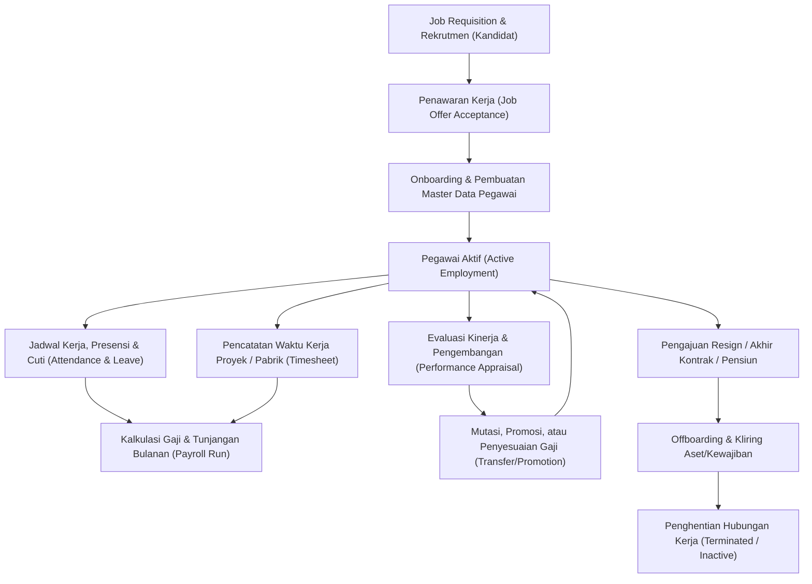

# HR Management Fundamentals

## Definition

**Human Resources Management (HRM)** di dalam Enterprise Resource Planning (ERP) adalah domain fungsional yang mengelola data induk tenaga kerja (*workforce master data*), struktur organisasi, siklus hidup hubungan kerja (*employment lifecycle*), pencatatan waktu dan kehadiran, remunerasi dan kompensasi (*payroll*), serta integrasi biaya tenaga kerja ke modul keuangan, akuntansi, manufaktur, dan proyek.

Berbeda dari aplikasi *Human Resource Information System* (HRIS) mandiri yang sering kali hanya berfokus pada administrasi personalia atau manajemen talenta yang terisolasi, HRM di dalam ERP bertindak sebagai **fondasi operasional dan finansial perusahaan**:
1. Menjadi *single source of truth* data orang (*people data*) yang mengikat hak otorisasi sistem, penanggung jawab operasional, dan kustodian aset.
2. Mengubah waktu dan tenaga kerja menjadi biaya finansial riil (*labor cost absorption*) yang mengalir ke buku besar akuntansi (*General Ledger*), harga pokok produksi (*manufacturing cost*), dan beban proyek (*project cost*).

---

## Purpose

Tujuan implementasi Human Resources Management di dalam ERP meliputi:

1. **Tata Kelola Data Ketenagakerjaan Terpadu**: Menyimpan dan mengelola profil pegawai, riwayat jabatan, kompensasi, dan kepatuhan administratif dalam satu basis data terpusat.
2. **Otomatisasi Remunerasi dan Kompensasi (*Payroll Engine*)**: Memproses kalkulasi gaji, tunjangan, potongan, serta kewajiban perpajakan dan jaminan sosial secara akurat dan tepat waktu.
3. **Pengendalian Biaya Tenaga Kerja (*Workforce Cost Control*)**: Memastikan seluruh biaya gaji, tunjangan, lembur, dan kontribusi pemberi kerja diatribusikan ke pusat biaya (*Cost Center*), pesanan produksi, atau objek biaya proyek (*WBS*) yang tepat.
4. **Penyelarasan Kapasitas Operasional**: Mengintegrasikan jadwal kerja, ketersediaan kehadiran, dan hak cuti pegawai dengan perencanaan kapasitas pusat kerja pabrik (*Work Center*) dan alokasi staf proyek (*Project Resource Management*).
5. **Kepatuhan Regulasi dan Audit (*Regulatory Compliance & Auditability*)**: Menegakkan kepatuhan terhadap regulasi ketenagakerjaan, perpajakan penghasilan, batas jam kerja, serta menyediakan jejak audit lengkap (*audit trail*) atas setiap perubahan status dan kompensasi pegawai.

---

## Konsep Kunci yang Wajib Dibedakan

Dalam arsitektur ERP, kerancuan istilah sering memicu kesalahan desain sistem dan distorsi pencatatan akuntansi. Berikut pembedaan konseptual mendasar:

### 1. Employee vs User
- **Employee (Pegawai)**: Entitas sumber daya manusia yang memiliki hubungan kerja legal dengan perusahaan (memiliki NIP, kontrak, gaji, hak cuti).
- **User (Pengguna Sistem)**: Akun digital berotentikasi yang digunakan untuk masuk (*login*) ke sistem ERP dan memiliki hak akses tertentu (*Role-Based Access Control* - RBAC).
*Prinsip*: Seorang *Employee* belum tentu memiliki akun *User* (misalnya operator pabrik atau petugas lapangan). Sebaliknya, akun *User* sistemik (seperti akun integrasi API atau *admin*) bukanlah seorang *Employee*.

### 2. Job vs Position
- **Job (Pekerjaan / Klasifikasi Profesi)**: Definisi generik mengenai fungsi dan tanggung jawab keahlian (misalnya *Software Engineer*, *Accountant*, *Machinist*).
- **Position (Posisi / Formasi Jabatan)**: Slot atau kursi spesifik dalam bagan struktur organisasi yang memiliki kuota dan anggaran (misalnya *Software Engineer - Core Backend Team 1*). Satu *Job* dapat diduduki oleh banyak *Position*, dan setiap *Position* biasanya diduduki oleh satu pegawai aktif pada satu waktu (*headcount slot*).

### 3. Department vs Cost Center
- **Department (Departemen)**: Unit organisasi fungsional yang mencerminkan hierarki manajerial dan kepemimpinan operasional (misalnya *Technology Department*, *Marketing Department*).
- **Cost Center (Pusat Biaya)**: Objek akuntansi manajerial dalam modul [[02-accounting/index|Accounting (Phase 3)]] dan [[07-finance/index|Finance (Phase 8)]] yang berfungsi sebagai wadah penampung akumulasi beban operasional. Meskipun departemen sering dipetakan 1:1 ke cost center, satu departemen dapat memiliki beberapa cost center untuk rincian pertanggungjawaban biaya.

### 4. Employee vs Contractor
- **Employee (Karyawan PKWT / PKWTT)**: Memiliki hubungan kerja langsung, menerima slip gaji berkala via modul *Payroll*, tunduk pada absensi kerja standar, dan mendapatkan hak jaminan sosial tenaga kerja.
- **Contractor / Freelancer (Pihak Ketiga)**: Mengikat perjanjian jasa profesional, dibayar melalui proses pengadaan (*Procurement / Accounts Payable*) via faktur tagihan (*Vendor Bill*), dan biayanya dibukukan sebagai beban jasa profesional luar, bukan beban gaji pegawai (*Salaries Expense*).

### 5. Attendance vs Timesheet
- **Attendance (Kehadiran)**: Catatan waktu kapan pegawai hadir, tiba di tempat kerja, dan pulang (*clock-in / clock-out*) untuk mengukur kepatuhan jadwal kerja (*work schedule*), batas keterlambatan, dan kelayakan tunjangan kehadiran.
- **Timesheet (Alokasi Waktu Kerja)**: Catatan berapa jam waktu kerja yang dialokasikan oleh pegawai ke aktivitas, pesanan produksi (*Manufacturing Order*), atau objek proyek (*WBS*) tertentu untuk kalkulasi biaya pokok (*labor costing*).

### 6. Leave vs Absence
- **Leave (Cuti Terotorisasi)**: Ketidakhadiran kerja yang telah direncanakan, diajukan, dan disetujui secara formal sesuai kebijakan cuti (*annual leave, sick leave, maternity leave*), yang memotong kuota saldo cuti hak pegawai.
- **Absence (Absensi / Ketidakhadiran Fisik)**: Fakta empiris bahwa pegawai tidak hadir pada jadwal kerjanya. Absensi dapat berstatus diizinkan (*approved leave*) atau mangkir (*unauthorized absence / alfa*) yang memicu pemotongan upah.

---

## Mental Model: Siklus Hidup Hubungan Kerja (Employment Lifecycle)

Siklus hidup pegawai di dalam sistem ERP dikelola secara komprehensif dari perekrutan hingga terminasi:

---

## Effective-Dating Concept (Pencatatan Berbasis Tanggal Efektif)

Data ketenagakerjaan dan kompensasi bersifat dinamis sepanjang waktu. Oleh karena itu, arsitektur ERP menerapkan konsep **Effective Dating** guna memastikan akurasi historis dan perencanaan masa depan:

- **Effective From & Effective To**: Setiap perubahan kompensasi, penugasan posisi, atau departemen memiliki rentang tanggal berlaku (`effective_from` s.d. `effective_to`).
- **Historical Record Preservation**: Sistem dirancang untuk mempertahankan rekaman historis tanpa menimpa (*overwrite*) data masa lalu guna mendukung kebutuhan audit dan penghitungan ulang laporan retroaktif.
- **Future-Dated Changes**: Manajemen dapat menyetujui promosi atau kenaikan gaji yang baru berlaku efektif pada awal bulan berikutnya tanpa mengganggu kalkulasi penggajian bulan berjalan.
- **Retroactive Adjustments (Rapel Gaji)**: Jika kenaikan gaji disetujui terlambat (misalnya kenaikan gaji efektif Januari baru disahkan pada bulan Maret), mesin payroll secara otomatis menghitung selisih rapel (*back-pay*) pada periode berjalan.

---

## Business Rules

1. **Prasyarat Otorisasi Payroll**: Pegawai umumnya diikutsertakan dalam kalkulasi penggajian (*payroll run*) apabila memiliki status kerja aktif (*Active*) pada rentang periode penggajian terkait dan memiliki struktur kompensasi (*Salary Structure*) yang valid.
2. **Keterikatan Struktur Organisasi**: Setiap rekaman pegawai aktif idealnya terikat pada posisi (*Position*) atau departemen utama, serta memiliki penanggung jawab persetujuan (*Direct Reporting Manager*) yang terdefinisi.
3. **Pemisahan Pengguna Sistem (*Employee-User Linkage*)**: Akun pengguna ERP yang ditautkan ke pegawai dapat dinonaktifkan secara terotomatisasi berdasarkan tanggal efektif terminasi (*Effective Termination Date*) dan kebijakan keamanan organisasi.
4. **Validasi Tanggal Hubungan Kerja**: Tanggal mulai kerja (*Hire Date*) membatasi pembuatan transaksi absensi, cuti, klaim biaya, dan lembar waktu kerja. Transaksi sebelum tanggal *Hire Date* ditolak oleh validasi sistem.
5. **Audit Trail Pencatatan**: Setiap modifikasi pada data sensitif pegawai (gaji pokok, nomor rekening bank, status pajak, identitas personal) mencatat stempel waktu (*timestamp*), ID pengguna pengubah, nilai lama, nilai baru, dan dokumen referensi persetujuan.

---

## Accounting Impact

Meskipun modul HR berfokus pada sumber daya manusia, dampaknya terhadap akuntansi dan keuangan sangat signifikan:

1. **Pengakuan Beban Gaji & Kewajiban (*Payroll Accrual*)**:
   - Menghasilkan pengakuan beban gaji (*Salaries & Wages Expense*) pada Laporan Laba Rugi dan kewajiban hutang gaji (*Salaries Payable*) pada Neraca.
2. **Pemisahan Potongan Pegawai vs Kontribusi Perusahaan**:
   - Potongan gaji pegawai (*Employee Deductions*) seperti PPh 21 dan porsi iuran BPJS pegawai tidak menambah beban perusahaan, melainkan ditampung sebagai hutang titipan (*Withholding Tax / Statutory Payables*).
   - Kontribusi jaminan sosial dari pemberi kerja (*Employer Statutory Contributions*) diakui sebagai beban tambahan perusahaan (*Employee Benefits Expense*).
3. **Penyerapan Biaya Tenaga Kerja (*Labor Cost Absorption*)**:
   - Biaya tenaga kerja langsung dari *timesheet* dapat dialokasikan ke objek biaya proyek pada modul [[09-project/timesheet-and-effort-tracking|Project Management (Phase 10)]] (sebagai *Project WIP / Contract Cost* apabila memenuhi kriteria kapitalisasi biaya kontrak di bawah IFRS 15 / PSAK 72, atau langsung diakui sebagai beban proyek) maupun sebagai beban tenaga kerja langsung manufaktur (*Direct Labor*) pada modul [[06-manufacturing/production-costing-and-wip|Manufacturing (Phase 7)]] sesuai standar akuntansi dan kebijakan organisasi.

---

## Skenario Kanonikal: Profil Pegawai PT Maju Bersama

Dalam seluruh pembahasan Phase 11 ini, digunakan satu entitas organisasi utama dan pegawai kanonikal sebagai **asumsi pembelajaran (*illustrative learning scenario*)**:

- **Perusahaan**: `PT Maju Bersama`
- **Employee ID**: `EMP-2026-0042`
- **Nama Pegawai**: `Andi Pratama`
- **Departemen**: `Technology`
- **Posisi / Jabatan**: `Software Engineer`
- **Manajer Atasan**: `EMP-2026-0010` (*Engineering Manager*)
- **Status Hubungan Kerja**: `Active` (Pegawai Tetap / PKWTT)
- **Tanggal Mulai Bekerja (*Hire Date*)**: 01 Januari 2024
- **Pusat Biaya (*Cost Center*)**: `CC-TECH-01` (Departemen Teknologi & Implementasi)

Profil dan parameter kebijakan ini digunakan secara konsisten untuk menelusuri data master, absensi, cuti, lembur, alokasi jam kerja proyek, perhitungan penggajian bulanan, klaim penggantian biaya, hingga evaluasi kinerja. Ketentuan durasi probation, kenaikan grade, alokasi cuti, dan potongan pajak adalah ilustrasi skenario, bukan aturan universal seluruh organisasi.

---

## ERP Implementation

Pola penerapan konsep dasar HR pada platform ERP enterprise:

### Odoo Implementation
- **Employees App (`hr.employee`)**: Mengelola data personal, kontrak kerja (`hr.contract`), dan struktur departemen.
- **Pemisahan User dan Employee**: Odoo secara eksplisit memisahkan model `res.users` dengan model `hr.employee`, yang dihubungkan melalui field relasi opsional `user_id`.
- **Contract-Centric Payroll**: Hak gaji dan tunjangan dikonfigurasikan pada dokumen *Contract*, di mana status kontrak menentukan apakah pegawai eligible untuk digaji.

### ERPNext Implementation
- **Employee DocType**: Entitas utama yang memuat data personal, penugasan departemen, penanggung jawab (*Reports to*), dan preferensi akun bank.
- **Job Applicant to Employee Workflow**: ERPNext menyediakan tombol otomatis *Create Employee* dari dokumen pelamar kerja yang diterima (*Job Applicant*).
- **Salary Structure & Assignment**: Memisahkan definisi komponen gaji dalam `Salary Structure` dengan penugasan nominal gaji per pegawai via dokumen `Salary Structure Assignment` yang mendukung *effective dating*.

### Dynamics 365 Implementation
- **Dynamics 365 Human Resources**: Mengelola hierarki organisasi tingkat lanjut, formasi posisi (*Position Management*), dan kualifikasi keahlian.
- **Worker & Position Relationship**: Dynamics 365 memisahkan secara ketat antara entitas *Worker* (orang) dengan *Position* (kursi jabatan). Hubungan penugasan (*Worker Position Assignment*) memiliki tanggal mulai dan berakhir yang ketat.
- **Compensation Management**: Menyediakan modul kompensasi tetap (*Fixed Compensation*) dan variabel (*Variable Compensation Plan*) terintegrasi buku besar.

---

## Naventra Consideration

Dalam perancangan modul Human Resources pada Naventra ERP:

1. **Pemisahan Ketat Entitas Orang, Pegawai, dan Pengguna**: Naventra memisahkan entitas `Person` (data biodata individu), `Employee` (hubungan kerja legal dengan perusahaan), dan `User` (kredensial login sistem). Satu individu dapat memiliki riwayat sebagai kontraktor lalu beralih menjadi pegawai tanpa duplikasi data profil.
2. **Mesin Effective Dating Terpadu**: Setiap entitas jabatan, gaji, dan alokasi pusat biaya wajib memiliki atribut `effective_from` dan `effective_to`. Perubahan gaji masa depan tidak memerlukan intervensi manual pada tanggal pergantian bulan.
3. **Universal Audit Trail & Granular Privacy Control**: Data sensitif seperti riwayat gaji, nomor rekening bank, dan nomor identitas kependudukan dilindungi dengan enkripsi tingkat kolom dan hanya dapat diakses oleh peran HR Payroll bersertifikasi dengan pencatatan log akses (*Access Log*).

---

## References

- Armstrong, M., & Taylor, S. (2020). *Armstrong's Handbook of Human Resource Management Practice* (15th ed.). Kogan Page.
- Society for Human Resource Management (SHRM). *HR Information Systems and Data Architecture Guidelines*.
- SAP Help Portal. *SAP SuccessFactors & ERP Human Capital Management Architecture*.
- Microsoft Learn. *Core HR concepts and Position Management in Dynamics 365 Human Resources*.
- ERPNext Documentation. *Human Resources Module Overview*.
- Odoo 17.0 Documentation. *Employees and Organizational Hierarchy*.
