# Human Resources Management

Selamat datang di modul pembelajaran **Human Resources Management (Manajemen Sumber Daya Manusia & Penggajian)** dalam knowledge base `erp-notes`.

Modul ini membahas arsitektur domain tata kelola tenaga kerja di dalam Enterprise Resource Planning (ERP) secara menyeluruh, mendalam, universal, dan *vendor-agnostic*.

Jika perangkat lunak *Human Resource Information System* (HRIS) mandiri umumnya hanya berfokus pada administrasi personalia, pencatatan cuti, atau manajemen talenta yang terisolasi, maka **Human Resources Management dalam ERP bertindak sebagai pilar operasional dan finansial perusahaan**:
1. Menjadi *single source of truth* data orang (*people data*) yang mengikat hak otorisasi sistem, rantai persetujuan transaksi bisnis, dan tanggung jawab kustodian aktiva tetap.
2. Mengonversi waktu kerja dan kompensasi pegawai menjadi nilai moneter nyata (*labor cost absorption*) yang mengalir ke buku besar akuntansi (*General Ledger*), harga pokok produksi pabrik (*Manufacturing*), dan biaya proyek (*Project Management*).

---

## Arsitektur Siklus Hidup HR & Penggajian di ERP

Tata kelola tenaga kerja dan kompensasi di dalam ERP dikelola melalui lima tahapan terpadu:

```mermaid
flowchart TD
    subgraph S1["Tahap 1: Fondasi & Struktur Organisasi"]
        N1["(1) [[10-hr/hr-management-fundamentals|HR Management Fundamentals]]"]
        N2["(2) [[10-hr/employee-master-data|Employee Master Data]]"]
        N3["(3) [[10-hr/organization-and-position-structure|Organization & Position Structure]]"]
    end

    subgraph S2["Tahap 2: Siklus Hidup & Manajemen Waktu"]
        N4["(4) [[10-hr/employment-lifecycle|Employment Lifecycle]]"]
        N5["(5) [[10-hr/recruitment-and-onboarding|Recruitment & Onboarding]]"]
        N6["(6) [[10-hr/attendance-and-work-schedule|Attendance & Work Schedule]]"]
        N7["(7) [[10-hr/leave-management|Leave Management]]"]
        N8["(8) [[10-hr/overtime-and-time-management|Overtime & Time Management]]"]
        N9["(9) [[10-hr/employee-timesheet-and-labor-cost|Timesheet & Labor Cost]]"]
    end

    subgraph S3["Tahap 3: Penggajian, Tunjangan & Akuntansi"]
        N10["(10) [[10-hr/payroll-fundamentals|Payroll Fundamentals]]"]
        N11["(11) [[10-hr/payroll-earnings-and-deductions|Earnings & Deductions]]"]
        N12["(12) [[10-hr/payroll-benefits-and-reimbursements|Benefits & Reimbursements]]"]
        N13["(13) [[10-hr/payroll-tax-and-statutory-compliance|Tax & Statutory Compliance]]"]
        N14["(14) [[10-hr/payroll-accounting-and-finance-integration|Payroll Accounting & Finance]]"]
    end

    subgraph S4["Tahap 4: Kinerja & Perencanaan Tenaga Kerja"]
        N15["(15) [[10-hr/performance-and-employee-management|Performance Management]]"]
        N16["(16) [[10-hr/workforce-planning-and-hr-analytics|Workforce Planning & Analytics]]"]
    end

    subgraph S5["Tahap 5: Pengendalian & Integrasi Lintas Modul"]
        N17["(17) [[10-hr/hr-controls-and-governance|HR Controls & Governance]]"]
        N18["(18) [[10-hr/hr-integration|Cross-Module HR Integration]]"]
    end

    S1 --> S2 --> S3 --> S4 --> S5
```

---

## Daftar Materi Pembelajaran Lengkap

### Fondasi & Struktur Organisasi
1. **[[10-hr/hr-management-fundamentals|HR Management Fundamentals]]**  
   Definisi HR dalam ERP; pembedaan fundamental antara Employee vs User, Job vs Position, Department vs Cost Center, Employee vs Contractor, serta Attendance vs Timesheet; konsep pencatatan bertanggal efektif (*Effective Dating*); serta pengenalan skenario kanonikal PT Maju Bersama.
2. **[[10-hr/employee-master-data|Employee Master Data]]**  
   Segmentasi data induk pegawai: Personal & Identitas, Organisasi & Posisi, Hubungan Kerja & Kontrak, Finansial & Pajak, serta Tata Kelola Sistem & Aset; penegakan keunikan NIP; perlindungan data pribadi sensitif (PII); dan rekaman profil lengkap Andi Pratama.
3. **[[10-hr/organization-and-position-structure|Organization and Position Structure]]**  
   Struktur organisasi multi-dimensi (Company Code, Division, Department Tree); hirarki Job vs Position vs Grade; karakteristik dan trade-off model *Position-to-Position* dibandingkan *Employee-to-Employee*; ketahanan hierarki persetujuan saat personil berganti; dan batas otorisasi finansial berbasis kepangkatan.

### Siklus Hidup & Manajemen Waktu
4. **[[10-hr/employment-lifecycle|Employment Lifecycle]]**  
   Mesin transisi status (*State Machine*) hubungan kerja: Candidate, Pre-Hire, Probation, Active, Movement (Promosi/Mutasi), Suspended, Offboarding, hingga Terminated; pola otomatisasi pencabutan akses; prasyarat kliring aset sebelum pencairan pesangon; dan jejak karir kanonikal.
5. **[[10-hr/recruitment-and-onboarding|Recruitment and Onboarding]]**  
   Alur rekrutmen berbasis formasi dan anggaran (*Job Requisition* dan *Position Vacancy*); pemisahan data pelamar (*Applicant*) dari master pegawai; orkestrasi tugas orientasi lintas departemen (HR, IT, GA, Manager); serta penyerahan aset laptop kustodian.
6. **[[10-hr/attendance-and-work-schedule|Attendance and Work Schedule]]**  
   Arsitektur jadwal kalender dan giliran kerja (*shifts & rosters*); penangkapan presensi mentah (*raw punch*) biometrik dan mobile GPS; penanganan kasus anomali (*missing punch, duplicate, overnight shifts crossing midnight*); dan alur koreksi presensi mandiri.
7. **[[10-hr/leave-management|Leave Management]]**  
   Tipologi cuti berbayar, cuti di luar tanggungan, dan cuti kompensasi (*TOIL*); metode alokasi kuota (awal tahun, akrual bulanan, prorata); aturan transfer sisa cuti (*carry-forward*) dan kedaluwarsa; pencegahan saldo negatif; serta akrual liabilitas cuti menurut IAS 19 / PSAK 24.
8. **[[10-hr/overtime-and-time-management|Overtime and Time Management]]**  
   Otorisasi kerja lembur terprogram (*Pre-approval Overtime Request*); skema pengali bertingkat (*progressive multiplier rates*); klasifikasi pegawai berhak (*Non-Exempt*) vs tidak berhak (*Exempt*); rekonsiliasi tiga arah jam presensi fisik vs surat tugas; konteks regulasi perburuhan; dan penyerapan biaya lembur.
9. **[[10-hr/employee-timesheet-and-labor-cost|Employee Timesheet and Labor Cost]]**  
   Pembedaan esensial Presensi (kehadiran fisik) vs Timesheet (alokasi jam kerja ke proyek/pekerjaan); perspektif kompensasi penggajian vs penyerapan biaya akuntansi; formula tarif tenaga kerja per jam (*Hourly Labor Rate*); serta penyerapan 80 jam kerja kanonik ke proyek implementasi ERP Naventra.

### Penggajian, Tunjangan & Akuntansi
10. **[[10-hr/payroll-fundamentals|Payroll Fundamentals]]**  
    Pembedaan batas domain Payroll (kalkulasi hak pegawai) vs Accounting (pembukuan jurnal) vs Tax (kepatuhan fiskal); formula inti matematika upah (*Gross Pay, Deductions, Net Pay, Employer Cost*); siklus pemrosesan gaji 8 tahap; dan slip gaji kanonikal bulanan.
11. **[[10-hr/payroll-earnings-and-deductions|Payroll Earnings and Deductions]]**  
    Taksonomi penghasilan tetap, variabel, dan tidak teratur (THR/Bonus); taksonomi potongan statutori, absensi/disiplin, dan sukarela (koperasi/pinjaman); arsitektur aturan struktur gaji (*Salary Structure Rules*); formula ketergantungan antar-komponen; serta batas upah bersih minimum.
12. **[[10-hr/payroll-benefits-and-reimbursements|Payroll Benefits and Reimbursements]]**  
    Program tunjangan kesejahteraan dan iuran jaminan sosial perusahaan; perlakuan pajak kenikmatan non-tunai (*fringe benefits / natura*); pembedaan upah kerja (*remuneration*) vs pengembalian uang operasional (*reimbursement*); serta alur verifikasi klaim perjalanan dinas via modul AP/Kas.
13. **[[10-hr/payroll-tax-and-statutory-compliance|Payroll Tax and Statutory Compliance]]**  
    Batasan pemrosesan pajak penggajian; dasar pengenaan pajak (DPP), status PTKP, tarif progresif, dan skema Tarif Efektif Rata-Rata (TER); ekualisasi pajak penutup tahun; mekanisme iuran dua sisi jaminan sosial (BPJS); serta antarmuka pelaporan elektronik resmi.
14. **[[10-hr/payroll-accounting-and-finance-integration|Payroll Accounting and Finance Integration]]**  
    Alur jurnal pembukuan lengkap: Jurnal Akrual Beban & Hutang Gaji, Jurnal Penyaluran Kas Gaji Bersih, Jurnal Penyetoran Pajak/BPJS ke Kas Negara, serta Jurnal Penyerapan Tenaga Kerja (Kliring Nihil); peramalan kebutuhan likuiditas kas perbendaharaan; dan rekonsiliasi bank.

### Kinerja, Perencanaan & Tata Kelola
15. **[[10-hr/performance-and-employee-management|Performance and Employee Management]]**  
    Manajemen kinerja sebagai proses bisnis objektif; penetapan sasaran kerja terukur (SMART KPIs / OKRs); siklus penilaian mandiri, manajer, dan komite kalibrasi (*9-Box Matrix*); tindak lanjut hasil evaluasi terhadap promosi jabatan dan penyesuaian gaji pokok kanonikal (Grade 4 - Rp10M).
16. **[[10-hr/workforce-planning-and-hr-analytics|Workforce Planning and HR Analytics]]**  
    Perencanaan formasi dan anggaran belanja tenaga kerja (*Headcount & Workforce Budgeting*); analisis varians formasi kosong (*vacancy savings*); formula metrik standar (Headcount vs FTE, Turnover Rate, Absenteeism, Overtime Ratio, Billable Project Utilization); serta dasbor berjenjang.
17. **[[10-hr/hr-controls-and-governance|HR Controls and Governance]]**  
    Pengendalian internal COSO pada SDM; pola matriks pemisahan tugas berisiko (Toxic SoD); pencegahan pegawai fiktif (*Ghost Employees*); enkripsi data pribadi sensitif (PII); dan jejak audit digital tak terbantahkan (*Immutable Audit Trail*).
18. **[[10-hr/hr-integration|Cross-Module HR Integration]]**  
    Sintesis arsitektur integrasi komprehensif antara Human Resources dengan seluruh modul ERP (Phase 1 s.d. Phase 10); diagram urutan transaksi terpadu (*sequence diagram*); penelusuran lengkap skenario kanonik Andi Pratama di PT Maju Bersama; serta komparasi software ERP enterprise (Odoo, ERPNext, Microsoft Dynamics 365).

---

## Skenario Kanonikal Konsisten: Profil Pegawai PT Maju Bersama

Seluruh materi pembelajaran dalam modul ini mengacu pada satu skenario organisasi dan profil pegawai kanonikal yang konsisten:

### 1. Entitas Perusahaan & Profil Pegawai
- **Perusahaan**: `PT Maju Bersama`
- **Employee ID**: `EMP-2026-0042`
- **Nama Pegawai**: `Andi Pratama`
- **Departemen**: `Technology` (Pusat Biaya: `CC-TECH-01`)
- **Posisi / Jabatan**: `Software Engineer` (`POS-TECH-042`)
- **Jenjang Kepangkatan**: `Grade 4` (*Professional Staff*)
- **Status Hubungan Kerja**: `PKWTT (Active)` sejak 01 Januari 2024
- **Manajer Atasan Langsung**: `EMP-2026-0010` (Budi Santoso - *Engineering Manager*)
- **Status Perpajakan**: Kawin dengan 1 Anak Kandung / Tanggungan (`K/1`)

> [!NOTE]
> **Kebijakan Perusahaan Skenario Kanonikal**:
> Detail kebijakan dalam skenario ini—seperti masa percobaan 3 bulan, promosi dari Grade 3 ke Grade 4, jadwal kerja 5 hari/40 jam, alokasi cuti 12 hari, dan batas otorisasi—merupakan **asumsi pembelajaran (illustrative company policy)** untuk keperluan pemodelan alur ERP, bukan aturan universal ketenagakerjaan untuk semua organisasi.

### 2. Rekapitulasi Finansial Penggajian Bulanan (Periode April 2026)
$$\begin{array}{lrr}
\text{Gaji Pokok (Basic Salary)} & \text{Rp10.000.000} & \\
\text{Tunjangan Tetap (Fixed Allowance)} & \text{Rp1.500.000} & \\
\text{Upah Lembur Sah (Approved Overtime - 8 Jam Periode Payroll)} & \text{Rp500.000} & \\
\hline
\textbf{Total Penghasilan Bruto (Gross Earnings)} & \mathbf{Rp12.000.000} & \\
\text{Potongan Iuran Jaminan Sosial Pegawai} & (\text{Rp600.000}) & \\
\text{Pemotongan Pajak Penghasilan (PPh 21 Withholding)} & (\text{Rp400.000}) & \\
\text{Potongan Koperasi / Sukarela Lainnya} & (\text{Rp200.000}) & \\
\hline
\textbf{Total Potongan Gaji (Total Deductions)} & \mathbf{(Rp1.200.000)} & \\
\hline
\textbf{Gaji Bersih Ditransfer ke Rekening Pegawai (Net Pay)} & \mathbf{Rp10.800.000} & (\text{Kas Keluar})
\end{array}$$

$$\begin{array}{lrr}
\textbf{Total Penghasilan Bruto} & \mathbf{Rp12.000.000} & \\
\text{Kontribusi Jaminan Sosial Porsi Kantor (Employer BPJS)} & \text{Rp800.000} & \\
\hline
\textbf{Total Beban Biaya Pemberi Kerja (Total Employer Cost)} & \mathbf{Rp12.800.000} & (\text{Beban Operasional})
\end{array}$$

### 3. Penyerapan Biaya Tenaga Kerja ke Proyek (Korelasi Phase 10)
- Standar Jam Kerja Produktif: **160 Jam/Bulan**
- Tarif Biaya Tenaga Kerja Per Jam (*Hourly Labor Rate*):
  $$\text{Hourly Rate} = \frac{\text{Rp12.800.000}}{160\text{ Jam}} = \mathbf{Rp80.000/\text{Jam}}$$
- **Penyerapan Biaya Proyek Pelanggan**:
  $$80\text{ Jam} \times \text{Rp80.000} = \mathbf{Rp6.400.000}\text{ (Debit Akun Project WIP / Contract Cost PRJ-ERP-2026-001)}$$
- **Penyerapan Biaya Operasional Departemen**:
  $$80\text{ Jam} \times \text{Rp80.000} = \mathbf{Rp6.400.000}\text{ (Debit Akun Overhead Departemen CC-TECH-01)}$$
- **Total Biaya Terserap**: $\text{Rp6.400.000} + \text{Rp6.400.000} = \mathbf{Rp12.800.000}$ (Terserap Penuh, Akun Kliring Rp0).

> [!NOTE]
> **Perlakuan Akuntansi & Regulasi Pembelajaran**:
> 1. **Alokasi Biaya Proyek**: Biaya tenaga kerja proyek tidak otomatis menjadi aset persediaan/WIP dalam seluruh kondisi. Biaya tenaga kerja yang memenuhi kriteria kapitalisasi atau biaya pemenuhan kontrak (*costs to fulfil a contract*) dapat dialokasikan ke *Project WIP / Contract Cost* sesuai standar akuntansi yang berlaku (IFRS 15 / PSAK 72) dan kebijakan organisasi; biaya lainnya dapat langsung diakui sebagai beban periode berjalan (*Project Labor Expense*).
> 2. **Konteks Lembur**: 8 jam lembur merupakan total jam lembur dalam periode payroll bulanan yang digunakan sebagai asumsi pembelajaran, bukan lembur dalam satu hari kerja normal. Ketentuan hukum diatur dalam regulasi ketenagakerjaan (seperti PP 35/2021 dan perubahannya).
> 3. **Asumsi Pajak PPh 21**: Untuk menjaga fokus pada mekanisme payroll ERP, contoh ini menggunakan potongan PPh 21 sebesar **Rp400.000** sebagai asumsi pembelajaran (*illustrative learning assumption*), bukan hasil perhitungan pajak aktual. Perhitungan aktual wajib mengacu pada ketentuan resmi DJP (seperti PP 58/2023, PMK 168/2023 tentang skema TER bulanan, dan mekanisme administrasi/pelaporan seperti e-Bupot 21/26 yang berlaku pada periode terkait).

---

## Hubungan dengan Domain Lain dalam `erp-notes`

Modul Human Resources Management terintegrasi secara mendalam dengan modul-modul lainnya:
- **[[00-fundamentals/index|Phase 1 (Fundamentals)]]**: Memetakan entitas Employee ke kredensial User, penugasan peran keamanan (*RBAC*), dan hierarki master data perusahaan.
- **[[01-business-processes/index|Phase 2 (Business Processes)]]**: Menghubungkan proses persetujuan dokumen bisnis (*Approval Hierarchy*) pada siklus O2C, P2P, dan R2R dengan struktur pelaporan manajerial.
- **[[02-accounting/index|Phase 3 (Accounting)]]**: Membukukan jurnal akrual penggajian, menolkan akun kliring penyerapan tenaga kerja, dan mencatat liabilitas hutang gaji/pajak pada buku besar umum (*General Ledger*).
- **[[03-sales/index|Phase 4 (Sales)]]**: Menugaskan staf penjual (*Sales Representatives*) ke pesanan penjualan dan mengonversi pencapaian omzet menjadi komisi penjualan pada slip gaji.
- **[[04-purchasing/index|Phase 5 (Purchasing)]]**: Mengelola penggantian biaya operasional pegawai (*Expense Reimbursements*) via alur Hutang Usaha (*Accounts Payable*) dan membedakan staf internal dari kontraktor luar.
- **[[05-inventory/index|Phase 6 (Inventory)]]**: Menetapkan staf gudang sebagai penanggung jawab fisik stok barang dan penandatangan sah dokumen mutasi barang masuk/keluar.
- **[[06-manufacturing/index|Phase 7 (Manufacturing)]]**: Mengalokasikan jam kerja operator pabrik ke pusat kerja (*Work Centers*) dan menyerap biaya tenaga kerja langsung ke harga pokok pesanan manufaktur (*MO WIP*).
- **[[07-finance/index|Phase 8 (Finance)]]**: Mengintegrasikan peramalan kebutuhan likuiditas kas gaji bulanan, transfer kas perbankan massal, serta rekonsiliasi pengeluaran kas.
- **[[08-assets/index|Phase 9 (Fixed Assets)]]**: Menetapkan pegawai sebagai kustodian aktiva tetap (laptop, kendaraan, peralatan kantor) dan memberlakukan kliring pengembalian aset sebelum pencairan hak akhir pesangon.
- **[[09-project/index|Phase 10 (Project Management)]]**: Mengalokasikan kapasitas pegawai ke tim proyek (*Project Resources*), mengintegrasikan lembar waktu kerja (*Timesheets*), serta menghitung penyerapan biaya tenaga kerja langsung ke WBS proyek.
