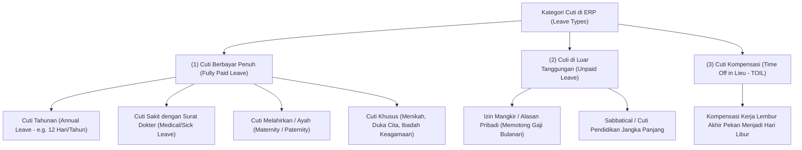
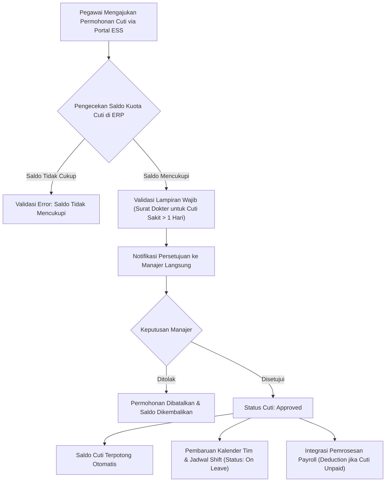

# Leave Management

## Definition

**Leave Management** (Manajemen Cuti dan Izin Kerja) di dalam Enterprise Resource Planning (ERP) adalah subsistem manajemen waktu yang mengatur definisi jenis cuti (*leave types*), kebijakan penjatahan kuota hak (*leave allocation & entitlement*), alur pengajuan dan persetujuan mandiri (*self-service workflow*), pemantauan saldo sisa (*balance tracking*), serta kalkulasi dampak finansial terhadap penggajian dan liabilitas imbalan kerja akuntansi.

Di dalam ERP enterprise, manajemen cuti bukan sekadar formulir izin libur elektronik, melainkan **komponen pengendali kontinuitas bisnis dan akuntansi biaya**:
1. Menghalangi timbulnya ketidakhadiran tak berizin (*unauthorized absence*) dan memblokir klaim lembur atau penugasan proyek pada hari-hari cuti aktif.
2. Menghitung liabilitas imbalan kerja jangka pendek (*accrued compensated absences liability*) pada akhir tahun fiskal sesuai standar akuntansi internasional (**IAS 19 / PSAK 24**).

---

## Purpose

Penerapan modul Leave Management di dalam ERP bertujuan untuk:

1. **Standardisasi Kebijakan Hak Cuti (*Leave Policy Enforcement*)**: Menegakkan aturan kuota cuti tahunan, cuti sakit, cuti melahirkan, dan cuti khusus sesuai undang-undang ketenagakerjaan dan kesepakatan kerja bersama.
2. **Visibilitas Ketersediaan Tim Kerja (*Team Availability Transparency*)**: Memperbarui kalender tim secara *real-time* sehingga manajer dapat mengantisipasi penurunan kapasitas sebelum menyetujui jadwal deliverable proyek.
3. **Pencegahan Saldo Cuti Negatif (*Leave Overdraft Prevention*)**: Memvalidasi kecukupan sisa kuota hak cuti secara otomatis sebelum permohonan dapat diserahkan untuk persetujuan.
4. **Otomatisasi Penyesuaian Penggajian (*Payroll Deduction Automation*)**: Memotong gaji pokok secara akurat untuk ketidakhadiran tidak berbayar (*Unpaid Leave*) dan menghitung pembayaran kompensasi cuti (*Leave Encashment*).
5. **Kepatuhan Akuntansi Akrual Cuti (*Compensated Absences Accounting*)**: Memfasilitasi pembukuan beban akrual cuti tahunan yang belum diambil oleh pegawai pada penutupan buku tahunan.

---

## Tipologi dan Kategori Cuti

Sistem ERP membagi permohonan ketidakhadiran terotorisasi ke dalam beberapa kategori utama:

---

## Mekanisme Penjatahan Kuota (Leave Allocation & Entitlement)

ERP mendukung beberapa metode penjatahan kuota cuti pegawai:

1. **Upfront Annual Allocation (Penjatahan di Awal Tahun)**:
   - Kuota cuti tahunan penuh (misalnya 12 hari) dialokasikan sekaligus pada tanggal 01 Januari setiap tahun baru kalender.
2. **Accrual-Based Allocation (Akrual Berkala Bulanan)**:
   - Pegawai mengakumulasi hak cuti secara bertahap (misalnya $12 / 12 = 1\text{ hari per bulan kerja penuh}$). Umum digunakan untuk pegawai baru yang belum genap 1 tahun masa kerja.
3. **Prorated Allocation (Prorata Pegawai Baru)**:
   - Jika pegawai bergabung di tengah tahun (misalnya bulan Mei), kuota dialokasikan proporsional:
   $$\text{Hak Cuti Prorata} = \frac{\text{Sisa Bulan Kerja}}{12} \times 12\text{ Hari}$$
4. **Seniority-Based Scaling (Penjatahan Berbasis Masa Kerja)**:
   - Skema berjenjang di mana kuota meningkat seiring loyalitas (misalnya 12 hari untuk tahun 1–5, dan meningkat menjadi 15–18 hari untuk masa kerja di atas 5 tahun).

---

## Kebijakan Rollover, Kedaluwarsa & Kompensasi Uang

Pengelolaan sisa kuota cuti yang belum digunakan pada akhir periode fiskal diatur oleh tiga kebijakan sistem:

1. **Carry-Forward / Rollover Policy**:
   - Membatasi jumlah hari yang boleh ditransfer ke tahun berikutnya (misalnya maksimum 5 hari).
2. **Expiration Policy (Batas Kedaluwarsa Cuti)**:
   - Cuti yang dibawa ke tahun baru wajib diambil dalam jangka waktu tertentu (misalnya paling lambat tanggal 30 Juni / 6 bulan), setelah itu saldo sisa otomatis hangus (*lapsed/expired*).
3. **Leave Encashment (Penggantian Uang Cuti)**:
   - Menghitung nilai konversi uang atas hak cuti yang belum gugur saat pemutusan hubungan kerja (*Exit Settlement*) dengan formula standar:
   $$\text{Nilai Penggantian Cuti} = \text{Sisa Hari Cuti} \times \frac{\text{Gaji Pokok} + \text{Tunjangan Tetap}}{21\text{ (atau 22 Hari Kerja)}}$$

---

## Business Process: Pengajuan dan Persetujuan Cuti

Alur permohonan cuti terintegrasi disajikan dalam diagram berikut:

---

## Business Rules

1. **Larangan Saldo Cuti Negatif (*No Negative Leave Balance*)**: Sistem secara baku menolak pengajuan cuti yang melebihi sisa saldo tersedia, kecuali profil pegawai memiliki otorisasi fasilitas *Overdraft Leave* yang disetujui HR Director.
2. **Pengecualian Hari Libur Resmi (*Holiday Exclusion Rule*)**: Sistem secara otomatis mengecualikan hari libur nasional (*Public Holidays*) dan hari libur akhir pekan (*Rest Days*) dari perhitungan durasi cuti kerja yang diajukan.
3. **Lampiran Medis Wajib untuk Cuti Sakit**: Pengajuan cuti sakit (*Sick Leave*) berdurasi $\ge 2$ hari kerja berturut-turut mewajibkan unggahan dokumen bukti surat keterangan dokter resmi sebelum formulir dapat diproses.
4. **Pemberitahuan Dini Minimum (*Advance Notice Policy*)**: Pengajuan cuti tahunan berdurasi $\ge 3$ hari berturut-turut wajib diajukan paling lambat 7 hari kalender sebelum tanggal mulai cuti guna memberikan waktu perencanaan delegasi tugas.
5. **Pemblokiran Pengajuan Jam Lembur dan Timesheet**: Pegawai dilarang memasukkan klaim jam lembur (*Overtime*) atau lembar waktu kerja (*Timesheet*) pada tanggal dan jam di mana status kehadiran pegawai terdaftar sebagai *On Leave*.

---

## Accounting Impact (IAS 19 / PSAK 24)

Cuti pegawai memiliki implikasi akuntansi langsung:

### 1. Akrual Imbalan Cuti Jangka Pendek (Compensated Absences Accrual)
Pada penutupan buku tahunan, hak cuti tahunan yang dapat dialihkan (*accumulated compensated absences*) dihitung estimasi kewajibannya dan dibukukan sebagai beban dan liabilitas:

$$\begin{array}{llrr}
\text{Debit:} & \text{Employee Benefits Expense (Beban Akrual Cuti Tahunan)} & \text{Rp15.000.000} & \\
\text{Kredit:} & \text{Accrued Leave Liability (Liabilitas Akrual Hak Cuti)} & & \text{Rp15.000.000}
\end{array}$$

### 2. Pemotongan Upah Akibat Cuti Tidak Berbayar (Unpaid Leave Deduction)
Jika pegawai mengambil cuti di luar tanggungan (*Unpaid Leave*), mesin payroll memotong nilai gaji bulanan pada komponen potongan absensi (*Unpaid Absence Deduction*), yang mengurangi beban gaji perusahaan pada periode terkait.

---

## Skenario Kanonikal: Saldo Cuti Andi Pratama

Catatan saldo hak cuti tahunan pegawai kanonikal `Andi Pratama` (`EMP-2026-0042`) di `PT Maju Bersama`:

- **Jenis Cuti**: `ANNUAL_LEAVE` (Cuti Tahunan Berbayar)
- **Tahun Alokasi**: 2026 (Periode: 01 Jan 2026 s.d. 31 Des 2026)
- **Metode Alokasi**: *Upfront Annual Entitlement* = 12 Hari Kerja
- **Saldo Bawaan 2025 (*Rollover*)**: 2 Hari (Kedaluwarsa 30 Juni 2026)
- **Total Kuota Tersedia**: $12 + 2 = \mathbf{14\text{ Hari Kerja}}$

### Riwayat Pengambilan Cuti Tahun Berjalan:

| Tanggal Mulai | Tanggal Selesai | Durasi | Keterangan Permohonan | Status Dokumen | Sisa Saldo Kuota |
| :--- | :--- | :--- | :--- | :--- | :--- |
| 02 Jan 2026 | 02 Jan 2026 | 1 Hari | Cuti Bersama Keluarga Awal Tahun | *Approved* | 13 Hari |
| 14 Feb 2026 | 14 Feb 2026 | 1 Hari | Keperluan Pribadi | *Approved* | 12 Hari |
| 10 Mei 2026 | 11 Mei 2026 | 2 Hari | Pengajuan Cuti Mendatang | *Approved* | **10 Hari** |

*Posisi Saldo Terkini*: Dari total hak 14 hari, telah disetujui 4 hari, menyisakan saldo sisa sebanyak **10 hari kerja**.

> [!NOTE]
> **Kebijakan Cuti Skenario Pembelajaran**:
> Alokasi cuti tahunan 12 hari kerja, izin carry-forward 2 hari dengan kedaluwarsa 30 Juni, serta penahanan cuti saat masa probation dalam skenario PT Maju Bersama merupakan **asumsi kebijakan internal perusahaan (*illustrative company policy*)** untuk mendemonstrasikan kapabilitas konfigurasi modul cuti ERP, bukan aturan universal seluruh organisasi.

---

## ERP Implementation

Penerapan manajemen cuti pada platform ERP enterprise:

### Odoo Implementation
- **Time Off App (`hr.leave`)**: Pengajuan cuti melalui tampilan kalender visual interaktif (*Time Off Calendar*).
- **Time Off Types (`hr.leave.type`)**: Mendukung konfigurasi apakah jenis cuti memerlukan persetujuan manajer (*Approval by Time Off Officer*), apakah berbayar, dan metode alokasi (*No Limit, Allow Overtime Compensation*).
- **Accrual Plans**: Odoo mendukung pembuatan skema akrual otomatis bertahap (misalnya menambah 1 hari per bulan).

### ERPNext Implementation
- **Leave Type & Leave Policy**: Mendukung penetapan kuota cuti global per *Leave Policy* yang ditugaskan ke kelompok pegawai.
- **Leave Allocation DocType**: Dokumen formal yang menerbitkan kuota cuti ke saldo pegawai dengan validitas tanggal mulai dan berakhir.
- **Compensatory Leave Request**: Fitur bawaan yang memungkinkan pegawai mengonversi kehadiran lembur hari libur menjadi kuota cuti kompensasi (*TOIL*).

### Dynamics 365 Implementation
- **Leave and Absence Plans**: Dynamics 365 Human Resources menyediakan sistem perancangan paket cuti tingkat lanjut (*Tiered Accrual Schedules*) berdasarkan masa kerja.
- **Absence Forecasting**: Menyediakan alat simulasi peramalan cuti yang memproyeksikan saldo hak cuti pegawai pada tanggal masa depan tertentu.
- **Compensated Absence Liability Valuation**: Mengintegrasikan valuasi liabilitas cuti yang belum diambil secara langsung ke modul buku besar umum (*General Ledger*).

---

## Naventra Consideration

Dalam perancangan modul manajemen cuti Naventra ERP:

1. **Calendar Collision Engine**: Sistem secara otomatis memeriksa jadwal komitmen kerja kritis pegawai (jadwal *Milestone Sign-Off* proyek atau perintah produksi pabrik) dan memberikan peringatan dini kepada manajer jika cuti pegawai berbenturan dengan deliverable penting.
2. **Automated Carry-Forward & Lapsing Processor**: Naventra menjalankan layanan latar belakang otomatis pada tanggal 31 Desember untuk menghitung kuota transfer cuti tahun baru, serta pada tanggal 30 Juni untuk menghanguskan sisa cuti kedaluwarsa tanpa intervensi manual tim HR.
3. **Penyelarasan Hak Cuti Masa Percobaan**: Sistem secara otomatis mengunci pengajuan cuti tahunan selama pegawai berstatus *Probation*, dan secara otomatis melepaskan kuota prorata begitu status pegawai beralih menjadi *Confirmed (Active)*.

---

## References

- International Accounting Standards Board (IASB). *IAS 19: Employee Benefits (Short-term compensated absences)*. IFRS Foundation.
- Ikatan Akuntan Indonesia (IAI). *PSAK 24: Imbalan Kerja*.
- Society for Human Resource Management (SHRM). *Managing Paid Time Off and Leave Programs*.
- SAP Help Portal. *Time Management and Leave Accruals in SAP ERP HCM*.
- Microsoft Learn. *Manage Leave and Absence Plans in Dynamics 365 Human Resources*.
- ERPNext Documentation. *Leave Management Overview*.
- Odoo 17.0 Documentation. *Time Off Management and Approvals*.
