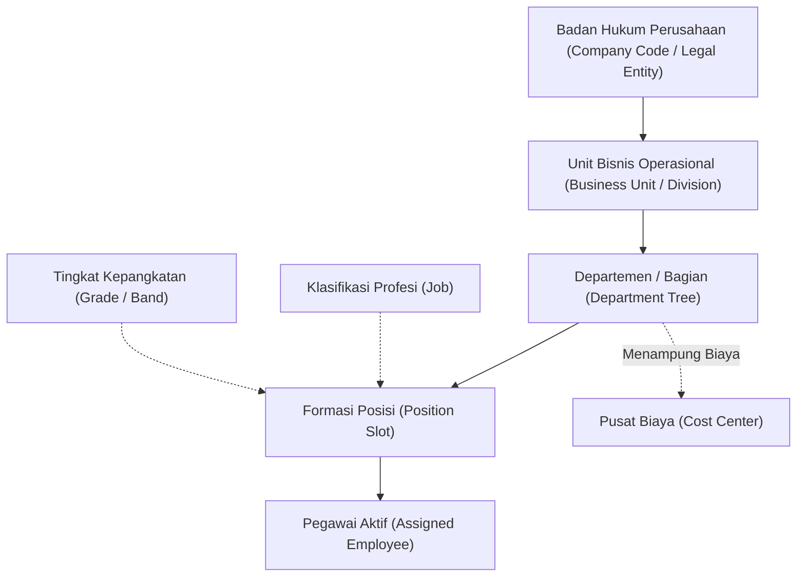

# Organization and Position Structure

## Definition

**Organization and Position Structure** adalah kerangka kerja arsitektural di dalam Enterprise Resource Planning (ERP) yang mendefinisikan hierarki unit kerja perusahaan (*organizational units*), rantai komando operasional (*reporting hierarchy*), klasifikasi peran profesi (*jobs*), formasi kursi jabatan berotoritas (*positions*), serta tingkatan kepangkatan dan kompensasi (*grades/bands*).

Di dalam ERP modern, struktur organisasi bukan sekadar bagan gambar susunan pengurus (*static org chart*), melainkan **mesin pengendali alur bisnis (*business process engine*)**:
1. Menentukan rute persetujuan dokumen (*approval workflows*) untuk pengadaan, penggajian, dan cuti.
2. Mengalokasikan biaya tenaga kerja ke pusat biaya akuntansi (*Cost Centers*).
3. Mengontrol kuota penerimaan pegawai (*headcount budget control*) agar perusahaan tidak merekrut melebihi formasi yang disetujui pemegang saham.

---

## Purpose

Tujuan penerapan Organization and Position Structure yang kokoh di dalam ERP adalah:

1. **Stabilitas Rantai Komando (*Hierarchy Resilience*)**: Mencegah putusnya alur persetujuan dokumen ketika seorang manajer mengundurkan diri melalui pendekatan hierarki berbasis posisi (*Position-to-Position*).
2. **Pengendalian Jumlah Tenaga Kerja (*Headcount Governance*)**: Membatasi penerimaan pegawai hanya pada formasi posisi yang telah diotorisasi dan memiliki pagu anggaran belanja pegawai.
3. **Penyelarasan Akuntansi Biaya Manajerial**: Memetakan setiap unit departemen secara presisi ke satu atau beberapa *Cost Center* untuk pelaporan laba rugi divisi.
4. **Standardisasi Kompensasi dan Jenjang Karir**: Mengelompokkan berbagai formasi posisi ke dalam jenjang kepangkatan (*Job Grades*) guna menjamin kesetaraan internal (*internal equity*) dalam pemberian kompensasi dan fasilitas kerja.
5. **Kesesuaian Tata Kelola Matriks (*Matrix & Multi-Entity Management*)**: Mendukung penugasan pegawai pada banyak entitas usaha (*Intercompany Assignment*) atau struktur matriks (atasan fungsional dan atasan proyek).

---

## Elemen Struktur Organisasi Multi-Dimensi

ERP membedakan lima lapisan struktur organisasi yang saling berhubungan:



### 1. Legal Entity & Business Unit
- **Legal Entity (Company Code)**: Entitas badan hukum resmi yang memiliki neraca dan laporan laba rugi tersendiri (misalnya `PT Maju Bersama`).
- **Business Unit / Division**: Unit bisnis strategis (misalnya Divisi Produk Digital, Divisi Layanan Konsultasi).

### 2. Department Hierarchy (Pohon Departemen)
Unit kerja fungsional yang tersusun dalam struktur pohon (*parent-child tree*):
- *Level 1*: Direktorat Teknologi & Operasional
  - *Level 2*: Departemen Teknologi (*Technology Department*)
    - *Level 3*: Sub-Departemen Pengembangan Perangkat Lunak (*Software Engineering*)
    - *Level 3*: Sub-Departemen Infrastruktur & DevOps

### 3. Job vs Position vs Grade
Tiga dimensi pembentuk peran kerja di dalam ERP:

| Dimensi | Definisi Konseptual | Karakteristik di ERP | Contoh Kasus PT Maju Bersama |
| :--- | :--- | :--- | :--- |
| **Job (Pekerjaan)** | Klasifikasi generik kelompok keahlian dan tanggung jawab profesional. | Tidak terikat kuota jumlah orang; mendefinisikan kompetensi standar. | `JOB-SWE` (*Software Engineer*) |
| **Position (Posisi)** | Slot jabatan spesifik dalam bagan organisasi yang didanai anggaran. | Memiliki kuota (*target headcount* = 1), memiliki atasan posisi, dan tertaut ke WBS/Cost Center. | `POS-TECH-042` (*Software Engineer - Core Team 1*) |
| **Grade (Pangkat)** | Tingkatan remunerasi dan batas kewenangan finansial. | Menentukan rentang gaji pokok (*salary range*) dan batas persetujuan belanja. | `Grade 4` (*Professional Staff*) |

---

## Position Management vs Employee-Centric Management

Dalam arsitektur ERP, pengelolaan struktur hierarki pelaporan umumnya menggunakan salah satu dari dua pendekatan dengan karakteristik dan trade-off masing-masing:

### 1. Employee-Centric Model (Hierarki Berbasis Orang)
- **Karakteristik**: Struktur pelaporan dikonfigurasi langsung antar personil/karyawan: `Andi Pratama melapor ke Budi Santoso`.
- **Use Case & Manfaat**: Cocok untuk organisasi skala kecil hingga menengah dengan alur kerja yang fleksibel, hierarki datar (*flat organization*), dan kebutuhan administrasi struktur data yang lebih sederhana.
- **Trade-off & Tantangan**: Ketika personil manajer mengundurkan diri atau dimutasi, alur persetujuan bawahan perlu dialihkan atau diperbarui secara manual ke manajer baru agar tidak terjadi kebuntuan (*approval deadlock*). Selain itu, sistem tidak dapat mendeteksi formasi jabatan kosong (*vacant slot*) secara otomatis.

### 2. Position-Based Model (Hierarki Berbasis Posisi)
- **Karakteristik**: Struktur pelaporan dikonfigurasi antar posisi jabatan: `Posisi POS-TECH-042 melapor ke Posisi POS-MGR-010`.
- **Use Case & Manfaat**:
  - Membantu mempertahankan struktur garis pelaporan dan persetujuan otorisasi (*approval chain*) saat pejabat yang menduduki posisi berganti (*resilient hierarchy*).
  - Posisi yang ditinggalkan secara otomatis teridentifikasi berstatus *Vacant* (Kosong), memudahkan pemicuan alur pembukaan rekrutmen formasi (*Job Requisition*).
  - Memfasilitasi penugasan pelaksana tugas / penjabat sementara (*Interim Assignment*) tanpa mengubah bagan struktur organisasi induk.
- **Trade-off & Tantangan**: Membutuhkan tata kelola master data yang lebih ketat, konfigurasi awal yang lebih kompleks, dan pemeliharaan kuota kapasitas formasi (*headcount budgeting*) yang disiplin.

Pilihan antara kedua model ini bergantung pada skala organisasi, kebutuhan tata kelola (*governance*), kompleksitas alur persetujuan, dan kemampuan model data platform ERP yang digunakan.

---

## Business Rules

1. **Aturan Formasi Tunggal (*Headcount Limit Enforcement*)**: Sistem secara baku melarang penugasan lebih dari satu pegawai aktif ke dalam satu posisi yang memiliki kuota kapasitas 1 (*FTE = 1,0*), kecuali untuk masa transisi serah terima tugas (*Handover Overlap*) yang telah diotorisasi dengan batas waktu maksimal 30 hari.
2. **Pemisahan Jalur Fungsional dan Finansial**: Setiap perubahan penempatan departemen seorang pegawai wajib secara otomatis memperbarui atau memvalidasi ulang pemetaan pusat biaya (*Cost Center*) untuk alokasi beban gaji bulanan.
3. **Pencegahan Struktur Melingkar (*Acyclic Graph Rule*)**: Bagan organisasi harus mematuhi struktur graf terarah tanpa siklus (*Directed Acyclic Graph* - DAG). Posisi atasan dilarang berada di bawah garis komando bawahannya sendiri.
4. **Batas Otoritas Berbasis Jenjang Jabatan (*Delegation of Authority by Grade*)**: Batas nominal persetujuan transaksi (misalnya pengajuan pembelian PR atau klaim biaya dinas) ditentukan oleh *Job Grade* posisi, bukan oleh preferensi personal pegawai.
5. **Penetapan Tanggal Efektif Organisasi (*Org Restructuring Effective Dating*)**: Perombakan struktur organisasi (merger departemen, penghapusan posisi, atau pembentukan divisi baru) wajib menggunakan tanggal efektif masa depan (*Future Effective Date*) agar tidak merusak transaksi operasional yang sedang berjalan.

---

## Skenario Kanonikal: Struktur Organisasi PT Maju Bersama

Bagan organisasi formasi penempatan pegawai kanonikal `Andi Pratama`:

```text
[Company: 1000 - PT Maju Bersama]
  └── [Division: Technology & Solution]
        └── [Department: Technology] (Cost Center: CC-TECH-01)
              │
              ├── [Position: POS-DIR-001] Chief Technology Officer (Grade 8)
              │     │
              │     └── [Position: POS-MGR-010] Engineering Manager (Grade 6)
              │           │   Pejabat Aktif: EMP-2026-0010 (Budi Santoso)
              │           │   Wewenang Persetujuan: s.d. Rp50.000.000
              │           │
              │           ├── [Position: POS-TECH-041] Senior Systems Analyst (Grade 5)
              │           │     Pejabat Aktif: EMP-2025-0018
              │           │
              │           └── [Position: POS-TECH-042] Software Engineer (Grade 4)
              │                 Pejabat Aktif: EMP-2026-0042 (Andi Pratama)
              │                 Klasifikasi Job: JOB-SWE (Software Engineering)
              │                 Status Formasi : Filled (Terisi 1/1)
              │                 Pusat Biaya    : CC-TECH-01
```

*Hubungan Alur Kerja*: Ketika Andi Pratama mengajukan permohonan cuti atau klaim lembur, sistem membaca bahwa posisi `POS-TECH-042` melapor ke `POS-MGR-010`, sehingga dokumen persetujuan secara otomatis diarahkan ke kotak masuk (*Inbox*) pejabat aktif posisi tersebut (`EMP-2026-0010`). Struktur organisasi dan batas kewenangan di atas merupakan contoh pemodelan (*illustrative learning scenario*), bukan aturan universal seluruh organisasi.

---

## ERP Implementation

Penerapan struktur organisasi dan posisi pada software ERP enterprise:

### Odoo Implementation
- **Department Tree (`hr.department`)**: Mendukung hierarki pohon induk-anak (*Parent Department*).
- **Job Positions (`hr.job`)**: Menggabungkan konsep *Job* dan *Position*. Pengguna dapat mendefinisikan target rekrutmen (*Target Headcount*) dan jumlah pegawai aktif yang sedang menduduki jabatan tersebut.
- **Manager Field**: Alur persetujuan dikendalikan oleh field `Manager` pada formulir pegawai atau departemen.

### ERPNext Implementation
- **Department Tree**: Menyediakan struktur departemen bertingkat tanpa batas kedalaman (*Nested Set Model*).
- **Designation DocType**: Berfungsi sebagai penanda profesi (*Job Title*).
- **Reports-to Field**: Menghubungkan pegawai ke manajer langsung secara personal; mendukung perutean alur kerja dokumen via konfigurasi *Workflow Rule*.

### Dynamics 365 Implementation
- **Organizational Hierarchy & Operating Units**: Mendukung pemodelan hierarki organisasi terpisah untuk tujuan hukum (*Legal Entities*), manajerial (*Cost Centers*), dan operasional (*Departments*).
- **Enterprise Position Management**: Menerapkan pemisahan posisi murni (*Position-to-Position Hierarchy*). Posisi memiliki masa berlaku (*Effective Dates*), status *Open / Filled / Retired*, serta matriks alokasi biaya multi-dimensi.
- **Job Families and Functions**: Mengelompokkan pekerjaan ke dalam *Job Families* dengan rentang kompetensi dan matriks kompensasi formal.

---

## Naventra Consideration

Dalam perancangan modul struktur organisasi Naventra ERP:

1. **Penerapan Penuh Model Position-to-Position**: Naventra mewajibkan seluruh alur persetujuan dokumen bisnis merujuk pada kode `position_id` daripada `employee_id`, memastikan alur bisnis tidak pernah terhenti saat terjadi kekosongan jabatan atau pergantian pejabat sementara.
2. **Headcount Quota Engine**: Setiap pembukaan lowongan kerja baru pada modul rekrutmen wajib memverifikasi ketersediaan kuota formasi posisi kosong (*Vacant Position Slot*) yang telah disetujui dalam anggaran tahunan perusahaan.
3. **Visual Interactive Organization Chart**: Antarmuka pengguna menyajikan bagan organisasi interaktif yang dapat di-*drill-down*, menampilkan indikator warna untuk posisi yang terisi (*Filled*), lowong (*Vacant*), atau sedang dalam proses rekrutmen aktif.

---

## References

- Armstrong, M., & Taylor, S. (2020). *Armstrong's Handbook of Human Resource Management Practice* (15th ed.). Kogan Page.
- Society for Human Resource Management (SHRM). *Organizational Structures and Position Management in Modern Enterprise*.
- SAP Help Portal. *Organizational Management (OM) in SAP S/4HANA*.
- Microsoft Learn. *Manage Organization and Position Hierarchies in Dynamics 365 Human Resources*.
- ERPNext Documentation. *Department and Designation Setup*.
- Odoo 17.0 Documentation. *Departments and Job Positions Management*.
