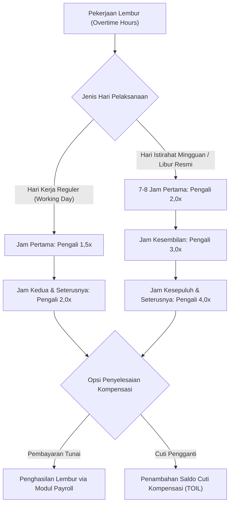
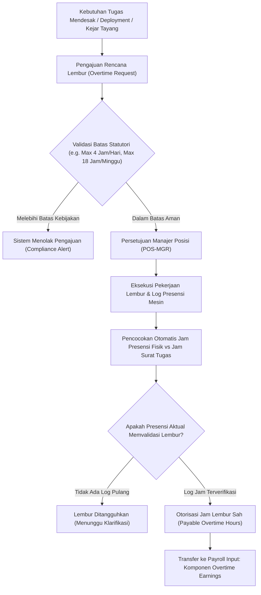

# Overtime and Time Management

## Definition

**Overtime and Time Management** (Manajemen Lembur dan Waktu Kerja) di dalam Enterprise Resource Planning (ERP) adalah domain operasional yang mengatur otorisasi, pencatatan waktu kerja di luar jam standar (*work beyond normal schedule*), penegakan batas kepatuhan hukum ketenagakerjaan, serta kalkulasi kompensasi finansial atau cuti kompensasi (*Time Off in Lieu - TOIL*) yang dihasilkan dari kelebihan jam kerja tersebut.

Di dalam ERP enterprise, lembur bukan sekadar tambahan jam kerja personal pegawai, melainkan **komponen biaya variabel kritis yang berdampak langsung pada anggaran operasional**:
1. Menjaga kepatuhan terhadap batas statutori perlindungan kesehatan dan keselamatan tenaga kerja.
2. Mengendalikan lonjakan biaya tenaga kerja (*labor cost overrun*) agar aktivitas lembur selalu diverifikasi kelayakannya dan dibebankan ke pusat biaya (*Cost Center*) atau objek biaya proyek (*WBS*) pemohon.

---

## Purpose

Tujuan penerapan Overtime and Time Management yang terstruktur di dalam ERP meliputi:

1. **Pencegahan Pembengkakan Biaya Tanpa Otorisasi (*Cost Leakage Prevention*)**: Memastikan seluruh jam lembur didasarkan pada surat perintah kerja lembur (*Overtime Request / Order*) yang disetujui manajer sebelum atau sesaat setelah pekerjaan dilaksanakan.
2. **Kepatuhan Terhadap Regulasi Ketenagakerjaan**: Menegakkan batas maksimum jam kerja lembur harian dan mingguan guna menghindari sanksi audit kepatuhan hukum perburuhan.
3. **Kalkulasi Kompensasi Bertingkat Otomatis**: Menghitung tarif pengali lembur progresif (*multiplier tiers*) secara otomatis berdasarkan jenis hari kerja (hari kerja normal, hari libur akhir pekan, atau hari libur nasional).
4. **Fleksibilitas Kompensasi Finansial vs Libur (*Cash vs TOIL*)**: Menyediakan opsi penyelesaian lembur, apakah dibayarkan sebagai penghasilan lembur pada slip gaji (*Payroll Overtime Earnings*) atau dikonversikan menjadi kuota cuti pengganti.
5. **Atribusi Biaya ke Aktivitas Riil**: Membebankan biaya lembur langsung ke proyek pemesan (*Project WBS*) pada modul [[09-project/project-cost-management|Project Management]] atau pesanan pabrik pada modul [[06-manufacturing/production-costing-and-wip|Manufacturing]].

---

## Mekanisme dan Skema Pengali Lembur (Overtime Multipliers)

Sistem ERP mendukung konfigurasi formula pengali lembur bertingkat (*progressive multiplier rates*):

### Formula Dasar Upah Lembur Sejam & Konteks Regulasi

Dalam standar praktik ketenagakerjaan di Indonesia (mengacu pada Peraturan Pemerintah No. 35 Tahun 2021 dan kerangka pengupahan terkait termasuk PP No. 49 Tahun 2025 yang mengubah PP No. 36 Tahun 2021):
$$
\text{Upah Lembur Sejam} = \frac{1}{173} \times \text{Upah Sebulan (Gaji Pokok + Tunjangan Tetap)}
$$

*Konteks Regulasi & Kepatuhan*:
- **Batas Waktu Kerja Lembur**: PP 35/2021 mengatur waktu kerja lembur pada hari kerja biasa paling banyak 4 jam dalam 1 hari dan 18 jam dalam 1 minggu (tidak termasuk kerja lembur pada hari istirahat mingguan atau hari libur resmi yang memiliki pengaturan tersendiri).
- **Pengali Bertingkat**: Pada hari kerja biasa, jam pertama dihitung 1,5x upah sejam, dan jam berikutnya 2,0x upah sejam. Pada hari libur resmi/istirahat mingguan berlaku skema pengali khusus (mulai 2,0x hingga 4,0x).
- **Parameter ERP**: Angka $\frac{1}{173}$ dan batasan jam tersebut merupakan acuan hukum di Indonesia. Sistem ERP dirancang menyediakan fleksibilitas konfigurasi aturan (*rule-based configuration*) sesuai yurisdiksi, perjanjian kerja bersama (PKB), atau peraturan perusahaan (PP) yang berlaku.

---

## Klasifikasi Kelayakan Lembur (Exempt vs Non-Exempt)

Tidak semua pegawai berhak menerima kompensasi uang lembur:

| Klasifikasi Status | Tingkat Kepangkatan / Posisi | Kebijakan Kompensasi Lembur di ERP |
| :--- | :--- | :--- |
| **Non-Exempt (Eligible)** | Staf pelaksana, teknisi, operator pabrik, *Software Engineer* (Grade 1 – Grade 4). | **Berhak Penuh**: Setiap jam lembur yang disetujui dihitung kompensasinya sesuai tarif pengali resmi via modul Payroll. |
| **Exempt (Ineligible)** | Manajer, kepala departemen, direksi, konsultan eksekutif (Grade 5 ke atas). | **Tidak Berhak**: Jam kerja berorientasi pada pencapaian hasil (*results-oriented*); kelebihan jam kerja dianggap sebagai tanggung jawab manajerial dan tidak menghasilkan uang lembur. |

---

## Business Process: Otorisasi dan Rekonsiliasi Lembur

Alur pemrosesan lembur terintegrasi disajikan dalam diagram berikut:

---

## Business Rules

1. **Prasyarat Otorisasi Sebelum Eksekusi (*Pre-Approval Requirement*)**: Lembur umumnya didahului oleh surat perintah kerja lembur digital (*Overtime Request*). Kehadiran fisik pegawai di luar jam kerja tanpa otorisasi dapat dikonfigurasi sebagai kehadiran yang tidak menimbulkan kewajiban kompensasi lembur.
2. **Rekonsiliasi Tiga Arah Jam Lembur (*Three-Way Time Reconciliation*)**: Jam lembur yang dihitung untuk pembayaran lazimnya menggunakan nilai terkecil antara:
   $$\text{Jam Lembur Dibayar} = \min(\text{Jam Permohonan Disetujui}, \text{Jam Kehadiran Fisik Riil Biometrik})$$
3. **Penegakan Batas Maksimum Ketenagakerjaan**: Sistem dapat memvalidasi pengajuan lembur terhadap batas maksimum regulasi (misalnya tidak lebih dari 4 jam lembur pada hari kerja biasa, atau 18 jam lembur kumulatif per minggu).
4. **Fasilitas Tambahan Lembur (*Meal & Transport Entitlement*)**: Berdasarkan kebijakan perusahaan, pelaksanaan lembur dengan durasi tertentu dapat memicu hak pemberian uang makan lembur atau transportasi malam.
5. **Batas Akhir Otorisasi Periode Penggajian**: Seluruh klaim jam lembur periode berjalan wajib diverifikasi atasan sebelum tanggal *Cut-Off Payroll*. Klaim yang disetujui setelah cut-off dialihkan ke periode penggajian berikutnya.

---

## Accounting & Financial Impact

Kompensasi lembur dicatat dalam pembukuan keuangan perusahaan:

### 1. Pengakuan Beban Lembur pada Penggajian (Payroll Accrual)
Pada akhir bulan, total kompensasi lembur dibukukan sebagai beban operasional dan kewajiban gaji:

$$\begin{array}{llrr}
\text{Debit:} & \text{Overtime Expense (Beban Lembur Karyawan)} & \text{Rp500.000} & \\
\text{Kredit:} & \text{Salaries & Wages Payable (Hutang Gaji & Upah)} & & \text{Rp500.000}
\end{array}$$

### 2. Penyerapan ke Biaya Proyek atau Manufaktur (Cost Absorption)
Jika lembur dilakukan untuk mempercepat pekerjaan pada proyek pelanggan `PRJ-ERP-2026-001` (*PT Maju Bersama*), biaya lembur dialokasikan ke objek biaya proyek:

$$\begin{array}{llrr}
\text{Debit:} & \text{Project WIP / Contract Cost (atau Project Labor Expense)} & \text{Rp500.000} & \\
\text{Kredit:} & \text{Direct Labor Absorption / Clearing Account} & & \text{Rp500.000}
\end{array}$$

> [!NOTE]
> **Kebijakan Akuntansi Proyek**:
> Biaya lembur proyek tidak otomatis dikapitalisasi sebagai aset/persediaan WIP. Jika biaya memenuhi kriteria pemenuhan kontrak (IFRS 15 / PSAK 72), biaya dialokasikan ke *Project WIP / Contract Cost*; jika tidak memenuhi kriteria, biaya dibukukan langsung sebagai beban proyek periode berjalan.

---

## Skenario Kanonikal: Lembur Andi Pratama

Penerapan lembur pada pegawai kanonikal `Andi Pratama` (`EMP-2026-0042` - Grade 4, Non-Exempt) di `PT Maju Bersama`:

- **Konteks Operasional**: Pendampingan peluncuran sistem dan migrasi data akhir pekan pada proyek `PRJ-ERP-2026-001`.
- **Surat Perintah Lembur**: `OT-2026-04-015` disetujui oleh Budi Santoso (`EMP-2026-0010`).
- **Waktu Pelaksanaan**: Sabtu, 18 April 2026 (Hari Istirahat Mingguan / *Rest Day*).
- **Durasi Kerja Riil**: Pukul 09:00 s.d. 13:00 WIB (4 Jam Kerja Efektif di hari istirahat mingguan, bukan dalam 1 hari kerja normal).
- **Formula Pengali Skenario**: Hari Istirahat Mingguan (4 Jam $\times$ Pengali $2,0 = \mathbf{8\text{ Jam Lembur Konversi}}$).
- **Nilai Kompensasi Lembur Skenario**: **Rp500.000** (Dihitung sebagai komponen penerimaan *Overtime* pada slip gaji bulanan kanonikal).

> [!NOTE]
> **Asumsi Pembelajaran Skenario**:
> Angka kompensasi lembur **Rp500.000** untuk 8 jam lembur konversi dalam satu periode penggajian bulanan ini merupakan **asumsi pembelajaran numerik (*illustrative learning assumption*)** guna menjaga konsistensi permodelan matematika payroll di seluruh modul. Perhitungan riil di industri wajib menerapkan formula detail pengupahan dan ketentuan upah minimum/kesepakatan kerja yang berlaku.

---

## ERP Implementation

Penerapan manajemen lembur pada platform ERP enterprise:

### Odoo Implementation
- **Overtime in Attendances App**: Odoo menghitung selisih jam kerja aktual terhadap kalender kerja pegawai (`resource.calendar`) secara otomatis sebagai saldo lembur positif.
- **Overtime to Time Off Conversion**: Pengguna dapat mengonversi saldo lembur menjadi hak cuti tambahan dalam modul *Time Off*.
- **Payroll Rule Integration**: Modul *Payroll* membaca baris input jam lembur untuk dikalikan dengan tarif lembur pada *Salary Rule*.

### ERPNext Implementation
- **Overtime Claim DocType**: Pengguna mengajukan dokumen lembur terpisah yang mencantumkan tanggal, durasi jam, dan tautan ke proyek atau pusat biaya.
- **Salary Component Mapping**: Total jam lembur disalurkan otomatis ke komponen gaji *Overtime Allowance* pada dokumen `Additional Salary`.
- **Shift Type Overtime Threshold**: Menentukan batas menit toleransi sebelum sistem mulai menghitung kelebihan waktu sebagai lembur.

### Dynamics 365 Implementation
- **Pay Agreements & Overtime Multipliers**: Modul *Time and Attendance* menyediakan aturan perjanjian penggajian (*Pay Agreements*) yang memetakan jam lembur ke kode pembayaran gaji (*Pay Types*) dengan tarif bertingkat multi-faktor.
- **Overtime Authorization Limits**: Mengonfigurasi batas jam lembur per departemen yang terintegrasi dengan ketersediaan plafon anggaran belanja tenaga kerja (*Budget Availability Control*).

---

## Naventra Consideration

Dalam perancangan modul manajemen lembur Naventra ERP:

1. **Dual Validation Engine (Biometrik vs Surat Tugas)**: Sistem secara otomatis membandingkan stempel presensi biometrik dengan jam surat perintah lembur. Jika pegawai lembur 3 jam tetapi surat tugas hanya mengizinkan 2 jam, sistem membatasi pembayaran maksimal 2 jam.
2. **Real-time Project Budget Check**: Pengajuan lembur dengan pembebanan kode WBS proyek secara otomatis memverifikasi ketersediaan saldo anggaran tenaga kerja (*WBS Labor Budget*) sebelum persetujuan dapat disahkan.
3. **Peringatan Kelelahan Tenaga Kerja (*Fatigue Monitoring Alert*)**: Naventra menampilkan indikator peringatan visual kepada manajer jika seorang staf teknis telah bekerja lembur lebih dari 12 jam dalam minggu berjalan untuk menjaga *Work-Life Balance* dan kualitas kode perangkat lunak.

---

## References

- Republik Indonesia. *Peraturan Pemerintah (PP) No. 35 Tahun 2021 tentang Perjanjian Kerja Waktu Tertentu, Alih Daya, Waktu Kerja dan Waktu Istirahat, dan Pemutusan Hubungan Kerja*.
- Republik Indonesia. *Peraturan Pemerintah (PP) No. 49 Tahun 2025 tentang Perubahan atas Peraturan Pemerintah No. 36 Tahun 2021 tentang Pengupahan*.
- International Labour Organization (ILO). *Hours of Work (Industry) Convention (No. 1)*. ILO.
- Armstrong, M., & Taylor, S. (2020). *Armstrong's Handbook of Human Resource Management Practice* (15th ed.). Kogan Page.
- SAP Help Portal. *Overtime Processing in Time Management (PT) in SAP ERP HCM*.
- Microsoft Learn. *Calculate overtime and pay types in Dynamics 365 Supply Chain & HR*.
- ERPNext Documentation. *Overtime Processing and Additional Salary*.
- Odoo 17.0 Documentation. *Attendance Overtime Management*.
