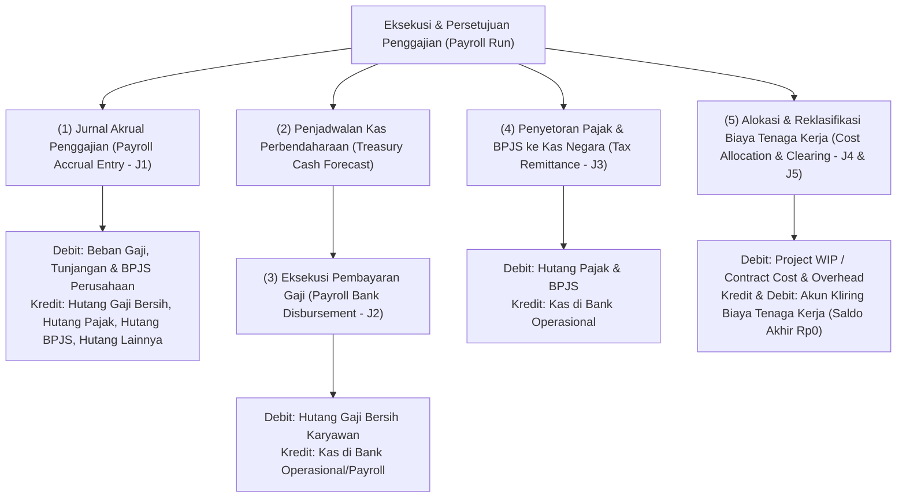

# Payroll Accounting and Finance Integration

## Definition

**Payroll Accounting and Finance Integration** adalah arsitektur integrasi lintas modul di dalam Enterprise Resource Planning (ERP) yang menerjemahkan kalkulasi penggajian pegawai (*payroll run outputs*) menjadi entri jurnal pembukuan buku besar umum (*General Ledger*), pembebanan pusat biaya manajerial (*Cost Center Accounting*), penyaluran kas perbendaharaan (*treasury disbursement*), serta rekonsiliasi akun kliring tenaga kerja (*labor clearing accounts*).

Di dalam arsitektur ERP enterprise, transaksi penggajian merupakan salah satu pos pengeluaran kas operasional terbesar perusahaan (*operating cash outflows*). Integrasi ini memastikan bahwa:
1. Setiap sen hak gaji pegawai, potongan pajak, dan kontribusi jaminan sosial tercatat secara presisi pada akun neraca dan laba rugi yang relevan.
2. Beban tenaga kerja teralokasikan secara adil ke departemen operasional, objek biaya proyek (*Project WBS*), atau pesanan pabrik (*Manufacturing Order*) tanpa distorsi pembukuan.

---

## Purpose

Tujuan penerapan Payroll Accounting and Finance Integration di dalam ERP meliputi:

1. **Otomatisasi Pembukuan Jurnal Gaji (*Automated GL Posting*)**: Menghilangkan penjurnalan manual ribuan baris komponen gaji dan menggantikannya dengan pemetaan akun otomatis berbasis aturan gaji.
2. **Kepatuhan Prinsip Penandingan Beban (*Matching Principle*)**: Mengakui beban gaji pada periode di mana pegawai mencurahkan tenaganya (*accrual basis*), bukan saat kas fisik dibayarkan.
3. **Penyelarasan Manajemen Likuiditas Kas (*Treasury & Cash Planning*)**: Memberikan proyeksi kebutuhan likuiditas kas penggajian (*Payroll Cash Requirements*) beberapa hari sebelum tanggal pembayaran guna mencegah kegagalan transfer massal.
4. **Pemisahan Akuntansi Keuangan dan Akuntansi Biaya**: Mengelola akuntansi statutori eksternal (beban gaji total dan kewajiban hutang) berdampingan dengan akuntansi manajerial internal (biaya per proyek, per produk, atau per departemen).
5. **Rekonsiliasi Bank Tanpa Selisih (*Seamless Bank Reconciliation*)**: Memfasilitasi pencocokan otomatis antara rekening koran bank (*bank statement*) dengan total voucher pengeluaran gaji (*Payroll Disbursement Batch*).

---

## Arsitektur Alur Finansial dan Akuntansi Penggajian

Integrasi penggajian dengan modul akuntansi dan keuangan mencakup empat siklus pembukuan terkoordinasi:

---

## Pemetaan Akun dan Alur Jurnal Lengkap

Proses akuntansi penggajian melibatkan akun-akun berikut:

### 1. Jurnal Akrual Penggajian Bulanan (Payroll Accrual at Month-End - J1)
Pada saat proses penggajian disetujui, ERP membukukan pengakuan beban operasional dan kewajiban lancar:

$$\begin{array}{llrr}
\text{Debit:} & \text{Salaries Expense - Basic (Beban Gaji Pokok - CC-TECH-01)} & \text{Rp10.000.000} & \\
\text{Debit:} & \text{Allowances Expense (Beban Tunjangan Tetap - CC-TECH-01)} & \text{Rp1.500.000} & \\
\text{Debit:} & \text{Overtime Expense (Beban Upah Lembur - CC-TECH-01)} & \text{Rp500.000} & \\
\text{Debit:} & \text{Employer Statutory Contribution Expense (Beban BPJS Kantor)} & \text{Rp800.000} & \\
\text{Kredit:} & \text{Salaries & Wages Payable (Hutang Gaji Bersih Karyawan)} & & \text{Rp10.800.000} \\
\text{Kredit:} & \text{Withholding Tax Payable PPh 21 (Hutang Pajak Karyawan)} & & \text{Rp400.000} \\
\text{Kredit:} & \text{Employee Social Security Payable (Hutang BPJS Pegawai)} & & \text{Rp600.000} \\
\text{Kredit:} & \text{Employer Social Security Payable (Hutang BPJS Kantor)} & & \text{Rp800.000} \\
\text{Kredit:} & \text{Other Employee Deductions Payable (Hutang Koperasi)} & & \text{Rp200.000}
\end{array}$$

*Total Debit*: Rp12.800.000 | *Total Kredit*: Rp12.800.000 (Seimbang).

### 2. Jurnal Penyaluran Kas Gaji Bersih ke Rekening Pegawai (Disbursement Entry - J2)
Saat bank mengeksekusi transfer dana gaji bersih pada tanggal pembayaran (misalnya tanggal 25):

$$\begin{array}{llrr}
\text{Debit:} & \text{Salaries & Wages Payable (Hutang Gaji Bersih Karyawan)} & \text{Rp10.800.000} & \\
\text{Kredit:} & \text{Cash in Bank - Payroll Account (Kas di Bank Penggajian)} & & \text{Rp10.800.000}
\end{array}$$

*Dampak Neraca*: Akun *Salaries & Wages Payable* menjadi **Rp0 (Lunas)**.

### 3. Jurnal Penyetoran Pajak dan Iuran Jaminan Sosial ke Kas Negara (Tax & Statutory Remittance - J3)
Saat perusahaan menyetorkan potongan PPh 21 dan total iuran BPJS ke kas negara dan kas BPJS pada awal bulan berikutnya (misalnya tanggal 10):

$$\begin{array}{llrr}
\text{Debit:} & \text{Withholding Tax Payable PPh 21} & \text{Rp400.000} & \\
\text{Debit:} & \text{Employee Social Security Payable} & \text{Rp600.000} & \\
\text{Debit:} & \text{Employer Social Security Payable} & \text{Rp800.000} & \\
\text{Debit:} & \text{Other Employee Deductions Payable (Transfer ke Rekening Koperasi)} & \text{Rp200.000} & \\
\text{Kredit:} & \text{Cash in Bank - Main Operational (Kas di Bank Operasional)} & & \text{Rp2.000.000}
\end{array}$$

*Dampak Neraca*: Seluruh akun hutang potongan statutori dan sukarela menjadi **Rp0 (Lunas)**.

### 4. Jurnal Alokasi Biaya Tenaga Kerja ke Proyek dan Operasional (Cost Allocation Entry - J4)
Sebagaimana dibahas pada [[10-hr/employee-timesheet-and-labor-cost|Timesheet & Labor Cost]], jika perusahaan menerapkan pola akuntansi penyerapan biaya tenaga kerja, biaya dialokasikan ke proyek dan overhead departemen:

$$\begin{array}{llrr}
\text{Debit:} & \text{Project WIP / Contract Cost (PRJ-ERP-2026-001)} & \text{Rp6.400.000} & \\
\text{Debit:} & \text{Departmental Overhead Expense (CC-TECH-01)} & \text{Rp6.400.000} & \\
\text{Kredit:} & \text{Direct Labor Absorption / Clearing Account} & & \text{Rp12.800.000}
\end{array}$$

### 5. Jurnal Reklasifikasi dan Penutupan Akun Kliring (Clearing Reclassification Entry - J5)
Untuk merekonsiliasi akun perantara kliring terhadap beban operasional penggajian yang telah dibukukan pada Jurnal 1:

$$\begin{array}{llrr}
\text{Debit:} & \text{Direct Labor Absorption / Clearing Account} & \text{Rp12.800.000} & \\
\text{Kredit:} & \text{Salaries Expense - Basic (CC-TECH-01)} & & \text{Rp10.000.000} \\
\text{Kredit:} & \text{Allowances Expense (CC-TECH-01)} & & \text{Rp1.500.000} \\
\text{Kredit:} & \text{Overtime Expense (CC-TECH-01)} & & \text{Rp500.000} \\
\text{Kredit:} & \text{Employer Statutory Contribution Expense (BPJS Kantor)} & & \text{Rp800.000}
\end{array}$$

*Hasil Rekonsiliasi*: Saldo akun *Direct Labor Absorption / Clearing Account* menjadi tepat **Rp0 (Nihil)**. Beban operasional telah teralokasikan secara tertib ke objek proyek dan overhead tanpa terjadi pencatatan beban ganda (*double-counting*).

> [!NOTE]
> **Kebijakan Akuntansi & Pola Arsitektur Alokasi Biaya**:
> 1. **Perlakuan Biaya Proyek**: Biaya tenaga kerja proyek tidak otomatis diakui sebagai persediaan/WIP dalam seluruh kondisi. Biaya tenaga kerja yang memenuhi kriteria kapitalisasi biaya kontrak (misalnya *costs to fulfil a contract* di bawah IFRS 15 / PSAK 72) dapat dialokasikan ke *Project WIP / Contract Cost*; biaya lainnya dapat langsung diakui sebagai beban periode berjalan (*Project Labor Expense*).
> 2. **Pola J4 + J5 sebagai Arsitektur Alokasi**: Rangkaian jurnal penyerapan dan reklasifikasi (J4 dan J5) merupakan salah satu pola arsitektur alokasi biaya (*cost allocation architecture pattern*). Perusahaan dapat memilih memposting pembebanan langsung ke akun proyek pada saat pengesahan lembar waktu tanpa melalui akun kliring, bergantung pada kebijakan akuntansi dan konfigurasi modul proyek.

---

## Integrasi Manajemen Kas dan Perbendaharaan (Finance Phase 8 Integration)

Penggajian terhubung erat dengan modul [[07-finance/cash-flow-planning|Finance (Phase 8)]]:

1. **Peramalan Kebutuhan Kas Gaji (*Payroll Cash Forecast*)**:
   - 5 hingga 10 hari sebelum tanggal penggajian, sistem menyajikan estimasi kebutuhan likuiditas kas kepada Manajer Keuangan (*Treasury Manager*) yang mencakup:
     - Gaji Bersih (*Net Pay* yang harus ditransfer ke rekening pegawai).
     - Pembayaran Pajak & BPJS yang jatuh tempo pada awal bulan berikutnya.
2. **Pemindahan Dana Antar-Rekening (*Inter-Account Fund Transfer*)**:
   - Bagian perbendaharaan memindahkan dana dari rekening operasional utama (*Main Operating Account*) ke rekening khusus penggajian (*Dedicated Payroll Account*) guna mengisolasi saldo pembayaran gaji dari risiko penarikan transaksi lain.
3. **Rekonsiliasi Rekening Koran Bank (*Bank Reconciliation Integration*)**:
   - Sistem mencocokkan baris debit rekening koran bank dengan nomor referensi berkas pembayaran *batch* penggajian pada modul [[07-finance/bank-reconciliation|Bank Reconciliation]].

---

## Business Rules

1. **Prasyarat Keseimbangan Pembukuan (*Zero-Variance Posting Rule*)**: Sistem secara baku memblokir posting jurnal penggajian ke buku besar jika total nilai debit tidak sama persis dengan total nilai kredit hingga digit desimal terkecil.
2. **Pemisahan Rekening Penyaluran Kas (*Dedicated Payroll Account Policy*)**: Seluruh transaksi penyaluran gaji bersih wajib dieksekusi melalui buku pembantu kas bank yang telah ditetapkan sebagai akun penggajian guna menjaga kerahasiaan informasi nominal upah individual dari staf akuntansi umum.
3. **Penguncian Periode Akuntansi Fiskal (*Period-End Cut-Off Linkage*)**: Jurnal akrual penggajian wajib dibukukan pada periode akuntansi buku besar yang terbuka. Upaya posting jurnal gaji ke periode akuntansi yang telah ditutup (*Closed Fiscal Period*) akan ditolak oleh sistem.
4. **Validasi Ketersediaan Anggaran Pusat Biaya (*Cost Center Budget Verification*)**: Beban gaji yang diposting ke pusat biaya departemen diperiksa terhadap ketersediaan plafon anggaran belanja pegawai (*Workforce Budget Availability Control*).
5. **Pemisahan Tugas Penyaluran Kas (*Segregation of Duties - SoD*)**: Petugas HR yang memproses slip gaji dilarang memiliki wewenang otorisasi transfer bank (*Bank Disburser*) atau akses persetujuan token perbankan (*Token Authorizer*).

---

## Skenario Kanonikal: Ringkasan Pembukuan Finansial Andi Pratama

Rekapitulasi pembukuan akuntansi dan arus kas untuk pegawai kanonikal `Andi Pratama` (`EMP-2026-0042`) di `PT Maju Bersama` pada periode April 2026:

| Dimensi Transaksi | Nilai Nominal | Keterangan Pos Pembukuan | Dampak ke Laporan Keuangan |
| :--- | :--- | :--- | :--- |
| **Gaji Pokok** | Rp10.000.000 | Kompensasi Dasar Kontrak PKWTT | Beban Laba Rugi (*Operating Expense*) |
| **Tunjangan Tetap** | Rp1.500.000 | Tunjangan Fungsional Keahlian | Beban Laba Rugi (*Operating Expense*) |
| **Upah Lembur Sah** | Rp500.000 | Kompensasi 8 Jam Lembur Deployment | Beban Laba Rugi (*Operating Expense*) |
| **Iuran BPJS Kantor** | Rp800.000 | Kewajiban Manfaat Pemberi Kerja | Beban Laba Rugi (*Operating Expense*) |
| **Total Beban Perusahaan**| **Rp12.800.000**| **Total Employer Cost** | **Total Beban Operasional Tenaga Kerja** |
| **Potongan Pajak PPh 21** | (Rp400.000) | Hutang Titipan Pajak ke Kas Negara | Liabilitas Lancar (*Current Liabilities*) |
| **Potongan BPJS Pegawai** | (Rp600.000) | Hutang Titipan Iuran ke BPJS | Liabilitas Lancar (*Current Liabilities*) |
| **Potongan Koperasi** | (Rp200.000) | Hutang Titipan Simpanan Anggota | Liabilitas Lancar (*Current Liabilities*) |
| **Total Potongan Gaji** | **(Rp1.200.000)**| **Pengurang Hak Bruto Pegawai** | **Total Kewajiban Titipan Pihak Ketiga** |
| **Gaji Bersih (Net Pay)** | **Rp10.800.000**| **Kas Ditransfer ke Rekening Mandiri**| **Arus Kas Keluar Operasional (CFO)** |

*Hasil Integrasi*: Seluruh angka saling mengunci secara matematis:
$$\text{Total Beban (Rp12.800.000)} = \text{Kas Gaji Bersih (Rp10.800.000)} + \text{Hutang Pajak \& Iuran (Rp2.000.000)}$$

---

## ERP Implementation

Penerapan integrasi akuntansi penggajian pada software ERP enterprise:

### Odoo Implementation
- **Accounting Configuration pada Salary Rules**: Setiap aturan gaji Odoo dapat dipetakan ke akun debit dan kredit tertentu, atau menggunakan akun default dari *Salary Structure*.
- **Journal Entries Generated on Payslip Run**: Pengesahan *Payslip Batch* secara otomatis menghasilkan satu dokumen jurnal teragregasi (`account.move`) pada jurnal khusus penggajian (*Payroll Journal*).
- **Analytic Distribution**: Memungkinkan pemecahan biaya gaji ke berbagai akun analitik proyek atau departemen.

### ERPNext Implementation
- **Payroll Entry GL Integration**: Dokumen `Payroll Entry` memiliki tombol *Make Bank Entry* yang secara otomatis membentuk jurnal pengeluaran kas (`Journal Entry` tipe *Bank Entry*) setelah jurnal akrual gaji disahkan.
- **Accounts Mapping on Salary Component**: Setiap komponen gaji langsung dipetakan ke akun buku besar beban atau hutang pada *Chart of Accounts*.

### Dynamics 365 Implementation
- **Posting Profiles in Payroll**: Dynamics 365 Finance & Human Resources menggunakan profil posting penggajian (*Payroll Posting Profiles*) yang memetakan kode penghasilan dan potongan ke akun utama (*Main Accounts*) dan dimensi keuangan (*Financial Dimensions*).
- **Vendor Generation for Statutory Payables**: Secara otomatis menghasilkan saldo hutang vendor (*Vendor Invoices*) untuk disetorkan ke otoritas pajak atau penyedia asuransi kesehatan.

---

## Naventra Consideration

Dalam perancangan modul integrasi akuntansi penggajian Naventra ERP:

1. **Automated Journal Consolidation Engine**: Naventra sebaiknya menggunakan payroll batch sebagai boundary posting ke GL secara teragregasi per pusat biaya pada akhir bulan, sementara rincian transaksi per komponen tetap berada pada payroll subledger guna menjaga performa pelaporan buku besar.
2. **Treasury Pre-Flight Balance Validation**: Modul perbendaharaan Naventra dapat memindai saldo rekening bank penggajian sebelum jadwal transfer massal, memberikan notifikasi otomatis jika saldo kas di bawah kebutuhan pencairan gaji bersih.
3. **Audit Trail for Payment Files**: Setiap berkas transaksi perbankan yang diekspor (*Bank Transfer File*) diamankan dengan jejak audit dan tanda tangan digital (*Digital Hash*) guna mencegah modifikasi di luar sistem ERP.

---

## References

- International Accounting Standards Board (IASB). *IAS 19: Employee Benefits*. IFRS Foundation.
- Ikatan Akuntan Indonesia (IAI). *PSAK 24: Imbalan Kerja*.
- Kaplan, R. S., & Atkinson, A. A. (2015). *Advanced Management Accounting* (3rd ed.). Pearson.
- SAP Help Portal. *Payroll Posting to Accounting (FI/CO) in SAP ERP HCM*.
- Microsoft Learn. *Post payroll to general ledger in Dynamics 365 Finance*.
- ERPNext Documentation. *Payroll Accounting and Journal Entries*.
- Odoo 17.0 Documentation. *Payroll Accounting Integration*.
