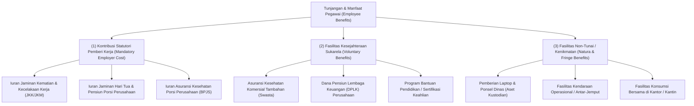
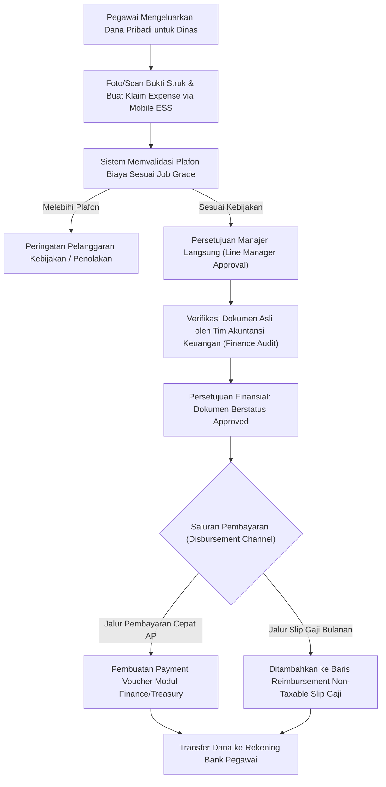

# Payroll Benefits and Reimbursements

## Definition

**Payroll Benefits and Reimbursements** (Tunjangan Perusahaan dan Penggantian Biaya Pegawai) di dalam Enterprise Resource Planning (ERP) adalah domain terpadu yang mengelola program kesejahteraan karyawan (*employee benefits*), kontribusi jaminan sosial pemberi kerja (*employer statutory contributions*), fasilitas kenikmatan non-tunai (*fringe benefits / natura*), serta pemrosesan klaim penggantian pengeluaran operasional pribadi pegawai untuk kepentingan bisnis (*employee expense reimbursements*).

Di dalam arsitektur ERP, pengelolaan antara **Kompensasi Gaji (Remuneration)** dan **Penggantian Biaya Operasional (Reimbursement)** lazimnya dibedakan:
- **Salary / Remunerasi**: Pembayaran imbalan atas jasa kerja pegawai yang umumnya merupakan penghasilan bruto objek pajak (*Taxable Employee Income*) dan dibukukan sebagai beban kompensasi pegawai (*Salaries Expense*).
- **Reimbursement**: Klaim dinas sebaiknya dikelola melalui channel reimbursement/expense terpisah dari remuneration payroll apabila organisasi memerlukan pemisahan tersebut. Pengembalian biaya operasional yang sah yang ditalangi pegawai umumnya bukan merupakan penghasilan kena pajak karyawan, dan perlakuan akuntansi serta perpajakannya mengikuti kebijakan organisasi dan ketentuan peraturan yang berlaku. Pembayaran dapat disalurkan melalui modul Accounts Payable (AP) maupun melalui baris *non-taxable reimbursement* terpisah pada siklus penggajian.

---

## Purpose

Tujuan pengelolaan Benefits and Reimbursements di dalam ERP adalah:

1. **Pemisahan Pengelolaan Remunerasi dan Penggantian Biaya**: Memberikan tata kelola yang tertib antara imbalan kerja dengan penggantian biaya operasional dinas agar perlakuan akuntansi dan pajaknya tidak tercampur secara keliru.
2. **Pengendalian Pengeluaran Bisnis (*Travel & Expense Governance*)**: Menegakkan kepatuhan terhadap kebijakan batas maksimal biaya perjalanan dinas (*per diem*, batas tarif hotel, dan kelayakan jamuan makan) melalui matriks persetujuan berjenjang.
3. **Penyaluran dan Pelaporan Jaminan Sosial Perusahaan**: Mengelola perhitungan kontribusi jaminan sosial porsi pemberi kerja secara akurat guna memenuhi kepatuhan regulasi ketenagakerjaan.
4. **Verifikasi Bukti Transaksi Digital (*Receipt Auditability*)**: Memvalidasi kwitansi, struk pembayaran, dan bukti pengeluaran sah secara digital sebelum dana reimbursement dicairkan.
5. **Alokasi Biaya ke Objek Proyek atau Departemen**: Membebankan biaya perjalanan dinas langsung ke kode WBS proyek pelanggan pada modul [[09-project/project-cost-management|Project Management]] atau pusat biaya departemen terkait.

---

## Arsitektur Program Tunjangan dan Fasilitas Kerja

ERP enterprise membagi fasilitas tunjangan ke dalam tiga kategori:

---

## Klaim Pengeluaran Pegawai (Expense Claims & Reimbursement)

Pengeluaran operasional yang ditalangi oleh pegawai dikelola melalui modul *Expense Management*:

### Kategori Pengeluaran yang Dapat Diklaim:
1. **Perjalanan Dinas (Business Travel Expenses)**:
   - Tiket transportasi (pesawat, kereta, taksi operasional).
   - Biaya hotel/akomodasi sesuai batas plafon jenjang kepangkatan (*Grade*).
   - Uang harian representasi (*Per Diem Allowance*).
2. **Pengeluaran Operasional Luar Kantor (Out-of-Pocket Purchases)**:
   - Pembelian suku cadang mendesak atau perlengkapan kantor tak terduga.
   - Jamuan makan resmi dengan klien (*Client Entertainment / Business Meeting*).
3. **Klaim Medis Non-Asuransi (Medical Allowance Reimbursement)**:
   - Penggantian biaya kacamata atau perawatan gigi sesuai plafon tahunan pegawai.

---

## Business Process: Alur Klaim Penggantian Biaya

Alur pengajuan klaim biaya dari bukti struk hingga pencairan kas disajikan dalam diagram berikut:

---

## Business Rules

1. **Bukti Kwitansi Sah Mandatori (*Proof of Expense Requirement*)**: Setiap klaim pengeluaran di atas ambang batas tertentu (misalnya > Rp50.000) wajib melampirkan foto struk, tiket, atau bukti pembayaran sah yang memuat tanggal, nominal, dan nama penyedia jasa.
2. **Batas Kedaluwarsa Pengajuan Klaim (*Claim Expiration Rule*)**: Seluruh klaim biaya dinas wajib diajukan paling lambat 30–60 hari kalender sejak tanggal transaksi pada struk. Pengajuan yang melampaui batas waktu ini ditolak otomatis oleh sistem (*Claim Lapsed*).
3. **Pemisahan Perlakuan Pajak Natura (Taxation on Fringe Benefits)**: Sesuai ketentuan perpajakan modern (seperti regulasi PMK terkait natura di Indonesia), fasilitas kenikmatan tertentu yang melampaui batas nilai pengecualian wajib dikonversi menjadi dasar pemotongan PPh 21 pada modul penggajian.
4. **Alokasi Objek Biaya (*Mandatory Cost Allocation*)**: Setiap baris klaim pengeluaran wajib mencantumkan kode pusat biaya (*Cost Center*) pembebanan atau nomor WBS proyek klien jika biaya tersebut terkait dengan penugasan proyek luar kota.
5. **Pencegahan Klaim Ganda (*Anti-Duplicate Detection*)**: Sistem memvalidasi tanggal transaksi, nominal, dan nomor referensi struk untuk mendeteksi potensi pengajuan berkas kwitansi yang sama lebih dari satu kali.

---

## Accounting & Financial Impact

Perlakuan akuntansi tunjangan pemberi kerja dan reimbursement melibatkan akun beban operasional dan hutang kas:

### 1. Jurnal Beban Tunjangan Jaminan Sosial Perusahaan (Employer Benefits)
Mencatat porsi kontribusi BPJS yang ditanggung oleh perusahaan:

$$\begin{array}{llrr}
\text{Debit:} & \text{Employer Statutory Contribution Expense (Beban BPJS Kantor)} & \text{Rp800.000} & \\
\text{Kredit:} & \text{Employer Statutory Contributions Payable (Hutang BPJS Kantor)} & & \text{Rp800.000}
\end{array}$$

### 2. Jurnal Pengakuan Beban Reimbursement Operasional Pegawai (Expense Approval)
Ketika klaim tiket dinas dan akomodasi senilai Rp350.000 disetujui:

$$\begin{array}{llrr}
\text{Debit:} & \text{Business Travel & Deployment Expense (Beban Perjalanan Dinas)} & \text{Rp350.000} & \\
\text{Kredit:} & \text{Employee Reimbursement Payable (Hutang Klaim Karyawan)} & & \text{Rp350.000}
\end{array}$$

### 3. Jurnal Pembayaran Reimbursement via Kas/Bank (Disbursement)
Saat dana penggantian ditransfer langsung ke rekening pegawai melalui modul [[07-finance/payment-and-cash-disbursement|Finance (Phase 8)]]:

$$\begin{array}{llrr}
\text{Debit:} & \text{Employee Reimbursement Payable (Hutang Klaim Karyawan)} & \text{Rp350.000} & \\
\text{Kredit:} & \text{Cash in Bank (Kas di Bank - Operasional)} & & \text{Rp350.000}
\end{array}$$

*Hasil Pembukuan*: Nilai Rp350.000 ini murni merupakan pengembalian biaya operasional perusahaan yang tidak dikenakan pemotongan pajak penghasilan pegawai (PPh 21) dan tidak mempengaruhi nilai gaji bersih (*Net Pay*) pokok pegawai.

---

## Skenario Kanonikal: Tunjangan & Klaim Andi Pratama

Penerapan skenario tunjangan dan penggantian biaya pegawai kanonikal `Andi Pratama` (`EMP-2026-0042`) di `PT Maju Bersama`:

### 1. Tunjangan Statutori Perusahaan (Employer Benefits)
- **Pemberi Kerja**: `PT Maju Bersama` menanggung iuran jaminan kecelakaan kerja, jaminan kematian, jaminan hari tua, dan BPJS Kesehatan porsi kantor sebesar **Rp800.000** per bulan.
- Biaya ini menjadi beban langsung perusahaan, melengkapi total biaya tenaga kerja (*Total Employer Cost*) menjadi **Rp12.800.000** per bulan.

### 2. Pengajuan Klaim Reimbursement Dinas Lapangan
- **Kasus Operasional**: Andi Pratama melakukan kunjungan dinas teknis ke lokasi pabrik klien `PT Maju Bersama` untuk konfigurasi terminal pemindai jaringan pada proyek `PRJ-ERP-2026-001`.
- **Nomor Dokumen Klaim**: `EXP-2026-04-009`
- **Rincian Pengeluaran**:
  1. Transportasi Taksi Bandara / Tol: Rp200.000
  2. Konsumsi Lembur Lapangan Terverifikasi: Rp150.000
  3. **Total Nilai Klaim**: **Rp350.000**
- **Alur Persetujuan**: Disetujui oleh Engineering Manager Budi Santoso (`EMP-2026-0010`) dan diverifikasi oleh tim verifikasi keuangan.
- **Penyaluran Dana**: Dicairkan melalui transfer langsung kas perbendaharaan (*Direct Bank Transfer*) pada 22 April 2026 tanpa menunggu siklus gaji akhir bulan.

---

## ERP Implementation

Penerapan manajemen tunjangan dan reimbursement pada software ERP enterprise:

### Odoo Implementation
- **Expenses App (`hr.expense`)**: Pegawai memfoto struk via aplikasi mobile; OCR Odoo membaca tanggal dan nominal secara otomatis.
- **Expense Sheet Validation**: Menggabungkan beberapa klaim ke dalam formulir laporan pengeluaran (*Expense Report*) untuk disetujui manajer dan diposting menjadi faktur vendor atau entri pembayaran.
- **Reimburse in Payslip**: Mendukung opsi mencairkan reimbursement bersamaan dengan slip gaji melalui baris input khusus yang tidak dikenai pajak.

### ERPNext Implementation
- **Expense Claim DocType**: Formulir formal pencatatan klaim pengeluaran dengan tabel akun beban (*Expense Account*), objek proyek (*Project*), dan pusat biaya (*Cost Center*).
- **Employee Advance**: Mendukung pemberian uang muka dinas (*cash advance*) yang nantinya direkonsiliasi dengan formulir klaim riil.
- **Sanctioned Amount vs Claimed Amount**: Memungkinkan auditor keuangan menyetujui nominal yang lebih kecil dari yang diklaim jika terdapat struk yang tidak valid.

### Dynamics 365 Implementation
- **Expense Management Module**: Modul enterprise canggih yang terhubung dengan kartu kredit korporat (*Corporate Credit Card Reconciliation*).
- **Policy Violation Engine**: Mengevaluasi kepatuhan aturan perjalanan secara otomatis (misalnya menolak pemesanan hotel bintang lima jika batas jenjang hanya mengizinkan hotel bintang tiga).
- **Intercompany Expense Allocations**: Memfasilitasi alokasi klaim biaya perjalanan dinas yang dikeluarkan atas nama entitas anak perusahaan lain.

---

## Naventra Consideration

Dalam perancangan modul tunjangan dan klaim biaya Naventra ERP:

1. **Receipt OCR & Digital Fraud Prevention**: Naventra mengintegrasikan modul pemindaian gambar pintar yang mendeteksi nomor transaksi struk dan stempel tanggal, secara otomatis menolak berkas struk yang terindikasi telah diunggah oleh pegawai lain.
2. **Dual-Channel Disbursement Routing**: Sistem memungkinkan pemisahan fleksibel: klaim bernilai kecil (< Rp500.000) disalurkan langsung via transfer harian kas kecil (*Petty Cash / Fast AP*), sedangkan klaim fasilitas berkala dapat digabungkan ke slip gaji bulanan sebagai komponen *Non-Taxable Reimbursement*.
3. **Penyelarasan Biaya Proyek Instan**: Klaim perjalanan dinas yang mencantumkan kode WBS proyek secara otomatis memicu pembaruan biaya riil pengeluaran (*Expenses Cost Category*) pada modul [[09-project/project-cost-management|Project Cost Management]], memantau margin laba kotor proyek secara *real-time*.

---

## References

- International Accounting Standards Board (IASB). *IAS 19: Employee Benefits*. IFRS Foundation.
- Society for Human Resource Management (SHRM). *Designing Competitive Employee Benefits and Travel Policies*.
- SAP Help Portal. *Travel and Expense Management in SAP Concur & S/4HANA*.
- Microsoft Learn. *Expense Management Overview and Policies in Dynamics 365 Finance*.
- ERPNext Documentation. *Expense Claim Management*.
- Odoo 17.0 Documentation. *Expenses Management and Invoicing*.
