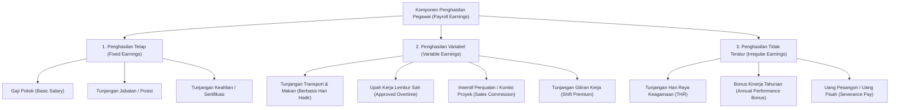
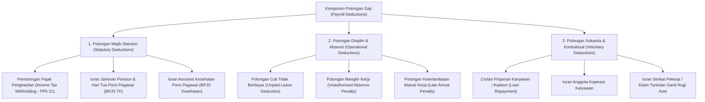
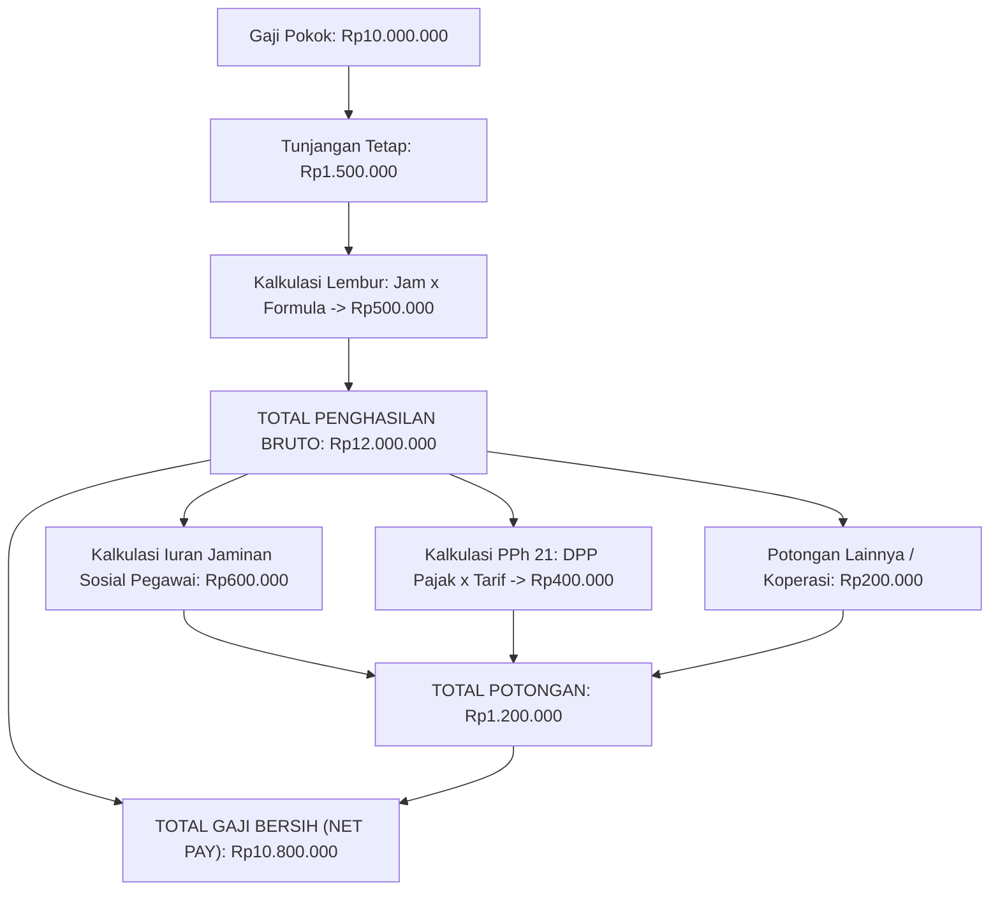

# Payroll Earnings and Deductions

## Definition

**Payroll Earnings and Deductions** (Komponen Penghasilan dan Potongan Gaji) di dalam Enterprise Resource Planning (ERP) adalah subsistem konfigurasi aturan kompensasi yang mendefinisikan, mengklasifikasikan, menghitung, dan memvalidasi setiap elemen penambah upah bruto (*earnings*) dan elemen pengurang upah (*deductions*) yang membentuk slip gaji resmi seorang pegawai.

Di dalam arsitektur ERP enterprise, komponen gaji tidak didefinisikan sebagai angka statis semata, melainkan sebagai **aturan terprogram (*computational rules*)** yang memiliki atribut perlakuan pajak (*taxability*), ketergantungan kehadiran (*attendance dependency*), pemetaan akun buku besar (*GL Account Determination*), serta keterkaitan hierarkis antar-komponen upah.

---

## Purpose

Tujuan standardisasi Payroll Earnings and Deductions di dalam ERP meliputi:

1. **Fleksibilitas Kebijakan Remunerasi (*Flexible Compensation Modeling*)**: Mendukung perancangan struktur paket upah yang beragam untuk berbagai kelompok jabatan (*Job Grades*), divisi kerja, atau lokasi regional.
2. **Kepatuhan Pajak dan Ketenagakerjaan (*Tax & Statutory Alignment*)**: Memisahkan secara presisi komponen yang menjadi objek pajak penghasilan (*Taxable Income*) dari komponen yang dikecualikan (*Non-Taxable Allowances*).
3. **Penyelarasan Disiplin Presensi Otomatis**: Menghubungkan log kehadiran dan ketidakhadiran harian secara langsung dengan komponen tunjangan variabel atau denda keterlambatan tanpa rekonsiliasi manual.
4. **Otomatisasi Pelunasan Kewajiban Pegawai (*Loan & Cooperative Recovery*)**: Memotong angsuran pinjaman pribadi (*employee cash advances*) atau iuran koperasi secara terprogram hingga saldo hutang pegawai lunas.
5. **Transparansi Perhitungan Finansial**: Menyajikan rincian pos penerimaan dan potongan secara jelas pada slip gaji pegawai guna menjaga keharmonisan hubungan industrial.

---

## Taksonomi Komponen Penghasilan (Earnings)

ERP mengklasifikasikan penghasilan pegawai ke dalam tiga kategori besar:

### 1. Penghasilan Tetap (Fixed Earnings)
Kompensasi yang dibayarkan dalam jumlah konstan setiap bulan tanpa dipengaruhi oleh jumlah hari kerja fisik atau fluktuasi kinerja jangka pendek.

### 2. Penghasilan Variabel (Variable Earnings)
Kompensasi yang nilainya berfluktuasi setiap bulan berdasarkan input aktivitas riil:
- **Tunjangan Kehadiran**: $\text{Nilai} = \text{Jumlah Hari Hadir Fisik} \times \text{Tarif Harian}$.
- **Upah Lembur**: Berdasarkan akumulasi jam lembur yang disetujui pada modul [[10-hr/overtime-and-time-management|Overtime Management]].
- **Komisi Penjualan**: Berdasarkan pencapaian omzet penjualan pada modul [[03-sales/sales-commission|Sales (Phase 4)]].

### 3. Penghasilan Tidak Teratur (Irregular / Annual Earnings)
Penghasilan yang dibayarkan satu atau beberapa kali dalam setahun, seperti Tunjangan Hari Raya (THR) statutori di Indonesia, bonus laba tahunan, atau uang pesangon saat pemutusan hubungan kerja.

---

## Taksonomi Komponen Potongan (Deductions)

ERP mengorganisasikan elemen pemotong gaji ke dalam tiga kelompok:

---

## Arsitektur Struktur Gaji (Salary Structure Modeling)

Di dalam ERP, kumpulan komponen upah dan potongan dirangkai ke dalam sebuah **Struktur Gaji (*Salary Structure*)**. Struktur ini memuat aturan komputasi bertingkat yang dieksekusi secara sekuensial:

### Formula Dasar Ketergantungan Antar-Komponen

Banyak komponen gaji dihitung secara proporsional terhadap komponen lain:
- **Formula Lembur**: Dihitung dari basis Upah Sebulan ($\text{Gaji Pokok} + \text{Tunjangan Tetap}$).
- **Formula Potongan Mangkir Harian**:
  $$\text{Potongan Mangkir} = \frac{\text{Gaji Pokok}}{21\text{ (atau 22 Hari Kerja)}} \times \text{Jumlah Hari Mangkir}$$
- **Formula Batas Maksimum Pemotongan Pinjaman**: Membatasi total potongan pinjaman agar tidak melebihi persentase tertentu (misalnya maksimal 30% dari upah bersih) untuk melindungi kesejahteraan pegawai.

---

## Business Rules

1. **Prinsip Batas Upah Bersih Minimum (*Net Pay Floor Rule*)**: Total potongan gaji (statutori dan sukarela) dilarang mengakibatkan nilai gaji bersih (*Net Pay*) menjadi bernilai negatif atau di bawah ketentuan batas upah minimum legal yang berlaku.
2. **Prioritas Urutan Pemotongan (*Deduction Priority Hierarchy*)**: Jika gaji bruto pegawai tidak mencukupi untuk menampung seluruh potongan, sistem memproses potongan berdasarkan urutan prioritas:
   $$\text{1. Pajak Statutori} \longrightarrow \text{2. Jaminan Sosial Wajib} \longrightarrow \text{3. Denda Absensi} \longrightarrow \text{4. Angsuran Pinjaman} \longrightarrow \text{5. Koperasi Sukarela}$$
3. **Pemisahan Pengenaan Pajak (*Taxable Flag Rule*)**: Setiap komponen penghasilan wajib memiliki penanda perlakuan pajak (*Taxable / Non-Taxable*) yang terdefinisi secara baku guna memastikan integritas dasar pengenaan pajak (DPP).
4. **Pencegahan Perubahan Komponen Tanpa Otorisasi**: Penambahan komponen penghasilan khusus atau potongan manual pada slip gaji seorang pegawai mewajibkan persetujuan digital dari HR Manager.
5. **Konsistensi Formula Kompensasi Statutori**: Komponen tunjangan hari raya keagamaan (THR) dihitung secara proporsional untuk pegawai dengan masa kerja kurang dari 12 bulan: $\frac{\text{Masa Kerja (Bulan)}}{12} \times \text{Upah Sebulan}$.

---

## Accounting Impact

Setiap komponen penghasilan dan potongan dipetakan ke akun spesifik di buku besar umum:

| Komponen Gaji | Tipe Komponen | Sisi Pembukuan | Akun Buku Besar (Contoh Pemetaan GL) |
| :--- | :--- | :--- | :--- |
| **Gaji Pokok** | *Earning* | **Debit** | Beban Gaji Pokok (*Salaries Expense*) |
| **Tunjangan Tetap** | *Earning* | **Debit** | Beban Tunjangan Pegawai (*Allowances Expense*) |
| **Upah Lembur** | *Earning* | **Debit** | Beban Lembur (*Overtime Expense*) |
| **Potongan PPh 21** | *Deduction* | **Kredit** | Hutang Pajak Penghasilan Pegawai (*Withholding Tax Payable*) |
| **Potongan BPJS Pegawai** | *Deduction* | **Kredit** | Hutang Iuran Jaminan Sosial (*Social Security Payable*) |
| **Potongan Koperasi** | *Deduction* | **Kredit** | Hutang Titipan Pihak Ketiga / Koperasi (*Third-Party Payable*) |
| **Gaji Bersih (Net Pay)**| *Balancing* | **Kredit** | Hutang Gaji Bersih Karyawan (*Salaries & Wages Payable*) |

---

## Skenario Kanonikal: Rincian Slip Gaji Andi Pratama

Penerapan struktur penghasilan dan potongan pegawai kanonikal `Andi Pratama` (`EMP-2026-0042`) di `PT Maju Bersama` pada periode April 2026:

### 1. Struktur Komponen Penerimaan (Earnings)
- **Gaji Pokok (*Basic Salary*)**: **Rp10.000.000** (Tetap - Hak PKWTT Grade 4)
- **Tunjangan Tetap (*Fixed Allowance*)**: **Rp1.500.000** (Tunjangan Fungsional Rekayasa)
- **Upah Lembur (*Approved Overtime*)**: **Rp500.000** (Kompensasi 8 jam konversi lembur deployment)
- **Total Penghasilan Bruto (*Gross Earnings*)**: $\text{Rp10.000.000} + \text{Rp1.500.000} + \text{Rp500.000} = \mathbf{Rp12.000.000}$

### 2. Struktur Komponen Potongan (Deductions)
- **Potongan Jaminan Sosial Pegawai (*Statutory Deduction*)**: **Rp600.000** (Iuran jaminan pensiun & kesehatan porsi pekerja)
- **Pemotongan Pajak Penghasilan (*Income Tax Withholding - PPh 21*)**: **Rp400.000** (Pajak penghasilan masa berjalan)
- **Potongan Iuran Koperasi Karyawan (*Other Deduction*)**: **Rp200.000** (Potongan sukarela simpanan wajib)
- **Total Potongan (*Total Deductions*)**: $\text{Rp600.000} + \text{Rp400.000} + \text{Rp200.000} = \mathbf{Rp1.200.000}$

### 3. Gaji Bersih Diterima (Net Pay)
$$\text{Net Pay} = \text{Gross Earnings} - \text{Total Deductions} = \text{Rp12.000.000} - \text{Rp1.200.000} = \mathbf{Rp10.800.000}$$

> [!NOTE]
> **Konteks Perpajakan & Asumsi Pembelajaran**:
> Nilai nominal potongan pajak penghasilan (Rp400.000) dan jaminan sosial (Rp600.000) pada skenario ini merupakan angka permodelan pembelajaran yang dirancang untuk konsistensi matematis akuntansi. Perhitungan aktual wajib mengikuti ketentuan perpajakan dan tarif jaminan sosial resmi yang berlaku di Indonesia pada periode transaksi.

---

## ERP Implementation

Penerapan komponen kompensasi pada platform ERP terkemuka:

### Odoo Implementation
- **Salary Rules (`hr.salary.rule`)**: Setiap baris aturan gaji didefinisikan dengan kode kategori (`BASIC`, `ALW`, `GROSS`, `DED`, `NET`).
- **Python Code Computation**: Menghitung komponen secara dinamis menggunakan ekspresi Python (misalnya `result = contract.wage * 0.05`).
- **Accounting Integration**: Setiap aturan gaji memiliki field pemetaan akun debit dan kredit analitik yang dibukukan saat slip gaji disahkan.

### ERPNext Implementation
- **Salary Component DocType**: Memisahkan komponen gaji bertipe *Earning* atau *Deduction*. Mendukung opsi *Depends on Attendance*, *Is Tax Applicable*, dan *Deduct Full Tax on Selected Month*.
- **Condition & Formula Boxes**: Memungkinkan penulisan formula matematika sederhana (misalnya `base * 0.1` atau nilai tetap).
- **Additional Salary**: Digunakan untuk memasukkan komponen variabel non-rutin seperti insentif kinerja atau bonus satu kali transfer.

### Dynamics 365 Implementation
- **Earning Codes & Deduction Codes**: Mengelola hierarki aturan penggajian yang sangat terstruktur dengan parameter batas tahunan (*Annual Limits*).
- **Arrear Processing**: Secara otomatis memproses penundaan potongan jika upah bruto tidak mencukupi, mencatat saldo tunggakan (*Arrears Balance*) untuk dipotong pada periode berikutnya.

---

## Naventra Consideration

Dalam perancangan modul komponen gaji Naventra ERP:

1. **Visual Formula Builder**: Naventra menyediakan antarmuka perancang formula visual yang ramah pengguna, memungkinkan staf HR menyusun aturan gaji ketergantungan kompleks tanpa perlu menulis kode pemrograman teknis.
2. **Dynamic Tax Bracket Synchronization**: Komponen pemotongan pajak dirancang modular yang dapat disinkronkan secara otomatis dengan pembaruan tabel tarif pajak resmi (seperti Tarif Efektif Rata-rata / TER PPh 21) tanpa memerlukan perubahan skema basis data.
3. **Automated Negative Net Pay Shield**: Sistem dilengkapi proteksi otomatis yang memvalidasi hasil kalkulasi slip gaji. Jika potongan sukarela menyebabkan gaji bersih berada di bawah ambang batas minimum, sistem secara otomatis menangguhkan potongan pinjaman terendah dan memunculkan peringatan audit.

---

## References

- Armstrong, M., & Taylor, S. (2020). *Armstrong's Handbook of Reward Management Practice* (6th ed.). Kogan Page.
- Society for Human Resource Management (SHRM). *Designing and Administering Compensation Systems*.
- SAP Help Portal. *Wage Types and Payroll Calculations in SAP S/4HANA*.
- Microsoft Learn. *Earning codes and deduction setups in Dynamics 365 Human Resources*.
- ERPNext Documentation. *Salary Components and Salary Structures*.
- Odoo 17.0 Documentation. *Salary Rules and Structure Configuration*.
