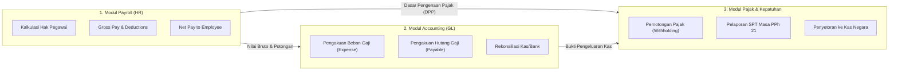
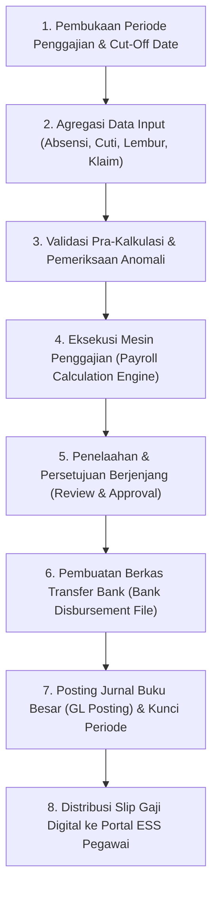

# Payroll Fundamentals

## Definition

**Payroll Fundamentals** (Dasar Penggajian) di dalam Enterprise Resource Planning (ERP) adalah domain operasional dan finansial yang mengatur kalkulasi kompensasi berkala pegawai, agregasi komponen penghasilan (*earnings*), pemotongan resmi (*deductions*), penghitungan gaji bersih (*net pay*), penyaluran dana perbankan (*disbursement*), serta pencatatan kewajiban dan beban ke dalam buku besar akuntansi umum.

Di dalam arsitektur ERP enterprise, modul penggajian bertindak sebagai **simpul temu antara hukum ketenagakerjaan, kepatuhan perpajakan, dan perbendaharaan perusahaan (*treasury*)**:
1. Menjamin hak remunerasi pegawai dibayarkan secara tepat waktu, akurat, dan transparan.
2. Memisahkan secara ketat fungsi kalkulasi kompensasi (Payroll), pencatatan pembukuan (Accounting), dan kepatuhan perpajakan fiskal (Tax Compliance).

---

## Purpose

Tujuan penerapan sistem penggajian terintegrasi di dalam ERP adalah:

1. **Akurasi Perhitungan Remunerasi**: Meniadakan kesalahan hitung manual pada komponen gaji pokok, tunjangan, lembur, dan potongan ketidakhadiran melalui mesin aturan gaji terstandarisasi (*Salary Rules Engine*).
2. **Kepatuhan Terhadap Pemotongan Statutori (*Statutory Compliance*)**: Menghitung porsi pemotongan jaminan sosial tenaga kerja, asuransi kesehatan, dan pemotongan pajak penghasilan pegawai secara konsisten.
3. **Efisiensi Penyaluran Dana Massal (*Automated Bank Disbursement*)**: Menghasilkan berkas transaksi transfer massal antarbank (*Bank Payment File*) yang siap diunggah ke sistem perbankan korporat tanpa input satu per satu.
4. **Pencegahan Fraud dan Penegakan SoD (*Segregation of Duties*)**: Menerapkan prinsip *Maker-Checker* di mana petugas yang memproses kalkulasi gaji tidak memiliki hak otorisasi pembayaran atau persetujuan transfer kas.
5. **Transparansi Informasi Pegawai**: Mendistribusikan slip gaji digital (*Electronic Payslip*) secara otomatis ke portal layanan mandiri pegawai (*Employee Self-Service* - ESS).

---

## Payroll vs Accounting vs Tax: Pembedaan Batas Domain

Kerancuan batas wewenang sering terjadi dalam implementasi sistem penggajian. ERP enterprise membedakan ketiga ranah ini secara tegas:



- **Payroll**: Menghitung hak penerimaan pegawai, potongan kehadiran, dan nominal transfer bersih berdasarkan kontrak dan absensi.
- **Accounting**: Mencatat dampak debit dan kredit transaksi penggajian ke akun beban laba rugi dan akun liabilitas neraca di buku besar.
- **Tax Compliance**: Mengelola pemenuhan ketentuan peraturan perundang-undangan perpajakan (seperti PPh 21 di Indonesia), menghitung tarif efektif, dan menghasilkan formulir pelaporan resmi ke otoritas pajak.

---

## Formula Inti Matematika Penggajian

Mesin penggajian ERP enterprise bekerja berdasarkan persamaan matematis berjenjang:

$$\begin{aligned}
\text{Gross Pay (Penghasilan Bruto)} &= \text{Gaji Pokok} + \text{Tunjangan Tetap} + \text{Tunjangan Variabel} + \text{Upah Lembur} \\
\text{Total Deductions (Total Potongan)} &= \text{Potongan Statutori Pegawai} + \text{Pajak Penghasilan (Withholding)} + \text{Potongan Lainnya} \\
\mathbf{Net\ Pay\ (Gaji\ Bersih)} &= \mathbf{Gross\ Pay} - \mathbf{Total\ Deductions} \\
\mathbf{Total\ Employer\ Cost} &= \mathbf{Gross\ Pay} + \mathbf{Kontribusi\ Statutori\ Pemberi\ Kerja}
\end{aligned}$$

*Prinsip Penting*:
- **Employee Deduction** memotong penghasilan bruto pegawai untuk disalurkan ke kas negara atau lembaga jaminan sosial atas nama pegawai; potongan ini **tidak menambah beban biaya perusahaan**.
- **Employer Contribution** dibayar langsung oleh perusahaan di luar gaji bruto pegawai sebagai kewajiban hukum pemberi kerja; porsi ini **menambah total beban biaya perusahaan**.

---

## Siklus Hidup Proses Penggajian (Payroll Run Lifecycle)

Proses pemrosesan penggajian bulanan di dalam ERP dijalankan melalui delapan tahapan terstruktur:



### Rincian Tahapan Siklus Penggajian:
1. **Period Setup & Cut-Off Definition**: Menetapkan rentang tanggal evaluasi kehadiran (misalnya tanggal 21 bulan lalu s.d. tanggal 20 bulan berjalan) dan tanggal pembayaran gaji (misalnya tanggal 25).
2. **Input Aggregation**: Mengumpulkan jam kerja, potongan cuti tidak berbayar (*Unpaid Leave*), jam lembur disetujui, dan klaim pengeluaran (*Reimbursements*).
3. **Pre-Payroll Audit**: Memeriksa kelengkapan rekening bank, mendeteksi lonjakan gaji drastis (*variance spikes*), dan memvalidasi pegawai baru atau pegawai berhenti.
4. **Calculation Execution**: Menghitung seluruh baris aturan gaji (*Salary Rules*) secara paralel untuk seluruh pegawai aktif.
5. **Approval Workflow**: Melibatkan persetujuan berjenjang dari HR Manager dan Finance Director (*Maker-Checker Rule*).
6. **Disbursement Processing**: Mengirimkan instruksi pembayaran massal ke rekening bank pegawai melalui transfer kliring atau *corporate internet banking*.
7. **GL Posting & Period Lockdown**: Memposting jurnal penggajian ke modul Akuntansi dan mengunci periode penggajian agar tidak dapat diubah lagi.
8. **Slip Distribution**: Menerbitkan slip gaji digital terenkripsi yang dapat diunduh pegawai via portal ESS.

---

## Business Rules

1. **Prasyarat Status Hubungan Kerja Aktif**: Pegawai yang diikutsertakan dalam *Payroll Run* wajib memiliki status operasional aktif (*Active*) atau berstatus *Probation* pada rentang periode bersangkutan dengan struktur gaji (*Salary Structure*) yang valid.
2. **Kepatuhan Batas Tanggal Tutup Buku (*Cut-Off Rule*)**: Data lembur, absensi, atau klaim biaya yang disetujui setelah tanggal *Cut-Off* penggajian secara otomatis ditangguhkan dan dimasukkan ke siklus penggajian bulan berikutnya.
3. **Pemisahan Tugas Pembuat dan Penyetuju (*Segregation of Duties - SoD*)**: Petugas administrasi HR yang menyusun draf penggajian dilarang memiliki wewenang untuk menyetujui (*Approve*) atau mengeksekusi berkas pembayaran bank.
4. **Penguncian Permanen Pasca-Persetujuan (*Payroll Period Lockdown*)**: Begitu proses penggajian disetujui dan dibukukan ke General Ledger, data slip gaji dikunci permanen (*Read-Only*). Setiap koreksi salah hitung wajib diselesaikan melalui mekanisme penyesuaian retroaktif (*Retroactive Adjustment*) pada periode berikutnya.
5. **Validasi Kelengkapan Rekening Bank (*Zero-Balance Bank Validation*)**: Sistem secara otomatis mengecualikan pegawai yang tidak memiliki nomor rekening bank valid dari berkas transfer massal dan menandai status pembayarannya sebagai *Pending Manual Disbursement*.

---

## Accounting Impact

Proses penggajian memicu pengakuan beban dan liabilitas di buku besar umum:

### 1. Jurnal Akrual Beban Gaji Bulanan (Payroll Accrual Entry)
Membukukan beban gaji kotor dan seluruh kewajiban potongan:

$$\begin{array}{llrr}
\text{Debit:} & \text{Salaries Expense (Beban Gaji Karyawan)} & \text{Rp11.500.000} & \\
\text{Debit:} & \text{Overtime Expense (Beban Lembur)} & \text{Rp500.000} & \\
\text{Debit:} & \text{Employer Statutory Contribution Expense (Beban BPJS Kantor)} & \text{Rp800.000} & \\
\text{Kredit:} & \text{Salaries & Wages Payable (Hutang Gaji Bersih Karyawan)} & & \text{Rp10.800.000} \\
\text{Kredit:} & \text{Withholding Tax Payable (Hutang PPh 21 Pegawai)} & & \text{Rp400.000} \\
\text{Kredit:} & \text{Employee Statutory Contributions Payable (Hutang BPJS Pegawai)} & & \text{Rp600.000} \\
\text{Kredit:} & \text{Employer Statutory Contributions Payable (Hutang BPJS Kantor)} & & \text{Rp800.000} \\
\text{Kredit:} & \text{Other Employee Deductions Payable (Hutang Koperasi/Lainnya)} & & \text{Rp200.000}
\end{array}$$

*Keseimbangan Akuntansi*:
- Total Sisi Debit: $\text{Rp11.500.000} + \text{Rp500.000} + \text{Rp800.000} = \mathbf{Rp12.800.000}$
- Total Sisi Kredit: $\text{Rp10.800.000} + \text{Rp400.000} + \text{Rp600.000} + \text{Rp800.000} + \text{Rp200.000} = \mathbf{Rp12.800.000}$ (Seimbang).

### 2. Jurnal Pembayaran Penyaluran Kas Gaji (Disbursement Entry)
Saat dana ditransfer dari rekening bank operasional perusahaan ke rekening pegawai:

$$\begin{array}{llrr}
\text{Debit:} & \text{Salaries & Wages Payable (Hutang Gaji Bersih Karyawan)} & \text{Rp10.800.000} & \\
\text{Kredit:} & \text{Cash in Bank (Kas di Bank - Payroll Disbursement)} & & \text{Rp10.800.000}
\end{array}$$

---

## Skenario Kanonikal: Slip Gaji Bulanan Andi Pratama

Penerapan skenario penggajian bulanan pegawai kanonikal `Andi Pratama` (`EMP-2026-0042`) di `PT Maju Bersama`:

```text
================================================================================
                    SLIP PENGGAJIAN BULANAN (CANONICAL PAYSLIP)
Periode: April 2026                            Perusahaan : PT Maju Bersama
Employee: EMP-2026-0042 / Andi Pratama         Departemen : Technology
Posisi  : Software Engineer (Grade 4)          Status     : PKWTT (Active)
================================================================================
A. PENGHASILAN (EARNINGS)
   1. Gaji Pokok (Basic Salary)                          : Rp 10.000.000
   2. Tunjangan Tetap (Fixed Allowance)                  : Rp  1.500.000
   3. Upah Lembur Sah (Approved Overtime - 8 Jam Periode): Rp    500.000
   -----------------------------------------------------------------------------
   TOTAL PENGHASILAN BRUTO (GROSS EARNINGS)              : Rp 12.000.000

B. POTONGAN PEGAWAI (EMPLOYEE DEDUCTIONS)
   1. Iuran Jaminan Sosial Pegawai (Statutory Deduction) : Rp    600.000
   2. Pemotongan Pajak Penghasilan (PPh 21 Withholding)  : Rp    400.000
   3. Potongan Koperasi / Lainnya (Other Deduction)      : Rp    200.000
   -----------------------------------------------------------------------------
   TOTAL POTONGAN GAJI (TOTAL DEDUCTIONS)                : Rp  1.200.000

--------------------------------------------------------------------------------
GAJI BERSIH DITERIMA PEGAWAI (NET PAY) : Rp 10.800.000
(Terbilang: Sepuluh Juta Delapan Ratus Ribu Rupiah)
Ditransfer ke Rekening: Bank Mandiri 123-00-9876543-2 A.n. Andi Pratama
--------------------------------------------------------------------------------

C. INFORMASI BIAYA PERUSAHAAN (EMPLOYER CONTRIBUTIONS - BUKAN POTONGAN GAJI)
   1. Iuran Jaminan Sosial Porsi Kantor (Employer BPJS)  : Rp    800.000
   -----------------------------------------------------------------------------
   TOTAL BIAYA TENAGA KERJA PEMBERI KERJA (TOTAL EMPLOYER COST) : Rp 12.800.000
================================================================================
```

> [!NOTE]
> **Asumsi Pembelajaran Konteks Perpajakan & Lembur**:
> 1. **Asumsi PPh 21**: Untuk menjaga fokus pada mekanisme payroll ERP, contoh ini menggunakan PPh 21 sebesar **Rp400.000** sebagai **asumsi pembelajaran (*illustrative learning assumption*)**, bukan hasil perhitungan pajak aktual. Nilai aktual harus dihitung berdasarkan ketentuan perpajakan yang berlaku pada periode dan kondisi wajib pajak bersangkutan (termasuk skema TER PP 58/2023, PMK 168/2023, dan pelaporan DJP).
> 2. **Konteks Lembur**: Nilai lembur Rp500.000 untuk 8 jam merupakan total jam lembur konversi dalam satu periode penggajian bulanan yang digunakan sebagai asumsi pembelajaran, bukan lembur dalam satu hari kerja reguler.
> 3. **Kebijakan Perusahaan**: Status PTKP (K/1), potongan koperasi, dan ketentuan gaji dalam skenario merupakan parameter simulasi pembelajaran untuk memvalidasi integrasi alur finansial.

---

## ERP Implementation

Penerapan modul penggajian pada platform ERP enterprise:

### Odoo Implementation
- **Payroll App (`hr.payroll`)**: Menggunakan mesin aturan gaji berbasis Python (*Salary Rules Engine*) yang sangat fleksibel.
- **Salary Structure (`hr.payroll.structure`)**: Menampung daftar aturan gaji yang menghitung variabel `categories.BASIC`, `categories.GROSS`, dan `categories.NET`.
- **Payslip Batches (`hr.payslip.run`)**: Memungkinkan pembuatan dan validasi slip gaji secara massal per departemen atau seluruh perusahaan.

### ERPNext Implementation
- **Salary Component & Structure**: Memisahkan komponen penerimaan (*Earning*) dan potongan (*Deduction*) yang dapat dikonfigurasi menggunakan formula matematis atau nilai tetap.
- **Payroll Entry**: Dokumen induk untuk menjalankan kalkulasi gaji massal berdasarkan cabang, departemen, atau penunjukan jabatan.
- **Bank Remittance Report**: Menghasilkan berkas instruksi pembayaran perbankan resmi yang kompatibel dengan format unggah massal perbankan.

### Dynamics 365 Implementation
- **Payroll Processing Framework**: Mendukung arsitektur penggajian berbasis siklus (*Pay Cycles*) dan periode pembayaran (*Pay Periods*).
- **Earning Codes & Benefit Deductions**: Mengelola ratusan kode penghasilan dan potongan tunjangan dengan aturan pemajakan (*Tax Calculation Services*) yang terintegrasi.
- **Direct General Ledger Integration**: Secara otomatis memetakan setiap kode penghasilan ke dimensi keuangan dan akun buku besar umum tanpa entri jurnal manual.

---

## Naventra Consideration

Dalam perancangan modul penggajian Naventra ERP:

1. **High-Performance Payroll Calculation Engine**: Naventra mengadopsi mesin kalkulasi paralel terisolasi (*worker-thread processing*) yang mampu menghitung ribuan slip gaji lengkap dengan formula pajak dan lembur dalam hitungan detik.
2. **Maker-Checker Security Workflow**: Proses penggajian mewajibkan otorisasi digital ganda: draf disusun oleh HR Payroll (*Maker*), ditinjau oleh HR Manager (*Checker*), dan disahkan oleh Finance Director (*Approver*) sebelum berkas transfer bank dapat diekspor.
3. **Automated Salary Variance Analyzer**: Sistem secara otomatis membandingkan total gaji kotor bulan berjalan terhadap bulan sebelumnya, menyoroti anomali deviasi lebih dari 10% untuk mencegah kebocoran kas akibat salah input.

---

## References

- Armstrong, M., & Taylor, S. (2020). *Armstrong's Handbook of Reward Management Practice* (6th ed.). Kogan Page.
- Society for Human Resource Management (SHRM). *Designing and Managing Compensation and Payroll Systems*.
- SAP Help Portal. *Payroll Management (PY) Architecture in SAP S/4HANA*.
- Microsoft Learn. *Payroll Processing and Salary Administration in Dynamics 365*.
- ERPNext Documentation. *Payroll and Salary Structure Management*.
- Odoo 17.0 Documentation. *Payroll Engine and Salary Rules Configuration*.
