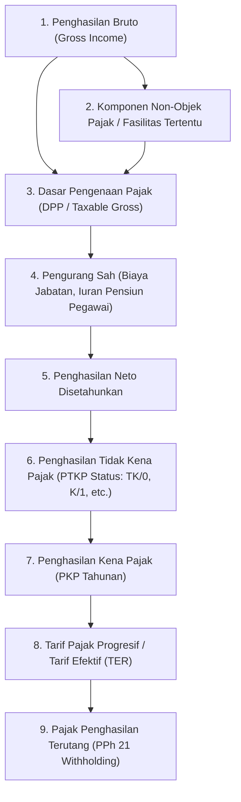
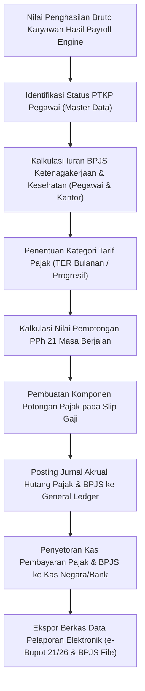

# Payroll Tax and Statutory Compliance

## Definition

**Payroll Tax and Statutory Compliance** (Pajak Penggajian dan Kepatuhan Statutori) di dalam Enterprise Resource Planning (ERP) adalah subsistem komputasi kepatuhan hukum yang mengatur penentuan dasar pengenaan pajak (*Taxable Base*), pemotongan pajak penghasilan tenaga kerja (*Income Tax Withholding / PPh 21*), perhitungan iuran jaminan sosial wajib tenaga kerja dan kesehatan (*Social Security Contributions*), serta pembuatan laporan bukti potong dan berkas integrasi pelaporan resmi ke otoritas perpajakan dan ketenagakerjaan.

Catatan ini berfokus pada **antarmuka pemrosesan penggajian (*payroll calculation boundary*)** dan **bukan merupakan pembahasan perpajakan korporasi menyeluruh**. Pembahasan komprehensif mengenai Pajak Penghasilan Badan (PPh Badan), Pajak Pertambahan Nilai (PPN), dan rekonsiliasi fiskal dikelola secara terdedikasi pada modul perpajakan tersendiri.

---

## Purpose

Penerapan Payroll Tax and Statutory Compliance di dalam ERP bertujuan untuk:

1. **Penegakan Kepatuhan Hukum Fiskal (*Tax Compliance Assurance*)**: Menjamin bahwa seluruh pemotongan pajak penghasilan karyawan dihitung secara tepat waktu dan akurat sesuai ketentuan perundang-undangan perpajakan yang berlaku.
2. **Kalkulasi Pemotongan Statutori Dua Sisi (*Dual-Sided Contribution Engine*)**: Mengelola perhitungan simultan antara porsi iuran yang ditanggung pegawai (*employee deduction*) dan porsi iuran yang ditanggung oleh perusahaan (*employer contribution*).
3. **Penerapan Tarif Berjenjang dan Efektif Otomatis**: Mendukung metode pemajakan progresif tahunan maupun skema Tarif Efektif Rata-Rata (TER) bulanan tanpa intervensi manual.
4. **Penyelarasan Batas Maksimal Upah (*Statutory Wage Caps*)**: Menerapkan batas atas plafon upah (*ceiling caps*) yang diatur oleh undang-undang jaminan sosial (seperti batas upah jaminan pensiun dan jaminan kesehatan).
5. **Standardisasi Berkas Pelaporan Otoritas (*Statutory Reporting Interface*)**: Menghasilkan berkas data elektronik siap lapor untuk portal DJP (seperti format e-Bupot 21/26) dan aplikasi pelaporan BPJS Ketenagakerjaan/Kesehatan.

---

## Konsep Dasar Pemajakan Penggajian

Mesin kepatuhan pajak penggajian ERP bekerja dengan membedakan beberapa istilah kunci:

### 1. Dasar Pengenaan Pajak (DPP) vs Penghasilan Bruto
Tidak semua penerimaan pegawai otomatis dipajaki. Tunjangan reimbursement dinas, seragam keselamatan kerja, dan santunan klaim asuransi tertentu merupakan komponen bukan objek pajak yang dikeluarkan dari perhitungan DPP.

### 2. Status PTKP (Penghasilan Tidak Kena Pajak)
Besaran ambang batas penghasilan bebas pajak yang ditentukan oleh status pernikahan dan jumlah tanggungan keluarga resmi pegawai pada awal tahun pajak (misalnya: TK/0 = Tidak Kawin tanpa tanggungan, K/1 = Kawin dengan 1 anak/tanggungan).

### 3. Skema Tarif Pemajakan
- **Tarif Progresif Tahunan**: Skema tarif berjenjang (misalnya lapisan 5%, 15%, 25%, 30%, 35% di Indonesia).
- **Tarif Efektif Rata-Rata (TER)**: Skema tarif persentase langsung terhadap penghasilan bruto bulanan berdasarkan kategori PTKP untuk mempermudah pemotongan masa pajak reguler (Januari s.d. November).

### 4. Ekualisasi Pajak Akhir Tahun (December Tax Equalization)
Pada masa pajak penutup tahun (Desember), sistem melakukan rekonsiliasi tahunan:
$$\text{PPh 21 Bulan Desember} = \text{Total PPh 21 Setahun Penuh} - \text{Akumulasi PPh 21 Januari s.d. November}$$
Proses ini menghasilkan dokumen bukti pemotongan pajak resmi (seperti Formulir 1721-A1 atau bukti potong elektronik sesuai ketentuan administrasi DJP yang berlaku).

---

## Mekanisme Iuran Jaminan Sosial (Social Security Dual-Contribution)

Program jaminan sosial wajib (seperti BPJS Ketenagakerjaan dan BPJS Kesehatan di Indonesia) dikelola melalui mekanisme pembagian beban:

| Program Jaminan Sosial | Beban Porsi Pegawai (Employee Deduction) | Beban Porsi Perusahaan (Employer Contribution) | Plafon Batas Atas Upah (Wage Cap) |
| :--- | :--- | :--- | :--- |
| **Jaminan Kesehatan** | Dipotong dari gaji bruto (e.g. 1%) | Dibayar oleh perusahaan (e.g. 4%) | Terdapat plafon batas maksimal upah bulanan resmi. |
| **Jaminan Hari Tua (JHT)** | Dipotong dari upah pokok (e.g. 2%) | Dibayar oleh perusahaan (e.g. 3,7%) | Berdasarkan upah riil / ketentuan yang berlaku. |
| **Jaminan Pensiun (JP)** | Dipotong dari upah (e.g. 1%) | Dibayar oleh perusahaan (e.g. 2%) | Terdapat plafon batas maksimal upah yang diperbarui berkala. |
| **Kecelakaan Kerja & Kematian (JKK/JKM)** | **0% (Nihil)** | Ditanggung penuh perusahaan (e.g. 0,24% - 1,74% & 0,3%) | Bergantung pada tingkat risiko lingkungan kerja perusahaan. |

---

## Business Process: Pemrosesan Pajak dan Kepatuhan

Alur kalkulasi dan pelaporan statutori penggajian disajikan dalam diagram berikut:

---

## Business Rules

1. **Integritas Status Pajak Awal Tahun (*Status Lock on Jan 1*)**: Status PTKP pegawai dikunci pada tanggal 01 Januari tahun pajak berjalan. Perubahan status pernikahan atau kelahiran anak di tengah tahun baru berlaku efektif pada tanggal 01 Januari tahun berikutnya sesuai ketentuan hukum perpajakan.
2. **Kepatuhan Batas Atas Upah (*Wage Ceiling Enforcement*)**: Mesin kalkulasi statutori mengunci dasar pengenaan iuran pensiun atau asuransi kesehatan pada angka plafon batas atas resmi jika upah pegawai melampaui batas tersebut.
3. **Pemisahan Penyetoran Titipan Pajak (*Fiduciary Tax Liability*)**: Dana pajak penghasilan yang telah dipotong dari slip gaji pegawai berstatus sebagai hutang titipan kepada negara (*Tax Withholdings Payable*) dan dilarang diakui sebagai pendapatan perusahaan.
4. **Penerbitan Bukti Pemotongan Pajak**: Perusahaan memfasilitasi penerbitan dokumen Bukti Pemotongan PPh 21 kepada pegawai tetap sesuai mekanisme administrasi perpajakan yang ditetapkan oleh otoritas pajak pada periode terkait (misalnya integrasi aplikasi e-Bupot 21/26 atau formulir resmi).
5. **Perlakuan Pajak atas Pegawai Berhenti (*Mid-Year Leaver Tax Recalculation*)**: Pada saat pegawai berhenti di tengah tahun, sistem menghitung ulang pajak disetahunkan hingga bulan keluar, menyesuaikan apakah terjadi lebih bayar (*tax refund*) atau kurang bayar pada slip gaji terakhir.

---

## Accounting & Financial Impact

Pemotongan pajak dan iuran jaminan sosial dicatat pada akun kewajiban lancar di neraca:

### 1. Jurnal Pembukuan Hutang Pajak dan BPJS (Payroll Accrual)
Mencatat kewajiban pemotongan pajak dan jaminan sosial yang terbentuk dari kalkulasi gaji:

$$\begin{array}{llrr}
\text{Debit:} & \text{Salaries & Benefits Expense (Beban Gaji & Tunjangan Perusahaan)} & \text{Rp12.800.000} & \\
\text{Kredit:} & \text{Salaries Payable (Hutang Gaji Bersih Karyawan)} & & \text{Rp10.800.000} \\
\text{Kredit:} & \text{Withholding Tax Payable PPh 21 (Hutang Pajak Karyawan)} & & \text{Rp400.000} \\
\text{Kredit:} & \text{Employee Social Security Payable (Hutang BPJS Pegawai)} & & \text{Rp600.000} \\
\text{Kredit:} & \text{Employer Social Security Payable (Hutang BPJS Kantor)} & & \text{Rp800.000} \\
\text{Kredit:} & \text{Other Voluntary Deductions Payable (Hutang Koperasi)} & & \text{Rp200.000}
\end{array}$$

### 2. Jurnal Penyetoran Pajak dan BPJS ke Kas Negara (Tax Remittance Entry)
Saat perusahaan menyetorkan pajak PPh 21 dan iuran BPJS ke bank persepsi pada awal bulan berikutnya:

$$\begin{array}{llrr}
\text{Debit:} & \text{Withholding Tax Payable PPh 21} & \text{Rp400.000} & \\
\text{Debit:} & \text{Employee Social Security Payable} & \text{Rp600.000} & \\
\text{Debit:} & \text{Employer Social Security Payable} & \text{Rp800.000} & \\
\text{Kredit:} & \text{Cash in Bank (Kas di Bank - Operasional)} & & \text{Rp1.800.000}
\end{array}$$

---

## Skenario Kanonikal: Pajak & Statutori Andi Pratama

Penerapan parameter kepatuhan statutori pada pegawai kanonikal `Andi Pratama` (`EMP-2026-0042`) di `PT Maju Bersama`:

- **Status Perpajakan**: Kawin dengan 1 Anak Kandung / Tanggungan (Status PTKP: `K/1`)
- **Penghasilan Bruto Bulan April 2026**: **Rp12.000.000** (Gaji Pokok Rp10M + Tunjangan Rp1.5M + Lembur Rp0.5M)
- **Pemotongan Pajak Penghasilan (PPh 21)**: **Rp400.000** (Digunakan sebagai asumsi pembelajaran)
- **Iuran Jaminan Sosial Porsi Pegawai (*Employee Deduction*)**: **Rp600.000** (Dipotong langsung dari gaji bruto)
- **Kontribusi Jaminan Sosial Porsi Perusahaan (*Employer Contribution*)**: **Rp800.000** (Ditanggung terpisah oleh `PT Maju Bersama` sebagai beban kantor)

> [!NOTE]
> **Asumsi Pembelajaran Skenario & Regulasi Perpajakan**:
> Untuk menjaga fokus pada arsitektur dan mekanisme payroll ERP, contoh ini menggunakan PPh 21 **Rp400.000** sebagai **asumsi pembelajaran (*illustrative learning assumption*)**, bukan hasil komputasi matematis aktual tarif pajak Indonesia. Nilai aktual harus dihitung berdasarkan ketentuan perpajakan yang berlaku pada periode dan kondisi wajib pajak yang bersangkutan.
> Regulasi terkait di Indonesia mencakup UU Harmonisasi Peraturan Perpajakan (UU HPP), Peraturan Pemerintah (PP) No. 58 Tahun 2023, Peraturan Menteri Keuangan (PMK) No. 168 Tahun 2023 (skema TER Bulanan Kategori A/B/C berdasarkan status PTKP K/1), serta regulasi batas atas upah (*wage ceiling*) BPJS Ketenagakerjaan dan Kesehatan. Mekanisme administrasi dan pelaporan resmi mengikuti sistem dan regulasi DJP yang berlaku pada masa pelaporan terkait (seperti integrasi aplikasi e-Bupot 21/26).

---

## ERP Implementation

Penerapan kepatuhan pajak penggajian pada platform ERP terkemuka:

### Odoo Implementation
- **Payroll Localization Modules (`l10n_id_hr_payroll`)**: Odoo mengandalkan modul lokalisasi negara untuk mendefinisikan aturan pemotongan pajak statutori sesuai regulasi lokal.
- **Salary Rules dengan Parameter Atribut**: Mendefinisikan baris aturan khusus untuk pemotongan pajak dengan integrasi langsung ke akun hutang pajak pada bagan akun (*Chart of Accounts*).

### ERPNext Implementation
- **Payroll Withholding & Tax Slabs**: ERPNext menyediakan dokumen `Income Tax Slab` yang memungkinkan penentuan lapisan tarif pajak progresif dan pengurangan standar secara modular.
- **Deduct Checkbox on Component**: Komponen gaji memiliki penanda *Is Tax Applicable* untuk menentukan apakah komponen tersebut masuk ke dalam basis kalkulasi *Gross Taxable Income*.

### Dynamics 365 Implementation
- **Tax Calculation Service Integration**: Dynamics 365 Human Resources menggunakan layanan komputasi pajak terpusat (*Tax Engine*) yang secara otomatis memisahkan pajak federal, negara bagian, atau pajak daerah berdasarkan yurisdiksi kerja pegawai.
- **Statutory Reporting Exports**: Menyediakan antarmuka ekspor dokumen pelaporan tahunan dan sertifikat bukti potong resmi.

---

## Naventra Consideration

Dalam perancangan modul kepatuhan pajak penggajian Naventra ERP:

1. **Tabel Tarif Efektif Terkonfigurasi (TER Engine)**: Naventra menyediakan pustaka tabel tarif pajak yang dapat diperbarui melalui antarmuka administratif (*Tax Configuration UI*) tanpa perlu melakukan kompilasi ulang kode sumber saat pemerintah memperbarui batasan lapisan tarif.
2. **December Tax Equalization Wizard**: Sistem menyediakan panduan wizard otomatis pada penutupan penggajian bulan Desember untuk menghitung ulang seluruh pajak tahunan pegawai, mendeteksi selisih lebih/kurang bayar, dan menerbitkan berkas formulir bukti potong digital secara massal.
3. **Validasi NPWP Format Baru (16 Digit / NIK)**: Formulir master data pajak Naventra telah diselaraskan dengan integrasi NIK menjadi NPWP 16 digit sesuai kebijakan standardisasi identitas perpajakan nasional.

---

## References

- Direktorat Jenderal Pajak (DJP) Kementerian Keuangan Republik Indonesia. *Peraturan Menteri Keuangan (PMK) No. 168 Tahun 2023 tentang Petunjuk Teknis Pemotongan Pajak atas Penghasilan Sehubungan dengan Pekerjaan, Jasa, atau Kegiatan Pribadi (PPh Pasal 21)*.
- Republik Indonesia. *Peraturan Pemerintah (PP) No. 58 Tahun 2023 tentang Tarif Pemotongan Pajak Penghasilan Pasal 21*.
- BPJS Ketenagakerjaan & BPJS Kesehatan. *Regulasi dan Pedoman Perhitungan Iuran Kepesertaan*.
- SAP Help Portal. *Payroll Tax Processing and Statutory Reporting in SAP ERP HCM*.
- Microsoft Learn. *Manage Payroll Taxes and Withholding in Dynamics 365 Human Resources*.
- ERPNext Documentation. *Income Tax and Statutory Deductions*.
- Odoo 17.0 Documentation. *Payroll Localizations and Statutory Rules*.
