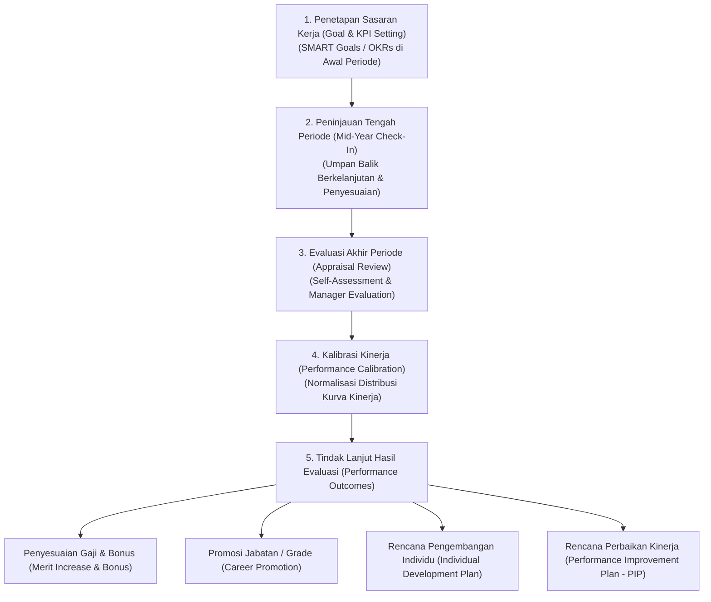
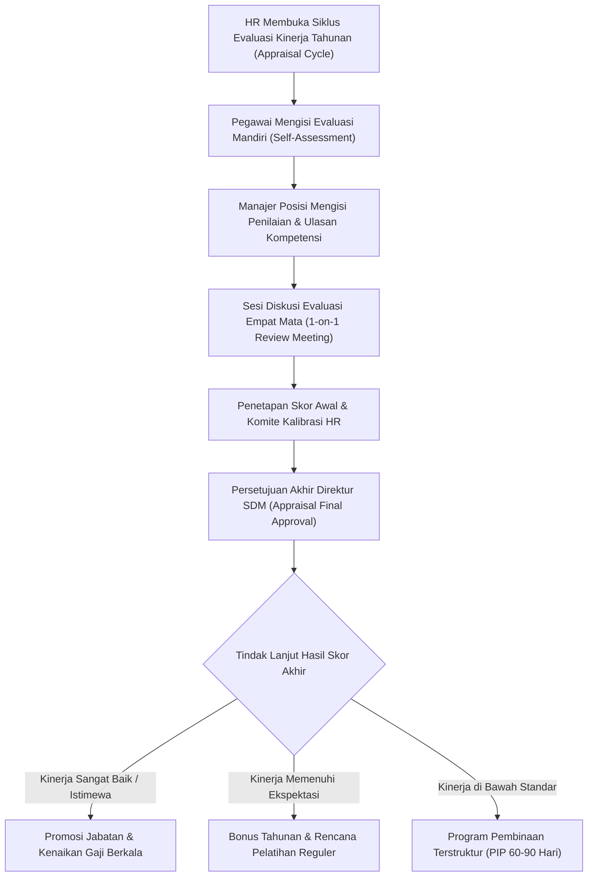

# Performance and Employee Management

## Definition

**Performance and Employee Management** (Manajemen Kinerja dan Pengembangan Pegawai) di dalam Enterprise Resource Planning (ERP) adalah subsistem tata kelola talenta yang memfasilitasi penetapan sasaran kerja (*goal setting*), pemantauan indikator kinerja utama (*Key Performance Indicators - KPIs* / *OKRs*), pelaksanaan siklus evaluasi berkala (*performance appraisal cycles*), serta penyelarasan hasil penilaian dengan keputusan kompensasi, promosi jabatan, dan rencana pengembangan kompetensi (*career & development planning*).

Di dalam arsitektur ERP enterprise, manajemen kinerja diperlakukan sebagai **proses bisnis objektif dan terstruktur**, bukan sebagai instrumen penilaian subjektif atau pengukuran psikologis individu:
1. Menyelaraskan sasaran strategis perusahaan ke dalam sasaran kerja operasional tim dan individu (*cascading goals*).
2. Menyediakan data rekam jejak kinerja yang terverifikasi untuk menjadi dasar penyesuaian skala upah (*merit increase*), pemberian bonus tahunan, atau pengisian lowongan suksesi internal.

---

## Purpose

Tujuan penerapan Performance and Employee Management di dalam ERP meliputi:

1. **Penyelarasan Sasaran Strategis (*Strategic Alignment*)**: Memastikan target bisnis korporasi diterjemahkan secara konsisten menjadi target terukur di tingkat departemen hingga individu pegawai.
2. **Standardisasi Siklus Evaluasi Kinerja (*Evaluation Governance*)**: Menegakkan jadwal peninjauan kinerja (tahunan, semesteran, atau berbasis penutupan proyek) dengan kriteria penilaian yang transparan dan adil.
3. **Penyelarasan Kompensasi Berbasis Kinerja (*Pay-for-Performance Integration*)**: Menghubungkan skor evaluasi kinerja secara otomatis dengan formula kenaikan gaji berkala atau alokasi bonus tahunan pada modul penggajian (*Payroll*).
4. **Identifikasi Kesenjangan Kompetensi (*Skill Gap Identification*)**: Mendeteksi kebutuhan pelatihan teknis (*training needs analysis*) guna meningkatkan kapasitas tenaga kerja dalam menyelesaikan proyek mendatang.
5. **Perencanaan Suksesi dan Formasi Jabatan (*Succession Planning*)**: Mengidentifikasi talenta internal yang siap dipromosikan (*ready-now candidates*) untuk mengisi formasi posisi kunci yang lowong.

---

## Arsitektur Komponen Manajemen Kinerja

ERP mengorganisasikan manajemen kinerja melalui lima komponen terpadu:

### 1. Penetapan Sasaran Kerja (Goal / KPI / OKR)
- **Cascading Goals**: Target korporasi diturunkan ke divisi, departemen, hingga pegawai.
- **Kriteria SMART**: *Specific, Measurable, Achievable, Relevant, Time-bound*.
- **Bobot Sasaran (*Weighting*)**: Setiap sasaran kerja memiliki bobot persentase tertentu (total bobot = 100%).

### 2. Perspektif Penilaian (Appraisal Perspectives)
- **Self-Assessment**: Evaluasi mandiri oleh pegawai terhadap pencapaian target dan perilakunya.
- **Direct Manager Review**: Evaluasi dan penilaian skor oleh atasan langsung posisi terkait.
- **360-Degree Feedback (Opsional)**: Masukan dari rekan sejawat (*peers*), bawahan, atau klien internal untuk posisi kepemimpinan.

### 3. Komite Kalibrasi (Calibration Committee)
Sesi penelaahan lintas manajer untuk menormalisasi standar penilaian agar tidak terjadi disparitas akibat manajer yang terlalu lunak (*lenient*) atau terlalu keras (*strict*), menjaga distribusi kurva kinerja yang sehat.

---

## Business Process: Siklus Evaluasi Kinerja

Alur evaluasi kinerja tahunan disajikan dalam diagram berikut:

---

## Business Rules

1. **Prasyarat Masa Kerja Evaluasi (*Appraisal Eligibility Rule*)**: Pegawai baru yang memiliki masa kerja kurang dari 3–6 bulan pada saat penutupan siklus evaluasi dikecualikan dari evaluasi penuh tahunan dan menggunakan mekanisme evaluasi masa percobaan (*Probation Review*).
2. **Kunci Sasaran Kerja (*Goal Lock Date*)**: Sasaran kerja yang telah disetujui bersama di awal periode dikunci secara permanen. Perubahan target di tengah tahun wajib melalui alur persetujuan perubahan sasaran resmi (*Goal Amendment Request*).
3. **Kerahasiaan Penilaian (*Appraisal Privacy*)**: Ulasan tertulis dan skor kalibrasi bersifat rahasia dan hanya dapat diakses oleh pegawai bersangkutan, atasan langsung, dan tim manajemen talenta HR.
4. **Pemisahan Evaluasi Kinerja dari Sentimen Pribadi**: Kriteria penilaian wajib didasarkan pada bukti pencapaian indikator kinerja kuantitatif yang tercatat pada sistem (misalnya penyelesaian deliverable proyek atau kepatuhan SLA).
5. **Keterikatan Hasil Evaluasi ke Struktur Kompensasi**: Kenaikan gaji berbasis kinerja (*Merit Increase*) wajib diselaraskan dengan batas rentang skala upah (*Salary Range Minimum-Maximum*) pada *Job Grade* yang bersangkutan.

---

## Accounting & Financial Impact

Hasil evaluasi kinerja bermuara pada keputusan finansial yang mempengaruhi anggaran tenaga kerja perusahaan:

### 1. Kenaikan Gaji Pokok Berkala (Merit Increase Accrual)
Kenaikan gaji akibat hasil kinerja istimewa meningkatkan dasar beban gaji tetap (*Fixed Cost*) bulanan perusahaan untuk periode fiskal berikutnya, yang dianggarkan melalui modul [[07-finance/budget-management|Finance (Phase 8)]].

### 2. Akrual Bonus Kinerja Tahunan (Annual Performance Bonus Accrual)
Jika perusahaan membayarkan bonus tahunan berbasis pencapaian kinerja, kewajiban bonus dibukukan pada akhir tahun buku:

$$\begin{array}{llrr}
\text{Debit:} & \text{Performance Bonus Expense (Beban Bonus Kinerja Karyawan)} & \text{Rp50.000.000} & \\
\text{Kredit:} & \text{Accrued Bonus Payable (Hutang Akrual Bonus Karyawan)} & & \text{Rp50.000.000}
\end{array}$$

Saat bonus dicairkan kepada pegawai, pajak PPh 21 atas penghasilan tidak teratur dipotong dan dilaporkan ke otoritas pajak.

---

## Skenario Kanonikal: Evaluasi Kinerja Andi Pratama

Rekam jejak evaluasi kinerja pegawai kanonikal `Andi Pratama` (`EMP-2026-0042`) di `PT Maju Bersama`:

- **Periode Penilaian**: Siklus Evaluasi Kinerja Tahun 2025 (Periode 01 Jan s.d. 31 Des 2025)
- **Jabatan Saat Dinilai**: *Junior Software Engineer* (Grade 3)
- **Atasan Penilai**: Budi Santoso (`EMP-2026-0010` - Engineering Manager)

### 1. Matriks Pencapaian Sasaran Kerja (KPI Scorecard)

| Sasaran Kinerja (KPI) | Bobot | Target Sasaran | Realisasi Tercapai | Skor Tertimbang |
| :--- | :--- | :--- | :--- | :--- |
| Penyelesaian Modul Finansial Proyek ERP | 40% | Tepat waktu & < 5 bug kritis | Selesai tepat waktu, 0 bug kritis | **4,5 / 5,0** |
| Ketersediaan & Kecepatan Respons API | 30% | Uptime 99,5%, respons < 200ms | Uptime 99,8%, respons 150ms | **4,2 / 5,0** |
| Pengembangan Kompetensi & Sertifikasi | 20% | Lulus 1 Sertifikasi Enterprise ERP | Lulus Sertifikasi Arsitektur ERP | **4,0 / 5,0** |
| Kepemimpinan & Kerjasama Tim | 10% | Mentoring 1 staf magang | Mentoring terlaksana sukses | **4,0 / 5,0** |
| **Total Skor Kinerja Akhir** | **100%** | | | **4,26 / 5,0 (Exceeds Expectations)** |

### 2. Tindak Lanjut Hasil Evaluasi (Effective 01 Januari 2026):
1. **Promosi Jabatan**: Dipromosikan dari *Grade 3 (Junior)* menjadi **Grade 4 (*Software Engineer*)** pada formasi posisi `POS-TECH-042`.
2. **Penyesuaian Skala Upah (*Merit Increase*)**: Gaji pokok disesuaikan menjadi **Rp10.000.000** per bulan (yang menjadi baseline kompensasi kanonikal pada tahun 2026).
3. **Pemberian Bonus Kinerja Tahunan**: Diberikan bonus prestasi setara 1,5 kali gaji pokok.

> [!NOTE]
> **Parameter Evaluasi Skenario Pembelajaran**:
> Bobot KPI, skala penilaian 1–5, kriteria promosi dari Grade 3 ke Grade 4, serta penyesuaian gaji pokok menjadi Rp10.000.000 di atas merupakan **asumsi skenario pembelajaran (*illustrative company policy*)** untuk menunjukkan integrasi modul kinerja ke modul kompensasi dan organisasi, bukan tolok ukur universal di seluruh perusahaan.

---

## ERP Implementation

Penerapan manajemen kinerja pada platform ERP enterprise:

### Odoo Implementation
- **Appraisals App (`hr.appraisal`)**: Mengelola jadwal peninjauan kinerja dengan formulir evaluasi digital yang memuat penilaian mandiri dan manajer.
- **Goals & Skills Tracking**: Terintegrasi dengan modul *Skills* yang memetakan perkembangan tingkat keahlian teknis pegawai secara visual (*radar chart*).
- **Automated Survey Forms**: Menggunakan mesin survei untuk mengumpulkan umpan balik 360 derajat dari rekan kerja.

### ERPNext Implementation
- **Appraisal & Goal DocTypes**: Menyediakan dokumen formal `Goal` yang dapat ditautkan ke kriteria hasil utama (*Key Result Areas - KRA*).
- **Appraisal Template**: Mendukung pembuatan template penilaian terstandarisasi per penunjukan jabatan (*Designation*).
- **Energy Points & Performance Tracking**: Fitur bawaan pelacakan produktivitas aktivitas operasional di dalam sistem.

### Dynamics 365 Implementation
- **Performance Management Framework**: Dynamics 365 Human Resources menyediakan modul evaluasi kinerja enterprise yang terhubung dengan buku kompetensi (*Competency Management*).
- **Continuous Feedback**: Memungkinkan pencatatan umpan balik kinerja informal (*Praise / Continuous Feedback*) sepanjang tahun tanpa menunggu siklus tahunan.
- **Compensation Integration**: Menghubungkan peringkat hasil penilaian secara langsung ke matriks pembaruan rencana kompensasi tetap (*Fixed Compensation Plan*).

---

## Naventra Consideration

Dalam perancangan modul manajemen kinerja Naventra ERP:

1. **Objective System-Driven KPIs**: Naventra mengintegrasikan data kinerja langsung dari modul operasional: metrik ketepatan waktu pengiriman deliverable proyek WBS pada modul [[09-project/project-task-and-milestone|Project Management]] secara otomatis ditarik sebagai nilai capaian KPI teknis pegawai.
2. **Automated Calibration Matrix**: Menyediakan antarmuka visual matriks 9 kotak (*9-Box Talent Matrix: Performance vs Potential*) yang memfasilitasi komite kalibrasi dalam mengelompokkan pegawai berkinerja tinggi (*High Performers*) untuk perencanaan suksesi kepemimpinan.
3. **Seamless Payroll Promotion Sync**: Persetujuan akhir kenaikan jabatan pada modul kinerja secara otomatis memperbarui rekaman *Job Grade* dan *Salary Structure Assignment* bertanggal efektif pada master data pegawai tanpa entri manual ganda.

---

## References

- Armstrong, M., & Taylor, S. (2020). *Armstrong's Handbook of Performance Management* (6th ed.). Kogan Page.
- Society for Human Resource Management (SHRM). *Designing and Implementing Performance Appraisal Systems*.
- SAP Help Portal. *Performance and Goals Management in SAP SuccessFactors*.
- Microsoft Learn. *Manage Employee Performance and Goals in Dynamics 365 Human Resources*.
- ERPNext Documentation. *Appraisal and Performance Management*.
- Odoo 17.0 Documentation. *Appraisals and Employee Feedback*.
