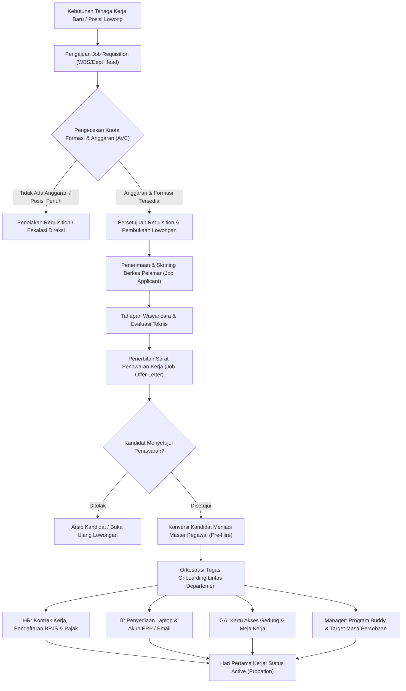

# Recruitment and Onboarding

## Definition

**Recruitment and Onboarding** di dalam Enterprise Resource Planning (ERP) adalah proses bisnis terintegrasi yang mengelola siklus perolehan talenta tenaga kerja (*talent acquisition*)—mulai dari pengajuan pembukaan lowongan kerja berdasarkan kuota formasi posisi dan anggaran (*Job Requisition*), pemrosesan data pelamar (*Applicant Tracking*), evaluasi penawaran kerja (*Job Offer*), hingga orkestrasi serah terima tugas dan fasilitas lintas departemen saat pegawai baru mulai bekerja (*Onboarding*).

Di dalam arsitektur ERP enterprise, modul rekrutmen bukan sekadar papan pelacak surat lamaran kerja (*applicant kanban board*), melainkan **pintu gerbang tata kelola anggaran tenaga kerja (*workforce headcount & budget gatekeeper*)**:
1. Memastikan tidak ada perekrutan liar tanpa formasi posisi (*Position Slot*) yang disahkan dalam rencana anggaran tahunan (*Workforce Budget*).
2. Menjamin otomatisasi konversi data dari kandidat menjadi master data pegawai (*Candidate-to-Employee Conversion*) tanpa entri ulang manual yang berisiko memicu salah saji data identitas dan perbankan.

---

## Purpose

Tujuan penerapan proses Recruitment and Onboarding yang terpadu dalam ERP adalah:

1. **Pengendalian Formasi dan Anggaran (*Budgetary Headcount Control*)**: Memvalidasi bahwa setiap rekrutmen baru didasarkan pada posisi lowong (*Vacant Position*) yang telah didanai dalam anggaran belanja modal atau operasional perusahaan.
2. **Pemisahan Entitas Pelamar dan Pegawai (*Data Integrity & Cleanliness*)**: Mengisolasi berkas pelamar kerja dari tabel master pegawai aktif guna menjaga basis data inti penggajian dan audit tetap bersih dari data pihak luar.
3. **Orkestrasi Tugas Orientasi Lintas Departemen (*Cross-Departmental Task Orchestration*)**: Mengoordinasikan kesiapan fasilitas hari pertama kerja secara otomatis antara Departemen HR, IT, Umum/GA, dan Manajer Lini.
4. **Percepatan Waktu Menuju Produktif (*Time-to-Productivity Acceleration*)**: Memastikan pegawai baru langsung menerima perangkat kerja, akun login sistem, dan target sasaran kerja pada hari pertama bertugas.
5. **Kepatuhan Penyerahan Aset Perusahaan**: Mencatat penyerahan laptop, kartu akses gedung, dan perlengkapan kerja langsung ke modul aktiva tetap (*Fixed Assets Custodianship*).

---

## Business Process

Alur terintegrasi proses rekrutmen hingga orientasi pegawai disajikan dalam diagram berikut:

### Entitas Kunci dalam Modul Rekrutmen

ERP membedakan secara tegas entitas-entitas data berikut:

1. **Job Requisition (Permintaan Pembukaan Formasi)**:
   - Dokumen otorisasi formal internal yang diajukan oleh manajer departemen untuk mengisi posisi kosong atau penambahan posisi baru yang telah disetujui dalam anggaran.
2. **Job Opening / Vacancy (Lowongan Kerja Terpublikasi)**:
   - Pengumuman resmi formasi pekerjaan yang dipublikasikan ke portal karir internal atau eksternal.
3. **Job Applicant / Candidate (Pelamar Kerja)**:
   - Entitas individu eksternal yang mengajukan lamaran; **bukan pegawai** dan tidak memiliki nomor induk pegawai (NIP) maupun hak akses sistem internal.
4. **Job Offer (Penawaran Kerja)**:
   - Dokumen legal yang menetapkan posisi jabatan, gaji pokok, tunjangan, tanggal mulai kerja, dan syarat masa percobaan.
5. **Employee Pre-Hire (Calon Pegawai)**:
   - Status transisi di mana kandidat telah menerima penawaran kerja dan sistem menyiapkan pembuatan nomor master pegawai (`EMP-ID`).

---

## The Onboarding Task Orchestration

Pada saat kandidat menyetujui penawaran kerja, ERP memicu alur kerja otomatis (*workflow checklist*) yang membagi tugas ke departemen pendukung:

| Departemen Pelaksana | Tindakan Onboarding yang Dijalankan Sistem | Dokumen / Transaksi Terkait | Dampak Integrasi ERP |
| :--- | :--- | :--- | :--- |
| **Human Resources (HR)** | Verifikasi dokumen asli (KTP, Ijazah, NPWP), penandatanganan kontrak kerja PKWT/PKWTT, pendaftaran BPJS Ketenagakerjaan & Kesehatan. | Kontrak Kerja & Master Pegawai | Master Data Pegawai aktif di modul HR; siap diproses dalam siklus payroll. |
| **Information Technology (IT)** | Penyerahan unit laptop terkonfigurasi, pembuatan akun email perusahaan, dan pembuatan akun login ERP (*User ID*). | Tanda Terima IT & Akun Pengguna | Menghubungkan `employee_id` ke `user_id` pada modul sistem administrasi; aset laptop dicatat di modul [[08-assets/asset-master-data|Fixed Assets]]. |
| **General Affairs (GA)** | Pembuatan kartu tanda pengenal (ID Badge / RFID), pengalokasian meja kerja fisik, dan pendaftaran akses parkir. | Formulir Akses Fasilitas | Nomor kartu RFID didaftarkan ke mesin presensi absensi (*Attendance Terminal*). |
| **Department Manager** | Penunjukan rekan pendamping (*Buddy*), pengenalan tim kerja, dan penetapan target sasaran masa percobaan (*Probation KPIs*). | Sasaran Kerja Masa Percobaan | Target kinerja terdaftar pada modul [[10-hr/performance-and-employee-management|Performance Management]]. |

---

## Business Rules

1. **Prasyarat Formasi Posisi (*No Requisition Without Vacant Position*)**: Dokumen *Job Requisition* tidak dapat disetujui apabila posisi yang dituju tidak berstatus *Vacant* dalam master data struktur posisi, atau tidak memiliki otorisasi penambahan formasi (*headcount quota increase*).
2. **Isolasi Data Pelamar (*Applicant Data Segregation*)**: Data biodata pelamar kerja dilarang masuk ke buku pembantu penggajian (*payroll subledger*) sebelum kandidat menandatangani surat penawaran kerja dan melewati tanggal efektif *Hire Date*.
3. **Pencegahan Duplikasi Identitas (*Anti-Duplicate Candidate Rule*)**: Sistem memvalidasi kombinasi Nomor Induk Kependudukan (NIK) dan alamat email untuk mendeteksi apakah pelamar pernah bekerja sebelumnya (*alumni/re-hire*) atau pernah melamar pada formasi lain.
4. **Keterikatan Kustodian Aset Pada Onboarding**: Penyerahan aset bernilai kapital (seperti laptop atau kendaraan) wajib mencantumkan nomor seri fisik aktiva tetap dan menghasilkan tanda terima digital (*Digital Handover Sheet*) sebelum status orientasi pegawai ditutup.
5. **Batas Waktu Pengesahan Kontrak Legal**: Jika dokumen kontrak kerja fisik/digital belum ditandatangani oleh pegawai hingga 3 hari kerja setelah tanggal mulai kerja, sistem secara otomatis membekukan hak pengajuan reimbursement dan lembur.

---

## Skenario Kanonikal: Rekrutmen Andi Pratama di PT Maju Bersama

Kronologi proses rekrutmen dan orientasi pegawai kanonikal `Andi Pratama`:

1. **Job Requisition**:
   - Manajer Rekayasa Perangkat Lunak (`EMP-2026-0010`) mengajukan dokumen `REQ-TECH-2023-018` untuk mengisi posisi lowong *Software Engineer* (`POS-TECH-042`) di Departemen Teknologi.
   - Pagu gaji yang disetujui dalam anggaran: Rp9.000.000 – Rp11.000.000. Sistem menyetujui permintaan karena formasi posisi berstatus *Vacant*.
2. **Aplikasi & Evaluasi Kandidat**:
   - Berkas lamaran masuk dengan nomor kandidat `CAND-9821` atas nama *Andi Pratama*.
   - Evaluasi tes koding dan wawancara teknis memperoleh skor 88/100 (*Recommended*).
3. **Job Offer Acceptance**:
   - Surat penawaran `OFF-2023-1102` diterbitkan dengan kesepakatan: Gaji Pokok Rp10.000.000, Tunjangan Tetap Rp1.500.000, status PKWTT dengan masa percobaan 3 bulan, tanggal mulai kerja 01 Januari 2024.
   - Kandidat menandatangani penawaran pada 15 Desember 2023.
4. **Konversi & Onboarding Orchestration**:
   - Pada 01 Januari 2024, sistem mengeksekusi aksi konversi: `CAND-9821` $\rightarrow$ `EMP-2026-0042`.
   - Departemen IT menyerahkan unit laptop Lenovo ThinkPad T14 (`AST-NB-2024-088`), yang secara otomatis tercatat dengan penanggung jawab *Andi Pratama* pada modul Aktiva Tetap.
   - GA menerbitkan kartu RFID nomor `RFID-88421` yang terhubung ke mesin absensi pintu masuk kantor.

---

## ERP Implementation

Penerapan alur rekrutmen dan orientasi pada sistem ERP enterprise:

### Odoo Implementation
- **Recruitment App (`hr.recruitment`)**: Mengelola jalur lamaran (*pipeline stages*: *Initial Qualification*, *First Interview*, *Contract Proposal*, *Contract Signed*).
- **Tombol Create Employee**: Saat pelamar mencapai tahap *Contract Signed*, tombol *Create Employee* otomatis menyalin data nama, email, nomor telepon, dan melampirkan berkas CV ke formulir `hr.employee` baru.
- **Onboarding Plans**: Odoo menyediakan template rencana orientasi (*Onboarding Plan*) yang otomatis membuat tugas kalender untuk staf HR, IT, dan manajer.

### ERPNext Implementation
- **Job Requisition & Job Opening**: Memisahkan izin pembukaan lowongan (`Job Requisition`) dengan pengumuman publik (`Job Opening`).
- **Job Applicant to Employee**: Fitur bawaan mengubah dokumen `Job Applicant` menjadi `Employee` dalam 1 klik.
- **Employee Onboarding DocType**: ERPNext memiliki dokumen formal `Employee Onboarding` yang berisi tabel aktivitas (*Activities List*) dengan penugasan ke pengguna tertentu, tanggal target penyelesaian, dan status *Pending/Completed*.

### Dynamics 365 Implementation
- **Attract & Onboard Integration**: Dynamics 365 Human Resources menyediakan modul orientasi modular yang memungkinkan pegawai baru mengisi biodata pribadi sebelum hari pertama kerja (*Pre-boarding Portal*).
- **Position Allocation on Hire**: Proses penerimaan (*Hire Worker Wizard*) mewajibkan penugasan langsung ke *Position* yang berstatus terbuka, mengunci formasi tersebut dari proses rekrutmen lain.
- **Task Management**: Menugaskan daftar tilik kepatuhan hukum dan pelatihan wajib (*Compliance Checklists*) yang terintegrasi dengan portal pembelajaran perusahaan.

---

## Naventra Consideration

Dalam perancangan modul rekrutmen dan orientasi Naventra ERP:

1. **Otomatisasi Penutupan Kuota Formasi**: Konversi kandidat menjadi pegawai secara otomatis mengubah status posisi terkait dari *Vacant* menjadi *Filled*, serta membatalkan seluruh proses seleksi pelamar lain pada formasi tersebut yang belum mencapai tahap penawaran.
2. **Digital Onboarding Checklist dengan Persetujuan Bertingkat**: Naventra menyediakan dasbor pelacak orientasi di mana staf IT dan GA wajib mencentang dan menandatangani secara digital bukti serah terima perangkat dan kartu akses sebelum status pegawai dialihkan dari *Pre-Hire* ke *Active (Probation)*.
3. **Pencegahan Redundansi Dokumen**: Berkas kartu identitas, NPWP, dan buku rekening yang diunggah pelamar pada saat penawaran kerja otomatis dialokasikan ke direktori berkas terenkripsi pada master data pegawai tanpa perlu meminta pegawai mengunggah ulang.

---

## References

- Society for Human Resource Management (SHRM). (2021). *Talent Acquisition and Onboarding in Enterprise Organizations*. SHRM.
- Armstrong, M., & Taylor, S. (2020). *Armstrong's Handbook of Human Resource Management Practice* (15th ed.). Kogan Page.
- SAP Help Portal. *Recruiting and Onboarding Architecture in SAP SuccessFactors*.
- Microsoft Learn. *Set up recruitment and hire workers in Dynamics 365 Human Resources*.
- ERPNext Documentation. *Recruitment and Onboarding Process*.
- Odoo 17.0 Documentation. *Recruitment Process and Employee Creation*.
