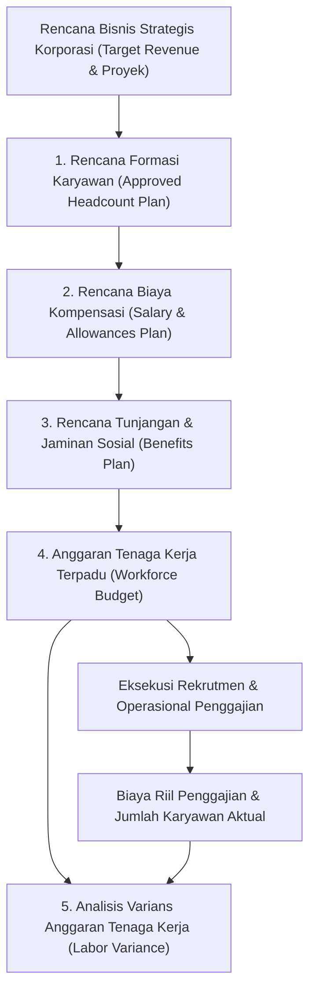

# Workforce Planning and HR Analytics

## Definition

**Workforce Planning and HR Analytics** (Perencanaan Tenaga Kerja dan Intelijen SDM) di dalam Enterprise Resource Planning (ERP) adalah domain strategis yang mengintegrasikan peramalan kebutuhan jumlah karyawan (*headcount forecasting*), penganggaran biaya kompensasi (*workforce budgeting*), pemantauan metrik efisiensi ketenagakerjaan, serta analisis data multi-dimensi guna mendukung pengambilan keputusan pimpinan perusahaan.

Di dalam ERP enterprise, perencanaan tenaga kerja bukan sekadar daftar estimasi perekrutan, melainkan **komponen pengendali beban operasional terbesar perusahaan**:
1. Menyelaraskan kapasitas formasi posisi (*Position Capacity*) dengan rencana ekspansi bisnis dan portofolio proyek.
2. Mempertemukan anggaran belanja pegawai yang disetujui (*Approved Workforce Budget*) pada modul [[07-finance/budget-management|Finance (Phase 8)]] dengan realisasi pengeluaran gaji aktual (*Payroll Spend*) pada buku besar.

---

## Purpose

Tujuan penerapan Workforce Planning and HR Analytics di dalam ERP adalah:

1. **Pengendalian Jumlah dan Komposisi Karyawan (*Headcount Control*)**: Memastikan jumlah pegawai aktif selalu berada dalam batas formasi yang disetujui pemegang saham (*Authorized Headcount Plan*).
2. **Akurasi Penganggaran Biaya Pegawai (*Labor Cost Budgeting*)**: Memproyeksikan seluruh beban gaji pokok, tunjangan, lembur, bonus, dan kontribusi jaminan sosial perusahaan secara terstruktur.
3. **Peringatan Dini Deviasi Anggaran (*Workforce Variance Analysis*)**: Mendeteksi pembengkakan biaya lembur atau inefisiensi pengeluaran tenaga kerja sedini mungkin sebelum tutup tahun buku.
4. **Optimalisasi Produktivitas dan Utilisasi Tenaga Kerja**: Mengukur efektivitas pemanfaatan jam kerja pegawai untuk aktivitas proyek yang menghasilkan pendapatan (*Billable Utilization*).
5. **Mitigasi Risiko Perputaran Karyawan (*Turnover Risk Mitigation*)**: Menganalisis tren keluarnya karyawan (*Turnover Rate*) berdasarkan departemen, masa kerja, atau kelompok kompetensi guna menyusun strategi retensi talenta.

---

## Arsitektur Perencanaan Tenaga Kerja (Workforce Planning)

ERP mengelola siklus perencanaan tenaga kerja melalui integrasi data berjenjang:

### Komponen Anggaran Belanja Tenaga Kerja (Workforce Budget Elements):
1. **Direct Compensation Budget (Biaya Kompensasi Tetap)**:
   - Proyeksi gaji pokok dan tunjangan tetap untuk seluruh formasi posisi yang terisi dan posisi yang direncanakan akan direkrut.
2. **Variable Compensation Budget (Biaya Kompensasi Variabel)**:
   - Alokasi anggaran upah lembur operasional, insentif komisi penjualan, dan bonus kinerja tahunan.
3. **Statutory & Fringe Benefits Budget (Biaya Manfaat Perusahaan)**:
   - Proyeksi iuran jaminan sosial porsi pemberi kerja (BPJS Ketenagakerjaan & Kesehatan), asuransi kesehatan komersial, dan program pelatihan.
4. **Recruitment & Training Budget (Biaya Pengadaan & Pengembangan)**:
   - Biaya iklan lowongan, jasa agen rekrutmen pihak ketiga, dan biaya sertifikasi kompetensi.

---

## Metrik Kunci Intelijen SDM (Key HR Analytics Metrics)

ERP enterprise menyediakan mesin analitik untuk menghitung metrik ketenagakerjaan standar industri:

### 1. Headcount vs Full-Time Equivalent (FTE)
- **Headcount**: Jumlah fisik individu pegawai yang memiliki hubungan kerja aktif (setiap orang dihitung 1).
- **Full-Time Equivalent (FTE)**: Kapasitas waktu kerja terstandardisasi. Satu pegawai purnawaktu setara dengan $1,0\text{ FTE}$, sedangkan dua pegawai paruh waktu yang masing-masing bekerja 20 jam per minggu setara dengan $1,0\text{ FTE}$ kumulatif.

### 2. Rasio Perputaran Karyawan (Turnover Rate)
Mengukur stabilitas retensi tenaga kerja dalam satu periode (biasanya tahunan atau bulanan):
$$
\text{Turnover Rate} = \frac{\text{Jumlah Pegawai Berhenti (Separations)}}{\text{Jumlah Rata-Rata Pegawai Aktif (Average Headcount)}} \times 100\%
$$
*Pembedaan Kritis*: ERP memisahkan antara *Voluntary Turnover* (pengunduran diri mandiri) dan *Involuntary Turnover* (pemutusan hubungan kerja atau habis kontrak).

### 3. Tingkat Ketidakhadiran (Absenteeism Rate)
Mengukur proporsi hilangnya jam kerja akibat ketidakhadiran yang tidak direncanakan:
$$
\text{Absenteeism Rate} = \frac{\text{Total Hari Mangkir \& Sakit}}{\text{Total Hari Kerja Tersedia (Total Available Work Days)}} \times 100\%
$$

### 4. Rasio Jam Lembur (Overtime Ratio)
Mengukur ketergantungan operasional terhadap jam kerja tambahan di luar jam reguler:
$$
\text{Overtime Ratio} = \frac{\text{Total Jam Lembur Riil}}{\text{Total Jam Kerja Reguler}} \times 100\%
$$

### 5. Tingkat Utilisasi Proyek (Billable Utilization Rate)
Metrik kunci untuk divisi konsultasi dan layanan profesional:
$$
\text{Billable Utilization Rate} = \frac{\text{Jam Kerja yang Dapat Ditagihkan ke Proyek (Billable Hours)}}{\text{Total Jam Kerja Produktif Tersedia (Standard Hours - e.g. 160 Jam)}} \times 100\%
$$

---

## Tiga Lapisan Dasbor Pelaporan SDM (Reporting Layers)

Sistem analitik ERP menyajikan informasi berdasarkan tingkatan pemangku kepentingan:

| Lapisan Pelaporan | Target Pengguna | Fokus Metrik & Visualisasi |
| :--- | :--- | :--- |
| **Operational Layer** | Staf HR & Manajer Tim Lini | Dasbor kehadiran harian, permohonan cuti tertunda, log anomali presensi (*missing punch*), dan pengingat akhir masa kontrak kerja. |
| **Tactical Layer** | Kepala Departemen & PMO | Realisasi jam lembur per tim, pemanfaatan jam lembar waktu proyek (*Timesheet Utilization*), dan penyelesaian sasaran kerja masa percobaan. |
| **Executive Layer** | Direksi & *Chief HR Officer* | Total beban belanja gaji (*Workforce Spend vs Budget*), tren *Turnover Rate*, pendapatan per pegawai (*Revenue per Employee*), dan status pemenuhan formasi jabatan. |

---

## Business Rules

1. **Penguncian Anggaran Formasi (*Approved Headcount Ceiling*)**: Departemen dilarang mengajukan rekrutmen pegawai baru jika jumlah pegawai aktif ditambah posisi yang sedang dalam proses rekrutmen telah mencapai batas maksimal formasi yang disahkan (*Authorized Headcount Cap*).
2. **Standardisasi Denominator Metrik**: Perhitungan *Turnover Rate* dan *Absenteeism* wajib menggunakan basis periode waktu dan definisi pembagi (*denominator*) yang konsisten (misalnya rata-rata pegawai aktif pada awal dan akhir periode) untuk mencegah distorsi pelaporan tren.
3. **Pencegahan Akses Informasi Biaya Sensitif**: Dasbor analitik biaya tenaga kerja (*Labor Cost Dashboards*) dilindungi dengan hak otorisasi khusus; manajer lini hanya dapat melihat data jam kerja (*hours*), sedangkan nilai nominal rupiah upah individual hanya dapat diakses oleh peran eksekutif dan HR Payroll (*salary data masking*).
4. **Penyesuaian Anggaran Otomatis Berbasis Posisi Kosong (*Vacancy Slippage*)**: Jika posisi yang dianggarkan belum berhasil direkrut sesuai target bulan yang direncanakan, sisa anggaran gaji bulanan formasi tersebut dialihkan menjadi varians hemat (*favorable vacancy variance*) dan tidak boleh digunakan untuk pos pengeluaran lain tanpa otorisasi anggaran.
5. **Rekonsiliasi Bulanan Data HR vs Buku Besar**: Total biaya tenaga kerja yang disajikan pada dasbor analitik HR wajib terekonsiliasi 100% dengan saldo akumulasi akun kelas 5/6 (Beban Gaji & Tunjangan) pada Laporan Laba Rugi modul [[02-accounting/financial-statements|Accounting (Phase 3)]].

---

## Skenario Kanonikal: Analitik SDM PT Maju Bersama

Data analitik tenaga kerja untuk **Departemen Teknologi** di `PT Maju Bersama` pada periode bulan April 2026:

### 1. Perencanaan vs Realisasi Formasi Jabatan (Headcount Plan)
- **Approved Headcount Formasi**: 20 FTE
- **Actual Headcount Aktif**: 18 FTE (Termasuk `Andi Pratama` / `EMP-2026-0042`)
- **Posisi Lowong (*Vacancies in Recruitment*)**: 2 FTE (*Senior DevOps Engineer* & *QA Specialist*)
- **Tingkat Keterisian Formasi (*Fill Rate*)**: $\frac{18}{20} \times 100\% = \mathbf{90\%}$

### 2. Anggaran vs Realisasi Biaya Tenaga Kerja (Workforce Budget Variance)
- **Pagu Anggaran Belanja Pegawai Bulanan (*Planned Payroll Budget*)**: **Rp250.000.000**
- **Realisasi Beban Gaji & Manfaat Aktual (*Actual Payroll Spend*)**: **Rp228.000.000**
- **Varians Anggaran (*Workforce Cost Variance*)**:
  $$\text{Variance} = \text{Rp250.000.000} - \text{Rp228.000.000} = +\mathbf{Rp22.000.000}\text{ (Favorable / Under Budget)}$$
  *Penyebab Varians*: Penghematan biaya akibat 2 posisi formasi belum terisi (*vacancy savings*).

### 3. Analisis Produktivitas Pegawai Kanonikal (Andi Pratama)
- Total Jam Kerja Tersedia: 160 Jam
- Jam Kerja Proyek Pelanggan (`PRJ-ERP-2026-001`): 80 Jam
- Jam Kerja Operasional Departemen: 80 Jam
- **Tingkat Utilisasi Proyek (*Billable Project Utilization*)**:
  $$\text{Utilization Rate} = \frac{80\text{ Jam}}{160\text{ Jam}} \times 100\% = \mathbf{50\%}$$
  *(50% waktu kerja teralokasi langsung untuk penyerapan biaya proyek pelanggan senilai Rp6.400.000)*.

---

## ERP Implementation

Penerapan analitik tenaga kerja pada platform ERP enterprise:

### Odoo Implementation
- **HR Reporting Views**: Menyediakan tampilan pivot dan grafik terintegrasi pada modul *Employees*, *Attendances*, dan *Timesheets*.
- **Odoo Spreadsheet Dashboards**: Memungkinkan penyusunan dasbor eksekutif dinamis yang mengagregasi data rasio turnover, sebaran usia, dan biaya penggajian per departemen.
- **Skills Matrix**: Visualisasi matriks ketersediaan kompetensi teknologi di seluruh organisasi.

### ERPNext Implementation
- **HR Dashboard & Analytics**: Menyediakan dasbor bawaan untuk pelacakan *Employee Turnover*, *Attendance Rate*, dan *Leave Utilization*.
- **Staffing Plan DocType**: Dokumen formal untuk merencanakan kebutuhan jumlah staf (*Headcount Budget*) per penunjukan jabatan dan departemen dengan estimasi biaya anggaran tahunan.
- **Custom Scripting & Chart Builder**: Memfasilitasi pembuatan grafik KPI khusus berbasis kueri basis data.

### Dynamics 365 Implementation
- **Power BI Embedded HR Analytics**: Dynamics 365 Human Resources menyediakan integrasi bawaan dengan paket analitik Power BI (analisis demografi tenaga kerja, tren kompensasi, dan metrik retensi talenta).
- **Position Budgeting & Forecasting**: Modul perencanaan formasi tingkat lanjut yang menghubungkan posisi lowong dengan buku besar anggaran perbendaharaan (*Budget Control Framework*).
- **Workforce Attrition Predictions**: Memanfaatkan analitik prediktif untuk mendeteksi pegawai yang berisiko tinggi mengundurkan diri (*flight risk analysis*).

---

## Naventra Consideration

Dalam perancangan modul perencanaan tenaga kerja dan analitik Naventra ERP:

1. **Automated Headcount vs Payroll Variance Engine**: Naventra menyediakan dasbor keuangan SDM terpadu yang memvisualisasikan korelasi antara posisi formasi yang lowong (*Vacancies*) dengan deviasi penyerapan anggaran belanja kas perbendaharaan secara *real-time*.
2. **Project Workforce Capacity Heatmap**: Modul analitik menyajikan peta panas (*heatmap*) alokasi sumber daya manusia lintas proyek, memungkinkan manajer operasional mendeteksi staf teknis yang mengalami kelebihan beban kerja (*over-allocated*) atau kekurangan penugasan (*under-utilized*).
3. **Role-Based Privacy Masking**: Data agregasi jumlah pegawai dan jam kerja dapat diakses oleh manajer departemen, sementara seluruh kolom nilai moneter gaji dienkripsi dan disamarkan secara otomatis bagi pengguna non-eksekutif.

---

## References

- Fitz-enz, J., & Mattox, J. R. (2014). *Predictive Analytics for Human Resources*. Wiley.
- Society for Human Resource Management (SHRM). *Workforce Planning and Analytics Standards*.
- SAP Help Portal. *Workforce Planning and Analytics in SAP SuccessFactors*.
- Microsoft Learn. *Workforce Management and Power BI Analytics in Dynamics 365 Human Resources*.
- ERPNext Documentation. *Staffing Plan and HR Dashboards*.
- Odoo 17.0 Documentation. *Human Resources Reporting and Dashboards*.
