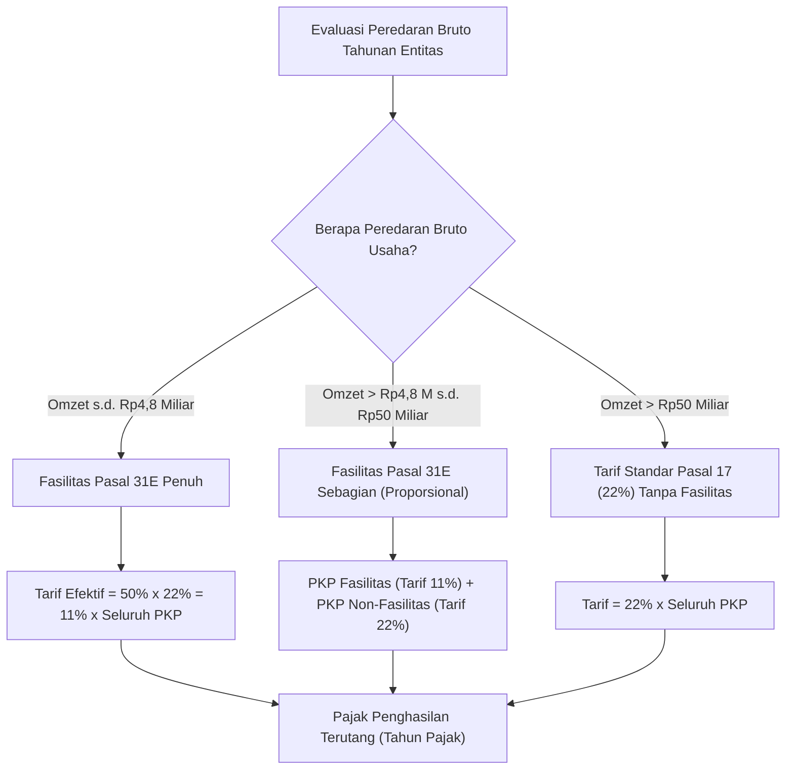

# Corporate Income Tax Calculation

## Definisi

**Corporate Income Tax Calculation (Perhitungan Pajak Penghasilan Badan)** adalah proses komputasi di dalam sistem ERP yang menerapkan skema tarif pajak penghasilan yang sah terhadap Penghasilan Kena Pajak (PKP) hasil rekonsiliasi fiskal guna menentukan jumlah Pajak Penghasilan Terutang (*Tax Liability*) dan Beban Pajak Kini (*Current Tax Expense*) korporasi dalam satu tahun pajak.

Perhitungan PPh Badan diatur oleh kerangka hukum perpajakan yang kaku, di mana penentuan besaran tarif tidak hanya bergantung pada laba bersih fiskal, tetapi juga pada batasan nilai peredaran bruto (*gross turnover / revenue*) tahunan yang diperoleh entitas usaha.

---

## Tujuan Bisnis (Purpose)

Pengoperasian mesin perhitungan PPh Badan di dalam ERP bertujuan untuk:
1. **Penetapan Beban Pajak yang Presisi:** Menghitung liabilitas pajak penghasilan terutang secara akurat untuk menghindari koreksi dan penetapan kurang bayar oleh otoritas pajak.
2. **Penerapan Fasilitas Tarif Berkeadilan (Statutory Relief Utilization):** Menerapkan fasilitas pengurangan tarif (seperti Fasilitas Pasal 31E UU PPh di Indonesia) secara otomatis bagi wajib pajak yang memenuhi syarat omzet.
3. **Penyajian Laba Bersih Setelah Pajak (Net Income after Tax):** Memperhitungkan beban pajak kini (*current tax*) dan beban/manfaat pajak tangguhan (*deferred tax*) untuk menyajikan Laba Bersih Tahun Berjalan (*Net Profit After Tax*) yang wajar pada laporan keuangan penutupan tahun.
4. **Dasar Penetapan Angsuran Pajak Tahun Berikutnya:** Menyediakan basis nilai pajak terutang yang menjadi titik tolak perhitungan angsuran bulanan PPh Pasal 25 untuk tahun pajak yang akan datang.

---

## Kerangka Regulasi dan Skema Tarif PPh Badan

Berdasarkan Undang-Undang Republik Indonesia No. 7 Tahun 2021 tentang Harmonisasi Peraturan Perpajakan (UU HPP), skema tarif Pajak Penghasilan Wajib Pajak Badan Dalam Negeri ditetapkan sebagai berikut:



### 1. Tarif Standar Pasal 17 ayat (1) huruf b UU HPP
Tarif umum PPh Badan yang berlaku efektif sejak Tahun Pajak 2022 adalah sebesar **22%**.

### 2. Fasilitas Pengurangan Tarif Pasal 31E UU PPh
Wajib Pajak Badan dalam negeri dengan peredaran bruto sampai dengan Rp50.000.000.000 (lima puluh miliar rupiah) mendapat fasilitas pengurangan tarif sebesar 50% dari tarif normal 22% (sehingga tarif efektif menjadi **11%**) atas Penghasilan Kena Pajak dari bagian peredaran bruto sampai dengan Rp4.800.000.000.

Formulasi Perhitungan Pasal 31E:
- **Kategori 1 (Omzet s.d. Rp4,8 Miliar):**
  $$\text{PPh Terutang} = 50\% \times 22\% \times \text{PKP} = 11\% \times \text{PKP}$$
- **Kategori 2 (Omzet > Rp4,8 Miliar s.d. Rp50 Miliar):**
  $$\text{Bagian PKP Fasilitas} = \left( \frac{\text{Rp4.800.000.000}}{\text{Peredaran Bruto}} \right) \times \text{PKP}$$
  $$\text{Bagian PKP Non-Fasilitas} = \text{PKP} - \text{Bagian PKP Fasilitas}$$
  $$\text{PPh Terutang} = (50\% \times 22\% \times \text{PKP Fasilitas}) + (22\% \times \text{PKP Non-Fasilitas})$$
- **Kategori 3 (Omzet > Rp50 Miliar):**
  $$\text{PPh Terutang} = 22\% \times \text{PKP}$$

---

## Business Rules Perhitungan PPh Badan

1. **Thousands Rounding Down Rule (Pasal 17 ayat 4 UU PPh):**
   Untuk keperluan penghitungan pajak, Penghasilan Kena Pajak (PKP) wajib dibulatkan ke bawah dalam ribuan rupiah penuh. Pecahan rupiah di bawah Rp1.000 dihilangkan (misalnya: PKP Rp105.000.750 dibulatkan menjadi Rp105.000.000).
2. **Comprehensive Gross Turnover Evaluation Rule:**
   Dalam menentukan batas omzet Rp4,8 miliar atau Rp50 miliar untuk fasilitas Pasal 31E, peredaran bruto mencakup seluruh penghasilan dari usaha utama, penghasilan di luar usaha, serta penghasilan yang dikenai PPh Final dan yang bukan objek pajak, sebelum dikurangi diskon atau potongan penjualan di luar faktur.
3. **Current vs Deferred Tax Distinction:**
   Beban Pajak Kini (*Current Tax Expense*) dihitung dari PKP dikalikan tarif pajak, sedangkan Beban/Manfaat Pajak Tangguhan (*Deferred Tax*) dihitung dari perubahan saldo perbedaan temporer dikalikan tarif pajak yang berlaku di masa depan. Total beban pajak pada laporan laba rugi merupakan penjumlahan keduanya.
4. **Corporate Tax Provision Approval Rule:**
   Jurnal penyisihan beban PPh Badan akhir tahun tidak boleh diposting otomatis tanpa persetujuan formal dari *Tax Manager* dan *Chief Financial Officer* (CFO).

---

## Dampak Akuntansi (Accounting Impact)

Penetapan perhitungan pajak badan menghasilkan pencatatan jurnal akuntansi akhir tahun:

### Jurnal Pengakuan Beban Pajak Kini
```text
(Db) Beban Pajak Penghasilan Kini (Laba Rugi)     [Nilai Pajak Terutang]
    (Cr) Utang Pajak Penghasilan Badan (PPh 29)                  [Nilai Pajak Terutang]
```

*(Catatan: Pengkreditan uang muka pajak PPh 22, 23, dan 25 akan dibahas secara terperinci pada proses penyelesaian dan angsuran di dokumen berikutnya)*.

---

## Skenario Kanonikal: PT Maju Bersama

Melanjutkan data transaksi keuangan `PT Maju Bersama`:
* **Laba Bersih Komersial Sebelum Pajak (EBT):** Rp100.000.000.
* **Koreksi Fiskal Positif Netto:** Rp5.000.000 (+Rp10.000.000 positif, -Rp5.000.000 negatif).
* **Penghasilan Kena Pajak (PKP):** Rp105.000.000.

### 1. Skenario Utama (Baseline Kanonikal): Tarif Standar 22% (Non-Fasilitas)
Sebagai basis perhitungan kanonikal korporasi umum (tarif umum Pasal 17 ayat (1) huruf b UU PPh jo. UU HPP):
* **Beban PPh Badan Terutang Bruto:**
  $$\text{PPh Badan Terutang} = 22\% \times \text{Rp105.000.000} = \mathbf{\text{Rp23.100.000}}$$
* **Total Kredit Pajak Terkumpul Sepanjang Tahun:**
  - Angsuran bulanan PPh Pasal 25: Rp5.000.000
  - Bukti potong PPh Pasal 23 dari pelanggan: Rp2.000.000
  - Total Kredit Pajak: **Rp7.000.000**
* **Kewajiban Kurang Bayar Akhir Tahun (PPh Pasal 29):**
  $$\text{PPh Pasal 29 Terutang} = \text{Rp23.100.000} - \text{Rp7.000.000} = \mathbf{\text{Rp16.100.000}}$$

### 2. Skenario Alternatif: Pemanfaatan Fasilitas Pasal 31E UU PPh
Apabila entitas memenuhi kriteria peredaran bruto tertentu (omzet tahunan sampai dengan Rp4,8 miliar) dan memilih memanfaatkan fasilitas pengurangan tarif 50%:
* **Tarif Efektif Fasilitas:** $50\% \times 22\% = 11\%$
* **PPh Badan Terutang (Pasal 31E):**
  $$\text{PPh Terutang Fasilitas} = 11\% \times \text{Rp105.000.000} = \mathbf{\text{Rp11.550.000}}$$
* **Kewajiban Kurang Bayar (PPh 29 Fasilitas):**
  $$\text{PPh Pasal 29} = \text{Rp11.550.000} - \text{Rp7.000.000} = \mathbf{\text{Rp4.550.000}}$$

*Catatan Implementasi ERP:* Modul perpajakan ERP modern dirancang fleksibel untuk mengomputasi secara otomatis baik skema tarif standar 22% maupun skema fasilitas berjenjang Pasal 31E berdasarkan parameter konfigurasi entitas dan ambang batas peredaran bruto yang tercatat di sistem.

---

## Implementasi ERP Universal

Arsitektur mesin perhitungan PPh Badan dalam ERP terintegrasi mencakup:
1. **Gross Turnover Aggregator:** Layanan yang secara otomatis menjumlahkan peredaran bruto dari subledger penjualan dan akun pendapatan lain-lain untuk menentukan ambang batas fasilitas fiskal.
2. **Tax Bracket & Relief Calculator:** Algoritma yang mengeksekusi rumus tarif berjenjang (*tax brackets*) atau rumus fasilitas proporsional Pasal 31E berdasarkan parameter konfigurasi tahun pajak aktif.
3. **Tax Provisioning Simulator:** Fasilitas simulasi beban pajak (*tax what-if analysis*) yang memungkinkan manajemen keuangan memprediksi dampak beban pajak akhir tahun berdasarkan angka proyeksi laba rugi triwulanan.

---

## Perbandingan Software ERP

| Dimensi Perhitungan PPh Badan | Odoo (v16 - v18) | ERPNext (v14 - v15) | Microsoft Dynamics 365 F&O |
|---|---|---|---|
| **Kalkulasi Tarif Bertingkat/Fasilitas** | Dihitung secara manual atau melalui skrip kustom; belum tersedia mesin tarif Pasal 31E bawaan. | Dapat diotomatisasi melalui skrip Python pada dokumen penutupan fiskal kustom (*Server Script*). | Mendukung *Tax Tiers and Calculation Limits* yang dapat dikonfigurasi bertingkat berdasarkan omzet. |
| **Simulasi Beban Pajak** | Terbatas pada laporan estimasi laba rugi standar. | Dapat disimulasikan melalui *Report Generator* dengan formula kustom. | Memiliki fitur *Tax Provision Simulator* dan analisis dampak perpajakan terpadu. |
| **Pembulatan Ribuan Penuh** | Memerlukan entri jurnal koreksi pembulatan tersendiri. | Pembulatan dapat diatur melalui pengaturan *Currency Precision* atau skrip. | Memiliki konfigurasi *Tax Rounding Rules* khusus untuk yurisdiksi perpajakan tertentu. |

---

## Pertimbangan Desain Naventra (Naventra Consideration)

Pada pengembangan ERP Naventra, modul perhitungan PPh Badan dirancang dengan fitur otomatisasi terdepan:

1. **Automated Article 31E Evaluation Engine:**
   Naventra secara otomatis mengeksekusi formula Pasal 31E saat proses penutupan tahun pajak dijalankan:
   - Menghitung total `gross_turnover` dari seluruh transaksi penjualan dan pendapatan di luar usaha.
   - Mengklasifikasikan entitas ke dalam Kategori Penuh (omzet <= 4,8M), Proporsional (4,8M < omzet <= 50M), atau Non-Fasilitas (omzet > 50M).
   - Menghitung nilai PPh terutang secara otomatis tanpa memerlukan intervensi manual.
2. **Dual Rounding Support:**
   Sistem secara otomatis menerapkan pemotongan ribuan rupiah ke bawah (*floor to thousands*) pada Dasar Pengenaan Pajak PKP sebelum mengalikan dengan tarif, menghasilkan angka yang identik dengan kertas kerja DJP.
3. **Tax Provision Workflow & Audit Trace:**
   Kalkulasi beban pajak menghasilkan dokumen draf `tax_provision_assessment` yang mencantumkan seluruh variabel perhitungan (Omzet, PKP, Fasilitas, Tarif) yang harus disetujui secara digital oleh pejabat berwenang sebelum memicu jurnal buku besar.

---

## Referensi

* Undang-Undang Republik Indonesia No. 36 Tahun 2008 tentang Pajak Penghasilan sebagaimana telah diubah terakhir dengan UU No. 7 Tahun 2021 (UU Harmonisasi Peraturan Perpajakan).
* Peraturan Pemerintah Republik Indonesia No. 55 Tahun 2022 tentang Penyesuaian Pengaturan di Bidang Pajak Penghasilan.
* Surat Edaran Direktur Jenderal Pajak No. SE-02/PJ/2015 tentang Penegasan atas Pelaksanaan Pasal 31E ayat (1) UU No. 36 Tahun 2008.
* International Accounting Standard (IAS) 12: *Income Taxes*.
* Microsoft Learn: *Corporate Tax Calculation and Rate Tier Setup in Dynamics 365 Finance*.
* Frappe / ERPNext Documentation: *Managing Year-End Tax Liabilities and Journal Postings*.
