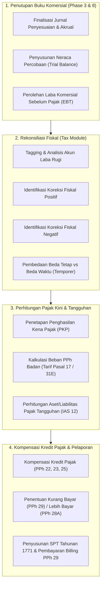

# Corporate Income Tax Fundamentals

## Definisi

**Corporate Income Tax Fundamentals (Fondasi Pajak Penghasilan Badan / PPh Badan)** adalah domain tata kelola di dalam ERP yang mengatur bagaimana laba komersial entitas diselaraskan dengan peraturan perpajakan yang berlaku untuk menghitung laba kena pajak (*Taxable Profit / Penghasilan Kena Pajak*), menentukan beban pajak kini (*Current Tax Expense*), menghitung pajak tangguhan (*Deferred Tax*), serta memenuhi kewajiban pelaporan Surat Pemberitahuan (SPT) Tahunan PPh Badan (Formulir 1771 di Indonesia).

Berbeda dari PPN yang merupakan pajak tidak langsung atas transaksi penyerahan barang/jasa, Pajak Penghasilan Badan merupakan **pajak langsung atas kemampuan ekonomis** (*direct income tax*) yang diperoleh wajib pajak korporasi selama satu tahun pajak.

---

## Tujuan Bisnis (Purpose)

Pengelolaan modul PPh Badan di dalam sistem ERP bertujuan untuk:
1. **Menjembatani Laba Komersial dan Fiskal (Book-Tax Alignment):** Menghubungkan pembukuan akuntansi standar (IFRS / SAK) dengan ketentuan perundang-undangan perpajakan tanpa merusak kemurnian laporan keuangan komersial.
2. **Kepatuhan Pajak Tahunan (Statutory Annual Filing):** Memfasilitasi penyusunan SPT Tahunan Badan 1771 beserta lampiran-lampirannya secara sistematis langsung dari data buku besar akuntansi.
3. **Penyediaan Pencatatan Pajak Tangguhan (IAS 12 / PSAK 46 Compliance):** Mengidentifikasi perbedaan temporer antara nilai tercatat aset/liabilitas komersial dan dasar pengenaan pajak fiskalnya untuk menghitung Aset Pajak Tangguhan (*Deferred Tax Asset*) atau Liabilitas Pajak Tangguhan (*Deferred Tax Liability*).
4. **Optimalisasi Pengkreditan Angsuran Pajak (Tax Credit Management):** Mengonsolidasikan seluruh pemotongan pihak ketiga (PPh 22, PPh 23) dan angsuran bulanan (PPh 25) yang telah disetor sepanjang tahun sebagai pengurang kewajiban PPh Badan akhir tahun.

---

## Akuntansi Komersial vs Akuntansi Pajak (Book-Tax Differences)

Dalam perancangan ERP, pemahaman terhadap dualisme pembukuan adalah mutlak:

| Dimensi | Akuntansi Komersial (IFRS / PSAK) | Akuntansi Fiskal (UU PPh / UU HPP) |
|---|---|---|
| **Tujuan Utama** | Memberikan gambaran yang wajar mengenai posisi keuangan dan kinerja entitas bagi investor dan kreditor. | Menghitung penerimaan negara secara adil, berkepastian hukum, dan seragam bagi seluruh wajib pajak. |
| **Prinsip Beban** | Mengakui seluruh beban yang relevan untuk menghasilkan pendapatan (*matching principle*), termasuk estimasi kerugian dan provisi penurunan nilai. | Hanya mengakui biaya yang secara tegas diizinkan oleh undang-undang (*deductible expenses*) yang berkaitan langsung dengan kegiatan usaha 3M. |
| **Prinsip Konservatisme** | Menganut kehati-hatian: potensi kerugian diakui segera (misal: cadangan piutang tak tertagih), keuntungan diakui saat terealisasi. | Menolak estimasi cadangan atau provisi kerugian di masa depan (kecuali cadangan untuk sektor usaha tertentu yang diatur ketat regulasi). |
| **Penyusutan Aset** | Didasarkan pada estimasi masa manfaat ekonomis riil dan nilai residu aset. | Didasarkan pada masa manfaat normatif yang kaku sesuai kelompok aset fiskal (Kelompok 1, 2, 3, 4, Bangunan). |
| **Hasil Akhir** | **Laba Sebelum Pajak (EBT)** pada Laporan Laba Rugi Komersial. | **Penghasilan Kena Pajak (PKP)** pada SPT Tahunan Formulir 1771. |

---

## Siklus Hidup PPh Badan dalam ERP (Annual Lifecycle)



---

## Klasifikasi Perbedaan: Beda Tetap vs Beda Waktu

ERP memisahkan perbedaan pembukuan komersial dan fiskal menjadi dua kategori mendasar:

### 1. Perbedaan Tetap (Permanent Differences)
Perbedaan antara perlakuan komersial dan fiskal yang **tidak akan pernah terpulihkan di masa mendatang**. Transaksi ini diakui dalam laporan laba rugi komersial tetapi sama sekali tidak diakui oleh perpajakan (atau sebaliknya).
- *Contoh Koreksi Positif Tetap:* Sanksi administrasi dan denda keterlambatan pajak, pengeluaran pribadi pemegang saham, biaya jamuan makan tanpa daftar nominatif resmi.
- *Contoh Koreksi Negatif Tetap:* Penghasilan bunga deposito (sudah dikenai PPh Final), dividen tertentu yang dikecualikan dari objek pajak sesuai UU Cipta Kerja / UU HPP.

### 2. Perbedaan Waktu / Temporer (Temporary Differences)
Perbedaan yang terjadi akibat perbedaan saat pengakuan (*timing*) antara akuntansi dan ketentuan pajak, namun **akan terpulihkan atau terbalik (*reverse*) di masa yang akan datang**.
- Menghasilkan perhitungan Pajak Tangguhan (*Deferred Tax*) sesuai standar IAS 12 / PSAK 46:
  - **Deductible Temporary Difference:** Menghasilkan Aset Pajak Tangguhan (*Deferred Tax Asset*), misalnya pengakuan cadangan penurunan nilai persediaan yang baru boleh dibiayakan secara fiskal saat barang benar-benar musnah atau terjual rugi.
  - **Taxable Temporary Difference:** Menghasilkan Liabilitas Pajak Tangguhan (*Deferred Tax Liability*), misalnya metode penyusutan fiskal yang lebih cepat (*accelerated*) daripada penyusutan komersial.

---

## Business Rules Fondasi PPh Badan

1. **Commercial Integrity Preservation Rule:**
   Modul perpajakan tidak boleh mengubah angka-angka saldo akun komersial di buku besar utama (*General Ledger*) demi menyesuaikan angka pajak. Penyesuaian fiskal wajib dikelola melalui lapisan kertas kerja fiskal (*Fiscal Ledger / Tax Adjustment Layer*) terpisah.
2. **Mandatory Documentation Rule (Daftar Nominatif):**
   Biaya-biaya promosi, perjamuan (*entertainment*), dan natura/kenikmatan hanya dapat dipertahankan sebagai biaya fiskal yang dapat dikurangkan (*deductible*) jika sistem menyimpan arsip dokumen pendukung atau Daftar Nominatif yang memuat identitas penerima dan rincian transaksi secara lengkap sesuai regulasi menteri keuangan.
3. **Tax Credit Verification Rule:**
   Seluruh kredit pajak pemotongan (PPh 22 dan PPh 23) yang akan diklaim pada SPT Tahunan wajib diverifikasi terhadap ketersediaan nomor Bukti Potong elektronik (e-Bupot Unifikasi) yang sah dari pihak lawan transaksi.

---

## Dampak Akuntansi (Accounting Impact)

Penetapan taksiran PPh Badan di akhir tahun fiskal dicatat melalui Jurnal Penyisihan Pajak Penghasilan (*Tax Provision Journal*):

### 1. Pengakuan Beban Pajak Kini dan Kredit Pajak
Beban Pajak Kini diakui di Laporan Laba Rugi, saldo uang muka pajak dikreditkan untuk mengurangi piutang pajak, dan selisihnya diakui sebagai Utang PPh Pasal 29:
```text
(Db) Beban Pajak Penghasilan Kini (Laba Rugi)     [Total Taksiran Pajak Badan]
    (Cr) Uang Muka PPh Pasal 22 (Aset Lancar)                  [Saldo Kredit PPh 22]
    (Cr) Uang Muka PPh Pasal 23 (Aset Lancar)                  [Saldo Kredit PPh 23]
    (Cr) Uang Muka PPh Pasal 25 (Aset Lancar)                  [Total Angsuran PPh 25]
    (Cr) Utang Pajak PPh Pasal 29 (Liabilitas Lancar)          [Kewajiban Kurang Bayar]
```

### 2. Pengakuan Beban / Pendapatan Pajak Tangguhan
```text
(Db) Aset Pajak Tangguhan (Non-Current Asset)     [Nilai Beda Waktu x Tarif]
    (Cr) Pendapatan Pajak Tangguhan (Laba Rugi)                [Nilai Pajak Tangguhan]
```

---

## Skenario Kanonikal: PT Maju Bersama

Data keuangan tahunan `PT Maju Bersama`:
* **Laba Bersih Komersial Sebelum Pajak (EBT):** Rp100.000.000.
* **Peristiwa Penyesuaian Fiskal yang Ditemukan Sistem:**
  1. *Biaya Jamuan Tanpa Nominatif & Denda Pajak:* Rp10.000.000 (Koreksi Fiskal Positif).
  2. *Penghasilan Bunga Jasa Giro/Deposito (Telah Dikenai PPh Final):* Rp5.000.000 (Koreksi Fiskal Negatif).
* **Penghasilan Kena Pajak (PKP) Hasil Rekonsiliasi:**
  $$\text{PKP} = \text{Rp100.000.000} + \text{Rp10.000.000} - \text{Rp5.000.000} = \mathbf{\text{Rp105.000.000}}$$
* **Beban PPh Badan Terutang (Tarif Baku 22%):**
  $$\text{PPh Badan Terutang} = 22\% \times \text{Rp105.000.000} = \mathbf{\text{Rp23.100.000}}$$
* **Total Kredit Pajak Terkumpul Sepanjang Tahun:** Rp7.000.000 (terdiri dari angsuran PPh 25 sebesar Rp5.000.000 dan kredit bukti potong PPh 23 sebesar Rp2.000.000).
* **Kewajiban Kurang Bayar Akhir Tahun (PPh Pasal 29):**
  $$\text{PPh Pasal 29} = \text{Rp23.100.000} - \text{Rp7.000.000} = \mathbf{\text{Rp16.100.000}}$$

---

## Implementasi ERP Universal

Dalam ERP modern, modul Corporate Income Tax beroperasi dengan fungsionalitas:
1. **Fiscal Ledger / Parallel Valuation Engine:** Kemampuan membukukan transaksi ke buku besar fiskal paralel atau menggunakan atribut *Tax Deductibility Tag* pada setiap baris jurnal untuk merekam perlakuan pajak secara *real-time*.
2. **Deferred Tax Matrix Calculator:** Algoritma yang membandingkan nilai buku komersial aset tetap (berdasarkan depresiasi garis lurus komersial) dengan dasar nilai buku fiskal (berdasarkan metode saldo menurun atau garis lurus fiskal) untuk menghitung posisi pajak tangguhan secara otomatis setiap akhir periode.
3. **Statutory Tax Package Extractor:** Layanan ekstraksi yang memformat seluruh akun neraca dan laba rugi ke dalam struktur formulir SPT Tahunan PPh Badan 1771 (Lampiran I hingga Lampiran VI).

---

## Perbandingan Software ERP

| Dimensi PPh Badan | Odoo (v16 - v18) | ERPNext (v14 - v15) | Microsoft Dynamics 365 F&O |
|---|---|---|---|
| **Pemisahan Buku Komersial & Fiskal** | Menggunakan fitur *Analytic Accounting* atau penandaan akun laba rugi khusus fiskal. | Menggunakan laporan kustom berbasis tag akun atau pembukuan ganda dengan jurnal penyesuaian. | Memiliki fitur *Tax Books* dan *Posting Layers* (*Current*, *Operations*, *Tax*) bawaan yang sangat kuat. |
| **Pajak Tangguhan (IAS 12)** | Memerlukan entri jurnal manual atau aplikasi pihak ketiga untuk perhitungan aset/liabilitas pajak tangguhan. | Dihitung di luar sistem dan dicatat melalui *Manual Journal Entry*. | Memiliki fitur pelacakan *Book-Tax Differences* dan kalkulasi otomatis pajak tangguhan pada aset tetap. |
| **Pengelolaan Kredit Pajak** | Dilacak melalui akun aset *Prepaid Tax* yang dikonsolidasikan pada laporan keuangan. | Dikelola pada akun aktiva lancar dengan referensi transaksi tagihan pemotongan. | Memiliki modul *Tax Credit Management* yang mengagregasikan pemotongan pihak ketiga per tahun fiskal. |
| **Lampiran SPT 1771** | Memerlukan modul lokalisasi khusus Indonesia untuk mengekspor data ke format lampiran 1771. | Diekspor melalui *Custom Script Report* ke spreadsheet untuk penyusunan SPT. | Dikelola melalui modul *Electronic Reporting* yang dipetakan ke taksonomi pelaporan fiskal. |

---

## Pertimbangan Desain Naventra (Naventra Consideration)

Pada rancangan sistem ERP Naventra, pengelolaan PPh Badan diimplementasikan melalui pendekatan modern:

1. **Transaction-Level Tax Tagging:**
   Setiap pembuatan akun beban pada Chart of Accounts dilengkapi atribut default `fiscal_treatment` (`FULLY_DEDUCTIBLE`, `NON_DEDUCTIBLE_PERMANENT`, `NON_DEDUCTIBLE_TEMPORARY`). Saat jurnal dibukukan, tag ini otomatis melekat pada baris transaksi.
2. **Dedicated Fiscal Adjustment Worksheet:**
   Naventra menyediakan modul kertas kerja rekonsiliasi fiskal virtual yang memungkinkan penyesuaian koreksi fiskal akhir tahun tanpa harus memposting jurnal balik ke buku besar komersial.
3. **Integrated Tax Asset Depreciation Schedule:**
   Naventra secara otomatis mengelola dua jadwal depresiasi untuk setiap aktiva tetap: jadwal depresiasi komersial dan jadwal depresiasi fiskal sesuai kelompok tarif pajak Indonesia, menghasilkan perhitungan beda temporer secara instan.

---

## Referensi

* Undang-Undang Republik Indonesia No. 36 Tahun 2008 tentang Pajak Penghasilan beserta perubahannya pada UU No. 7 Tahun 2021 (UU Harmonisasi Peraturan Perpajakan).
* International Accounting Standard (IAS) 12: *Income Taxes*.
* Pernyataan Standar Akuntansi Keuangan (PSAK) No. 46: *Akuntansi Pajak Penghasilan*.
* Microsoft Learn: *Posting Layers, Tax Books, and Book-to-Tax Reconciliation in Dynamics 365*.
* Frappe / ERPNext Documentation: *Fiscal Year Closing and Managing Tax Adjustments*.
* Odoo Accounting User Guide: *Year-End Financial Closing and Tax Declarations*.
