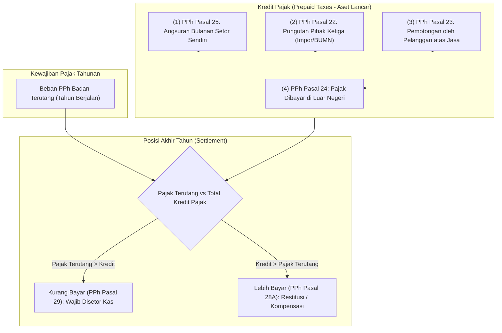

# Corporate Tax Installment and Prepayment

## Definisi

**Corporate Tax Installment and Prepayment (Angsuran dan Pembayaran Dimuka Pajak Badan)** adalah tata kelola di dalam ERP yang mengelola pelunasan kewajiban Pajak Penghasilan Badan dalam tahun berjalan melalui mekanisme angsuran berkala dan pemotongan oleh pihak ketiga (*Tax Credits / Prepaid Taxes*), serta penyelesaian posisi kurang bayar (*PPh Pasal 29*) atau lebih bayar (*PPh Pasal 28A*) pada akhir tahun pajak.

Mekanisme ini dirancang oleh otoritas perpajakan dengan prinsip **Pay As You Earn (PAYE)**: mencicil pembayaran pajak selama tahun berjalan sehingga korporasi tidak terbebani oleh pengeluaran kas yang masif sekaligus pada saat penutupan tahun buku.

---

## Tujuan Bisnis (Purpose)

Pengelolaan angsuran dan kredit pajak di dalam ERP bertujuan untuk:
1. **Perencanaan Arus Kas Fiskal (Tax Liquidity Planning):** Mengatur jadwal pengeluaran kas rutin untuk pembayaran angsuran bulanan PPh Pasal 25 agar tidak mengganggu likuiditas operasional perusahaan.
2. **Pengamanan dan Pengendalian Hak Kredit Pajak (Tax Asset Recovery):** Membantu memastikan seluruh pemotongan pajak yang dilakukan oleh pelanggan atau pungutan impor oleh otoritas kepabeanan tercatat rapi di neraca sebagai aset lancar yang sah.
3. **Penyelesaian Akhir Tahun yang Tepat Waktu (Statutory Settlement):** Memastikan pembayaran kekurangan pajak tahunan (PPh Pasal 29) dilakukan sebelum Surat Pemberitahuan (SPT) Tahunan disampaikan ke kantor pajak.
4. **Penetapan Basis Angsuran Masa Depan:** Menghitung estimasi besaran angsuran bulanan PPh Pasal 25 yang baru secara otomatis untuk tahun pajak yang akan datang.

---

## Arsitektur Angsuran dan Kredit Pajak Badan

Komponen kredit pengurang PPh Badan terdiri dari dua kategori utama:



---

## Mekanisme Angsuran Bulanan PPh Pasal 25

Berdasarkan ketentuan Pasal 25 Undang-Undang PPh, besarnya angsuran pajak dalam tahun berjalan yang harus dibayar sendiri oleh wajib pajak untuk setiap bulan dihitung dengan formula:

$$\text{Angsuran PPh 25 per Bulan} = \frac{\text{PPh Terutang SPT Tahun Lalu} - \text{Total Kredit Pajak (PPh 22 + 23 + 24)}}{\text{12 Bulan}}$$

### Aturan Khusus Masa Peralihan (Bulan Januari s.d. Maret)
Karena SPT Tahunan Badan baru disampaikan paling lambat tanggal 30 April tahun berikutnya:
- Besarnya angsuran PPh Pasal 25 untuk masa pajak sebelum SPT Tahunan disampaikan (masa Januari, Februari, dan Maret) adalah **sama dengan besarnya angsuran PPh Pasal 25 masa pajak Desember tahun sebelumnya**.
- Setelah SPT Tahunan baru disampaikan (misalnya pada akhir April), besaran angsuran baru mulai berlaku efektif untuk masa pajak April dan seterusnya.

---

## Business Rules Angsuran dan Kredit Pajak

1. **Strict Due Date Rule (Jatuh Tempo PPh 25):**
   Angsuran bulanan PPh Pasal 25 wajib disetorkan ke kas negara paling lambat **tanggal 15 bulan berikutnya** setelah berakhirnya masa pajak. Keterlambatan pembayaran memicu timbulnya sanksi bunga per bulan sesuai tarif bunga acuan menteri keuangan.
2. **Credit Verification & Substantiation Rule:**
   Saldo akun Uang Muka PPh Pasal 22 dan 23 hanya boleh diperhitungkan sebagai pengurang pajak terutang jika didukung oleh dokumen resmi yang tervalidasi:
   - PPh Pasal 22 Impor: Didukung dokumen Pemberitahuan Impor Barang (PIB) dan bukti setor SSP/e-Billing yang valid.
   - PPh Pasal 23: Didukung Bukti Pemotongan Pajak Elektronik (e-Bupot Unifikasi) yang diterbitkan oleh pelanggan.
3. **Settlement Before Filing Rule (PPh 29):**
   Apabila terdapat kekurangan pembayaran pajak (PPh Pasal 29), wajib pajak wajib melunasi kekurangan tersebut ke kas negara **sebelum SPT Tahunan PPh Badan disampaikan**, dan nomor transaksi penerimaan negara (NTPN) wajib dilampirkan dalam induk formulir SPT 1771.
4. **Overpayment Audit Risk Rule (PPh 28A):**
   Jika total kredit pajak melampaui pajak terutang (menghasilkan posisi Lebih Bayar / PPh 28A), sistem ERP harus memberikan peringatan kepada manajemen (*Tax Risk Alert*) bahwa permohonan pengembalian kelebihan pajak (restitusi) secara otomatis memicu prosedur pemeriksaan pajak menyeluruh (*all-taxes audit*) oleh kantor pajak.

---

## Dampak Akuntansi (Accounting Impact)

Akuntansi ERP mengelola arus pencatatan kredit pajak dan penyelesaian akhir tahun:

### 1. Pembayaran Angsuran Bulanan PPh Pasal 25
Setiap bulan saat pembayaran angsuran dilakukan:
```text
(Db) Uang Muka PPh Pasal 25 (Aset Lancar)          [Nilai Angsuran]
    (Cr) Kas dan Bank                                            [Nilai Angsuran]
```

### 2. Penjurnalan Kliring Akhir Tahun (Annual Tax Settlement)
Pada akhir tahun buku, saldo beban pajak dipertemukan dengan seluruh akun uang muka pajak:
```text
(Db) Beban Pajak Penghasilan Kini (Laba Rugi)     Rp23.100.000
    (Cr) Uang Muka PPh Pasal 25 (Aset Lancar)                    Rp 5.000.000
    (Cr) Uang Muka PPh Pasal 23 (Aset Lancar)                    Rp 2.000.000
    (Cr) Utang PPh Pasal 29 (Liabilitas Lancar)                  Rp16.100.000
```

### 3. Pelunasan Utang PPh Pasal 29 ke Kas Negara
Sebelum penyampaian SPT Tahunan pada bulan April via sistem billing / kas negara:
```text
(Db) Utang PPh Pasal 29                           Rp16.100.000
    (Cr) Kas dan Bank (Bank Operasional)                         Rp16.100.000
```

---

## Skenario Kanonikal: PT Maju Bersama

Melanjutkan data kanonikal tahunan `PT Maju Bersama`:
* **Pajak Penghasilan Badan Terutang (Tarif Baku 22%):** Rp23.100.000 (22% x PKP Rp105.000.000).

### 1. Rekapitulasi Kredit Pajak Berjalan yang Dicatat Sistem:
1. **Angsuran PPh Pasal 25:** Telah disetorkan selama tahun berjalan sebesar **Rp5.000.000** (akumulasi saldo akun Aset Lancar `115200 - Uang Muka PPh 25`).
2. **Pemotongan PPh Pasal 23 oleh Klien:** Terkumpul dari jasa konsultasi yang dipotong oleh pelanggan sebesar **Rp2.000.000** (didukung bukti pemotongan resmi pada akun Aset Lancar `115300 - Uang Muka PPh 23`).
* **Total Kredit Pajak Terkumpul:** Rp5.000.000 + Rp2.000.000 = **Rp7.000.000**.

### 2. Perhitungan Posisi Kurang Bayar (PPh Pasal 29):
$$\text{PPh Badan Terutang Bruto} = \text{Rp23.100.000}$$
$$\text{Total Kredit Pajak (PPh 25 + PPh 23)} = (\text{Rp7.000.000})$$
$$\mathbf{\text{PPh Pasal 29 (Kurang Bayar Akhir Tahun)}} = \mathbf{\text{Rp16.100.000}}$$

### 3. Perhitungan Angsuran PPh Pasal 25 untuk Tahun Berikutnya:
Berdasarkan data SPT Tahunan yang diselesaikan:
- PPh Terutang: Rp23.100.000
- Dikurangi Kredit PPh 23 (yang diperkirakan berulang): Rp2.000.000
- Dasar Penghitungan Angsuran: Rp21.100.000
- **Angsuran Baru PPh 25 per Bulan:** $\frac{\text{Rp21.100.000}}{12} = \mathbf{\text{Rp1.758.333}}$ per bulan.
*(Mulai dibayarkan untuk Masa Pajak April tahun berikutnya)*.

---

## Implementasi ERP Universal

Dalam modul Tax Management ERP modern, tata kelola angsuran mencakup:
1. **Recurring Tax Schedule Engine:** Jadwal pembayaran berulang otomatis pada modul Treasury/Finance yang membuat voucher pembayaran angsuran PPh 25 setiap tanggal 10 tiap bulan lengkap dengan referensi Kode Billing DJP.
2. **Tax Credit Verification Ledger:** Lembar kerja audit yang mencocokkan setiap baris transaksi uang muka pajak dengan nomor dokumen bukti potong eksternal.
3. **Automated Article 25 Forecaster:** Kalkulator proyeksi yang menghitung perubahan nilai angsuran bulanan secara instan saat simulasi draf SPT Tahunan dievaluasi.

---

## Perbandingan Software ERP

| Dimensi Fitur | Odoo (v16 - v18) | ERPNext (v14 - v15) | Microsoft Dynamics 365 F&O |
|---|---|---|---|
| **Pengelolaan Angsuran Berkala** | Dikelola melalui *Recurring Invoices / Recurring Payments* pada modul Akuntansi. | Dikelola melalui *Subscription* atau pembuatan berkas pembayaran berulang (*Payment Entry*). | Memiliki fitur *Periodic Tax Settlement* dan jadwal pembayaran pajak terencana (*Tax Payment Schedules*). |
| **Penyelesaian Kredit Pajak Akhir Tahun** | Menggunakan entri jurnal penutup manual (*Year-End Miscellaneous Journal Entry*). | Dikelola melalui pembuatan *Journal Entry* pembalik antar akun aset dan beban pajak. | Memiliki alur kerja *Tax Settlement Posting* yang mengeliminasi akun uang muka ke akun kewajiban akhir. |
| **Kalkulasi Angsuran Tahun Berikutnya** | Dihitung secara eksternal pada kertas kerja spreadsheet. | Memerlukan laporan skrip kustom untuk menghitung estimasi angsuran tahun berikutnya. | Memiliki fitur *Tax Estimation & Installment Calculation* pada modul perencanaan pajak korporasi. |

---

## Pertimbangan Desain Naventra (Naventra Consideration)

Pada rancangan sistem ERP Naventra, pengelolaan angsuran dan kredit pajak badan dikembangkan dengan mekanisme berikut:

1. **Automated Payment Voucher Generation:**
   Setiap tanggal 5 setiap bulan, Naventra secara otomatis membuat draf *Payment Voucher* untuk angsuran PPh Pasal 25 yang menampilkan nominal angsuran aktif, siap disetujui oleh manajer keuangan sebelum batas waktu tanggal 15.
2. **Automatic Baseline Switching (April Transition):**
   Naventra secara otomatis menerapkan besaran angsuran baru pada modul pembayaran rutin segera setelah draf SPT Tahunan berstatus `FINAL_APPROVED`, menggantikan baseline masa Desember tahun lalu secara mulus.
3. **Tax Credit Matching Lock:**
   Sistem mengunci (*lock*) catatan Uang Muka PPh yang telah dipasangkan dengan laporan SPT Tahunan, mencegah pembatalan transaksi masa lampau yang dapat merusak saldo kredit pajak yang telah dilaporkan.

---

## Referensi

* Undang-Undang Republik Indonesia No. 36 Tahun 2008 tentang Pajak Penghasilan beserta perubahannya pada UU No. 7 Tahun 2021 (UU Harmonisasi Peraturan Perpajakan).
* Peraturan Direktur Jenderal Pajak No. PER-19/PJ/2014 tentang Tata Cara Pembayaran dan Penyetoran Pajak.
* Surat Edaran Direktur Jenderal Pajak No. SE-05/PJ/2019 tentang Tata Cara Penanganan Wajib Pajak Lebih Bayar.
* Microsoft Learn: *Sales and Income Tax Prepayments and Withholdings in Dynamics 365 Finance*.
* Frappe / ERPNext Documentation: *Advance Tax Payments and Tax Asset Management*.
* Odoo Accounting User Guide: *Managing Advance Payments and Periodic Tax Obligations*.
