# Tax Management

Selamat datang di modul pembelajaran **Tax Management (Manajemen Perpajakan)** dalam knowledge base `erp-notes`.

Modul ini membahas arsitektur domain tata kelola perpajakan di dalam Enterprise Resource Planning (ERP) secara menyeluruh, mendalam, universal, dan *vendor-agnostic*.

Jika aplikasi perpajakan mandiri (*standalone tax compliance tools* atau aplikasi e-SPT/e-Faktur desktop) umumnya hanya bertindak sebagai pengisi formulir pelaporan statis di hilir, maka **Tax Management dalam ERP beroperasi sebagai lapisan kepatuhan regulasi terdistribusi (*distributed regulatory compliance layer*)**:
1. Menentukan status keterpajakan subjek, objek, dan peristiwa bisnis secara otomatis di titik transaksi operasional (Sales, Purchasing, Inventory, Manufacturing, Fixed Assets, Project, HR & Payroll).
2. Memisahkan nilai pajak terutang dan hak kredit pajak dari pendapatan atau beban komersial secara otomatis ke dalam buku besar akuntansi (*General Ledger*).
3. Mengelola siklus kepatuhan formal mencakup penerbitan Faktur Pajak elektronik (e-Faktur), Bukti Potong Elektronik Unifikasi (e-Bupot), pengujian ekualisasi mandiri, rekonsiliasi tiga arah, hingga penyusunan Surat Pemberitahuan (SPT) Masa dan Tahunan.

---

## Arsitektur Siklus Hidup Perpajakan ERP (Tax Lifecycle)

Tata kelola perpajakan di dalam ERP diorganisasikan ke dalam lima tahapan pembelajaran terpadu:

```mermaid
flowchart TD
    subgraph S1["Tahap 1: Fondasi & Mesin Kalkulasi Pajak"]
        N1["(1) [[11-tax/tax-management-fundamentals|Tax Management Fundamentals]]"]
        N2["(2) [[11-tax/tax-master-data-and-tax-code|Tax Master Data & Tax Code]]"]
        N3["(3) [[11-tax/tax-determination-and-tax-rules|Tax Determination & Tax Rules]]"]
        N4["(4) [[11-tax/taxable-base-and-tax-calculation|Taxable Base & Tax Calculation]]"]
    end

    subgraph S2["Tahap 2: Pajak Pertambahan Nilai (PPN / VAT)"]
        N5["(5) [[11-tax/vat-fundamentals|VAT Fundamentals]]"]
        N6["(6) [[11-tax/input-vat-and-output-vat|Input VAT & Output VAT]]"]
        N7["(7) [[11-tax/vat-transaction-and-tax-invoice|VAT Transaction & Tax Invoice (e-Faktur)]]"]
        N8["(8) [[11-tax/vat-return-and-reconciliation|VAT Return & Reconciliation (SPT Masa)]]"]
    end

    subgraph S3["Tahap 3: Pemotongan Pajak & PPh Badan"]
        N9["(9) [[11-tax/withholding-tax-management|Withholding Tax Management (e-Bupot)]]"]
        N10["(10) [[11-tax/corporate-income-tax-fundamentals|Corporate Income Tax Fundamentals]]"]
        N11["(11) [[11-tax/taxable-income-and-fiscal-reconciliation|Taxable Income & Fiscal Reconciliation]]"]
        N12["(12) [[11-tax/corporate-income-tax-calculation|Corporate Income Tax Calculation (Pasal 31E)]]"]
    end

    subgraph S4["Tahap 4: Angsuran, Pembayaran & Penutupan"]
        N13["(13) [[11-tax/corporate-tax-installment-and-prepayment|Tax Installments & Prepayments (PPh 25/29)]]"]
        N14["(14) [[11-tax/tax-payment-and-tax-return|Tax Payment & Tax Return (Billing/NTPN/BPE)]]"]
        N15["(15) [[11-tax/tax-closing-and-period-end|Tax Closing & Period-End Procedures]]"]
    end

    subgraph S5["Tahap 5: Pengendalian, Analitika & Integrasi"]
        N16["(16) [[11-tax/tax-reporting-and-tax-analytics|Tax Reporting, Equalization & Analytics]]"]
        N17["(17) [[11-tax/tax-controls-audit-and-compliance|Tax Controls, Audit & Compliance (SP2DK)]]"]
        N18["(18) [[11-tax/tax-integration|Cross-Module Tax Integration]]"]
    end

    S1 --> S2 --> S3 --> S4 --> S5
```

---

## Direktori Dokumen Pembelajaran (Canonical Notes)

Berikut adalah daftar 18 dokumen kanonikal yang menyusun kurikulum menyeluruh modul Tax Management:

### Tahap 1: Fondasi & Mesin Kalkulasi Pajak
1. **[[11-tax/tax-management-fundamentals|Tax Management Fundamentals]]**: Konsep dasar perpajakan dalam ERP, siklus hidup pajak, perbedaan domain Tax vs Accounting vs Finance vs HR, struktur entitas inti, dan perkenalan skenario kanonikal `PT Maju Bersama`.
2. **[[11-tax/tax-master-data-and-tax-code|Tax Master Data and Tax Code]]**: Struktur data master Wajib Pajak, yurisdiksi, jenis pajak, kategori pajak, anatomi Tax Code, jadwal tarif (*effective dating*), dan pemetaan akun buku besar.
3. **[[11-tax/tax-determination-and-tax-rules|Tax Determination and Tax Rules]]**: Mesin aturan penentu pajak otomatis berbasis multi-atribut (pihak rekanan, sifat barang/jasa, yurisdiksi logistik, jenis transaksi, dan tanggal terutang), skema pemungut WAPU, serta kawasan fasilitas khusus.
4. **[[11-tax/taxable-base-and-tax-calculation|Taxable Base and Tax Calculation]]**: Mekanisme perhitungan Dasar Pengenaan Pajak (DPP), perlakuan diskon komersial (*trade discount*) vs potongan tunai, skema inklusif vs eksklusif, pembulatan, dan konversi kurs pajak resmi (Kurs KMK).

### Tahap 2: Pajak Pertambahan Nilai (PPN / VAT)
5. **[[11-tax/vat-fundamentals|VAT Fundamentals]]**: Prinsip pemungutan PPN multi-tahap, metode pengkreditan (*invoice credit method*), Pengusaha Kena Pajak (PKP), Barang/Jasa Kena Pajak, tempat penyerahan, dan aturan saat terutang pajak (*tax point*).
6. **[[11-tax/input-vat-and-output-vat|Input VAT and Output VAT]]**: Pemisahan PPN Masukan dan Keluaran, kriteria PPN masukan yang dapat dikreditkan vs tidak dapat dikreditkan (Pasal 9 ayat 8 UU PPN), fleksibilitas pengkreditan hingga 3 bulan, dan kapitalisasi biaya.
7. **[[11-tax/vat-transaction-and-tax-invoice|VAT Transaction and Tax Invoice]]**: Tata kelola Faktur Pajak Elektronik (e-Tax Invoice) terpusat via Coretax DJP, kode transaksi faktur (01 s.d. 09), alur Faktur Pengganti, Faktur Batal, serta konteks historis NSFP / e-Nofa.
8. **[[11-tax/vat-return-and-reconciliation|VAT Return and Reconciliation]]**: Metodologi Rekonsiliasi Tiga Arah (Subledger Penjualan/Pembelian vs Buku Besar Akun Pajak vs Data Faktur DJP/Coretax), penyelesaian selisih (*exception workbench*), jurnal kliring PPN bulanan, dan pelaporan SPT Masa PPN.

### Tahap 3: Pemotongan Pajak & PPh Badan
9. **[[11-tax/withholding-tax-management|Withholding Tax Management]]**: Mekanisme pemotongan PPh Pasal 23, PPh 26 (Tax Treaty/Form DGT), PPh Final 4 ayat (2), PPh 22, formula gross-up, dan penerbitan bukti pemotongan elektronik unifikasi (e-Bupot).
10. **[[11-tax/corporate-income-tax-fundamentals|Corporate Income Tax Fundamentals]]**: Fondasi Pajak Penghasilan Badan, dualisme akuntansi komersial vs akuntansi pajak (*book-tax differences*), perbedaan tetap (*permanent*) vs perbedaan waktu (*temporary*), serta konsep pajak kini dan tangguhan (IAS 12 / PSAK 46).
11. **[[11-tax/taxable-income-and-fiscal-reconciliation|Taxable Income and Fiscal Reconciliation]]**: Metodologi koreksi fiskal positif (biaya non-3M, natura non-deductible PMK 66/2023, sanksi denda, jamuan tanpa daftar nominatif) dan koreksi negatif (penghasilan final/non-objek) untuk menetapkan Penghasilan Kena Pajak (PKP) pada Formulir 1771-I.
12. **[[11-tax/corporate-income-tax-calculation|Corporate Income Tax Calculation]]**: Penerapan tarif PPh Badan standar 22% (Pasal 17 UU HPP) dan skema fasilitas pengurangan tarif 50% bagi wajib pajak dengan peredaran bruto tertentu (Pasal 31E UU PPh), serta aturan pembulatan ribuan penuh.

### Tahap 4: Angsuran, Pembayaran & Penutupan
13. **[[11-tax/corporate-tax-installment-and-prepayment|Corporate Tax Installment and Prepayment]]**: Pengelolaan angsuran bulanan PPh Pasal 25, pengkreditan pemotongan pihak ketiga (PPh 22 & PPh 23), penyelesaian posisi kurang bayar akhir tahun (PPh Pasal 29) atau lebih bayar (PPh Pasal 28A), dan perhitungan angsuran tahun berikutnya.
14. **[[11-tax/tax-payment-and-tax-return|Tax Payment and Tax Return]]**: Alur pembayaran pajak melalui Kode Akun Pajak (KAP), Kode Jenis Setoran (KJS), pembuatan Kode Billing e-Billing DJP, validasi Nomor Transaksi Penerimaan Negara (NTPN), serta penarikan Bukti Penerimaan Elektronik (BPE).
15. **[[11-tax/tax-closing-and-period-end|Tax Closing and Period-End]]**: Daftar periksa penutupan bulanan dan tahunan (*Monthly & Annual Close Checklist*), penegakan pisah batas (*cut-off*), penguncian periode pajak (*Tax Period Lock*), dan protokol penanganan SPT Pembetulan.

### Tahap 5: Pengendalian, Analitika & Integrasi
16. **[[11-tax/tax-reporting-and-tax-analytics|Tax Reporting and Tax Analytics]]**: Hierarki laporan statuter dan operasional, pengujian ekualisasi mandiri (Peredaran Usaha vs PPN Keluaran, Beban Jasa vs PPh 23), analitika Tarif Pajak Efektif (ETR), dan pemantauan umur kredit pajak.
17. **[[11-tax/tax-controls-audit-and-compliance|Tax Controls, Audit, and Compliance]]**: Kerangka pengendalian internal tiga lapis (pencegahan, pendeteksian, pemulihan), matriks pemisahan tugas (SoD), kesiapan menghadapi SP2DK dan pemeriksaan pajak, serta keamanan sertifikat elektronik.
18. **[[11-tax/tax-integration|Tax Integration]]**: Sintesis arsitektur integrasi lintas modul ERP (Sales, Purchasing, Inventory, Manufacturing, Finance, Assets, Project, HR), matriks titik sentuh data, dan diagram alur terpadu.

---

## Ringkasan Skenario Kanonikal: PT Maju Bersama

Seluruh contoh numerik di dalam modul ini dirancang secara terpadu dan saling terhubung menggunakan skenario kanonikal `PT Maju Bersama`:

* **Profil Entitas:** Pengusaha Kena Pajak (PKP) terdaftar di Indonesia, mata uang pembukuan IDR.
* **Catatan Tarif PPN:** Tarif 11% yang dicantumkan pada transaksi berikut merupakan **asumsi pembelajaran ilustratif** (merujuk pada periode implementasi UU HPP No. 7 Tahun 2021). Mesin pajak ERP modern mengelola perubahan tarif statuter (seperti penyesuaian ke 12%) secara dinamis berbasis tanggal terutang (*effective dating*).
* **Transaksi Pengadaan (Purchasing / P2P):**
  - Pemasok: `PT Sumber Teknologi` (PKP).
  - Pembelian: Laptop Pro 10 unit @ Rp700.000 = DPP Rp7.000.000.
  - PPN Masukan (11% ilustratif): Rp770.000 (Dapat dikreditkan).
  - Total Tagihan AP: Rp7.770.000.
* **Transaksi Penjualan (Sales / O2C):**
  - Pelanggan: Klien Korporasi (PKP).
  - Penjualan: Laptop Pro 10 unit @ Rp1.000.000 = DPP Rp10.000.000.
  - PPN Keluaran (11% ilustratif): Rp1.100.000 (Faktur Pajak Normal No: `DUMMY-FP-001` -- identifikasi fiktif untuk ilustrasi pembelajaran).
  - Total Tagihan AR: Rp11.100.000.
* **Transaksi Jasa Vendor (Withholding Tax):**
  - Rekanan: `PT Solusi Servis` (NPWP valid).
  - Jasa Pemeliharaan Server: DPP Rp10.000.000.
  - PPN Masukan: Rp1.100.000.
  - Pemotongan PPh Pasal 23 (2%): Rp200.000 (Terbit Bukti Pemotongan Unifikasi `DUMMY-BUPOT-001` -- identifikasi fiktif).
  - Pembayaran Bersih Kas ke Vendor: Rp10.900.000.
* **Posisi PPN Bulanan (Monthly VAT Settlement):**
  - PPN Keluaran Terutang: Rp1.100.000.
  - PPN Masukan Dikreditkan: (Rp770.000).
  - **PPN Kurang Bayar yang Disetor:** **Rp330.000** (Disetor via Bank Operasional, NTPN: `DUMMY-NTPN-001`, BPE: `DUMMY-BPE-PPN-001`). Identifikasi bersifat fiktif untuk ilustrasi pembelajaran.
* **Rekonsiliasi Fiskal & PPh Badan Tahunan:**
  - Laba Bersih Komersial Sebelum Pajak (EBT): Rp100.000.000.
  - Koreksi Fiskal Positif: +Rp10.000.000 (Denda pajak Rp2.000.000 + Jamuan tanpa nominatif Rp3.000.000 + Natura non-deductible Rp5.000.000).
  - Koreksi Fiskal Negatif: (Rp5.000.000) (Bunga deposito telah dikenai PPh Final).
  - **Penghasilan Kena Pajak (PKP Fiskal):** **Rp105.000.000**.
  - Beban PPh Badan Terutang (Tarif Baku 22% x PKP): **Rp23.100.000**.
  - Kredit Pajak Terkumpul: Rp7.000.000 (Angsuran PPh 25 Rp5.000.000 + Kredit PPh 23 Pelanggan Rp2.000.000).
  - **PPh Pasal 29 Kurang Bayar Akhir Tahun:** **Rp16.100.000** (Disetor via Bank Operasional, NTPN: `DUMMY-NTPN-002`, BPE: `DUMMY-BPE-1771-001`). Identifikasi bersifat fiktif untuk ilustrasi pembelajaran.
  - Basis Angsuran PPh 25 Tahun Berikutnya: (Rp23.100.000 - Rp2.000.000) / 12 = Rp1.758.333 per bulan.
  - **ETR (Baseline Tarif Standar):** Rp23.100.000 / Rp100.000.000 = **23,1%**.
