# Input VAT and Output VAT

## Definisi

**Input VAT and Output VAT (PPN Masukan dan PPN Keluaran)** adalah dua klasifikasi operasional utama dalam mekanisme Pajak Pertambahan Nilai di dalam sistem ERP yang memisahkan pajak yang dibayar atas perolehan barang/jasa dari pajak yang dipungut atas penyerahan barang/jasa:

1. **Output VAT (Pajak Keluaran / PPN Keluaran):** PPN yang dipungut oleh Pengusaha Kena Pajak (PKP) ketika menyerahkan Barang Kena Pajak (BKP), Jasa Kena Pajak (JKP), atau melakukan ekspor BKP/JKP. Dalam neraca keuangan, PPN Keluaran merupakan kewajiban lancar (*Current Liabilities*) kepada kas negara.
2. **Input VAT (Pajak Masukan / PPN Masukan):** PPN yang dibayarkan oleh PKP atas perolehan BKP, penerimaan JKP, impor BKP, atau pemanfaatan BKP Tidak Berwujud/JKP dari luar daerah pabean. Dalam neraca keuangan, PPN Masukan yang memenuhi syarat hukum diakui sebagai aset lancar (*Current Assets - Prepaid Taxes*) yang menjadi hak kredit pengurang PPN Keluaran.

---

## Tujuan Bisnis (Purpose)

Pengelolaan terpisah antara PPN Masukan dan PPN Keluaran bertujuan untuk:
1. **Mendukung Pengkreditan Pajak yang Sah (Tax Credit Optimization):** Membantu memastikan seluruh PPN Masukan yang memenuhi kriteria substantif dan formal dapat diidentifikasi dan dikreditkan untuk mengurangi arus kas keluar saat penyetoran pajak bulanan.
2. **Kepatuhan Terhadap Larangan Pengkreditan (Deductibility Compliance):** Mengidentifikasi transaksi perolehan yang secara hukum dilarang untuk dikreditkan (misalnya biaya non-operasional atau perolehan sedan dinas) agar langsung dibukukan sebagai beban/kapitalisasi, sehingga meminimalkan risiko koreksi saat pengawasan atau pemeriksaan pajak.
3. **Fleksibilitas Manajemen Masa Pengkreditan (Timing Flexibility):** Memanfaatkan aturan penundaan pengkreditan PPN Masukan hingga batas waktu yang diizinkan undang-undang guna mengoptimalkan perencanaan arus kas (*cash flow planning*).
4. **Rekonsiliasi Faktur Elektronik Terintegrasi:** Memfasilitasi pencocokan otomatis antara data tagihan pemasok di modul Purchasing dengan data prapopulasi Faktur Masukan dari sistem Coretax DJP (atau alur e-Faktur).

---

## Alur Hidup PPN Keluaran vs PPN Masukan

```mermaid
flowchart TD
    subgraph SalesTrack["Alur PPN Keluaran (Sales / O2C)"]
        S1["Sales Order / Delivery Order Selesai"] --> S2["Penerbitan Commercial Invoice"]
        S2 --> S3["Generate Data Faktur Pajak Keluaran"]
        S3 --> S4["Submit ke Portal / API Coretax DJP"]
        S4 --> S5["Approval Coretax (Nomor Faktur Otomatis)"]
        S5 --> S6["Kirim Dokumen Faktur Pajak Resmi ke Pelanggan"]
    end

    subgraph PurchaseTrack["Alur PPN Masukan (Purchasing / P2P)"]
        P1["Penerimaan Barang / Jasa (Goods Receipt)"] --> P2["Penerimaan Tagihan Vendor (Vendor Bill)"]
        P2 --> P3["Penerimaan Faktur Pajak (Prapopulasi Coretax / Scan QR)"]
        P3 --> P4{"Evaluasi Kriteria Pengkreditan (Pasal 9 ayat 8 UU PPN)"}
        P4 -- "Memenuhi Syarat (Creditable)" --> P5["Buku ke Akun PPN Masukan (Aset Lancar)"]
        P4 -- "Tidak Memenuhi Syarat (Non-Creditable)" --> P6["Buku ke Beban Pajak / Kapitalisasi Biaya Aset"]
        P5 --> P7{"Tentukan Masa Pajak Pengkreditan (Masa Sama vs s.d. +3 Bulan)"}
        P7 --> P8["Masuk ke SPT Masa PPN di Coretax (Historis: Formulir B2)"]
    end
```



---

## Kriteria PPN Masukan Dapat Dikreditkan vs Tidak Dapat Dikreditkan

Berdasarkan ketentuan Pasal 9 ayat (8) Undang-Undang PPN (sebagaimana telah diselaraskan dalam UU Harmonisasi Peraturan Perpajakan No. 7 Tahun 2021), sistem ERP harus membedakan perlakuan PPN Masukan:

| Kategori | Dapat Dikreditkan (*Creditable*) | Tidak Dapat Dikreditkan (*Non-Creditable*) |
|---|---|---|
| **Hubungan dengan Kegiatan Usaha** | Terkait langsung dengan kegiatan menghasilkan, memelihara, dan menagih pendapatan (3M: Operasional, Pabrikasi, Distribusi). | Tidak terkait langsung dengan kegiatan usaha (misalnya pengeluaran pribadi pemegang saham/manajemen). |
| **Karakteristik Aset Khusus** | Perolehan truk pengangkut barang, van operasional logistik, alat berat pabrik. | Perolehan dan pemeliharaan kendaraan sedan dan station wagon (kecuali sebagai barang dagangan atau disewakan). |
| **Validitas Dokumen Formal** | Memiliki Faktur Pajak lengkap dengan identitas pembeli (NPWP/NIK) dan berstatus *Approval Sukses*. | Faktur cacat, tanpa identitas pembeli yang sah, atau tidak diunggah ke portal DJP. |
| **Status Sebelum Pengukuhan** | Perolehan BKP/JKP sebelum entitas dikukuhkan sebagai PKP (kecuali menggunakan skema pedoman pengkreditan khusus). | Umumnya tidak dapat dikreditkan melalui mekanisme faktur pajak standar. |
| **Perlakuan Akuntansi di ERP** | Dicatat pada akun neraca: `PPN Masukan Dibayar di Muka` (Aset Lancar). | Dikapitalisasi ke nilai perolehan persediaan/aktiva tetap, atau dicatat sebagai beban operasional di Laba Rugi. |

---

## Aturan Batas Waktu Pengkreditan 3 Bulan (3-Month Rule)

Sesuai regulasi perpajakan Indonesia (Pasal 9 ayat 9 UU PPN), PPN Masukan yang belum dikreditkan pada masa pajak saat faktur dibuat, dapat dikreditkan pada masa pajak berikutnya:
- **Batas Waktu:** Paling lambat 3 (tiga) bulan setelah berakhirnya masa pajak saat Faktur Pajak dibuat.
- **Syarat:** Belum dibebankan sebagai biaya dalam laporan komersial/SPT Tahunan dan belum dilakukan pemeriksaan oleh otoritas pajak.

*Contoh Fungsional ERP:*
Faktur Pajak Masukan tertanggal 15 Januari:
- Masa Pajak Normal: Masa Januari.
- Pilihan Masa Pajak Alternatif: Masa Februari, Masa Maret, atau paling lambat Masa April.
- Pengguna di modul Tax dapat memilih periode pengkreditan (*Tax Period Assignment*) secara fleksibel tanpa mengubah tanggal pembukuan akuntansi komersial.

---

## Dampak Akuntansi (Accounting Impact)

Perbedaan status keterkreditan PPN Masukan menghasilkan pola pencatatan jurnal yang berbeda di modul General Ledger:

### Kasus 1: PPN Masukan Dapat Dikreditkan (Creditable)
Membeli perlengkapan pabrik Rp10.000.000 + PPN 11% (asumsi pembelajaran ilustratif):
```text
(Db) Persediaan Perlengkapan Pabrik               Rp10.000.000
(Db) PPN Masukan (Prepaid Tax - Aset Lancar)      Rp 1.100.000
    (Cr) Utang Usaha (AP)                                        Rp11.100.000
```

### Kasus 2: PPN Masukan Tidak Dapat Dikreditkan (Dikapitalisasi ke Aset)
Membeli kendaraan sedan operasional direksi Rp300.000.000 + PPN 11% (asumsi pembelajaran ilustratif):
```text
(Db) Aset Tetap - Kendaraan Sedan                 Rp333.000.000
    (Cr) Utang Usaha / Kas Bank                                  Rp333.000.000
```
*(Nilai PPN Rp33.000.000 dikapitalisasi ke harga perolehan aset tetap dan disusutkan selama masa manfaat fiskal aset)*.

### Kasus 3: PPN Masukan Tidak Dapat Dikreditkan (Dibebankan ke Biaya)
Biaya jamuan makan tamu tanpa daftar nominatif Rp2.000.000 + PPN 11%:
```text
(Db) Beban Jamuan Makan (Operasional)             Rp 2.000.000
(Db) Beban Pajak Non-Kreditabel (Laba Rugi)       Rp   220.000
    (Cr) Utang Usaha / Kas Bank                                  Rp 2.220.000
```

---

## Skenario Kanonikal: PT Maju Bersama

Melanjutkan data transaksi `PT Maju Bersama`:
* **Tarif PPN yang digunakan:** 11% (asumsi pembelajaran ilustratif. Mengacu pada UU HPP jo PMK 131/2024 dan PMK 11/2025, tarif statutory 12% dipadukan dengan formula DPP Nilai Lain 11/12 untuk BKP/JKP non-mewah menghasilkan beban pajak efektif 11%).

### 1. Transaksi PPN Masukan (Creditable)
* Pemasok: `PT Sumber Teknologi` (PKP terdaftar).
* Item: Laptop Pro 10 unit @ Rp700.000.
* DPP: Rp7.000.000.
* PPN Masukan: Rp770.000 (Tax Code: `PPN-IN-11`, status: *Creditable*, beban efektif 11% ilustratif).
* Nilai Tagihan AP: Rp7.770.000.

Pencatatan di ERP:
```text
(Db) Persediaan Laptop Pro                 Rp7.000.000
(Db) PPN Masukan (Aset Lancar)             Rp  770.000
    (Cr) Utang Usaha - PT Sumber Teknologi               Rp7.770.000
```

### 2. Transaksi PPN Keluaran
* Klien: Klien Korporasi (PKP terdaftar).
* Item: Laptop Pro 10 unit @ Rp1.000.000.
* DPP: Rp10.000.000.
* PPN Keluaran: Rp1.100.000 (Tax Code: `PPN-OUT-11`, beban efektif 11% ilustratif).
* Nilai Tagihan AR: Rp11.100.000.

Pencatatan di ERP:
```text
(Db) Piutang Usaha - Klien                 Rp11.100.000
    (Cr) Pendapatan Penjualan Laptop Pro                 Rp10.000.000
    (Cr) PPN Keluaran (Liabilitas Lancar)                Rp 1.100.000
```

### 3. Eksekusi Pengkreditan Antar-Masa (3-Month Flexibility)
Misalkan tagihan dari `PT Sumber Teknologi` tertanggal 28 Januari baru diterima berkas fisiknya oleh departemen pajak pada 5 Maret.
- Status di ERP: Tanggal pembukuan AP tetap 28 Januari.
- Penugasan Masa Pajak PPN Masukan: Diarahkan ke **Masa Pajak Maret** (masih dalam koridor 3 bulan).
- Pada pelaporan SPT Masa PPN Januari: PPN Keluaran Rp1.100.000 disetor penuh.
- Pada pelaporan SPT Masa PPN Maret: PPN Masukan Rp770.000 dikreditkan untuk mengurangi PPN Keluaran masa Maret.

---

## Implementasi ERP Universal

Dalam modul Tax Management ERP modern, sistem menyediakan antarmuka khusus pengelolaan faktur:
1. **Tax Invoice Verification Workbench:** Layanan verifikasi yang memvalidasi berkas faktur masukan rekanan menggunakan sinkronisasi data prapopulasi portal/API Coretax DJP atau pemindaian QR code guna memastikan faktur masukan valid dan belum pernah diunggah sebelumnya (*anti-duplicate check*).
2. **Flexible Tax Period Allocator:** Fitur pemilihan masa pajak pelaporan (*Filing Period Selector*) pada level baris dokumen tagihan vendor, memisahkan antara *Posting Date* akuntansi dengan *VAT Filing Period*.
3. **Non-Deductible Auto-Routing:** Aturan konfigurasi yang secara otomatis mengalihkan nilai PPN ke akun beban pajak non-kreditabel apabila kategori barang pada baris pembelian ditandai sebagai pengeluaran non-bisnis.

---

## Perbandingan Software ERP

| Dimensi Fitur | Odoo (v16 - v18) | ERPNext (v14 - v15) | Microsoft Dynamics 365 F&O |
|---|---|---|---|
| **Pemisahan Akun Masukan/Keluaran** | Dikonfigurasi dalam tab *Definition* pada masing-masing akun pajak (*Tax In / Tax Out*). | Menggunakan akun GL berbeda pada template *Purchase Taxes* dan *Sales Taxes*. | Menggunakan grup posting terpisah (*Sales Tax Receivable* vs *Sales Tax Payable*). |
| **Penanganan PPN Non-Kreditabel** | Menggunakan konfigurasi *Tax Grids* atau memetakan akun beban pada baris pajak bersangkutan. | Mengatur akun tujuan pajak langsung ke akun beban pada *Purchase Taxes and Charges Template*. | Memiliki parameter bawaan *Non-deductible %* yang otomatis mengkapitalisasi atau membiayakan pajak. |
| **Alokasi Masa Pengkreditan Fleksibel** | Memerlukan pengaturan modul lokalisasi atau penyesuaian manual pada *Tax Report*. | Memerlukan pemilihan tanggal atau penyesuaian periode pelaporan secara terpisah. | Mendukung field *Tax Period* independen dari *Voucher Posting Date* pada transaksi vendor. |
| **Dukungan Verifikasi e-Tax Invoice** | Modul lokalisasi pihak ketiga mendukung pemindaian URL QR dan sinkronisasi data faktur masukan. | Dapat diintegrasikan menggunakan skrip server Frappe atau aplikasi integrasi pihak ketiga. | Mendukung integrasi modul *Electronic Invoicing* dengan parser QR code dan konektor API perpajakan. |

---

## Pertimbangan Desain Naventra (Naventra Consideration)

Pada pengembangan sistem ERP Naventra, pengelolaan PPN Masukan dan Keluaran dirancang dengan mekanisme kendali berikut:

1. **Explicit Deductibility Flag:**
   Setiap baris penerimaan tagihan vendor (`purchase_invoice_lines`) memiliki kolom boolean `is_creditable`. Jika dinonaktifkan oleh petugas pajak, sistem secara otomatis menawarkan opsi:
   - Kapitalisasi ke akun aset terkait (`capitalize_to_cost = TRUE`).
   - Alokasi ke akun beban non-deductible fiskal (`account_id = GL_619100`).
2. **Independent VAT Period Field:**
   Naventra memisahkan `posting_date` (tanggal pengakuan jurnal AP) dari `vat_filing_period` (format `YYYY-MM`). Staf perpajakan dapat mengubah `vat_filing_period` sepanjang masih dalam rentang 3 bulan kalender sejak tanggal faktur tanpa membatalkan jurnal akuntansi.
3. **Pemberitahuan Kadaluwarsa Faktur Masukan (Expiry Alert):**
   Sistem secara otomatis menampilkan peringatan pada dasbor pajak jika terdapat Faktur Masukan belum dikreditkan yang usianya telah mendekati batas akhir 3 bulan, mencegah hilangnya hak kredit pajak perusahaan.

---

## Referensi

* Undang-Undang Republik Indonesia No. 42 Tahun 2009 tentang Pajak Pertambahan Nilai dan perubahannya pada UU No. 7 Tahun 2021 (UU Harmonisasi Peraturan Perpajakan).
* Peraturan Menteri Keuangan No. 131/PMK.03/2024 tentang Perlakuan PPN Sehubungan dengan Berlakunya Tarif PPN 12%.
* Peraturan Menteri Keuangan No. 11 Tahun 2025 tentang Perhitungan PPN dengan DPP Nilai Lain dan Besaran Tertentu.
* Direktorat Jenderal Pajak: *Panduan Sistem Inti Administrasi Perpajakan (Coretax DJP)*.
* Peraturan Direktur Jenderal Pajak No. PER-03/PJ/2022 tentang Faktur Pajak sebagaimana telah diubah dengan PER-11/PJ/2022 (Konteks Transisi e-Faktur).
* Surat Edaran Direktur Jenderal Pajak No. SE-10/PJ/2020 tentang Petunjuk Pelaksanaan Pengkreditan Pajak Masukan.
* Microsoft Learn: *Non-deductible Sales Tax and Tax Allocation in Dynamics 365 Supply Chain Management*.
* Odoo Accounting Guide: *Managing Input and Output Taxes and VAT Crediting*.
* ERPNext Documentation: *Purchase Taxes and Charges Template Configuration*.
