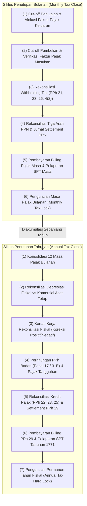

# Tax Closing and Period-End

## Definisi

**Tax Closing and Period-End (Penutupan Pajak dan Akhir Periode)** adalah rangkaian prosedur tata kelola, rekonsiliasi, dan penguncian sistematis di dalam ERP yang dijalankan pada setiap akhir bulan kalender (*Monthly Tax Close*) dan akhir tahun buku (*Annual Tax Close*) untuk memastikan seluruh peristiwa perpajakan telah dicatat secara lengkap, divalidasi keabsahannya, diselesaikan kewajiban pembayarannya, dan dibekukan dari modifikasi data masa lampau.

Penutupan perpajakan beroperasi secara berdampingan dengan Penutupan Periode Akuntansi (*Financial Period Close* - Phase 3) dan Penutupan Kas/Bank (*Treasury Close* - Phase 8). Kegagalan melakukan penutupan pajak yang tertib dapat merusak integritas laporan keuangan dan memicu sanksi pelaporan SPT yang cacat.

---

## Tujuan Bisnis (Purpose)

Pelaksanaan penutupan pajak akhir periode yang terstruktur bertujuan untuk:
1. **Penegakan Integritas Pisah Batas (Cut-Off Enforcement):** Memastikan seluruh penyerahan barang/jasa dan penerimaan tagihan diakui pada masa pajak yang tepat sesuai aturan tanggal terutang (*tax point*).
2. **Perlindungan Data Historis (Period Lock & Anti-Tampering):** Mencegah posting transaksi tanggal lampau (*backdated entries*) ke masa pajak yang SPT-nya telah dilaporkan ke otoritas pajak.
3. **Penyelesaian Akun Kliring Pajak (Tax Clearing Accounts Settlement):** Mengeliminasi saldo rekening perantara perpajakan bulanan ke akun liabilitas atau aset bersih yang definitif.
4. **Kesiapan Audit dan Pelaporan Statuter:** Menyediakan kepastian angka bagi manajemen sebelum laporan keuangan tahunan diaudit oleh akuntan publik dan dilaporkan ke kantor pelayanan pajak.

---

## Matriks Penutupan: Penutupan Bulanan vs Penutupan Tahunan



---

## Daftar Uji Penutupan Pajak Bulanan (Monthly Checklist)

Sebelum penguncian masa pajak diaktifkan di ERP, tim kepatuhan perpajakan wajib menyelesaikan tahapan kendali berikut:

| No | Aktivitas Pengendalian | Modul Terkait | Kriteria Kelulusan |
|---|---|---|---|
| 1 | **Verifikasi Faktur Penjualan Belum Terbit Faktur Pajak** | Sales / AR | Tidak ada invoice komersial berstatus *posted* yang belum diterbitkan faktur pajaknya (persetujuan e-Tax Invoice Coretax / data pajak terintegrasi). |
| 2 | **Validasi Batas Unggah e-Faktur (Maksimal Tgl 15)** | Tax Engine | Seluruh Faktur Pajak Keluaran masa berjalan telah berstatus *Approval Sukses* di DJP. |
| 3 | **Pencocokan Faktur Pajak Masukan Rekanan** | Purchasing / AP | Seluruh faktur vendor telah diverifikasi via pemindaian QR / prapopulasi dan ditentukan masa pengkreditannya. |
| 4 | **Penyelarasan PPh 21 Payroll** | HR / Payroll | Nilai PPh 21 pada modul gaji (Phase 11) cocok 100% dengan akun utang PPh 21 di General Ledger. |
| 5 | **Penerbitan Bukti Potong e-Bupot Unifikasi** | Tax / AP | Seluruh tagihan jasa vendor yang dipotong PPh 23/26/4(2) telah dibuatkan nomor bukti potong resmi. |
| 6 | **Rekonsiliasi Tiga Arah PPN** | Accounting / Tax | Selisih antara Subledger, Buku Besar Pajak, dan Register e-Faktur bernilai Rp0. |
| 7 | **Posting Jurnal Settlement PPN** | Accounting | Saldo akun PPN Masukan dan Keluaran masa terkait bersaldo nol. |
| 8 | **Penyetoran dan Pelaporan SPT Masa** | Finance / Tax | Kode billing telah dibayar (ada NTPN) dan SPT Masa telah dilaporkan (ada BPE). |
| 9 | **Aktivasi Tax Period Lock** | System Admin | Status masa pajak diubah menjadi `LOCKED` di ERP. |

---

## Business Rules Penutupan Pajak

1. **Tax Lock Precedence Rule:**
   Setelah masa pajak dikunci (*Tax Period Lock*), konfigurasi kontrol sistem menolak:
   - Pembuatan invoice penjualan atau tagihan vendor baru dengan tanggal transaksi di masa yang telah dikunci.
   - Perubahan kuantitas, harga, atau kode pajak pada dokumen yang telah disetujui.
   - Pembatalan transaksi (*void / delete*) secara sepihak.
2. **Exception Handling & Unlocking Protocol:**
   Pembukaan kembali periode pajak yang telah dikunci (*Tax Period Unlock*) hanya dapat diotorisasi oleh *Chief Financial Officer* (CFO) melalui pengajuan tiket formal. Sistem secara otomatis mencatat alasan bisnis pembukaan kunci dan menandai bahwa transaksi yang dimasukkan wajib memicu draf **SPT Pembetulan**.
3. **Synchronization with Accounting Period Close:**
   Penutupan periode akuntansi umum (*General Ledger Close*) tidak boleh diselesaikan sebelum modul perpajakan menyelesaikan rekonsiliasi dan memposting jurnal penyelesaian pajak (*tax settlement entries*).
4. **Annual Fiscal Depreciation Freeze Rule:**
   Tabel penyusutan fiskal aktiva tetap wajib dibekukan (*frozen*) bersamaan dengan finalisasi Lampiran Khusus 1A SPT Tahunan 1771 untuk memastikan dasar nilai buku fiskal awal tahun berikutnya konsisten dengan laporan resmi ke kantor pajak.

---

## Dampak Akuntansi (Accounting Impact)

Proses penutupan akhir periode memastikan pemindahan saldo temporer ke saldo permanen:

### 1. Dampak Penutupan Bulanan
Akun sementara PPN Masukan (`115100`) dan PPN Keluaran (`214100`) di-clearing ke akun kewajiban lancar `Utang PPN Kurang Bayar` (`214200`), sehingga saldo akun temporer kembali bersih (nol) untuk menyambut transaksi bulan berikutnya.

### 2. Dampak Penutupan Tahunan
Akun beban komersial dan laba komersial ditutup ke Saldo Laba (*Retained Earnings*), sementara estimasi liabilitas PPh Badan diakui sebagai Beban Pajak Kini dan Utang PPh Pasal 29 di neraca:
```text
(Db) Beban Pajak Penghasilan Kini (Laba Rugi)     Rp23.100.000
    (Cr) Uang Muka PPh Pasal 25 (Aset Lancar)                    Rp 5.000.000
    (Cr) Uang Muka PPh Pasal 23 (Aset Lancar)                    Rp 2.000.000
    (Cr) Utang PPh Pasal 29 (Liabilitas Lancar)                  Rp16.100.000
```

---

## Skenario Kanonikal: PT Maju Bersama

Penerapan jadwal penutupan akhir periode pada `PT Maju Bersama`:

### 1. Kalender Penutupan Bulanan (Masa Pajak Berjalan)
* **Tanggal 31 Akhir Bulan:** Penutupan cut-off fisik gudang dan penerbitan commercial invoice.
* **Tanggal 10 Bulan Berikutnya:** Batas akhir verifikasi dan impor seluruh Faktur Pajak Masukan rekanan.
* **Tanggal 12 Bulan Berikutnya:** Eksekusi Rekonsiliasi Tiga Arah PPN dan PPh Unifikasi.
* **Tanggal 14 Bulan Berikutnya:** Pengunggahan seluruh Faktur Pajak Keluaran ke DJP (memenuhi batas akhir tanggal 15).
* **Tanggal 25 Bulan Berikutnya:** Eksekusi Jurnal Kliring PPN (menolkan PPN Masukan Rp770.000 dan PPN Keluaran Rp1.100.000, membentuk Utang PPN Rp330.000).
* **Tanggal 28 Bulan Berikutnya:** Pembayaran Kode Billing `DUMMY-BILLING-001` Rp330.000 (NTPN `DUMMY-NTPN-001` diperoleh) dan Pelaporan SPT Masa PPN (BPE `DUMMY-BPE-PPN-001` diterima).
* **Tanggal 28 Pukul 23:59:** Modul Tax `PT Maju Bersama` mengaktifkan **Hard Lock** untuk masa pajak bersangkutan.

### 2. Kalender Penutupan Tahunan (Tahun Fiskal)
* **31 Desember:** Penutupan buku besar komersial awal (EBT Komersial tercatat Rp100.000.000).
* **15 Februari:** Finalisasi kertas kerja koreksi fiskal (+Rp10.000.000 positif, -Rp5.000.000 negatif, PKP = Rp105.000.000).
* **15 Maret:** Perhitungan beban pajak kini Rp23.100.000 (22% x Rp105.000.000) dan rekonsiliasi kredit pajak (PPh 25 Rp5.000.000, PPh 23 Rp2.000.000).
* **20 April:** Posting jurnal penyesuaian PPh Badan akhir tahun dan pembentukan Utang PPh 29 sebesar Rp16.100.000.
* **25 April:** Pembayaran Kode Billing PPh 29 `DUMMY-BILLING-002` sebesar Rp16.100.000 via Treasury / bank persepsi (NTPN `DUMMY-NTPN-002` diperoleh).
* **28 April:** Pelaporan SPT Tahunan PPh Badan via portal Coretax DJP (memperoleh BPE `DUMMY-BPE-1771-001`) dan penguncian permanen tahun buku fiskal.

---

## Implementasi ERP Universal

Dalam arsitektur ERP enterprise, modul penutupan perpajakan mengoperasikan fitur:
1. **Period Close Cockpit:** Dasbor pemantau status penutupan yang menyajikan daftar periksa (*checklist*) seluruh modul anak (AR, AP, Inventory, Payroll) beserta indikator kelengkapan dokumen pajak.
2. **Granular Locking Framework:** Kemampuan mengunci sistem berdasarkan hierarki entitas: per modul (*Tax module only*), per jenis transaksi (*VAT only / WHT only*), atau per unit bisnis/cabang.
3. **Audit Trail Exception Logger:** Modul pencatat otomatis yang merekam setiap upaya posting transaksi ke periode yang telah dikunci beserta identitas pengguna dan stempel waktu (*timestamp*).

---

## Perbandingan Software ERP

| Dimensi Penutupan Pajak | Odoo (v16 - v18) | ERPNext (v14 - v15) | Microsoft Dynamics 365 F&O |
|---|---|---|---|
| **Mekanisme Penguncian Periode** | Menggunakan *Tax Lock Date* dan *Journal Lock Date* pada menu konfigurasi akuntansi. | Menggunakan *Period Closing Voucher* dan pengaturan *Freeze Accounting Entries*. | Menggunakan *Ledger Calendar Periods* dengan status `Open`, `On hold`, dan `Permanently closed`. |
| **Daftar Periksa Penutupan (Cockpit)** | Tersedia melalui modul tambahan *Accounting Dashboard* atau pelacakan manual. | Menggunakan *Process Statement* atau *Checklist* kustom pada ruang kerja Akuntansi. | Memiliki fitur bawaan komprehensif *Financial Period Close Workspace* dengan dependensi tugas. |
| **Penanganan SPT Pembetulan Pasca-Kunci** | Memerlukan pembukaan sementara *Tax Lock Date* dan pelacakan baris jurnal koreksi. | Dikelola melalui pembuatan dokumen baru berstatus *Amended* dengan referensi dokumen lama. | Memiliki proses khusus *Settle and post sales tax for prior periods* yang otomatis melacak pembetulan. |

---

## Pertimbangan Desain Naventra (Naventra Consideration)

Pada pengembangan ERP Naventra, fitur penutupan pajak akhir periode dirancang dengan arsitektur ketat:

1. **Automated Period Gatekeeper:**
   Naventra menerapkan validasi otomatis pada tingkat API/basis data: transaksi apa pun dengan `tax_point_date` di dalam rentang periode `status = 'LOCKED'` akan secara otomatis ditolak (*HTTP 403 Forbidden: Tax Period Locked*).
2. **Interactive Tax Close Checklist:**
   Manajer Pajak disediakan dasbor interaktif 9 langkah penutupan bulanan. Tombol `Lock Period` tidak dapat ditekan sebelum seluruh indikator rekonsiliasi dan verifikasi dokumen menunjukkan tanda centang hijau.
3. **Integrated Amendment Versioning:**
   Jika pembukaan kunci darurat disetujui, Naventra menandai seluruh entri penyesuaian dengan label `amendment_version_id`, mengisolasi transaksi koreksi tersebut sehingga langsung terpetakan ke SPT Pembetulan tanpa merusak integritas arsip SPT Normal awal.

---

## Referensi

* Undang-Undang Republik Indonesia No. 28 Tahun 2007 tentang Ketentuan Umum dan Tata Cara Perpajakan (UU KUP) beserta perubahannya pada UU No. 7 Tahun 2021 (UU Harmonisasi Peraturan Perpajakan).
* Peraturan Menteri Keuangan No. 243/PMK.03/2014 tentang Surat Pemberitahuan (SPT) sebagaimana telah diubah dengan PMK No. 9/PMK.03/2018.
* Microsoft Learn: *Financial Period Close Workspace and Tax Period Management in Dynamics 365 Finance*.
* Odoo Accounting User Guide: *Locking Accounting and Tax Periods*.
* Frappe / ERPNext Documentation: *Period Closing Voucher and Year-End Accounting Workflows*.
