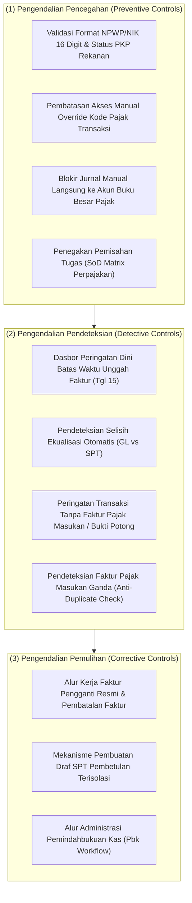

# Tax Controls, Audit, and Compliance

## Definisi

**Tax Controls, Audit, and Compliance (Pengendalian Perpajakan, Kesiapan Audit, dan Kepatuhan)** adalah kerangka tata kelola, aturan validasi sistematis, dan jejak audit di dalam ERP yang memastikan bahwa seluruh transaksi perpajakan dilaksanakan secara patuh hukum, terlindungi dari kecurangan (*fraud*) maupun kelalaian, serta siap menghadapi pemeriksaan oleh auditor internal maupun otoritas perpajakan (seperti Direktorat Jenderal Pajak).

Dalam lanskap kepatuhan modern, sistem ERP bertindak sebagai benteng pertahanan fiskal (*fiscal defense shield*). Sistem tidak hanya menghitung angka pajak, tetapi juga memvalidasi bahwa setiap angka tersebut didukung oleh dasar transaksi yang jelas, bukti fisik digital yang sah, dan diproses melalui pemisahan kewenangan yang terstruktur (*Segregation of Duties*).

---

## Tujuan Bisnis (Purpose)

Penerapan pengendalian dan kepatuhan perpajakan di dalam ERP bertujuan untuk:
1. **Mencegah Kerugian Finansial Akibat Denda (Penalty Prevention):** Mengeliminasi kesalahan penagihan, keterlambatan penerbitan faktur, atau keterlambatan penyetoran kas yang memicu Surat Tagihan Pajak (STP).
2. **Penegakan Pemisahan Kewenangan (Segregation of Duties / SoD):** Mencegah potensi penyalahgunaan wewenang dan kolusi internal dengan memisahkan fungsi entri operasional, penetapan perlakuan pajak, otorisasi faktur resmi, dan pembayaran kas.
3. **Kesiapan Cepat Menjawab SP2DK (SP2DK Audit Readiness):** Menyediakan kemampuan ekstraksi data rekonsiliasi dan dokumen pendukung transaksi dalam hitungan jam untuk menjawab Surat Permintaan Penjelasan atas Data dan/atau Keterangan dari Kantor Pelayanan Pajak (KPP).
4. **Penyediaan Jejak Audit yang Abadi (Immutable Audit Trail):** Menyimpan rekam jejak digital atas seluruh perubahan status faktur, pengubahan master data, dan persetujuan pelaporan.

---

## Taksonomi Pengendalian Internal Perpajakan (Tax Control Framework)

Sistem ERP mengoperasikan pengendalian pajak melalui tiga lapisan pertahanan:

---

## Matriks Pemisahan Tugas Perpajakan (Tax Segregation of Duties / SoD)

Untuk memenuhi standar kepatuhan tata kelola korporasi yang baik (*Good Corporate Governance*), ERP membatasi kewenangan melalui matriks peran berikut:

| Peran Sistem | Buat Transaksi Operasional (SO/PO) | Pilih / Override Kode Pajak | Submit & Setujui e-Faktur DJP | Buat Payment Request Pajak | Eksekusi Pembayaran Kas Bank |
|---|---|---|---|---|---|
| **Sales / Purchasing Staff** | Diizinkan | Dilarang | Dilarang | Dilarang | Dilarang |
| **Tax Specialist / Preparer** | Dilarang | Diizinkan (Koreksi) | Diizinkan (Draf) | Diizinkan | Dilarang |
| **Tax Manager / Approver** | Dilarang | Diizinkan (Otorisasi) | Diizinkan (Final Approval) | Diizinkan (Review) | Dilarang |
| **Treasury / Finance Officer** | Dilarang | Dilarang | Dilarang | Dilarang | Diizinkan |
| **Financial Controller / CFO** | Dilarang | Dilarang | Dilarang | Otorisasi Akhir | Otorisasi Akhir |

---

## Kesiapan Menghadapi Pengawasan dan Pemeriksaan Pajak (Tax Audit Readiness)

Dalam praktik bisnis di Indonesia, wajib pajak secara berkala menerima pengawasan dari Account Representative (AR) kantor pajak. ERP mendukung mitigasi risiko ini:

### 1. Manajemen Respons SP2DK (Surat Permintaan Penjelasan)
SP2DK umumnya dipicu oleh ketidakcocokan data (*data matching discrepancy*) antara SPT Masa PPN dengan SPT Tahunan Badan, atau laporan lawan transaksi.
- ERP menyediakan modul **SP2DK Response Workbench**: mengekstraksi seluruh transaksi terkait nomor faktur yang dipertanyakan oleh KPP beserta lembar ekualisasi pendukung, kuitansi pembayaran, dan bukti penerimaan barang dalam satu klik.

### 2. Kesiapan Pemeriksaan Lapangan (All-Taxes Audit)
Ketika diterbitkan Surat Perintah Pemeriksaan Pajak (SP2):
- Sistem dapat membekukan *snapshot* basis data tahun pajak terkait (*Audit Freeze*).
- Menyediakan akses *read-only* terisolasi bagi pemeriksa pajak untuk menelusuri rantai transaksi utuh:
  $$\text{PO} \longrightarrow \text{Goods Receipt} \longrightarrow \text{Vendor Bill} \longrightarrow \text{Faktur Pajak Masukan} \longrightarrow \text{Bank Voucher} \longrightarrow \text{NTPN}$$

---

## Business Rules Pengendalian Perpajakan

1. **Tax Account Direct Posting Block Rule:**
   Akun neraca penampung PPN Masukan, PPN Keluaran, Uang Muka PPh, dan Utang PPh pada Chart of Accounts wajib dikunci dari entri jurnal manual biasa (*block manual journal entry*). Seluruh mutasi ke akun pajak wajib berasal dari dokumen transaksi yang terikat ke modul operasional atau modul penutupan pajak resmi.
2. **Digital Certificate Custodianship Rule:**
   Sertifikat elektronik (*Digital Certificate / Passphrase DJP*) yang digunakan untuk menandatangani e-Faktur dan e-Bupot wajib disimpan dalam media penyimpanan berkas terenkripsi tingkat tinggi (*Hardware Security Module / KMS*) dengan pembatasan hak akses yang sangat ketat.
3. **Audit Trail Immutability Rule:**
   Log sistem yang merekam perubahan aturan pajak, pengubahan tarif, penghapusan draf, dan interaksi API dengan server DJP berstatus *append-only* dan tidak dapat diedit atau dihapus oleh administrator sistem mana pun.

---

## Skenario Kanonikal: PT Maju Bersama

Penerapan prosedur pengendalian dan audit pada `PT Maju Bersama`:

### Skenario: Penanganan Notifikasi SP2DK atas Selisih Omzet Penjualan
1. **Latar Belakang Kasus:**
   KPP Pratama mengirimkan SP2DK yang mempertanyakan dugaan selisih antara peredaran usaha komersial yang dilaporkan di laporan keuangan internal dengan akumulasi DPP PPN Keluaran pada SPT Masa. Dengan sistem Coretax, DJP dapat melakukan data matching secara lebih terstruktur terhadap faktur pajak yang sudah otomatis terlapor.
2. **Investigasi Melalui Audit Trail ERP:**
   - Tim pajak membuka modul *Tax Audit Workbench*.
   - Sistem memanggil riwayat transaksi: Ditemukan bahwa terdapat transaksi penjualan dengan nilai komersial yang direvisi karena perubahan jumlah unit, sehingga diterbitkan Faktur Pajak Pengganti dengan nomor `DUMMY-FP-REPLACE-001` (identifikasi fiktif untuk ilustrasi pembelajaran) berstatus disetujui pada sistem DJP.
   - Sistem membuktikan bahwa PPN terutang atas seluruh nilai tagihan (termasuk pengganti) telah disetorkan secara penuh dengan NTPN yang valid.
3. **Penyusunan Surat Tanggapan:**
   ERP menghasilkan lembar kertas kerja ekualisasi dan tautan salinan digital faktur pajak normal serta pengganti secara terstruktur. Seluruh data dukung disampaikan ke KPP untuk mendukung proses klarifikasi. SP2DK dapat ditutup tanpa penerbitan ketetapan pajak apabila seluruh dokumen pendukung dinyatakan lengkap dan sah.

---

## Implementasi ERP Universal

Dalam arsitektur sistem ERP modern, pengendalian dan audit perpajakan dijalankan oleh:
1. **Tax Rule Change Tracker:** Modul pelacak konfigurasi yang mencatat siapa, kapan, dan alasan apa yang mendasari perubahan pada tabel *Tax Code* atau *Rate Schedule*.
2. **Automated Pre-Audit Engine:** Algoritma prapemeriksaan yang secara proaktif memindai transaksi buku besar setiap akhir bulan untuk mendeteksi transaksi tanpa nomor NPWP rekanan, tagihan ganda, atau pemotongan pajak yang tidak konsisten.
3. **Statutory Document Exporter for Auditors:** Fitur penyiapan data audit (*Tax Audit Data Package*) yang mengonversi catatan transaksi menjadi format terstandarisasi yang siap diperiksa oleh pemeriksa pajak pemerintah.

---

## Perbandingan Software ERP

| Dimensi Pengendalian & Audit | Odoo (v16 - v18) | ERPNext (v14 - v15) | Microsoft Dynamics 365 F&O |
|---|---|---|---|
| **Pemisahan Tugas (SoD)** | Dikelola melalui grup hak akses pengguna (*User Groups & Access Rights*). | Dikelola melalui *Role Permissions Manager* per tipe dokumen (*DocType*). | Memiliki modul bawaan *Security Diagnostics & Segregation of Duties Analysis*. |
| **Proteksi Akun Pajak Buku Besar** | Dapat mengunci jurnal tertentu melalui penandaan hak akses akun pada master akun. | Pengaturan *Freeze Accounting Entries* atau pembatasan peran pada master akun. | Memiliki flag *Do not allow manual entry* yang sangat ketat pada setiap akun buku besar. |
| **Jejak Audit Perubahan Pajak** | Tersimpan pada riwayat *Chatter Tracking* di setiap formulir dokumen transaksi. | Tersimpan pada tabel *Version Log* dan *Activity Log* yang merekam perubahan data. | Memiliki fitur *Audit Trail Logging* dan *Database Log Setup* yang bersertifikasi kepatuhan SOX. |

---

## Pertimbangan Desain Naventra (Naventra Consideration)

Pada pengembangan ERP Naventra, kerangka kepatuhan dan audit perpajakan dibangun dengan fondasi ketat:

1. **Mandatory Ledger Lock on Tax Accounts:**
   Seluruh akun GL yang memiliki tipe `TAX_CLEARING`, `TAX_PAYABLE`, atau `PREPAID_TAX` secara baku dikunci dari formulir *Manual Journal Entry*. Mutasi akun hanya dapat terjadi melalui mesin posting otomatis dari modul dokumen transaksi.
2. **Built-in SP2DK Assistant:**
   Naventra menyertakan fitur *SP2DK Reconciliation Assistant*: pengguna cukup menginput nomor SP2DK dan memilih masa pajak yang dipersoalkan, lalu sistem secara otomatis menghasilkan berkas PDF tanggapan resmi yang memuat lembar ekualisasi, daftar faktur, dan bukti bayar bank.
3. **Cryptographic Log Immutability:**
   Setiap transaksi pengunggahan, pembatalan, dan penggantian faktur pajak dicatat dengan tanda tangan kriptografi (hash SHA-256) pada tabel `tax_compliance_audit_ledger` guna memproteksi integritas data riwayat audit dari manipulasi tidak terotorisasi.

---

## Referensi

* Undang-Undang Republik Indonesia No. 28 Tahun 2007 tentang Ketentuan Umum dan Tata Cara Perpajakan (UU KUP) beserta perubahannya pada UU No. 7 Tahun 2021 (UU Harmonisasi Peraturan Perpajakan).
* Peraturan Menteri Keuangan No. 17/PMK.03/2013 tentang Tata Cara Pemeriksaan Pajak sebagaimana telah diubah dengan PMK No. 18/PMK.03/2021.
* Surat Edaran Direktur Jenderal Pajak No. SE-05/PJ/2022 tentang Pengawasan Kepatuhan Wajib Pajak.
* Committee of Sponsoring Organizations of the Treadway Commission (COSO): *Internal Control - Integrated Framework*.
* Microsoft Learn: *Security Architecture and Segregation of Duties in Dynamics 365 Finance*.
* Frappe / ERPNext Documentation: *Role Permissions and Document Versioning for Audit Compliance*.
