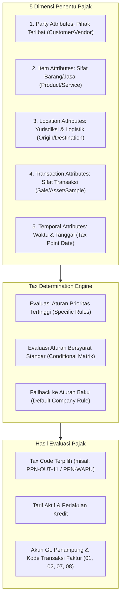
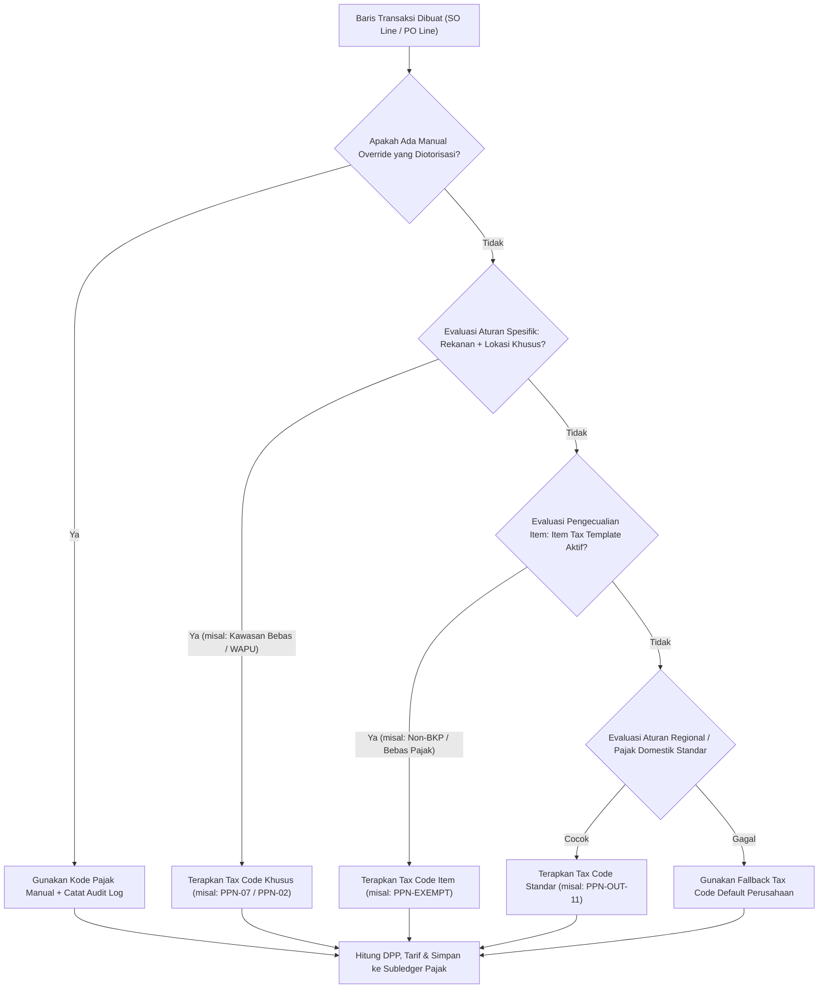

# Tax Determination and Tax Rules

## Definisi

**Tax Determination and Tax Rules (Penentuan Pajak dan Aturan Perpajakan)** adalah logika komputasi dan mesin aturan (*rule engine*) di dalam sistem ERP yang secara dinamis dan otomatis mengevaluasi atribut-atribut transaksi untuk menentukan kode pajak (*Tax Code*), perlakuan perpajakan, tarif yang berlaku, serta perlakuan akuntansi yang tepat bagi setiap baris item transaksi bisnis.

Proses penentuan pajak membebaskan pengguna operasional (seperti staf *sales order entry* atau *purchasing officer*) dari keharusan menghafal peraturan fiskal yang kompleks. Sistem bertindak sebagai filter regulasi cerdas yang menerjemahkan kombinasi subjek, objek, lokasi, tanggal, dan sifat transaksi menjadi instruksi perpajakan yang presisi.

---

## Tujuan Bisnis (Purpose)

Penerapan mesin penentu pajak (*tax determination engine*) bertujuan untuk:
1. **Otomatisasi Aturan dan Mitigasi Human Error:** Mengurangi kesalahan penentuan kode pajak oleh staf operasional yang dapat berakibat pada ketidaksesuaian dokumen pajak atau sanksi kepatuhan.
2. **Penegakan Aturan Fiskal Khusus (Special Scheme Enforcement):** Mengidentifikasi transaksi dengan perlakuan khusus secara otomatis, seperti transaksi dengan Instansi Pemerintah Pemungut (WAPU), transaksi di Kawasan Perdagangan Bebas dan Pelabuhan Bebas (KPBPB/Batam), atau transaksi penyerahan jasa luar negeri.
3. **Penyelarasan dengan Tanggal Terutang (Tax Point Alignment):** Memilih jadwal tarif pajak yang valid secara otomatis berdasarkan tanggal penyerahan atau tanggal faktur (*effective dating*).
4. **Jejak Logika Keputusan (Traceable Decision Logic):** Menyimpan rekam jejak mengenai aturan mana yang terpicu untuk menentukan kode pajak pada suatu dokumen transaksi guna keperluan pembuktian audit fiskal.

---

## Matriks Penentu Pajak Multi-Atribut (Multi-Attribute Matrix)

Mesin penentu pajak ERP mengevaluasi transaksi melalui analisis simultan terhadap lima dimensi atribut utama:



### 1. Atribut Pihak Terlibat (*Party Attributes*)
- **Status Registrasi:** Apakah rekanan berstatus Pengusaha Kena Pajak (PKP) atau Non-PKP?
- **Kategori Fiskal:** Apakah mitra bisnis tergolong Badan Swasta Biasa, Instansi Pemerintah (WAPU Pasal 22/PPN), Badan Usaha Milik Negara (BUMN WAPU), atau Subjek Pajak Luar Negeri?
- **Sertifikat Bebas Pajak:** Apakah entitas memiliki Surat Keterangan Bebas (SKB) PPh/PPN yang masih aktif?

### 2. Atribut Barang dan Jasa (*Item Attributes*)
- **Klasifikasi Objek:** Barang Kena Pajak (BKP), Bukan BKP (misalnya barang kebutuhan pokok), Jasa Kena Pajak (JKP), atau Bukan JKP.
- **Kategori Khusus:** Barang Mewah terutang PPnBM, atau komoditas dengan skema PPN Besaran Tertentu (misalnya kendaraan bermotor bekas, jasa pengiriman paket, atau jasa biro perjalanan).

### 3. Atribut Lokasi dan Logistik (*Location & Jurisdiction Attributes*)
- **Alamat Asal (*Ship-From*):** Lokasi gudang atau fasilitas pengiriman barang.
- **Alamat Tujuan (*Ship-To*):** Lokasi penyerahan fisik atau penerimaan manfaat jasa.
- **Zona Bebas / Khusus:** Apakah transaksi melibatkan kawasan fasilitas, seperti Kawasan Berikat, Kawasan Ekonomi Khusus (KEK), atau Kawasan Bebas Batam (PPN Tidak Dipungut - Kode Faktur 07)?

### 4. Atribut Sifat Transaksi (*Transaction Attributes*)
- **Tujuan Penggunaan:** Penjualan reguler, pemakaian sendiri, pemberian cuma-cuma (*sample*), pengalihan aktiva tetap (Pasal 16D UU PPN), atau pengadaan proyek konstruksi.

### 5. Atribut Waktu (*Temporal Attributes*)
- Tanggal transaksi dievaluasi terhadap tabel *Tax Rate Schedule* untuk mengambil tarif yang sah secara hukum pada tanggal terutang tersebut.

---

## Alur Kerja Penentuan Pajak (Determination Execution Flow)

Dalam memproses setiap baris dokumen operasional, mesin aturan perpajakan ERP menjalankan evaluasi hierarkis:



---

## Business Rules Penentuan Pajak

1. **Hierarchy of Specificity (Aturan Tingkat Kekhususan):**
   Aturan yang paling spesifik selalu mengalahkan aturan yang lebih umum:
   - *Tingkat 1 (Tertinggi):* Pengecualian mitra spesifik pada lokasi spesifik (misalnya: Penyerahan ke Pabrik Klien di Kawasan Berikat Batam -> PPN Tidak Dipungut).
   - *Tingkat 2:* Pengecualian kategori barang/jasa spesifik (misalnya: Jasa Pendidikan / Medis -> Dibebaskan dari PPN).
   - *Tingkat 3:* Matriks fiskal grup pelanggan / grup vendor.
   - *Tingkat 4 (Terendah):* Pengaturan bawaan perusahaan (*company-wide default*).
2. **Controlled Manual Override Rule:**
   Pengguna lini depan tidak diizinkan mengubah kode pajak secara sembarangan. Jika terjadi kasus perkecualian, pengubahan kode pajak manual memerlukan alasan bisnis (*business justification*) dan otorisasi dari Supervisor Pajak (*Tax Supervisor Approval*), serta wajib dicatat dalam *system audit log*.
3. **Tax Point Stability Rule:**
   Sekali Faktur Pajak resmi diterbitkan atau invoice dikunci, kode pajak hasil penentuan sistem tidak dapat dievaluasi ulang secara otomatis meskipun parameter master data rekanan diubah di kemudian hari.
4. **WAPU Transaction Separation Rule:**
   Bila pembeli teridentifikasi sebagai Pemungut PPN (Instansi Pemerintah / BUMN WAPU), sistem secara otomatis mengarahkan PPN Keluaran ke kode transaksi faktur khusus (Kode 02 atau 03) dan memisahkan tagihan piutang: nilai PPN tidak ditagihkan ke kas perusahaan melainkan langsung dipungut dan disetor oleh bendahara instansi pemerintah terkait.

---

## Dampak Akuntansi (Accounting Impact)

Penentuan kode pajak yang akurat menentukan konfigurasi jurnal akuntansi secara mendasar:

### Skenario 1: Penjualan Reguler (Bukan Pemungut) -> Tax Code: `PPN-OUT-11`
Perusahaan menagihkan nilai barang ditambah PPN ke pelanggan:
```text
(Db) Piutang Usaha (AR - Total Tagihan)           Rp11.100.000
    (Cr) Pendapatan Penjualan (Revenue)                          Rp10.000.000
    (Cr) PPN Keluaran (Tax Payable)                              Rp 1.100.000
```

### Skenario 2: Penjualan ke Instansi Pemerintah (WAPU) -> Tax Code: `PPN-WAPU-11`
Pelanggan bendahara pemerintah membayar nilai barang, sementara PPN disetor langsung oleh bendahara ke kas negara:
```text
(Db) Piutang Usaha (AR - Net DPP Saja)            Rp10.000.000
(Db) Piutang PPN WAPU / Kas Kliring WAPU          Rp 1.100.000
    (Cr) Pendapatan Penjualan (Revenue)                          Rp10.000.000
    (Cr) PPN Keluaran Dipungut WAPU                              Rp 1.100.000
```
*(Saat bukti setoran/NTPN diterima dari bendahara, akun perantara PPN WAPU diselesaikan)*.

---

## Skenario Kanonikal: PT Maju Bersama

Melanjutkan skenario `PT Maju Bersama`:
* Barang: Laptop Pro (diklasifikasikan sebagai BKP Standar pada master item).
* Catatan Regulasi: Sesuai UU HPP jo PMK 131/2024 dan PMK 11/2025, tarif statutory PPN 12% dipadukan dengan DPP Nilai Lain 11/12 untuk penyerahan non-mewah menghasilkan beban pajak efektif 11% (digunakan sebagai asumsi pembelajaran).

### Evaluasi Kasus A: Pembelian dari PT Sumber Teknologi
1. *Vendor:* `PT Sumber Teknologi` (PKP terdaftar, vendor domestik non-fasilitas).
2. *Item:* Laptop Pro (BKP Standar).
3. *Mesin Aturan:* Menemukan aturan pembelian BKP dari vendor PKP domestik.
4. *Hasil Penentuan:* Tax Code = `PPN-IN-11` (Dapat dikreditkan, beban efektif 11% asumsi pembelajaran).
5. *Kalkulasi:* DPP = Rp7.000.000, Pajak = Rp770.000, Total Tagihan AP = Rp7.770.000.

### Evaluasi Kasus B: Penjualan ke Klien Korporasi Swasta Domestik
1. *Customer:* `PT Klien Utama` (Badan usaha swasta, PKP).
2. *Item:* Laptop Pro (BKP Standar).
3. *Mesin Aturan:* Menemukan aturan penyerahan BKP dalam negeri reguler (Kode Transaksi Faktur 01).
4. *Hasil Penentuan:* Tax Code = `PPN-OUT-11` (Beban efektif 11% asumsi pembelajaran).
5. *Kalkulasi:* DPP = Rp10.000.000, Pajak = Rp1.100.000, Total Piutang AR = Rp11.100.000.

### Evaluasi Kasus C: Penjualan ke Cabang Pelanggan di Kawasan Bebas Batam
1. *Customer:* `PT Mitra Batam` (Alamat *Ship-To* berada di KPBPB Batam).
2. *Item:* Laptop Pro (BKP Standar).
3. *Mesin Aturan:* Terpicu aturan yurisdiksi khusus penyerahan ke Kawasan Bebas (Kode Transaksi Faktur 07: PPN Tidak Dipungut).
4. *Hasil Penentuan:* Tax Code = `PPN-OUT-FTZ-07` (Tarif 0% efektif / PPN Tidak Dipungut).
5. *Kalkulasi:* DPP = Rp10.000.000, Pajak = Rp0, Total Piutang AR = Rp10.000.000.

---

## Implementasi ERP Universal

Pada rancangan sistem ERP skala besar, logika penentuan pajak dioperasikan sebagai layanan mikro terisolasi (*Tax Determination Microservice*):
1. **Payload Request:** Modul pemanggil mengirimkan dokumen transaksi dalam format JSON/XML yang berisi identitas para pihak, daftar barang, alamat asal/tujuan, tanggal terutang, dan termin pembayaran.
2. **Rule Evaluation Engine:** Mesin memuat matriks aturan dari memori *cache*, mengevaluasi predikat boolean, dan menyortir kecocokan berdasarkan skor bobot spesifisitas.
3. **Response Payload:** Mesin mengembalikan objek rincian pajak berisi Tax Code, persentase tarif, Dasar Pengenaan Pajak, nilai pajak per baris, dan referensi akun buku besar.

---

## Perbandingan Software ERP

| Aspek Penentuan Pajak | Odoo (v16 - v18) | ERPNext (v14 - v15) | Microsoft Dynamics 365 F&O |
|---|---|---|---|
| **Mekanisme Penentu** | Menggunakan *Fiscal Position* yang mendeteksi negara/provinsi rekanan dan menukar kode pajak default dengan kode pengganti. | Menggunakan *Tax Rule* berbasis prioritas yang mencocokkan *Customer/Supplier*, *Tax Category*, dan *Billing/Shipping Address*. | Menggunakan *Tax Calculation Service* dengan matriks kondisi multi-kolom (*Sales Tax Group* x *Item Sales Tax Group*). |
| **Pengecualian Tingkat Item** | Dikonfigurasi langsung pada field *Customer Taxes / Vendor Taxes* di master produk. | Menggunakan *Item Tax Template* yang mengesampingkan template pajak transaksi global. | Menggunakan *Item Sales Tax Group* yang dipasangkan dengan grup pelanggan/vendor. |
| **Dukungan WAPU / Pemungut** | Memerlukan kustomisasi atau konfigurasi *Fiscal Position* khusus dengan akun piutang/utang kliring terpisah. | Dapat dikonfigurasi melalui kombinasi *Tax Category* dan pembuatan *Taxes Template* khusus WAPU. | Memiliki fitur parameter bawaan untuk transaksi instansi pemungut dan skema pemotongan langsung. |
| **Audit Jejak Aturan** | Informasi log terbatas pada riwayat perubahan *chatter* dokumen invoice. | Tersimpan dalam *Version Log* dokumen transaksi. | Menyediakan *Tax Calculation Results & Trace Log* yang memperlihatkan alur evaluasi aturan secara visual. |

---

## Pertimbangan Desain Naventra (Naventra Consideration)

Pada arsitektur ERP Naventra, modul penentuan pajak dirancang dengan spesifikasi teknis berikut:

1. **Deterministic Rule Engine (Pipeline Pattern):**
   Naventra mengimplementasikan *tax determination pipeline* berurutan:
   - *Phase 1:* Verifikasi Alamat Pengiriman (*Jurisdiction / FTZ check*).
   - *Phase 2:* Verifikasi Kategori Subjek Pajak (*WAPU / Tax-Exempt Entity check*).
   - *Phase 3:* Verifikasi Kategori Objek Pajak (*Non-BKP / Special Scheme check*).
   - *Phase 4:* Penentuan Jadwal Tarif Aktif & Faktor DPP (*Effective Date & DPP factor lookup*).
2. **Immutable Trace Logging:**
   Setiap hasil penentuan kode pajak pada dokumen final disimpan beserta `rule_id` yang terpicu ke dalam tabel `tax_determination_audit_log`, memudahkan audit perpajakan internal dalam meneliti dasar hukum penetapan pajak transaksi masa lampau.
3. **Strict Validation Engine:**
   Sistem menolak posting transaksi jika terdeteksi inkonsistensi data, misalnya transaksi penjualan ke entitas WAPU yang secara manual diisi kode pajak reguler non-WAPU.

---

## Referensi

* Undang-Undang Republik Indonesia No. 7 Tahun 2021 tentang Harmonisasi Peraturan Perpajakan (UU HPP).
* Peraturan Menteri Keuangan No. 131/PMK.03/2024 tentang Perlakuan PPN Sehubungan dengan Berlakunya Tarif PPN 12%.
* Peraturan Menteri Keuangan No. 11 Tahun 2025 tentang Perhitungan PPN dengan DPP Nilai Lain dan Besaran Tertentu.
* Direktorat Jenderal Pajak: *Panduan Sistem Inti Administrasi Perpajakan (Coretax DJP)*.
* Peraturan Menteri Keuangan No. 173/PMK.03/2021 tentang Tata Cara Penyerahan BKP dan/atau JKP ke dan/atau dari Kawasan Bebas.
* Peraturan Menteri Keuangan No. 59/PMK.03/2022 tentang Perubahan atas PMK No. 231/PMK.03/2019 mengenai Tata Cara Pendaftaran dan Pemungutan Pajak oleh Instansi Pemerintah.
* Frappe / ERPNext Documentation: *Tax Rules Architecture and Priority Logic*.
* Microsoft Learn: *Tax Determination Rules and Tax Calculation Engine in Dynamics 365 Finance*.
* Odoo S.A.: *Fiscal Positions Documentation and Advanced Tax Mapping*.
