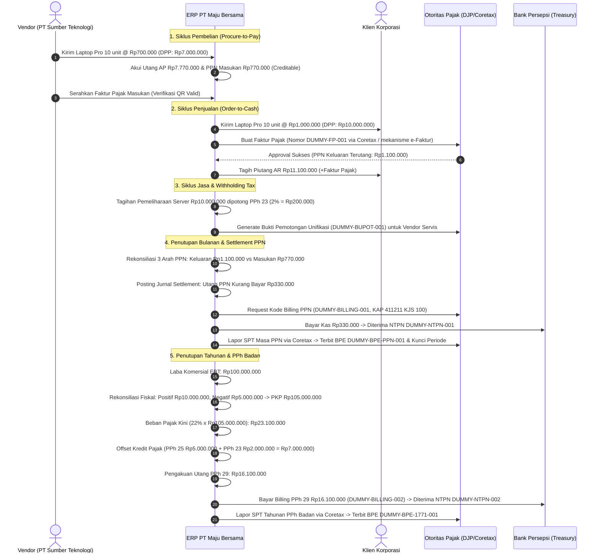

# Tax Integration

## Definisi

**Tax Integration (Integrasi Lintas Modul Perpajakan)** adalah arsitektur penghubung dan orkestrasi data di dalam ERP yang menautkan mesin perpajakan (*Tax Engine*) dengan seluruh modul operasional, logistik, manufaktur, ketenagakerjaan, aset, dan keuangan perusahaan.

Dalam sistem Enterprise Resource Planning yang matang, perpajakan bukanlah pulau data yang terisolasi. Perpajakan beroperasi sebagai **lapisan kepatuhan regulasi terdistribusi (*distributed regulatory compliance layer*)** yang mengevaluasi setiap mutasi barang, penyerahan jasa, pemakaian internal, pelepasan aset, pembayaran gaji, dan arus kas perbankan guna memastikan seluruh hak dan kewajiban perpajakan tercatat secara *real-time*.

---

## Tujuan Bisnis (Purpose)

Integrasi perpajakan menyeluruh di dalam ERP bertujuan untuk:
1. **Mencapai Kepatuhan Tanpa Gesekan (Frictionless Compliance):** Menghilangkan entri data ulang (*duplicate entry*) antara modul operasional dengan aplikasi pelaporan pajak pemerintah.
2. **Keterpaduan Integritas Angka (Single Source of Truth):** Mendukung konsistensi data antara nilai transaksi komersial di lini depan dengan nilai yang dilaporkan pada formulir pajak resmi.
3. **Visibilitas Eksposur Pajak Komprehensif (Holistic Tax Visibility):** Memberikan gambaran posisi likuiditas dan liabilitas perpajakan terkonsolidasi kepada *Chief Financial Officer* (CFO) secara *real-time*.
4. **Otomatisasi Alur Kepatuhan Multi-Yurisdiksi:** Memfasilitasi penerapan berbagai skema regulasi (PPN, PPh Potput, PPh Badan, Bea Masuk) secara harmonis dalam satu arsitektur terintegrasi.

---

## Arsitektur Integrasi Modul Perpajakan ERP

```mermaid
flowchart TD
    TaxEngine["Tax Engine & Compliance Core (Phase 12)"]

    subgraph Operations["Modul Operasional & Rantai Pasok"]
        Sales["Sales / O2C (Phase 4): PPN Keluaran, e-Tax Invoice Coretax, AR WHT"]
        Purchasing["Purchasing / P2P (Phase 5): PPN Masukan, AP WHT, QR Scan"]
        Inventory["Inventory (Phase 6): Pemakaian Sendiri, Sampel, Kawasan Berikat"]
        Manufacturing["Manufacturing (Phase 7): Jasa Makloon PPh 23, Scrap, PPN Impor"]
    end

    subgraph FinanceAdmin["Modul Keuangan & Aset"]
        Accounting["Accounting / GL (Phase 3): Akun Pajak, Kliring, Rekonsiliasi Fiskal"]
        Finance["Finance / Treasury (Phase 8): Kode Billing, Setoran NTPN, Cash Flow"]
        Assets["Fixed Assets (Phase 9): Depresiasi Fiskal, PPN Non-Kreditabel, PPN 16D"]
        Project["Project (Phase 10): Milestone Billing, PPh Konstruksi, Retensi"]
        HR["HR / Payroll (Phase 11): PPh 21 Karyawan, Natura PMK 66/2023"]
    end

    Sales <--> TaxEngine
    Purchasing <--> TaxEngine
    Inventory <--> TaxEngine
    Manufacturing <--> TaxEngine
    Accounting <--> TaxEngine
    Finance <--> TaxEngine
    Assets <--> TaxEngine
    Project <--> TaxEngine
    HR <--> TaxEngine
```



---

## Matriks Integrasi Lintas Modul Perpajakan

| Modul ERP Asal | Titik Sentuh Perpajakan (*Tax Touchpoint*) | Data yang Dipertukarkan | Arah Integrasi |
|---|---|---|---|
| **Accounting (Phase 3)** | Pemetaan akun neraca, penutupan masa pajak, dan perhitungan pajak tangguhan (IAS 12). | Saldo GL, pemetaan akun pajak, selisih temporer, jurnal kliring. | Dua Arah (Bi-directional) |
| **Sales / O2C (Phase 4)** | Penentuan PPN Keluaran, penerbitan Faktur Pajak (Coretax / alokasi NSFP historis), pemotongan PPh oleh pelanggan. | Customer Tax ID, nilai DPP, kode transaksi faktur, bukti potong AR. | Dua Arah (Bi-directional) |
| **Purchasing / P2P (Phase 5)** | Penerimaan tagihan vendor, evaluasi PPN Masukan kreditabel, pemotongan PPh 23/26/4(2). | Vendor Tax ID, nomor faktur vendor, bukti potong e-Bupot AP. | Dua Arah (Bi-directional) |
| **Inventory (Phase 6)** | Penyerahan cuma-cuma (*samples*), pemakaian sendiri untuk keperluan non-usaha, barang rusak (*scrap*). | Kuantitas mutasi gudang, harga pokok persediaan, status BKP barang. | Masuk ke Modul Tax |
| **Manufacturing (Phase 7)** | Biaya jasa makloon/subkontrak terutang PPh 23, penyusutan mesin pabrik, limbah produksi. | Work Order cost, tagihan jasa subkontrak, nilai scrap bahan baku. | Masuk ke Modul Tax |
| **Finance / Treasury (Phase 8)** | Pembuatan kode billing penyetoran pajak, eksekusi transfer bank, pencocokan NTPN. | ID Billing, tanggal bayar, nomor rekening, NTPN, bukti transfer. | Dua Arah (Bi-directional) |
| **Fixed Assets (Phase 9)** | Kapitalisasi PPN non-kreditabel (sedan dinas), rekonsiliasi penyusutan fiskal, PPN Pasal 16D atas pelepasan aset. | Nilai perolehan aset, tabel penyusutan fiskal, keuntungan pelepasan aset. | Dua Arah (Bi-directional) |
| **Project (Phase 10)** | Penagihan termin kemajuan fisik (*progress billing*), pemotongan PPh Final Jasa Konstruksi. | Milestone project, sertifikat kemajuan fisik, kualifikasi LPJK vendor. | Dua Arah (Bi-directional) |
| **HR / Payroll (Phase 11)** | Perhitungan PPh Pasal 21 atas upah/gaji/tunjangan pegawai, batasan natura/kenikmatan (PMK 66/2023). | Nilai bruto gaji, status PTKP/TER, rekapitulasi fasilitas kantor. | Dua Arah (Bi-directional) |

---

## Sintesis Skenario Kanonikal Terpadu: PT Maju Bersama

Untuk menyatukan pemahaman seluruh modul, berikut adalah narasi siklus hidup perpajakan terpadu `PT Maju Bersama` dalam satu periode komprehensif:



---

## Rekapitulasi Jurnal Akuntansi Siklus Terpadu

Rangkuman seluruh entri jurnal akuntansi pada skenario kanonikal `PT Maju Bersama`:

### 1. Pembelian Barang Dagang dari PT Sumber Teknologi
```text
(Db) Persediaan Barang Dagang - Laptop Pro        Rp 7.000.000
(Db) PPN Masukan (Prepaid VAT - Aset Lancar)      Rp   770.000
    (Cr) Utang Usaha (AP) - PT Sumber Teknologi                  Rp 7.770.000
```

### 2. Penjualan Barang Dagang ke Klien Korporasi
```text
(Db) Piutang Usaha (AR) - Klien                   Rp11.100.000
    (Cr) Pendapatan Penjualan Laptop Pro                         Rp10.000.000
    (Cr) PPN Keluaran (Liabilitas Lancar)                        Rp 1.100.000
```

### 3. Pemotongan Jasa Pemeliharaan Server (Vendor Solusi Servis -- dengan PPN)
```text
(Db) Beban Pemeliharaan Server                    Rp10.000.000
(Db) PPN Masukan (11%)                            Rp 1.100.000
    (Cr) Utang Usaha (AP Net ke Vendor)                          Rp10.900.000
    (Cr) Utang PPh Pasal 23 (Liabilitas Lancar)                  Rp   200.000
```

### 4. Settlement PPN Bulanan dan Pembayaran Kas
```text
(Db) PPN Keluaran                                 Rp 1.100.000
    (Cr) PPN Masukan                                             Rp   770.000
    (Cr) Utang PPN Kurang Bayar                                  Rp   330.000

(Db) Utang PPN Kurang Bayar                       Rp   330.000
    (Cr) Kas dan Bank (Bank Operasional)                         Rp   330.000
```

### 5. Settlement PPh Badan Tahunan dan Pembayaran Kurang Bayar (PPh 29)
```text
(Db) Beban Pajak Penghasilan Kini                 Rp23.100.000
    (Cr) Uang Muka PPh Pasal 25                                  Rp 5.000.000
    (Cr) Uang Muka PPh Pasal 23                                  Rp 2.000.000
    (Cr) Utang PPh Pasal 29                                      Rp16.100.000

(Db) Utang PPh Pasal 29                           Rp16.100.000
    (Cr) Kas dan Bank (Bank Operasional)                         Rp16.100.000
```

---

## Perbandingan Software ERP

| Dimensi Integrasi | Odoo (v16 - v18) | ERPNext (v14 - v15) | Microsoft Dynamics 365 F&O |
|---|---|---|---|
| **Keterpaduan Mesin Pajak** | Pajak melekat pada setiap baris dokumen melalui konfigurasi *Account Tax* dan *Fiscal Positions*. | Terintegrasi melalui dokumen *Tax Rule* dan template pajak penjualan/pembelian terpadu. | Menggunakan arsitektur terpusat *Tax Calculation Service* yang melayani seluruh modul secara terpisah. |
| **Integrasi Fixed Assets & Tax** | Mengharuskan modul tambahan untuk buku depresiasi fiskal paralel. | Mendukung *Finance Books* terpisah untuk mencatat depresiasi komersial vs fiskal. | Memiliki fitur bawaan *Asset Depreciation Books* dengan buku pajak khusus (*Tax Books*). |
| **Integrasi Payroll & Tax** | PPh 21 dikelola melalui modul *Payroll* lokalisasi dengan aturan struktur gaji. | Dikelola melalui komponen *Salary Structure* dan aturan *Tax Slab*. | Memiliki integrasi mendalam antara modul *Human Resources* dan *Tax Engine*. |
| **Kesiapan Coretax Modernization** | Komunitas dan mitra resmi mengembangkan modul integrasi API Coretax terdedikasi. | Didukung oleh aplikasi pihak ketiga Frappe untuk koneksi gateway pajak regional. | Memiliki arsitektur *Electronic Invoicing Service* global yang terus diperbarui untuk regulasi DJP. |

---

## Pertimbangan Desain Naventra (Naventra Consideration)

Pada perancangan arsitektur terintegrasi ERP Naventra, modul perpajakan dirancang dengan pertimbangan arsitektur berikut:

1. **Centralized Tax Event Bus (Publish-Subscribe Pattern):**
   Naventra menggunakan pola *Event-Driven Architecture*. Setiap kali modul operasional memicu peristiwa bisnis yang memiliki implikasi pajak (misalnya `INVOICE_POSTED`, `PAYMENT_RECEIVED`, `GOODS_SCRAPPED`), peristiwa tersebut dipublikasikan ke antrean *Tax Event Bus* untuk diproses secara asinkron tanpa membebani performa modul utama.
2. **Universal Tax Ledger & Subledger Binding:**
   Seluruh catatan transaksi pajak disimpan dalam tabel terpadu `tax_subledger_entries` yang menghubungkan modul transaksi asal (`source_module`), nomor dokumen komersial (`source_document_id`), nomor dokumen pajak resmi (`official_tax_document_no`), serta nomor jurnal buku besar (`gl_voucher_id`).
3. **Cross-Module Pre-Closing Guard:**
   Modul penutupan akuntansi Naventra tidak mengizinkan penutupan periode finansial jika terdapat modul operasional yang belum menyelesaikan status pajaknya (misalnya masih terdapat faktur penjualan yang belum dialokasikan nomor serinya atau tagihan jasa yang belum dibuatkan bukti potongnya).

---

## Referensi

* Undang-Undang Republik Indonesia No. 7 Tahun 2021 tentang Harmonisasi Peraturan Perpajakan (UU HPP).
* Undang-Undang Republik Indonesia No. 42 Tahun 2009 tentang Pajak Pertambahan Nilai dan Perubahannya.
* Undang-Undang Republik Indonesia No. 36 Tahun 2008 tentang Pajak Penghasilan dan Perubahannya.
* Peraturan Direktur Jenderal Pajak No. PER-03/PJ/2022 jo PER-11/PJ/2022 tentang Faktur Pajak.
* Peraturan Direktur Jenderal Pajak No. PER-24/PJ/2021 tentang Bukti Pemotongan/Pemungutan Unifikasi.
* Microsoft Learn: *End-to-End Tax Lifecycle and Cross-Module Integration Architecture in Dynamics 365 Finance*.
* Frappe / ERPNext Documentation: *Integrated Accounting, Tax Engines, and Subledger Architecture*.
* Odoo Accounting User Guide: *Cross-App Invoicing, Tax Calculations, and Financial Workflows*.
