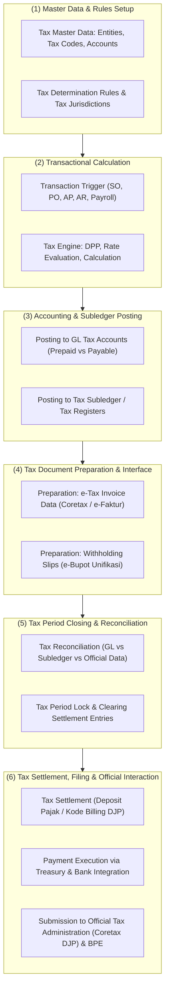
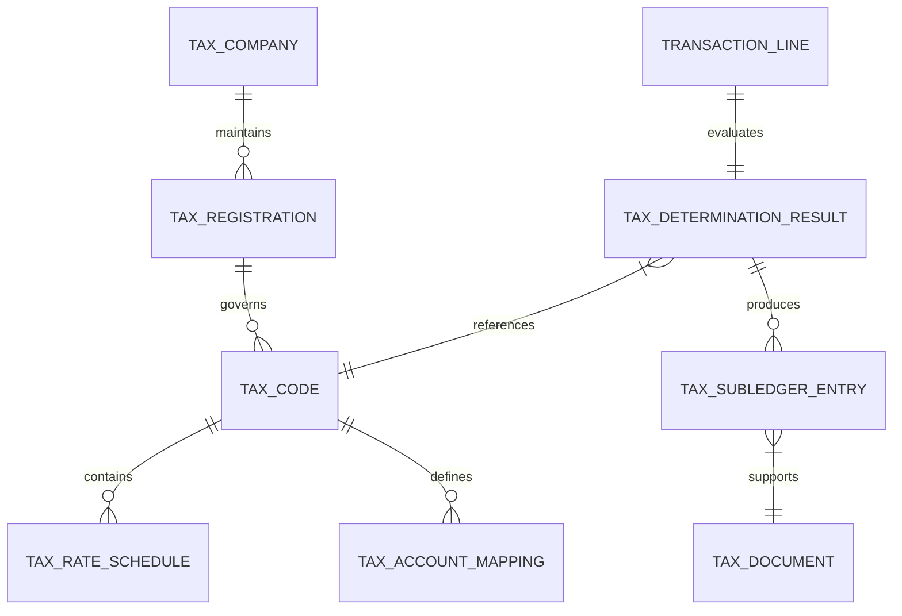

# Tax Management Fundamentals

## Definisi

**Tax Management Fundamentals (Fondasi Manajemen Perpajakan dalam ERP)** adalah arsitektur konseptual dan operasional di dalam Enterprise Resource Planning yang mengatur bagaimana kewajiban perpajakan diidentifikasi, dihitung, dicatat, direkonsiliasi, dilaporkan, dan disetorkan kepada otoritas perpajakan sesuai yurisdiksi hukum yang berlaku.

Dalam ekosistem ERP, modul perpajakan (*Tax Engine / Tax Management*) bukanlah aplikasi pencatat formulir statis yang terpisah, melainkan lapisan kendali lintas modul (*cross-module regulatory compliance layer*). Modul ini tertanam langsung di jantung setiap transaksi operasional:
1. Menentukan status keterpajakan suatu entitas bisnis (*Tax Subject*), barang/jasa (*Tax Object*), dan transaksi (*Tax Event*).
2. Menghitung Dasar Pengenaan Pajak (DPP) serta besaran pajak terutang secara otomatis saat transaksi dipicu di modul Sales, Purchasing, Inventory, Fixed Assets, Project, atau Payroll.
3. Menghasilkan pencatatan akuntansi (*tax accounting entries*) ke buku besar (*General Ledger*) yang memisahkan piutang/utang pajak dari nilai pendapatan atau beban komersial.
4. Memfasilitasi rekonsiliasi antara catatan komersial perusahaan dengan ketentuan perpajakan (*tax compliance and reporting*).

---

## Tujuan Bisnis (Purpose)

Penerapan Tax Management di dalam ERP bertujuan untuk:
1. **Mendukung Kepatuhan Regulasi (Regulatory Compliance Support):** Membantu memastikan transaksi entitas diproses selaras dengan peraturan perundang-undangan perpajakan yang berlaku (misalnya di Indonesia: UU KUP, UU PPh, UU PPN, UU HPP No. 7 Tahun 2021, serta regulasi turunan Kementerian Keuangan dan Direktorat Jenderal Pajak). ERP bertindak sebagai sistem pendukung kepatuhan, bukan penjamin mutlak kepatuhan hukum.
2. **Mitigasi Risiko Denda dan Sanksi (Penalty Mitigation):** Mengurangi potensi keterlambatan pelaporan, kesalahan pemotongan, atau ketidaksesuaian data transaksi yang berisiko memicu Surat Permintaan Penjelasan atas Data dan/atau Keterangan (SP2DK), Surat Tagihan Pajak (STP), atau Surat Ketetapan Pajak (SKP).
3. **Otomatisasi Kalkulasi Transaksional (Transactional Automation):** Menghilangkan proses manual dan potensi *human error* dalam menghitung Pajak Pertambahan Nilai (PPN), Pajak Penghasilan (PPh) Potong/Pungut (*Withholding Tax*), serta bea meterai atau pajak daerah.
4. **Rekonsiliasi Pajak Terintegrasi (Tax Reconciliation & Audit Readiness):** Menyediakan jejak audit (*audit trail*) yang andal antara subledger operasional (AR, AP, Payroll, Fixed Assets) dengan akun buku besar pajak dan pelaporan Surat Pemberitahuan (SPT) masa maupun tahunan.
5. **Optimasi Arus Kas Fiskal (Cash Flow Management):** Mengelola hak kredit pajak (*tax credits*) seperti PPN Masukan dan angsuran PPh Pasal 25 secara tepat waktu guna mencegah timbulnya biaya kas yang tidak perlu atau kelebihan bayar yang memicu pemeriksaan dini tanpa persiapan.

---

## Siklus Hidup Perpajakan ERP (Tax Lifecycle)

Siklus hidup manajemen perpajakan di dalam ERP berjalan secara berkelanjutan melalui enam tahapan utama yang bermuara pada interaksi dengan sistem administrasi perpajakan resmi (Coretax DJP):



---

## Batasan Domain: Tax vs Accounting vs Finance vs HR

Untuk menjaga kemurnian domain knowledge dan mencegah duplikasi fungsi antar-modul, ERP modern membagi batas tanggung jawab (*separation of concerns*) sebagai berikut:

| Aspek Domain | Modul Accounting (Phase 3) | Modul Finance (Phase 8) | Modul HR / Payroll (Phase 11) | Modul Tax Management (Phase 12) |
|---|---|---|---|---|
| **Fokus Utama** | Penyusunan laporan keuangan komersial sesuai standar akuntansi (IFRS / SAK). | Manajemen likuiditas, perbankan, treasury, dan eksekusi arus kas. | Perhitungan gaji, tunjangan, lembur, dan status keluarga pegawai. | Kepatuhan fiskal, penentuan aturan pajak, perhitungan DPP, dan pelaporan SPT. |
| **Buku Besar (GL)** | Menampung jurnal komersial debit/kredit seluruh aktivitas perusahaan. | Memonitor saldo kas/bank dan fasilitas pembiayaan. | Menyediakan jurnal kompensasi dan utang gaji kotor/bersih. | Mengelola akun perantara pajak (*tax clearing*), utang pajak, dan uang muka pajak. |
| **Kalkulasi Pajak** | Mencatat dampak laba/rugi atas beban pajak kini dan pajak tangguhan. | Tidak melakukan kalkulasi regulasi pajak. | Menghitung PPh 21 atas penghasilan pegawai berdasarkan PTKP dan tarif TER/Pasal 17. | Menentukan *tax code*, menghitung PPN/PPh Vendor, mengelola kompensasi lebih bayar fiskal. |
| **Dokumen Resmi** | *Balance Sheet*, *Income Statement*, *Trial Balance*. | *Cash Flow Statement*, Rekening Koran, *Payment Voucher*. | Slip Gaji (*Payslip*), Formulir 1721-A1/A2. | Faktur Pajak, Bukti Potong Unifikasi, SPT Masa (PPN, Unifikasi) & Tahunan. |
| **Eksekusi Kas** | Mengakui liabilitas utang pajak (*Tax Payable*). | Menyetor kas ke kas negara melalui kanal bank persepsi/billing. | Mengirim daftar transfer gaji bersih ke perbankan. | Memvalidasi kode billing dan mencocokkan NTPN dari otoritas pajak. |

---

## Entitas Kunci Domain Perpajakan (Core Entities)

Dalam skema konseptual ERP, data perpajakan dibangun di atas struktur hierarki entitas berikut:



1. **Tax Company / Tax Entity:** Entitas hukum yang terdaftar sebagai Wajib Pajak (WP) dan Pengusaha Kena Pajak (PKP), memiliki Nomor Pokok Wajib Pajak (NPWP) serta Nomor Induk Berusaha (NIB).
2. **Tax Registration:** Atribut registrasi fiskal per yurisdiksi, mencakup status PKP, tanggal pengukuhan, Kantor Pelayanan Pajak (KPP) terdaftar, dan klasifikasi lapangan usaha (KLU).
3. **Tax Code (Kode Pajak):** Identifier unik dalam ERP (misalnya `PPN-OUT-11`, `PPH23-SRV-2`) yang merepresentasikan kombinasi perlakuan pajak, jenis pajak, tarif, dan aturan pelaporan.
4. **Tax Rate Schedule (Effective Dating):** Jadwal tarif pajak yang memiliki tanggal berlaku efektif (*valid from* dan *valid to*). Fitur ini krusial untuk menangani perubahan tarif undang-undang tanpa memodifikasi transaksi historis.
5. **Tax Account Mapping:** Pemetaan akun buku besar spesifik untuk menampung PPN Masukan (*Prepaid VAT*), PPN Keluaran (*VAT Output Payable*), Utang PPh Potput (*WHT Payable*), dan Uang Muka PPh (*Prepaid Income Tax*).
6. **Tax Document:** Dokumen perpajakan resmi. Pada administrasi perpajakan Indonesia terkini (sistem Coretax DJP), faktur pajak elektronik (*e-Tax Invoice*) dan bukti pemotongan unifikasi (*e-Bupot*) dikelola dan diterbitkan secara terpusat melalui portal/API Coretax dengan penomoran otomatis oleh sistem. Sebagai konteks historis/migrasi, alur e-Faktur sebelumnya menggunakan mekanisme permohonan kuota Nomor Seri Faktur Pajak (NSFP) melalui e-Nofa dan aplikasi desktop client.

---

## Business Rules Fundamental Perpajakan

1. **Tax Point Rule (Saat Terutang Pajak):**
   Pajak harus diakui dan dihitung pada saat peristiwa pajak (*tax event*) terjadi sesuai hukum positif, mana yang terjadi lebih dahulu antara:
   - Penyerahan fisik atau penyelesaian jasa (*goods delivery / service completion*).
   - Penerbitan faktur komersial (*commercial invoice issuance*).
   - Pembayaran atau penerimaan uang muka (*advance payment receipt*).
2. **Effective Dating Rule:**
   Perhitungan tarif pajak tidak boleh bergantung pada saat entri data dibuat ke dalam sistem, melainkan wajib merujuk pada tanggal saat terutang pajak (*tax point date*).
3. **Tax Integrity & Immutability:**
   Ketika transaksi yang menghasilkan dokumen perpajakan resmi telah disetujui di portal otoritas pajak (seperti Coretax DJP) dan diterbitkan ke pihak ketiga, transaksi tersebut tidak boleh dihapus (*hard delete*). Penyesuaian wajib dilakukan melalui mekanisme Dokumen Pengganti / Perubahan (*Amendment / Replacement*) atau Pembatalan (*Cancellation*) sesuai ketentuan yang berlaku.
4. **Rounding & Currency Translation Rule:**
   Perhitungan nilai pajak transaksi mata uang asing wajib menggunakan kurs resmi otoritas perpajakan (Kurs Menteri Keuangan / KMK di Indonesia) yang berlaku pada tanggal saat terutang pajak, bukan kurs tengah bank komersial (Kurs Transaksi BI).
5. **Segregation of Duties (SoD) Rule:**
   Pengguna yang bertugas membuat transaksi operasional (Sales Order / PO) tidak boleh memiliki otorisasi tunggal untuk menerbitkan, menyetujui, dan membatalkan dokumen pajak resmi di portal otoritas pajak.

---

## Dampak Akuntansi (Accounting Impact)

Transaksi perpajakan menghasilkan dua kelompok besar posisi neraca:

1. **Pajak Tidak Langsung (Indirect Tax / PPN):**
   - Transaksi Pembelian: Menghasilkan PPN Masukan (*Input VAT*) yang dicatat di sisi Aset Lancar (*Current Assets - Prepaid Taxes*) jika dapat dikreditkan.
   - Transaksi Penjualan: Menghasilkan PPN Keluaran (*Output VAT*) yang dicatat di sisi Liabilitas Jangka Pendek (*Current Liabilities - Tax Payables*).
   - Pada akhir masa pajak, saldo PPN Keluaran dan PPN Masukan di-clearing. Selisih kurang bayar disetor ke kas negara (atau diselesaikan via akun deposit pajak), sedangkan lebih bayar dapat dikompensasikan ke masa berikutnya atau dimohonkan restitusi.
2. **Pajak Langsung & Potong/Pungut (Direct & Withholding Tax):**
   - Pembayaran Jasa Vendor: Memotong PPh Pasal 23 dari nilai tagihan vendor, membentuk Utang PPh 23 (*Current Liabilities*) yang wajib disetor ke kas negara atas nama vendor.
   - Pemotongan oleh Pelanggan: Saat pelanggan korporasi/pemerintah memotong PPh 23/22 atas tagihan kita, pemotongan tersebut diakui sebagai Uang Muka PPh (*Prepaid Income Tax - Current Assets*) yang berfungsi sebagai kredit pengurang Pajak Penghasilan Badan di akhir tahun fiskal.

---

## Skenario Kanonikal: PT Maju Bersama

Untuk memastikan konsistensi numerik di seluruh modul `11-tax`, digunakan data master kanonikal berikut:

* **Entitas Perusahaan:** `PT Maju Bersama`
* **Status Fiskal:** Pengusaha Kena Pajak (PKP) terdaftar sejak 2020.
* **Mata Uang Basis:** IDR (Rupiah).
* **Catatan Regulasi Tarif PPN:**
  Berdasarkan Undang-Undang Harmonisasi Peraturan Perpajakan (UU HPP No. 7 Tahun 2021) jo. PMK No. 131/PMK.03/2024 dan PMK No. 11 Tahun 2025, tarif statutory PPN di Indonesia ditetapkan sebesar 12%. Untuk penyerahan Barang Kena Pajak dan Jasa Kena Pajak non-mewah, pemerintah menerapkan mekanisme Dasar Pengenaan Pajak (DPP) Nilai Lain sebesar 11/12 dari harga jual/penggantian, sehingga beban pajak efektif yang ditanggung konsumen tetap sebesar **11%** (12% x 11/12). 
  Tarif 11% yang dicantumkan pada angka transaksi kanonikal berikut digunakan sebagai **asumsi pembelajaran ilustratif** untuk menjaga konsistensi lintas modul. Dalam desain ERP modern, mesin penentu pajak (*tax engine*) wajib mendukung *effective dating* dan formula DPP fleksibel agar mampu beralih antara tarif statutory, DPP Nilai Lain, maupun skema Besaran Tertentu sesuai tanggal transaksi (*tax point*).

### 1. Transaksi Pembelian (Purchasing P2P)
* **Pemasok:** `PT Sumber Teknologi` (PKP terdaftar).
* **Barang:** Laptop Pro sebanyak 10 unit @ Rp700.000.
* **Dasar Pengenaan Pajak (DPP):** 10 x Rp700.000 = Rp7.000.000.
* **PPN Masukan (Input VAT 11% ilustratif):** Rp770.000.
* **Total Utang Dagang (AP):** Rp7.770.000.

Jurnal Pembelian di ERP:
```text
(Db) Persediaan / Beban Pembelian          Rp7.000.000
(Db) PPN Masukan (Prepaid VAT)             Rp  770.000
    (Cr) Utang Usaha (Accounts Payable)                  Rp7.770.000
```

### 2. Transaksi Penjualan (Sales O2C)
* **Pelanggan:** Klien Korporasi / `PT Klien Utama`.
* **Barang:** Laptop Pro sebanyak 10 unit @ Rp1.000.000.
* **Dasar Pengenaan Pajak (DPP):** 10 x Rp1.000.000 = Rp10.000.000.
* **PPN Keluaran (Output VAT 11% ilustratif):** Rp1.100.000.
* **Total Piutang Usaha (AR):** Rp11.100.000.

Jurnal Penjualan di ERP:
```text
(Db) Piutang Usaha (Accounts Receivable)   Rp11.100.000
    (Cr) Pendapatan Penjualan (Revenue)                  Rp10.000.000
    (Cr) PPN Keluaran (VAT Output Payable)               Rp 1.100.000
```

### 3. Posisi Settlement PPN Masa Berjalan
* Saldo PPN Keluaran Terutang: Rp1.100.000
* Saldo PPN Masukan Dapat Dikreditkan: (Rp770.000)
* **PPN Kurang Bayar (Net Tax Payable):** Rp330.000

Jurnal Settlement / Penutupan Pajak Masa:
```text
(Db) PPN Keluaran                          Rp1.100.000
    (Cr) PPN Masukan                                     Rp  770.000
    (Cr) Utang PPN Kurang Bayar (Clearing Account)       Rp  330.000
```

---

## Implementasi ERP Universal

Secara arsitektural, modul perpajakan ERP modern menerapkan tiga pilar arsitektur utama:

1. **Decoupled Tax Engine:**
   Mesin kalkulasi pajak dipisahkan dari logika bisnis penjualan atau pembelian. Modul operasional hanya mengirimkan objek transaksi standar (*Context Payload*: entitas pembeli, entitas penjual, item barang/jasa, tanggal pengiriman, alamat asal, alamat tujuan, nilai transaksi) ke Tax Engine, dan Tax Engine mengembalikan rincian pajak (Tax Code, DPP, Tarif, Nilai Pajak, Pemetaan Akun GL).
2. **Tax Jurisdictions & Nexus Engine:**
   Dalam perusahaan multinasional atau multi-cabang, sistem mengelola yurisdiksi perpajakan berdasarkan lokasi fisik (*ship-from*, *ship-to*) atau kehadiran bisnis (*nexus*), memungkinkan penerapan aturan PPN, Sales Tax, atau GST yang berbeda dalam satu instalasi sistem.
3. **Tax Audit Log & Digital Certificate Storage:**
   Menyimpan riwayat utuh seluruh payload XML/JSON yang dipertukarkan dengan gateway otoritas pajak pemerintah, tanda tangan digital (*digital signature*), serta bukti penerimaan elektronik sebagai arsip kepatuhan hukum (*legal audit trail*).

---

## Perbandingan Software ERP

| Dimensi Arsitektur | Odoo (v16 - v18) | ERPNext (v14 - v15) | Microsoft Dynamics 365 F&O |
|---|---|---|---|
| **Struktur Tax Engine** | Dikelola melalui *Account Tax* dengan fleksibilitas *Fiscal Position* untuk pemetaan ulang otomatis berdasarkan lokasi partner. | Dikelola melalui *Sales/Purchase Taxes and Charges Template* dan *Tax Category*. | Menggunakan *Core Tax Engine* khusus yang berbasis *Tax Calculation Service* dengan parameter penentu multi-atribut. |
| **Effective Dating Tarif** | Memerlukan pembuatan *tax record* baru atau penggantian via Fiscal Position pada tanggal pergantian regulasi. | Mendukung pembaruan *Item Tax Template* atau penyesuaian manual pada *Taxes Template*. | Mendukung *Effective Dating* asli secara granular di level kode pajak dan yurisdiksi. |
| **Withholding Tax** | Menggunakan *Tax on Payment / Retention* atau modul lokalisasi pihak ketiga (*third-party module*). | Fitur asli *Withholding Tax Category* yang memotong tagihan AP/AR pada saat posting atau payment. | Mendukung modul *Withholding Tax* bawaan dengan konfigurasi ambang batas (*thresholds*) dan sertifikat potong. |
| **Integrasi Pajak Indonesia** | Modul lokalisasi Indonesia (*l10n_id*) mendukung format ekspor dan integrasi gateway perpajakan (Coretax / PJAP API). Alur lama menggunakan pertukaran berkas CSV e-Faktur. | Mendukung format ekspor terstruktur dan integrasi regional Frappe untuk kepatuhan administrasi perpajakan Indonesia. | Memiliki fitur *Electronic Invoicing Service* untuk integrasi kepatuhan pajak elektronik global dan gateway perpajakan nasional. |

---

## Pertimbangan Desain Naventra (Naventra Consideration)

Dalam pengembangan ERP Naventra, modul perpajakan dirancang dengan prinsip-prinsip arsitektur berikut:

1. **Tax Engine Standalone Service:**
   Hindari menempelkan (*hardcode*) rumus perhitungan pajak di dalam kode modul Sales Order atau Purchase Order. Bangun layanan `TaxCalculationEngine` yang independen yang menerima model transaksi dan menghasilkan respons pajak terstruktur.
2. **Mandatory Effective Dating & Flexible DPP Formula:**
   Setiap `tax_code` di Naventra wajib memiliki tabel relasional `tax_rates` dengan kolom `valid_from`, `valid_to`, dan `dpp_factor` (misal 11/12 untuk penyerahan non-mewah sesuai PMK 131/2024 jo PMK 11/2025). Hal ini membantu memastikan transaksi tanggal lampau yang di-repost tidak akan mengalami distorsi tarif saat terjadi perubahan regulasi.
3. **Pemisahan Akun Komersial vs Fiskal:**
   Naventra secara ketat memisahkan kode akun penampung pajak dari pendapatan/beban murni, sehingga mempermudah penyusunan laporan keuangan komersial dan rekonsiliasi fiskal tahunan tanpa perlu penyesuaian manual di luar sistem.
4. **Audit Immutability:**
   Setiap transaksi pajak yang telah disetujui di portal otoritas perpajakan dikunci (*immutable*). Pembatalan atau revisi transaksi hanya dapat dilakukan melalui mekanisme pembuatan dokumen penyesuaian/pembatalan resmi dan jurnal pembalik.

---

## Referensi

* Undang-Undang Republik Indonesia No. 7 Tahun 2021 tentang Harmonisasi Peraturan Perpajakan (UU HPP).
* Undang-Undang Republik Indonesia No. 42 Tahun 2009 tentang Pajak Pertambahan Nilai Barang dan Jasa dan Pajak Penjualan atas Barang Mewah (UU PPN).
* Peraturan Menteri Keuangan No. 131/PMK.03/2024 tentang Perlakuan PPN Sehubungan dengan Berlakunya Tarif PPN 12%.
* Peraturan Menteri Keuangan No. 11 Tahun 2025 tentang Perhitungan PPN dengan DPP Nilai Lain dan Besaran Tertentu.
* Direktorat Jenderal Pajak: *Panduan Sistem Inti Administrasi Perpajakan (Coretax DJP)*.
* Peraturan Direktur Jenderal Pajak Nomor PER-03/PJ/2022 tentang Faktur Pajak sebagaimana telah diubah dengan PER-11/PJ/2022 (Konteks Historis/Transisi e-Faktur).
* International Financial Reporting Standards (IFRS): IAS 12 *Income Taxes*.
* Microsoft Dynamics 365 Finance Documentation: *Tax Calculation Service Overview and Architecture* (Microsoft Learn).
* ERPNext Documentation: *Tax Rule and Withholding Tax Engine* (Frappe Technologies).
* Odoo Accounting Documentation: *Taxes, Fiscal Positions, and Tax Return Management*.
