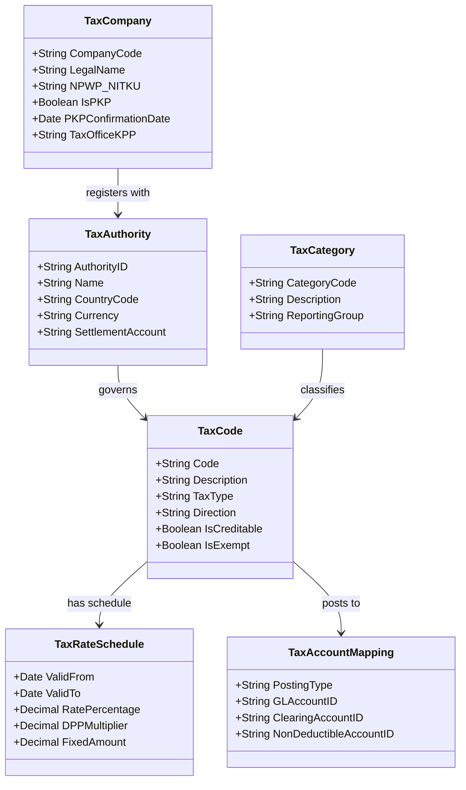
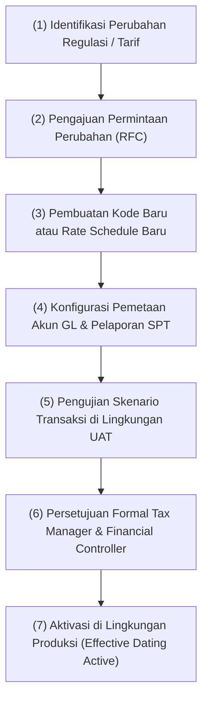

# Tax Master Data and Tax Code

## Definisi

**Tax Master Data and Tax Code (Data Master Pajak dan Kode Pajak)** adalah struktur data statis dan konfigurasi inti di dalam ERP yang mendefinisikan seluruh parameter, entitas hukum, tarif, aturan pemotongan/pemungutan, dan pemetaan akun buku besar yang digunakan untuk menjalankan kalkulasi serta kepatuhan perpajakan secara konsisten di seluruh modul transaksi.

Di pusat struktur ini berada **Tax Code (Kode Pajak)**: sebuah pengidentifikasi unik (*unique identifier*) yang merangkum aturan perpajakan, mengikat jenis pajak (*Tax Type*), kategori pajak (*Tax Category*), tarif berlaku (*Rate Schedule*), perlakuan kredit (*Tax Deductibility*), dan akun buku besar tujuan (*GL Account Mapping*).

---

## Tujuan Bisnis (Purpose)

Pengelolaan Tax Master Data dan Tax Code yang terstruktur bertujuan untuk:
1. **Standarisasi Kebijakan Fiskal (Tax Policy Standardization):** Memastikan seluruh unit bisnis dan cabang menerapkan perlakuan pajak yang seragam tanpa adanya diskresi manual dari staf entri data.
2. **Fleksibilitas Menghadapi Perubahan Regulasi (Statutory Adaptability):** Memfasilitasi perubahan tarif atau penambahan skema perpajakan baru melalui konfigurasi data (*data-driven rules*), bukan melalui perubahan kode program (*hardcoding*).
3. **Pemisahan Perlakuan Akuntansi (Automated Financial Segregation):** Mengarahkan nilai pajak secara otomatis ke akun neraca yang tepat (PPN Masukan, PPN Keluaran, Uang Muka PPh, Utang PPh) sehingga saldo piutang/utang pajak selalu terisolasi dari pendapatan atau beban komersial.
4. **Validasi Kredensial Mitra Bisnis (Partner Tax Validation):** Memvalidasi Nomor Pokok Wajib Pajak (NPWP 16 digit / NIK / NITKU), status Pengusaha Kena Pajak (PKP), dan alamat legal pelanggan maupun pemasok untuk mendukung keabsahan dokumen pajak resmi.
5. **Jejak Audit dan Tata Kelola (Audit Trail & Governance):** Memastikan setiap perubahan tarif atau pemetaan akun memiliki catatan log yang lengkap, tanggal berlaku efektif yang jelas, dan persetujuan yang terotorisasi.

---

## Struktur Entitas Data Master Pajak

Dalam arsitektur ERP tingkat *enterprise*, data master perpajakan tersusun dalam hierarki relasional berikut:



1. **Tax Company / Entitas Legal:** Data Wajib Pajak entitas sendiri, mencakup NPWP (format 16 digit / NIK untuk orang pribadi), identitas Pengusaha Kena Pajak (PKP), Kantor Pelayanan Pajak (KPP), dan rekening bank penyetoran.
2. **Tax Authority (Otoritas Pajak / Yurisdiksi):** Badan penerima setoran pajak (misalnya Direktorat Jenderal Pajak / DJP di Indonesia, Internal Revenue Service / IRS di AS, atau Royal Malaysian Customs Department).
3. **Tax Type (Jenis Pajak):** Klasifikasi mendasar perpajakan, seperti *Value Added Tax* (VAT/PPN), *Withholding Tax* (PPh Potput Pasal 21, 23, 26, 4(2)), *Corporate Income Tax* (CIT/PPh Badan), *Customs/Excise* (Bea Masuk/Cukai), dan Pajak Daerah (PB1/PBJT).
4. **Tax Category (Kategori Keterpajakan):** Penanda perlakuan transaksi, misalnya: Standar (*Standard Rated*), Tarif Nol (*Zero Rated / Ekspor*), Dibebaskan (*Exempt*), atau Tidak Dipungut (*Out of Scope / Non-Taxable*).
5. **Tax Code (Kode Pajak):** Kunci konfigurasi yang digunakan pada transaksi operasional (misalnya `PPN-OUT-11`, `PPN-IN-11`, `PPH23-SRV-2`).
6. **Tax Rate Schedule (Jadwal Tarif Berdasarkan Tanggal):** Rincian persentase tarif dan faktor DPP yang dilengkapi rentang waktu berlaku (*effective dating*: `valid_from` dan `valid_to`).
7. **Tax Account Mapping:** Penentuan nomor akun General Ledger spesifik berdasarkan jenis transaksi (aset pajak, liabilitas pajak, beban pajak non-kreditabel, atau akun kliring).

---

## Anatomi Tax Code

Sebuah Tax Code di dalam sistem ERP memiliki atribut fungsional yang sangat spesifik:

| Atribut | Deskripsi | Contoh Konfigurasi |
|---|---|---|
| **Tax Code ID** | Identifier unik kode pajak. | `PPN-IN-CR-11` |
| **Description** | Penjelasan peruntukan kode pajak. | PPN Masukan Beban Efektif 11% (Dapat Dikreditkan) |
| **Tax Type** | Klasifikasi jenis pajak. | PPN / VAT |
| **Direction** | Arah aliran transaksi (Input vs Output). | Input (Purchasing) |
| **Deductibility / Creditable** | Status hak pengkreditan pajak masukan. | True (Dapat Dikreditkan) |
| **Calculation Basis** | Formula penentu Dasar Pengenaan Pajak (DPP). | Standar (100%) atau DPP Nilai Lain (11/12 sesuai PMK 131/2024 jo PMK 11/2025) |
| **Effective Rate Schedule** | Jadwal tarif dan rentang waktu berlaku. | Valid per tanggal transaksi: Tarif statuter 12% x DPP 11/12 (atau tarif ilustratif 11%) |
| **Debit GL Account** | Akun pencatatan sisi debit. | `115100 - PPN Masukan Dibayar di Muka` |
| **Credit GL Account (Clearing)** | Akun perantara kliring saat settlement. | `214100 - PPN Settlement Clearing` |
| **Reporting Tax Classification** | Pemetaan klasifikasi pelaporan resmi. | Akun Wajib Pajak Coretax / e-Tax Invoice (historis: SPT 1111 Formulir B2) |

---

## Business Process: Konfigurasi dan Pembaruan Master Data Pajak

Proses bisnis pemeliharaan data master pajak harus mengikuti prosedur tata kelola yang ketat:



---

## Business Rules Tax Master Data

1. **Effective Dating Immutability Rule:**
   Tarif pada kode pajak tidak boleh diubah dengan menimpa (*overwrite*) data yang sudah ada jika kode tersebut telah digunakan oleh transaksi aktif. Penyesuaian tarif dilakukan dengan menambahkan baris baru pada *Rate Schedule* dengan menentukan tanggal `valid_from` yang baru, atau menerbitkan Tax Code baru untuk yurisdiksi yang mewajibkannya.
2. **Zero-Rate vs Exempt Distinction Rule:**
   ERP harus membedakan secara tegas antara transaksi bertarif 0% (*Zero-Rated*, misalnya penyerahan ekspor di mana PPN Masukannya tetap dapat dikreditkan) dengan transaksi yang dibebaskan (*Exempt*, di mana penyerahan tidak terutang PPN dan PPN Masukan terkait tidak dapat dikreditkan serta wajib dibiayakan).
3. **Partner Tax Identifier Validation Rule:**
   Sistem harus memvalidasi kelengkapan data mitra sebelum transaksi final dibukukan:
   - Pelanggan PKP: Wajib memiliki NPWP valid (16 digit), nama legal sesuai SKT/SPPKP, dan alamat terdaftar.
   - Pelanggan Non-PKP / Ritel: Dapat menggunakan NIK atau nomor identitas resmi lainnya.
   - Pemasok: Validasi status PKP menentukan apakah dokumen tagihan dapat dipasangkan dengan Faktur Pajak Masukan.
4. **GL Account Integrity Rule:**
   Akun GL yang telah dialokasikan sebagai akun penampung pajak (*Tax Ledger Account*) harus dikonfigurasi dengan flag proteksi di Chart of Accounts agar tidak dapat dijurnal secara manual oleh staf akuntansi umum (*block direct manual journal entry*), guna mencegah distorsi rekonsiliasi antara subledger pajak dan buku besar.

---

## Dampak Akuntansi (Accounting Impact)

Data master pajak mengendalikan secara langsung posting jurnal di modul Accounting (Phase 3). 

Sebagai ilustrasi, mari kita telaah dampak dari dua konfigurasi Tax Code yang berbeda terhadap transaksi pembelian barang:

### Kasus A: PPN Masukan Dapat Dikreditkan (`PPN-IN-CR-11`)
Akun GL terkonfigurasi:
- Akun Beban/Aset Persediaan: `113100 - Persediaan Barang Dagang`
- Akun Pajak Masukan: `115100 - PPN Masukan Dibayar di Muka` (Aset Lancar)
- Akun Utang: `211100 - Utang Usaha (AP)`

### Kasus B: PPN Masukan Tidak Dapat Dikreditkan (`PPN-IN-NC-11`)
(Misalnya untuk pembelian kendaraan operasional sedan direksi atau transaksi yang tidak berhubungan langsung dengan kegiatan usaha sesuai Pasal 9 ayat 8 UU PPN).
Akun GL terkonfigurasi:
- Opsi 1 (Kapitalisasi ke Aset/Beban): Masuk langsung ke nilai persediaan/beban (`113100`).
- Opsi 2 (Akun Beban Pajak Terpisah): `619100 - Beban Pajak Non-Kreditabel` (Laba Rugi).

---

## Skenario Kanonikal: PT Maju Bersama

Merujuk pada skenario kanonikal `PT Maju Bersama`:
* **Tarif PPN yang digunakan:** 11% (asumsi pembelajaran ilustratif. Sesuai UU HPP jo PMK 131/2024 dan PMK 11/2025, tarif statutory 12% dipadukan dengan DPP Nilai Lain 11/12 untuk BKP/JKP non-mewah menghasilkan beban pajak efektif 11%).

### 1. Konfigurasi Master Tax Code Pembelian
* **Tax Code ID:** `PPN-IN-11`
* **Effective Rule:** Tarif statutory 12% x DPP 11/12 (beban efektif 11%, asumsi pembelajaran)
* **Status:** Dapat Dikreditkan (*Creditable*)
* **GL Account:** `115100 - PPN Masukan`

Transaksi Pembelian dari `PT Sumber Teknologi` (10 unit Laptop Pro @ Rp700.000):
* DPP: Rp7.000.000
* Nilai Pajak: Rp7.000.000 x 11% = Rp770.000
* Total Tagihan AP: Rp7.770.000

Jurnal Otomatis yang Dihasilkan Sistem:
```text
(Db) Persediaan Laptop Pro                 Rp7.000.000
(Db) PPN Masukan (Tax Code: PPN-IN-11)     Rp  770.000
    (Cr) Utang Usaha - PT Sumber Teknologi               Rp7.770.000
```

### 2. Konfigurasi Master Tax Code Penjualan
* **Tax Code ID:** `PPN-OUT-11`
* **Rate:** 11% (Valid from: 01/04/2022)
* **Status:** Terutang Pajak (*Output Tax*)
* **GL Account:** `214100 - PPN Keluaran`

Transaksi Penjualan ke Klien (10 unit Laptop Pro @ Rp1.000.000):
* DPP: Rp10.000.000
* Nilai Pajak: Rp10.000.000 x 11% = Rp1.100.000
* Total Tagihan AR: Rp11.100.000

Jurnal Otomatis yang Dihasilkan Sistem:
```text
(Db) Piutang Usaha - Klien                 Rp11.100.000
    (Cr) Pendapatan Penjualan Laptop Pro                 Rp10.000.000
    (Cr) PPN Keluaran (Tax Code: PPN-OUT-11)             Rp 1.100.000
```

---

## Implementasi ERP Universal

Arsitektur data master perpajakan modern dibangun dengan prinsip *loosely-coupled master data*:
1. **Tax Matrix Determination:** Sistem tidak mengharuskan pengguna memilih Tax Code secara manual pada setiap baris transaksi. Sebaliknya, ERP menggunakan matriks penentu (*Determination Matrix*) yang menggabungkan:
   - *Customer/Vendor Tax Class* (misalnya: PKP Badan, Instansi Pemerintah Pemungut, Karyawan Pribadi).
   - *Item Tax Class* (misalnya: BKP Standar, BKP Tertentu, Jasa Kena Pajak, Barang Non-BKP).
   - *Geographic Tax Zone* (misalnya: Domestik, Kawasan Bebas Batam, Luar Negeri/Ekspor).
2. **Multi-Currency Tax Rate Table:** Mengelola tabel nilai tukar kurs pajak resmi (*Tax Official Exchange Rate Table*) yang diperbarui secara mingguan sesuai keputusan otoritas moneter/kementerian keuangan.
3. **Tax Form Box Association:** Menghubungkan setiap kode pajak dengan nomor kolom dan lampiran pada formulir pelaporan resmi pemerintah, memastikan data siap diekspor ke format pelaporan standar (seperti berkas XML atau integrasi API Coretax).

---

## Perbandingan Software ERP

| Aspek Master Data | Odoo (v16 - v18) | ERPNext (v14 - v15) | Microsoft Dynamics 365 F&O |
|---|---|---|---|
| **Entitas Utama** | `account.tax` yang dikelompokkan dalam `account.tax.group`. | `Sales/Purchase Taxes and Charges Template` dan `Tax Category`. | `Tax Table` (Sales Tax Code), `Tax Group`, dan `Item Tax Group`. |
| **Mekanisme Effective Dating** | Tidak memiliki tabel jadwal tarif bertanggal bawaan di dalam satu `account.tax`; perubahan tarif biasanya dilakukan dengan membuat kode pajak baru atau mengubah *Fiscal Position*. | Memiliki kolom tanggal pada *Item Tax Template*, namun penyesuaian tarif massal sering membutuhkan pembaruan template. | Memiliki fitur *Tax Values* dengan `From Date` dan `To Date` yang sangat kuat di dalam satu kode pajak yang sama. |
| **Pemetaan Akun Buku Besar** | Dikonfigurasi pada tab *Definition* di setiap *Tax* (akun debit, akun kredit, serta pengaturan pembalik). | Ditentukan langsung pada baris tabel pajak dengan memilih nama akun GL yang sesuai dari Chart of Accounts. | Dikonfigurasi terpusat di *Ledger Posting Groups*, memisahkan akun *Sales Tax Payable*, *Sales Tax Receivable*, dan *Use Tax Expense*. |
| **Klasifikasi Pajak Mitra** | Dikelola melalui *Fiscal Position* yang mendefinisikan aturan pemetaan ulang pajak (*tax mapping rules*). | Dikelola melalui *Tax Category* pada master *Customer* dan *Supplier*. | Dikelola melalui *Sales Tax Group* pada master *Vendor* dan *Customer*. |

---

## Pertimbangan Desain Naventra (Naventra Consideration)

Pada implementasi ERP Naventra, arsitektur master data perpajakan dibangun dengan fondasi relasional yang kokoh:

1. **Relasi Granular `tax_codes` dan `tax_rates`:**
   Tabel `tax_codes` bertindak sebagai *header* deklaratif, sementara tabel `tax_rates` menampung riwayat tarif berbasis tanggal:
   ```sql
   CREATE TABLE tax_rates (
       id UUID PRIMARY KEY,
       tax_code_id UUID REFERENCES tax_codes(id),
       rate_percentage DECIMAL(5,2) NOT NULL,
       valid_from DATE NOT NULL,
       valid_to DATE,
       is_active BOOLEAN DEFAULT TRUE
   );
   ```
2. **Kategori Deterministik:**
   Naventra mewajibkan setiap kode pajak memiliki relasi langsung ke `tax_type` (`VAT`, `WHT_21`, `WHT_23`, `WHT_4_2`, `CIT`) dan `reporting_box` (nomor formulir SPT) guna mengotomatisasi penyusunan laporan SPT tanpa proses pemetaan manual di akhir periode.
3. **Pemberian Hak Akses Terbatas:**
   Hanya staf dengan wewenang *Tax Administrator* atau *Financial Controller* yang memiliki izin untuk membuat atau mengubah data master pajak. Perubahan langsung dicatat ke tabel `tax_master_audit_trail`.

---

## Referensi

* Undang-Undang Republik Indonesia No. 7 Tahun 2021 tentang Harmonisasi Peraturan Perpajakan (UU HPP).
* Peraturan Pemerintah Republik Indonesia No. 44 Tahun 2022 tentang Penerapan terhadap Pajak Pertambahan Nilai Barang dan Jasa dan Pajak Penjualan atas Barang Mewah.
* Peraturan Menteri Keuangan No. 131/PMK.03/2024 tentang Perlakuan PPN Sehubungan dengan Berlakunya Tarif PPN 12%.
* Peraturan Menteri Keuangan No. 11 Tahun 2025 tentang Perhitungan PPN dengan DPP Nilai Lain dan Besaran Tertentu.
* Direktorat Jenderal Pajak: *Panduan Sistem Inti Administrasi Perpajakan (Coretax DJP)*.
* ERPNext Documentation: *Tax Rule, Sales Taxes and Charges Template, Item Tax Template* (Frappe).
* Odoo Accounting User Guide: *Managing Taxes and Fiscal Positions* (Odoo S.A.).
* Microsoft Dynamics 365 Finance Guide: *Sales Tax Codes, Tax Groups, and Ledger Posting Groups* (Microsoft Learn).
