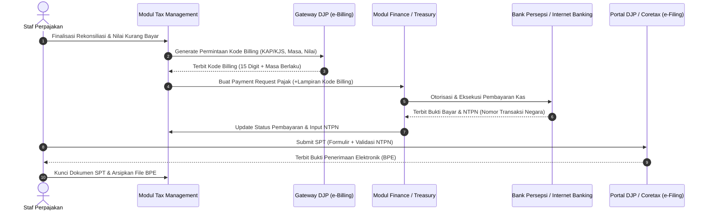

# Tax Payment and Tax Return

## Definisi

**Tax Payment and Tax Return (Pembayaran Pajak dan Penyampaian Surat Pemberitahuan / SPT)** adalah tahap eksekusi akhir dalam siklus manajemen perpajakan di dalam ERP di mana liabilitas pajak yang telah dihitung dan direkonsiliasi disetorkan secara moneter ke kas negara melalui kanal perbankan/persepsi resmi, dan dokumen deklarasi kepatuhan fiskal formal (Surat Pemberitahuan / SPT Masa maupun Tahunan) dilaporkan kepada otoritas perpajakan.

Dalam ekosistem perpajakan Indonesia, proses ini berputar di sekitar integrasi antara:
1. **Kode Akun Pajak (KAP) dan Kode Jenis Setoran (KJS):** Klasifikasi standar untuk mengarahkan setoran ke pos penerimaan negara yang tepat.
2. **Kode Billing (e-Billing DJP):** Kode identifikasi transaksi pembayaran 15 digit yang diterbitkan oleh sistem penagihan Direktorat Jenderal Pajak.
3. **Nomor Transaksi Penerimaan Negara (NTPN):** Nomor bukti sah yang diterbitkan oleh sistem kas negara setelah dana berhasil dipindahbukukan melalui Bank Persepsi.
4. **Bukti Penerimaan Elektronik (BPE):** Tanda terima resmi yang membuktikan bahwa SPT telah berhasil diterima dan divalidasi oleh sistem administrasi perpajakan pemerintah.

---

## Tujuan Bisnis (Purpose)

Pengelolaan alur pembayaran dan pelaporan pajak yang terintegrasi di dalam ERP bertujuan untuk:
1. **Menghindari Sanksi Keterlambatan Setor dan Lapor:** Mendukung ketepatan waktu eksekusi pembayaran kas dan penyampaian SPT sebelum batas waktu hukum (*statutory deadline*) berakhir.
2. **Kesesuaian Kode Penyetoran (Zero-Error Tax Routing):** Mencegah kesalahan input KAP/KJS yang dapat menyebabkan dana tersangkut di pos penerimaan yang keliru dan memerlukan proses Pemindahbukuan (Pbk) yang memakan waktu berbulan-bulan.
3. **Penyelarasan Kas dan Beban Liabilitas (Treasury-Tax Alignment):** Menghubungkan modul perpajakan dengan modul Treasury/Cash Management (Phase 8) untuk mengeksekusi pengeluaran kas secara terotorisasi.
4. **Pengarsipan Bukti Sah Digital (Statutory Digital Vault):** Menyimpan rekam jejak Kode Billing, struk bukti bank, NTPN, dan BPE secara terpusat untuk menghadapi pemeriksaan kepatuhan fiskal.

---

## Alur Kerja Pembayaran dan Pelaporan Terintegrasi



---

## Klasifikasi Kode Akun Pajak (KAP) dan Kode Jenis Setoran (KJS)

Sistem ERP memetakan transaksi penutupan pajak ke dalam tabel referensi KAP/KJS resmi:

| Jenis Pajak | Kode Akun Pajak (KAP) | Kode Jenis Setoran (KJS) | Uraian Pembayaran |
|---|---|---|---|
| **PPN Dalam Negeri** | `411211` | `100` | Setoran Masa PPN Kurang Bayar (SPT Masa 1111) |
| **PPh Pasal 25 Badan** | `411126` | `100` | Setoran Masa Angsuran Bulanan PPh Badan |
| **PPh Pasal 29 Badan** | `411126` | `200` | Setoran Pajak Kurang Bayar SPT Tahunan PPh Badan |
| **PPh Pasal 23 Jasa** | `411124` | `104` | Setoran Masa PPh 23 atas Jasa (SPT Unifikasi) |
| **PPh Final 4 ayat (2)** | `411128` | `403` | Setoran PPh Final Persewaan Tanah dan Bangunan |
| **PPh Pasal 21 Pegawai** | `411121` | `100` | Setoran Masa PPh 21 atas Upah/Gaji Pegawai |

---

## Business Rules Pembayaran dan Pelaporan Pajak

1. **Payment Precedence Rule (Bayar Sebelum Lapor):**
   Sistem ERP melarang penyampaian draf SPT apabila nilai pajak kurang bayar belum memiliki Nomor Transaksi Penerimaan Negara (NTPN) yang valid. Pelaporan SPT tanpa bukti pembayaran yang sah akan otomatis ditolak oleh gateway penerimaan pajak.
2. **Billing Validity Monitoring Rule:**
   Setiap Kode Billing yang diterbitkan memiliki masa kadaluwarsa (biasanya 30 hari sejak penerbitan). Sistem wajib memonitor sisa masa berlaku kode billing. Jika masa berlaku habis sebelum pembayaran dieksekusi oleh treasury, sistem harus membatalkan kode lama dan membuat kode billing baru.
3. **NTPN Uniqueness & Integrity Rule:**
   Satu nomor NTPN hanya dapat dipasangkan pada satu dokumen pembayaran di ERP dan tidak boleh diduplikasi untuk transaksi lain guna mencegah manipulasi pencatatan kas negara.
4. **Mandatory 5-Year Archiving Rule (Pasal 28 UU KUP):**
   Seluruh dokumen elektronik yang mencakup berkas SPT (XML/PDF), lembar Kode Billing, konfirmasi transfer bank, bukti NTPN, dan lembar BPE wajib disimpan dalam basis data terenkripsi dan dapat diakses sekurang-kurangnya 5 (lima) tahun atau sampai daluwarsa penetapan pajak berakhir.

---

## Dampak Akuntansi (Accounting Impact)

Eksekusi pembayaran pajak membalik liabilitas pajak yang telah terbentuk saat rekonsiliasi penutupan masa:

### 1. Pembayaran Utang PPN Kurang Bayar Masa Berjalan
```text
(Db) Utang PPN Kurang Bayar (Settlement Account)  Rp  330.000
    (Cr) Kas dan Bank (Bank Operasional)                         Rp  330.000
```
*(Deskripsi Jurnal: Pelunasan PPN Masa Berjalan, KAP 411211 KJS 100, NTPN: DUMMY-NTPN-001)*.

### 2. Pembayaran Utang PPh Pasal 29 Akhir Tahun
```text
(Db) Utang PPh Pasal 29 (Liabilitas Lancar)       Rp16.100.000
    (Cr) Kas dan Bank (Bank Operasional)                         Rp16.100.000
```
*(Deskripsi Jurnal: Pelunasan SPT Tahunan PPh Badan, KAP 411126 KJS 200, NTPN: DUMMY-NTPN-002)*.

---

## Skenario Kanonikal: PT Maju Bersama

Melanjutkan data transaksi terpadu `PT Maju Bersama`:

### 1. Pembayaran dan Pelaporan PPN Bulanan
* **Objek:** PPN Kurang Bayar Masa Berjalan.
* **Nominal:** Rp330.000.
* **Klasifikasi Fiskal:** KAP `411211`, KJS `100`.
* **Eksekusi di ERP:**
  1. Modul Tax meminta pembuatan Kode Billing atau pemindahbukuan deposit pajak pada sistem Coretax: Diterbitkan Kode Billing fiktif `DUMMY-BILLING-001`.
  2. Modul Treasury mengeksekusi transfer dari rekening bank operasional pada tanggal 28 bulan berikutnya.
  3. Respon Perbankan / Kas Negara: Diterbitkan bukti transfer dengan **NTPN `DUMMY-NTPN-001`** (identifikasi fiktif untuk ilustrasi pembelajaran).
  4. Pelaporan: SPT Masa PPN disampaikan ke portal pajak / Coretax dengan validasi data pembayaran tersebut.
  5. Bukti Lapor: Diterbitkan **Bukti Penerimaan Elektronik (BPE) No: `DUMMY-BPE-PPN-001`**.

### 2. Pembayaran dan Pelaporan PPh Badan Tahunan
* **Objek:** PPh Pasal 29 Kurang Bayar Tahun Pajak Berjalan.
* **Nominal:** Rp16.100.000 (Pajak terutang Rp23.100.000 dikurangi kredit pajak Rp7.000.000).
* **Klasifikasi Fiskal:** KAP `411126`, KJS `200`.
* **Eksekusi di ERP:**
  1. Modul Tax menghasilkan Kode Billing Tahunan: Kode Billing `DUMMY-BILLING-002`.
  2. Bagian Finance melakukan pembayaran kas via *Corporate Internet Banking* atau mekanisme deposit pajak Coretax sebelum SPT dilaporkan.
  3. Diterima **NTPN `DUMMY-NTPN-002`**.
  4. Draf SPT Tahunan Badan diverifikasi dan dilaporkan melalui portal Coretax DJP.
  5. Diterbitkan **Bukti Penerimaan Elektronik (BPE) No: `DUMMY-BPE-1771-001`**.

---

## Implementasi ERP Universal

Dalam arsitektur ERP terpadu, modul pembayaran dan pelaporan perpajakan mencakup:
1. **Tax Authority Gateway Integration:** Protokol penghubung langsung (*API Connector*) ke sistem otoritas pajak untuk permintaan kode billing instan dan penarikan status penerimaan SPT secara otomatis.
2. **Treasury Payment Batching:** Fasilitas pengelompokan pembayaran pajak bersama transaksi operasional lainnya dengan menerapkan matriks persetujuan bertingkat (*multi-level approval matrix*).
3. **Digital Compliance Vault:** Repositori arsip digital yang mengikat dokumen faktur asal, kode billing, bukti bayar bank, dan tanda terima resmi otoritas pajak ke dalam satu bundel audit (*Audit Bundle*).

---

## Perbandingan Software ERP

| Dimensi Fitur | Odoo (v16 - v18) | ERPNext (v14 - v15) | Microsoft Dynamics 365 F&O |
|---|---|---|---|
| **Pembuatan Kode Billing** | Dilakukan di luar ERP melalui portal pajak; data billing diinput manual ke modul pembayaran. | Dikelola secara eksternal atau melalui integrasi aplikasi pihak ketiga (*Third-party Frappe App*). | Mendukung pembuatan permintaan pembayaran terstruktur via modul *Electronic Reporting* atau API perbankan. |
| **Pelacakan NTPN** | Nomor referensi pembayaran dicatat pada kolom *Payment Reference* di jurnal bank. | Dicatat pada kolom *Reference No* di dokumen *Payment Entry*. | Memiliki kolom khusus *Bank Transaction ID / Tax Payment Reference* yang terverifikasi otomatis. |
| **Penyimpanan BPE Resmi** | Berkas PDF BPE diunggah sebagai lampiran dokumen (*Chatter Attachment*) pada catatan pajak. | Berkas diunggah sebagai lampiran pada dokumen *Journal Entry* atau *Tax Report*. | Tersimpan secara terpusat pada sistem manajemen dokumen (*Document Routing / SharePoint Vault*). |

---

## Pertimbangan Desain Naventra (Naventra Consideration)

Pada rancangan sistem ERP Naventra, modul pembayaran dan pelaporan perpajakan dikembangkan dengan standar otomasi tinggi:

1. **Integrated Tax Payment Voucher:**
   Naventra membuat dokumen `tax_payment_voucher` yang menggabungkan informasi KAP, KJS, ID Billing, masa pajak, tahun pajak, dan nomor rekening sumber secara otomatis dari hasil rekonsiliasi pajak.
2. **Automated NTPN Verification Hook:**
   Setelah kasir menginput nomor NTPN dari bukti bayar perbankan, sistem memicu *webhook* validasi ke gateway DJP untuk memastikan dana telah benar-benar masuk ke kas negara sebelum mengizinkan tombol `Submit SPT` diaktifkan.
3. **Immutable Compliance Binding:**
   Ketika status SPT berubah menjadi `FILED`, seluruh berkas digital (kertas kerja rekonsiliasi, PDF laporan, NTPN, dan BPE) digabungkan menjadi berkas arsip ber-hash kriptografi unik yang tidak dapat dimodifikasi oleh pengguna mana pun.

---

## Referensi

* Undang-Undang Republik Indonesia No. 28 Tahun 2007 tentang Ketentuan Umum dan Tata Cara Perpajakan (UU KUP) beserta perubahannya pada UU No. 7 Tahun 2021 (UU Harmonisasi Peraturan Perpajakan).
* Peraturan Direktur Jenderal Pajak No. PER-05/PJ/2017 tentang Pembayaran Pajak Secara Elektronik.
* Peraturan Direktur Jenderal Pajak No. PER-02/PJ/2019 tentang Tata Cara Penyampaian, Penerimaan, dan Pengolahan Surat Pemberitahuan.
* Microsoft Learn: *Vendor and Tax Authority Payments in Dynamics 365 Finance*.
* Frappe / ERPNext Documentation: *Payment Entries and Tax Remittance Workflows*.
* Odoo Accounting Documentation: *Payments, Bank Synchronization, and Compliance Declarations*.
