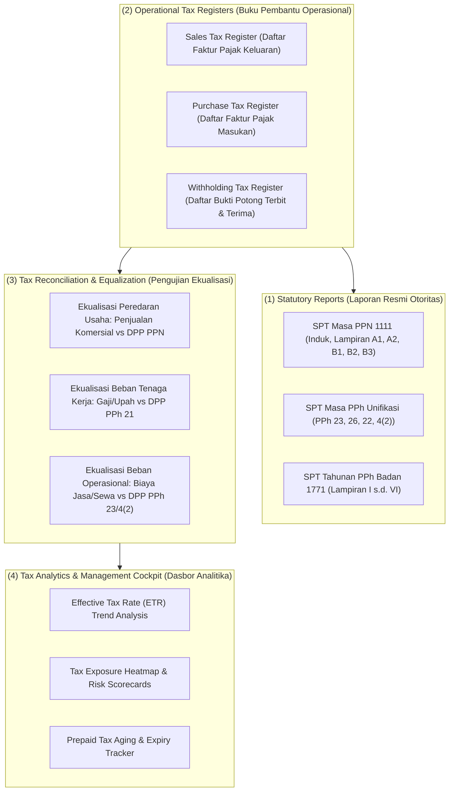

# Tax Reporting and Tax Analytics

## Definisi

**Tax Reporting and Tax Analytics (Pelaporan Pajak dan Analitika Perpajakan)** adalah kapabilitas di dalam sistem ERP untuk mengekstraksi, mentranslasikan, dan menganalisis data transaksi perpajakan menjadi laporan kepatuhan statuter resmi (*Statutory Compliance Reports*), buku pembantu operasional (*Operational Tax Registers*), pengujian ekualisasi fiskal (*Tax Equalization Tests*), serta indikator kinerja utama perpajakan (*Tax KPIs and Risk Analytics*).

Dalam era administrasi perpajakan berbasis data (seperti modernisasi sistem Coretax di Indonesia), fungsi pelaporan perpajakan di ERP tidak lagi sekadar mencetak formulir akhir bulan, melainkan bertindak sebagai sistem intelijen kepatuhan (*Compliance Intelligence System*) yang memverifikasi kesehatan fiskal korporasi secara proaktif sebelum data dilaporkan ke otoritas pajak.

---

## Tujuan Bisnis (Purpose)

Penerapan pelaporan dan analitika perpajakan di dalam ERP bertujuan untuk:
1. **Otomatisasi Kepatuhan Statuter (Statutory Automation):** Menghasilkan berkas formulir pajak resmi (SPT Masa PPN 1111, SPT Unifikasi, dan SPT Tahunan 1771) secara otomatis sesuai skema data otoritas pajak.
2. **Pengujian Ekualisasi Mandiri (Pre-Audit Tax Equalization):** Menjalankan pencocokan otomatis antara akun laba rugi komersial dengan Dasar Pengenaan Pajak (DPP) pada SPT guna mengantisipasi Surat Permintaan Penjelasan atas Data dan/atau Keterangan (SP2DK).
3. **Analisis Tarif Pajak Efektif (Effective Tax Rate / ETR Analytics):** Memantau rasio beban pajak terhadap laba komersial guna mengevaluasi efisiensi perencanaan pajak perusahaan.
4. **Mitigasi Risiko Daluwarsa Kredit Pajak:** Memonitor umur Faktur Pajak Masukan dan Bukti Potong pihak ketiga agar tidak melewati batas waktu pengkreditan yang diizinkan undang-undang.

---

## Taksonomi Laporan Perpajakan dalam ERP

Sistem ERP mengelompokkan laporan perpajakan ke dalam empat tingkatan fungsional:

---

## Metodologi Pengujian Ekualisasi Pajak (Tax Equalization)

Ekualisasi pajak adalah teknik audit standar yang digunakan oleh pemeriksa pajak untuk menguji kepatuhan wajib pajak. ERP modern menyediakan modul pengujian ekualisasi mandiri:

### 1. Ekualisasi Peredaran Usaha (Revenue vs PPN Keluaran)
Membandingkan akun pendapatan di Laporan Laba Rugi dengan akumulasi DPP PPN Keluaran pada 12 masa pajak:
$$\text{Peredaran Usaha (GL)} \stackrel{?}{=} \sum_{t=1}^{12} \text{DPP PPN Keluaran (SPT Masa)}$$
*Penyebab Selisih yang Sah (Legitimate Gaps):*
- Uang muka penjualan: PPN terutang saat kas diterima, namun pendapatan komersial belum diakui (IFRS 15).
- Penyerahan cuma-cuma / pemakaian sendiri: Terutang PPN, tetapi tidak diakui sebagai pendapatan penjualan di buku besar.
- Pengalihan aktiva tetap (Pasal 16D): Terutang PPN, tetapi dicatat pada keuntungan/kerugian pelepasan aset, bukan peredaran usaha.

### 2. Ekualisasi Beban Jasa dan Sewa (Expense vs PPh Potput)
Membandingkan saldo akun beban pemeliharaan, sewa, konsultan, dan teknik dengan akumulasi DPP PPh Pasal 23 dan PPh Final Pasal 4 ayat (2):
$$\text{Beban Jasa \& Sewa (GL)} \stackrel{?}{=} \sum \text{DPP PPh 23} + \sum \text{DPP PPh 4(2)}$$
*Penyebab Selisih yang Sah:*
- Pembelian material yang menyatu dalam tagihan jasa (tidak dipotong jika material terpisah).
- Biaya reimbursemens murni yang memenuhi syarat surat edaran DJP.
- Beban akrual akhir tahun yang belum terbit faktur tagihannya (*unbilled accruals*).

---

## Business Rules Analitika dan Pelaporan Pajak

1. **Equalization Zero-Variance Rule:**
   Seluruh selisih antara saldo buku besar akuntansi dan Dasar Pengenaan Pajak pada laporan SPT Masa wajib terpetakan ke dalam akun penjelas (*reconciliation gap categories*). Tidak boleh ada selisih yang tidak teridentifikasi penyebabnya sebelum laporan tahunan difinalisasi.
2. **Real-Time Data Lineage Rule:**
   Setiap angka pada laporan perpajakan wajib memiliki kemampuan penelusuran balik (*drill-down capability*) secara langsung hingga ke tingkat dokumen transaksi operasional sumber (Invoice, Delivery Order, Purchase Order).
3. **Data Security & Privacy in Analytics:**
   Laporan analitika perpajakan yang memuat data sensitif (seperti data kompensasi pegawai pada PPh 21 atau laba kena pajak korporasi) wajib dilindungi dengan pembatasan hak akses berbasis peran (*Role-Based Access Control / RBAC*).

---

## Skenario Kanonikal: PT Maju Bersama

Penerapan pengujian ekualisasi dan analitika pada `PT Maju Bersama`:

### 1. Pengujian Ekualisasi Peredaran Usaha
* **Akun Buku Besar Penjualan (Revenue GL 411100):** Rp10.000.000.
* **Dasar Pengenaan Pajak (DPP) PPN Keluaran SPT Masa 1111:** Rp10.000.000.
* **Hasil Pengujian Ekualisasi:**
  $$\text{Selisih} = \text{Rp10.000.000} - \text{Rp10.000.000} = \mathbf{\text{Rp0 (100\% Tervalidasi)}}$$

### 2. Pengujian Ekualisasi Beban Jasa IT vs PPh 23
* **Akun Buku Besar Beban Pemeliharaan Server (GL 612100):** Rp10.000.000.
* **Dasar Pengenaan Pajak PPh Pasal 23 pada SPT Masa Unifikasi:** Rp10.000.000.
* **Hasil Pengujian Ekualisasi:**
  $$\text{Selisih} = \text{Rp10.000.000} - \text{Rp10.000.000} = \mathbf{\text{Rp0 (100\% Tervalidasi)}}$$

### 3. Analitika Tarif Pajak Efektif (Effective Tax Rate / ETR)
* Laba Bersih Komersial Sebelum Pajak (EBT): Rp100.000.000.
* Beban PPh Badan Terutang (Tarif Baku 22% x PKP Rp105.000.000): **Rp23.100.000**.
* **Perhitungan ETR (Baseline Tarif Standar):**
  $$\text{ETR} = \frac{\text{Beban Pajak Penghasilan}}{\text{Laba Komersial Sebelum Pajak}} = \frac{\text{Rp23.100.000}}{\text{Rp100.000.000}} = \mathbf{23{,}1\%}$$
*(Evaluasi Manajemen: ETR 23,1% melampaui tarif nominal 22% karena koreksi fiskal positif neto sebesar Rp5.000.000 menaikkan PKP dari Rp100.000.000 menjadi Rp105.000.000. Entitas yang memanfaatkan fasilitas Pasal 31E (omzet memenuhi syarat) akan memiliki ETR yang lebih rendah -- lihat skenario alternatif di dokumen Corporate Income Tax Calculation).*

---

## Implementasi ERP Universal

Dalam arsitektur ERP modern, analitika perpajakan didukung oleh:
1. **Automated Equalization Engine:** Mesin audit internal yang secara otomatis menjalankan rekonsiliasi antara modul GL, AR, AP, dan Tax Subledger setiap akhir pekan dan menyajikan dasbor variansi (*variance alerts*).
2. **Tax Exposure Matrix:** Peta visual yang mendeteksi transaksi berisiko tinggi (misalnya pembayaran ke yurisdiksi suaka pajak / *tax haven*, transaksi dengan pihak terafiliasi / *transfer pricing*, atau lonjakan beban non-deductible).
3. **Statutory Format Exporter:** Layanan mikro yang mengekspor data ke dalam berkas XML atau format skema API Coretax terstandarisasi guna mendukung kelancaran pelaporan elektronik.

---

## Perbandingan Software ERP

| Dimensi Fitur | Odoo (v16 - v18) | ERPNext (v14 - v15) | Microsoft Dynamics 365 F&O |
|---|---|---|---|
| **Laporan Ekualisasi Pajak** | Memerlukan pembuatan kueri kustom atau spreadsheet eksternal. | Dapat dibuat melalui fitur *Script Report* kustom yang membandingkan GL dan Tax Ledger. | Memiliki fitur bawaan *Sales Tax Reconciliation and Specification Reports*. |
| **Dasbor Analitika ETR** | Menggunakan dasbor modul *Reporting* umum dengan formula kustom. | Dikelola melalui *Dashboard Charts* yang dikonfigurasi pada ruang kerja Akuntansi. | Memiliki kapabilitas terintegrasi dengan *Power BI Tax Analytics Content Pack*. |
| **Pelacakan Umur Kredit Pajak** | Dilacak melalui laporan penuaan akun piutang/aset biasa (*Aged Partner Balance*). | Menggunakan laporan penuaan buku pembantu standar. | Memiliki fitur *Withholding Tax Certificate Aging & Allocation Status*. |

---

## Pertimbangan Desain Naventra (Naventra Consideration)

Pada arsitektur ERP Naventra, fitur pelaporan dan analitika perpajakan dirancang dengan pendekatan desain teknis berikut:

1. **Built-in Equalization Dashboard:**
   Naventra menyajikan modul *Tax Equalization Workbench* yang secara *real-time* menghitung selisih antara akun Laba Rugi komersial dan Dasar Pengenaan Pajak per jenis pajak (PPN, PPh 21, PPh 23, PPh 4(2)) tanpa memerlukan proses ekstraksi manual.
2. **Tax Risk Early Warning System (SP2DK Radar):**
   Sistem secara otomatis mendeteksi anomali transaksi yang sering menjadi pemicu surat himbauan pajak, seperti lonjakan rasio biaya promosi terhadap omzet atau transaksi dengan lawan transaksi yang teridentifikasi bermasalah.
3. **Multi-Format Statutory Generator:**
   Naventra menyediakan konverter data terintegrasi yang mampu menghasilkan berkas CSV impor e-Faktur lama, format XML e-Bupot Unifikasi, hingga konektor API langsung ke sistem Coretax DJP.

---

## Referensi

* Undang-Undang Republik Indonesia No. 28 Tahun 2007 tentang Ketentuan Umum dan Tata Cara Perpajakan (UU KUP) beserta perubahannya pada UU No. 7 Tahun 2021 (UU Harmonisasi Peraturan Perpajakan).
* Surat Edaran Direktur Jenderal Pajak No. SE-05/PJ/2022 tentang Pengawasan Kepatuhan Wajib Pajak Melalui Analisis Data dan Ekualisasi.
* Microsoft Learn: *Tax Reporting, Financial Analytics, and Power BI Integration in Dynamics 365*.
* Frappe / ERPNext Documentation: *Creating Custom Script Reports for Tax Reconciliation*.
* Odoo Accounting Documentation: *Tax Reports, Audit Trail, and Financial Dashboards*.
