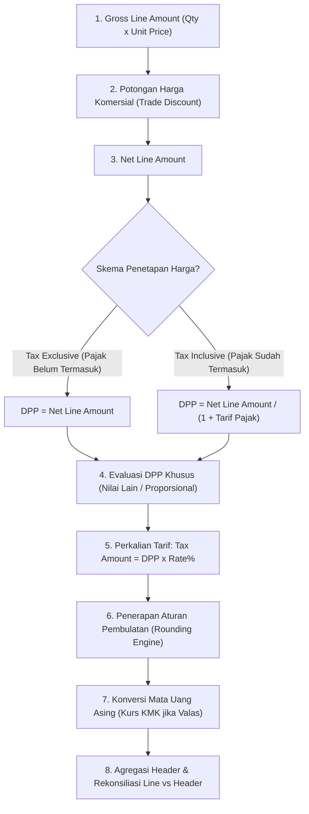

# Taxable Base and Tax Calculation

## Definisi

**Taxable Base and Tax Calculation (Dasar Pengenaan Pajak dan Kalkulasi Pajak)** adalah mekanisme komputasi di dalam sistem ERP yang menghitung nilai moneter dasar yang dikenakan pajak (*Taxable Base* / Dasar Pengenaan Pajak atau DPP) dan menerapkan tarif pajak yang berlaku untuk menghasilkan jumlah liabilitas atau piutang pajak yang sah secara hukum dan akuntansi.

Dalam konteks perpajakan Indonesia, Dasar Pengenaan Pajak (DPP) dapat berbentuk:
1. **Harga Jual:** Jumlah kompensasi berupa uang atas penyerahan Barang Kena Pajak (BKP).
2. **Penggantian:** Nilai uang atas penyerahan Jasa Kena Pajak (JKP) atau ekspor JKP.
3. **Nilai Impor:** Nilai pabean (Cost, Insurance, Freight / CIF) ditambah bea masuk dan pungutan pabean lainnya.
4. **Nilai Ekspor:** Nilai yang tercantum dalam Pemberitahuan Ekspor Barang (PEB).
5. **DPP Nilai Lain (Special Tax Base):** Nilai dasar yang ditetapkan secara khusus oleh Menteri Keuangan. Berdasarkan PMK No. 131/PMK.03/2024 jo. PMK No. 11 Tahun 2025, dalam rangka penerapan tarif statutory PPN 12%, penyerahan BKP dan JKP non-mewah dikenakan PPN dengan formula DPP Nilai Lain sebesar 11/12 dari harga jual atau penggantian, sehingga menghasilkan beban pajak efektif sebesar 11% (12% x 11/12). Untuk barang yang tergolong mewah (terkena PPnBM), DPP dihitung 100% dari harga jual.
6. **Besaran Tertentu:** Nilai pengenaan pajak dengan persentase tertentu atas peredaran bruto sesuai Pasal 9A UU PPN untuk sektor usaha tertentu.

---

## Tujuan Bisnis (Purpose)

Proses kalkulasi dasar pengenaan pajak yang akurat di dalam ERP bertujuan untuk:
1. **Integritas Penagihan dan Pembayaran:** Memastikan jumlah pajak yang ditagihkan kepada pelanggan atau dibayarkan kepada pemasok sesuai dengan regulasi perpajakan yang berlaku tanpa adanya selisih pembulatan material.
2. **Kesesuaian dengan Dokumen Pajak Resmi:** Menjaga keselarasan antara total invoice komersial dengan nilai DPP dan PPN yang tercantum dalam dokumen Faktur Pajak resmi (Coretax / e-Faktur DJP).
3. **Pengelolaan Valuta Asing yang Akurat:** Mengeliminasi kekeliruan konversi kurs dengan menerapkan Kurs Menteri Keuangan (KMK) resmi secara otomatis pada transaksi mata uang asing.
4. **Transparansi Perlakuan Diskon:** Mengakomodasi pemisahan antara diskon komersial langsung (*trade discount*) yang mengurangi DPP dengan diskon pelunasan cepat (*cash discount*) yang tidak mengubah DPP awal.

---

## Pipeline Kalkulasi Pajak ERP (Tax Calculation Pipeline)

Mesin kalkulasi ERP mengeksekusi perhitungan pajak melalui urutan pemrosesan matematis yang ketat:



---

## Skema Harga: Tax Exclusive vs Tax Inclusive

ERP harus mendukung dua metode penetapan harga yang lazim dalam dunia usaha:

### 1. Pajak Belum Termasuk (Tax Exclusive Pricing)
Metode ini umum digunakan dalam transaksi antar-bisnis (B2B). Harga yang disepakati adalah nilai bersih di luar pajak.
- Formula DPP: $\text{DPP} = \text{Net Price}$
- Formula Pajak: $\text{Pajak} = \text{DPP} \times \text{Tarif}$
- Formula Total Tagihan: $\text{Total} = \text{DPP} + \text{Pajak}$

### 2. Pajak Sudah Termasuk (Tax Inclusive Pricing)
Metode ini lazim digunakan dalam penjualan ritel (B2C) di mana harga pada label atau katalog sudah mencakup pajak.
- Formula DPP: $\text{DPP} = \frac{\text{Gross Price}}{1 + \text{Tarif}}$
- Formula Pajak: $\text{Pajak} = \text{Gross Price} - \text{DPP}$
- Formula Total Tagihan: $\text{Total} = \text{Gross Price}$

---

## Business Rules Kalkulasi Pajak

1. **Trade Discount vs Cash Discount Rule:**
   - *Trade Discount (Potongan Harga):* Diskon kuantitas atau potongan komersial yang tercantum langsung pada baris invoice diperlakukan sebagai pengurang DPP.
   - *Cash Discount (Potongan Tunai / Early Payment Discount):* Diskon yang diberikan karena pembayaran dilakukan dalam jangka waktu tertentu (misalnya termin `2/10, n/30`) tidak mengurangi DPP pada saat faktur diterbitkan. Penyesuaian pajak atas diskon tunai memerlukan penerbitan Nota Retur/Pengurang atau penyesuaian tersendiri sesuai ketentuan yurisdiksi.
2. **Rounding Method Rule:**
   Sistem harus menerapkan metode pembulatan yang konsisten per baris transaksi dan per total dokumen. Dalam regulasi perpajakan Indonesia (e-Faktur), nilai pajak dihitung dalam satuan Rupiah penuh. Apabila terdapat pecahan desimal, sistem menerapkan aturan pembulatan standar matematis (*Half Up*) atau pembulatan ke bawah (*Floor*) sesuai spesifikasi validasi skema XML DJP.
3. **Line-Level vs Header-Level Calculation Consistency:**
   Untuk mencegah selisih satu rupiah (*one-cent rounding discrepancy*), sistem ERP harus menetapkan apakah pajak dihitung per baris kemudian dijumlahkan (*Sum of Line Taxes*), atau dihitung dari total DPP pada header (*Tax on Sum of DPP*). Praktik umum yang dianjurkan untuk kompatibilitas data faktur pajak DJP adalah menghitung pajak per baris transaksi dan menjumlahkannya.
4. **Foreign Currency Tax Translation Rule (Kurs KMK):**
   Apabila transaksi menggunakan mata uang asing (valas), Dasar Pengenaan Pajak dan Pajak Terutang yang dilaporkan pada Faktur Pajak wajib dikonversikan ke dalam mata uang Rupiah menggunakan Kurs Menteri Keuangan (KMK) yang berlaku pada tanggal Faktur Pajak diterbitkan, bukan kurs transaksi Bank Indonesia (BI) atau kurs komersial harian.

---

## Dampak Akuntansi dan Selisih Kurs Pajak

Perbedaan antara Kurs Komersial (Kurs Tengah BI) yang digunakan untuk pembukuan akuntansi komersial dengan Kurs Pajak (Kurs KMK) yang diwajibkan oleh otoritas pajak menimbulkan selisih yang harus ditangani oleh sistem akuntansi ERP:

### Skenario Transaksi Valas (Penjualan Ekspor / Domestik Valas)
* Nilai Transaksi: USD 1,000.
* Kurs Tengah BI (Akuntansi): Rp15.500 / USD.
* Kurs Menteri Keuangan (Pajak): Rp15.400 / USD.
* Asumsi Tarif PPN: 11% (asumsi pembelajaran ilustratif).

Kalkulasi:
- Nilai Piutang Komersial (USD 1,000 x Rp15.500) = Rp15.500.000
- Dasar Pengenaan Pajak (KMK): USD 1,000 x Rp15.400 = Rp15.400.000
- PPN Keluaran Terutang (KMK): 11% x Rp15.400.000 = Rp1.694.000

Pencatatan Akuntansi di ERP:
```text
(Db) Piutang Usaha (AR Valas)               Rp17.194.000
    (Cr) Pendapatan Penjualan (Revenue Komersial)        Rp15.500.000
    (Cr) PPN Keluaran (Berdasarkan Kurs KMK)             Rp 1.694.000
```
*(Jika ada selisih konversi antara kalkulasi komersial dan faktur pajak, sistem membukukan selisih tersebut ke akun Selisih Kurs / Rounding Difference)*.

---

## Skenario Kanonikal: PT Maju Bersama

Melanjutkan skenario kanonikal `PT Maju Bersama`:
* **Tarif PPN yang digunakan:** 11% (asumsi pembelajaran ilustratif untuk menjaga konsistensi permodelan antarmodul. Dalam konteks regulasi perpajakan Indonesia, tarif statutory 12% dengan mekanisme DPP Nilai Lain 11/12 untuk barang non-mewah menghasilkan beban pajak efektif 11%).

### 1. Transaksi Pembelian Standar (Tax Exclusive)
* Pemasok: `PT Sumber Teknologi`
* Barang: Laptop Pro 10 unit @ Rp700.000 (Tax Exclusive).
* DPP = 10 x Rp700.000 = Rp7.000.000.
* PPN Masukan (11% ilustratif) = Rp7.000.000 x 11% = Rp770.000.
* Total Tagihan AP = Rp7.770.000.

### 2. Transaksi Penjualan Standar (Tax Exclusive)
* Pelanggan: Klien Korporasi
* Barang: Laptop Pro 10 unit @ Rp1.000.000 (Tax Exclusive).
* DPP = 10 x Rp1.000.000 = Rp10.000.000.
* PPN Keluaran (11% ilustratif) = Rp10.000.000 x 11% = Rp1.100.000.
* Total Tagihan AR = Rp11.100.000.

### 3. Transaksi Penjualan dengan Trade Discount Langsung 5%
* Klien Korporasi mendapatkan diskon komersial 5% langsung pada pesanan penjualan:
* Gross Line Amount = 10 x Rp1.000.000 = Rp10.000.000.
* Diskon Komersial (5%) = Rp500.000.
* **Dasar Pengenaan Pajak (DPP Net):** Rp10.000.000 - Rp500.000 = **Rp9.500.000**.
* **PPN Keluaran (11%):** Rp9.500.000 x 11% = **Rp1.045.000**.
* **Total Tagihan AR:** Rp9.500.000 + Rp1.045.000 = **Rp10.545.000**.

Jurnal Akuntansi Otomatis di ERP:
```text
(Db) Piutang Usaha (AR)                    Rp10.545.000
    (Cr) Pendapatan Penjualan                            Rp 9.500.000
    (Cr) PPN Keluaran                                    Rp 1.045.000
```
*(Perhatikan bahwa DPP yang dilaporkan ke Faktur Pajak adalah Rp9.500.000, bukan Rp10.000.000)*.

---

## Implementasi ERP Universal

Arsitektur mesin kalkulasi perpajakan di dalam ERP dirancang dengan modul *Tax Calculation Engine* yang modular:
1. **Precision Decimal Management:** Mendukung kalkulasi internal hingga 4 sampai 6 angka desimal untuk unit price dan persentase diskon sebelum melakukan pembulatan akhir ke 2 digit (sen) atau 0 digit (Rupiah).
2. **Dual Currency Calculation Engine:** Menghitung nilai transaksi secara paralel dalam mata uang transaksi (*Transaction Currency*), mata uang pembukuan (*Base / Functional Currency*), dan mata uang perpajakan (*Tax Reporting Currency*) dengan referensi tabel kurs yang berbeda.
3. **Compound Tax Support:** Mendukung perhitungan pajak bertingkat (*Tax-on-Tax*), di mana pajak tahap kedua dihitung dari (DPP + Pajak Pertama), yang umum diterapkan pada skema Cukai atau Bea Masuk yang menjadi bagian dari DPP PPN Impor.

---

## Perbandingan Software ERP

| Dimensi Kalkulasi | Odoo (v16 - v18) | ERPNext (v14 - v15) | Microsoft Dynamics 365 F&O |
|---|---|---|---|
| **Pajak Inklusif vs Eksklusif** | Diatur pada opsi *Included in Price* di masing-masing baris *Account Tax*. | Diatur melalui checkbox *Is this Tax included in Basic Rate?* pada tabel pajak. | Dikonfigurasi melalui parameter *Prices include sales tax* pada level dokumen atau buku besar. |
| **Metode Pembulatan** | Mendukung opsi *Round per Line* atau *Round Globally* pada konfigurasi akuntansi. | Menghitung pajak per baris dan membulatkan pada subtotal dokumen secara otomatis. | Mendukung konfigurasi presisi desimal dan metode pembulatan (*Normal, Downward, Rounding rule*) per kode pajak. |
| **Kurs Pajak Khusus (KMK)** | Memerlukan kustomisasi modul lokalisasi (*l10n_id*) untuk mengelola tipe kurs pajak terpisah dari kurs harian. | Memiliki fitur *Exchange Rate* umum; memerlukan skrip atau aplikasi regional untuk membedakan kurs pajak KMK. | Memiliki fitur bawaan *Sales Tax Exchange Rate Type* yang terpisah dari kurs pembukuan akuntansi. |
| **Dukungan Diskon terhadap DPP** | Diskon baris mengurangi nilai dasar pajak secara langsung (*trade discount native*). | Mendukung *Net Amount* setelah diskon sebagai basis pengenaan pajak. | Mendukung kalkulasi fleksibel apakah diskon tunai/komersial mengurangi dasar pengenaan pajak. |

---

## Pertimbangan Desain Naventra (Naventra Consideration)

Pada pengembangan ERP Naventra, modul kalkulasi pajak dibangun dengan spesifikasi teknis berikut:

1. **Explicit Line-Level Calculation:**
   Naventra menerapkan pendekatan *Line-by-Line Tax Calculation* untuk mendukung konsistensi dengan validasi sistem perpajakan resmi:
   $$\text{Tax Line} = \text{Round}(\text{DPP Line} \times \text{Rate}, 0)$$
   $$\text{Total Document Tax} = \sum \text{Tax Line}$$
2. **Tabel Kurs Terpisah (Dual Currency Exchange Tables):**
   Naventra memisahkan penyimpanan kurs operasional (`exchange_rates`) dan kurs fiskal resmi (`tax_exchange_rates`):
   ```sql
   CREATE TABLE tax_exchange_rates (
       id UUID PRIMARY KEY,
       currency_code VARCHAR(3) NOT NULL,
       kmk_decree_number VARCHAR(100) NOT NULL,
       exchange_rate DECIMAL(18,4) NOT NULL,
       valid_from DATE NOT NULL,
       valid_to DATE NOT NULL
   );
   ```
3. **Audit Immutability of Calculated Base:**
   Setelah faktur diterbitkan, nilai `base_amount`, `tax_amount`, dan `tax_exchange_rate_applied` disimpan secara permanen pada baris invoice untuk mencegah perhitungan ulang yang tidak disengaja jika tabel kurs diperbarui di masa mendatang.

---

## Referensi

* Undang-Undang Republik Indonesia No. 42 Tahun 2009 tentang Pajak Pertambahan Nilai Barang dan Jasa dan Pajak Penjualan atas Barang Mewah beserta perubahannya pada UU No. 7 Tahun 2021 (UU HPP).
* Peraturan Menteri Keuangan No. 131/PMK.03/2024 tentang Perlakuan PPN Sehubungan dengan Berlakunya Tarif PPN 12%.
* Peraturan Menteri Keuangan No. 11 Tahun 2025 tentang Perhitungan PPN dengan DPP Nilai Lain dan Besaran Tertentu.
* Keputusan Menteri Keuangan Republik Indonesia tentang Nilai Kurs sebagai Dasar Pelunasan Bea Masuk, Pajak Pertambahan Nilai Barang dan Jasa dan Pajak Penjualan atas Barang Mewah (Keputusan Mingguan KMK).
* Peraturan Direktur Jenderal Pajak No. PER-03/PJ/2022 tentang Faktur Pajak.
* ERPNext Documentation: *Item Price, Taxes and Charges Calculation, and Currency Exchange*.
* Microsoft Learn: *Sales Tax Calculation Methods, Marginal Base, and Exchange Rates in Dynamics 365 Finance*.
* Odoo Documentation: *Taxes Computation: Included in Price, Tax Grids, and Rounding Modes*.
