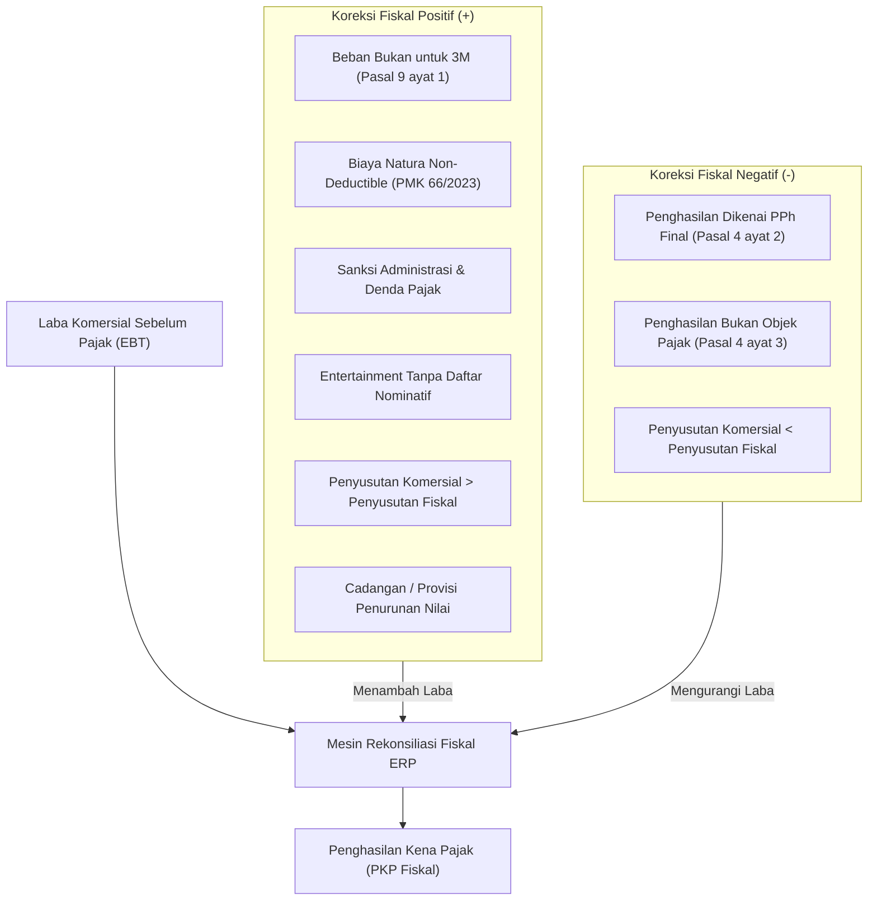
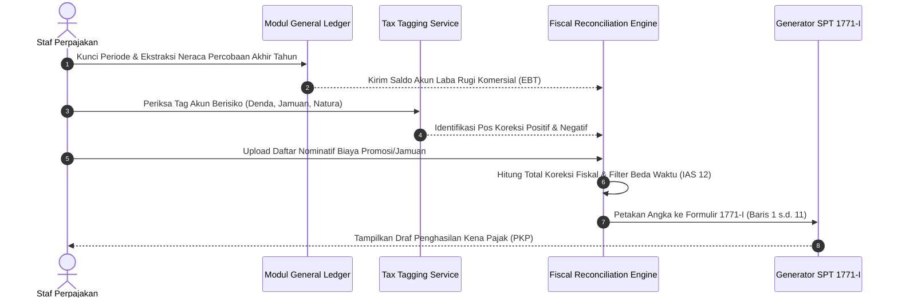

# Taxable Income and Fiscal Reconciliation

## Definisi

**Taxable Income and Fiscal Reconciliation (Penghasilan Kena Pajak dan Rekonsiliasi Fiskal)** adalah proses analisis, klasifikasi, dan penyesuaian sistematis di dalam ERP yang mengubah Laba Bersih Komersial Sebelum Pajak (*Commercial Profit Before Tax / Earnings Before Tax*) menjadi Penghasilan Kena Pajak (*Taxable Income* / PKP Fiskal) sesuai ketentuan peraturan perundang-undangan perpajakan yang berlaku.

Perbedaan standar antara Standar Akuntansi Keuangan (SAK/IFRS) dengan hukum perpajakan mewajibkan dilakukannya penyesuaian fiskal melalui dua instrumen utama:
1. **Koreksi Fiskal Positif:** Penyesuaian yang menambah Penghasilan Kena Pajak atau mengurangi beban/biaya komersial yang tidak diakui secara fiskal (*non-deductible expenses*).
2. **Koreksi Fiskal Negatif:** Penyesuaian yang mengurangi Penghasilan Kena Pajak, misalnya penghasilan yang telah dikenai PPh Final, penghasilan yang bukan objek pajak, atau penambahan biaya fiskal yang lebih besar dari biaya komersial.

---

## Tujuan Bisnis (Purpose)

Penerapan mesin rekonsiliasi fiskal di dalam ERP bertujuan untuk:
1. **Otomatisasi Kertas Kerja Rekonsiliasi Fiskal:** Menyusun formulir rekonsiliasi fiskal tahunan (seperti Lampiran I SPT Tahunan PPh Badan Formulir 1771-I maupun skema pelaporan SPT Tahunan Badan pada Coretax) secara otomatis dari pemetaan akun buku besar.
2. **Pengawasan Beban Rawan Koreksi (Tax Exposure Monitoring):** Mengidentifikasi akun beban operasional yang memiliki risiko tinggi ditolak oleh otoritas pajak (seperti biaya jamuan, promosi, dan sanksi denda) sebelum tahun buku ditutup.
3. **Pengelolaan Perbedaan Waktu untuk Pajak Tangguhan:** Menghitung dampak pajak tangguhan (*Deferred Tax Assets/Liabilities*) sesuai PSAK 46 / IAS 12 atas pos-pos perbedaan temporer.
4. **Kesiapan Audit Fiskal (Tax Audit Trail):** Menyediakan tautan langsung antara angka koreksi fiskal dengan dokumen pendukung transaksi (seperti kuitansi, faktur, dan daftar nominatif resmi).

---

## Taksonomi Koreksi Fiskal Indonesia

Sistem ERP memetakan transaksi laba rugi ke dalam kategori koreksi fiskal standar sesuai Undang-Undang PPh:

### Rincian Koreksi Fiskal Positif
1. **Beban Non-3M (Pasal 9 ayat 1 UU PPh):** Pengeluaran untuk keperluan pribadi pemegang saham, sekutu, atau anggota keluarga.
2. **Natura dan Kenikmatan Non-Deductible:** Pemberian imbalan dalam bentuk barang/fasilitas yang tidak memenuhi batasan kriteria pengecualian pada PMK No. 66/2023.
3. **Sanksi Administrasi Perpajakan:** Surat Tagihan Pajak (STP), bunga, denda keterlambatan, atau kenaikan sanksi perpajakan.
4. **Biaya Promosi dan Jamuan Tanpa Bukti Sah:** Biaya representasi yang tidak dilengkapi dengan Daftar Nominatif sesuai PMK No. 02/PMK.03/2010.
5. **Beban Pembentukan Dana Cadangan:** Seluruh cadangan kerugian piutang, cadangan persediaan usang, atau cadangan pesangon (kecuali cadangan perbankan/asuransi tertentu yang diatur khusus).
6. **Selisih Penyusutan/Amortisasi Komersial di Atas Fiskal:** Terjadi jika beban penyusutan di laporan komersial lebih tinggi daripada penyusutan yang dihitung menurut masa manfaat fiskal resmi.

### Rincian Koreksi Fiskal Negatif
1. **Penghasilan Dikenakan PPh Final:** Bunga deposito bank, jasa giro, sewa tanah dan/atau bangunan yang telah dipotong PPh Final Pasal 4 ayat (2).
2. **Penghasilan Bukan Objek Pajak:** Dividen yang diterima perseroan terbatas dari dalam negeri yang memenuhi kriteria pengecualian undang-undang perpajakan.
3. **Selisih Penyusutan Komersial di Bawah Fiskal:** Terjadi jika beban penyusutan menurut ketentuan fiskal lebih besar daripada penyusutan komersial (misalnya akibat penggunaan metode saldo menurun secara fiskal).

---

## Alur Kerja Rekonsiliasi Fiskal di ERP

---

## Business Rules Rekonsiliasi Fiskal

1. **Mandatory Nominative Attachment Rule:**
   Sistem ERP secara otomatis menetapkan status *Non-Deductible* (Koreksi Fiskal Positif) terhadap seluruh akun beban promosi dan jamuan makan, kecuali pengguna mengunggah dokumen *Nominative List* yang memuat nama relasi, nama instansi, posisi, bentuk jamuan, dan nominal transaksi yang valid.
2. **Final Tax Income Elimination Rule:**
   Seluruh penghasilan yang telah dipotong PPh Final wajib dikeluarkan dari peredaran usaha kena pajak komersial melalui koreksi fiskal negatif dan dilaporkan pada Lampiran IV SPT Tahunan Badan.
3. **Non-Deductibility of Income Tax Itself:**
   Pajak Penghasilan Badan itu sendiri (termasuk setoran angsuran bulanan PPh Pasal 25) dilarang dibukukan sebagai biaya pengurang laba kena pajak. Di ERP, setoran PPh 25 wajib dialokasikan ke akun aset lancar (*Prepaid Tax*), bukan ke akun beban di laba rugi.
4. **Temporary Difference Tagging Rule:**
   Setiap baris koreksi fiskal wajib memiliki penanda apakah berstatus *Permanent* atau *Temporary*. Pos yang ditandai *Temporary* otomatis diteruskan ke modul perhitungan pajak tangguhan (*Deferred Tax Engine*).

---

## Skenario Kanonikal: PT Maju Bersama

Data buku besar tahun buku `PT Maju Bersama`:
* **Laba Komersial Sebelum Pajak (EBT):** Rp100.000.000.

### 1. Rincian Koreksi Fiskal Positif (Menambah Laba)
1. Sanksi Administrasi Denda Keterlambatan Pajak (Akun 619200): Rp2.000.000 (Beda Tetap).
2. Biaya Jamuan Tamu Bisnis tanpa Daftar Nominatif (Akun 612400): Rp3.000.000 (Beda Tetap).
3. Beban Natura/Kenikmatan yang tidak memenuhi syarat PMK 66/2023 (Akun 611500): Rp5.000.000 (Beda Tetap).
* **Total Koreksi Fiskal Positif:** Rp2.000.000 + Rp3.000.000 + Rp5.000.000 = **Rp10.000.000**.

### 2. Rincian Koreksi Fiskal Negatif (Mengurangi Laba)
1. Pendapatan Bunga Jasa Giro & Deposito yang telah dikenai PPh Final (Akun 711100): Rp5.000.000 (Beda Tetap).
* **Total Koreksi Fiskal Negatif:** **Rp5.000.000**.

### 3. Formulir Rekonsiliasi Fiskal (SPT 1771-I)

| Pos Laporan | Nilai Buku Komersial | Koreksi Fiskal | Saldo Fiskal | Sifat Koreksi |
|---|---|---|---|---|
| **Penjualan Bersih** | Rp150.000.000 | Rp0 | Rp150.000.000 | - |
| **Harga Pokok Penjualan (HPP)** | (Rp35.000.000) | Rp0 | (Rp35.000.000) | - |
| **Laba Bruto Usaha** | **Rp115.000.000** | **Rp0** | **Rp115.000.000** | - |
| Beban Operasional Komersial | (Rp20.000.000) | +Rp10.000.000 | (Rp10.000.000) | Positif (Beda Tetap) |
| Pendapatan Bunga Deposito | Rp 5.000.000 | (Rp 5.000.000) | Rp0 | Negatif (Final) |
| **Laba Bersih / Penghasilan Kena Pajak** | **Rp100.000.000** | **+Rp 5.000.000** | **Rp105.000.000** | **Net Koreksi Positif** |

*Hasil Perhitungan:*
$$\text{Penghasilan Kena Pajak (PKP)} = \text{Rp100.000.000} + \text{Rp10.000.000} - \text{Rp5.000.000} = \mathbf{\text{Rp105.000.000}}$$

---

## Implementasi ERP Universal

Pada rancangan sistem ERP kelas atas, rekonsiliasi fiskal dijalankan melalui komponen perangkat lunak berikut:
1. **Tax Tagging & Classification Subledger:** Memungkinkan pemberian label kepatuhan fiskal pada akun buku besar komersial tanpa mengubah struktur Chart of Accounts.
2. **Parallel Tax Ledger / Fiscal Ledger:** Mengoperasikan buku besar fiskal paralel yang secara otomatis mencatat selisih penyusutan aset tetap dan penyisihan cadangan secara *real-time* setiap bulan.
3. **Automated SPT 1771-I Mapper:** Modul pembuat laporan yang secara instan memetakan seluruh akun General Ledger dan koreksi penyesuaian ke dalam 11 baris standar formulir lampiran penyesuaian fiskal Indonesia.

---

## Perbandingan Software ERP

| Dimensi Rekonsiliasi Fiskal | Odoo (v16 - v18) | ERPNext (v14 - v15) | Microsoft Dynamics 365 F&O |
|---|---|---|---|
| **Pemetaan Koreksi Fiskal** | Dikelola melalui pembuatan akun buku besar terpisah atau menggunakan modul lokalisasi pihak ketiga. | Memerlukan kustomisasi *Custom Field* pada akun atau pembuatan skrip laporan rekonsiliasi. | Memiliki fitur bawaan *Tax Adjustments* dan *Tax Dimensions* yang terintegrasi penuh ke Chart of Accounts. |
| **Pemisahan Beda Tetap vs Waktu** | Tidak didukung secara native; memerlukan pencatatan jurnal manual di akhir tahun. | Dikelola di luar sistem melalui kertas kerja spreadsheet. | Memiliki modul *Deferred Tax Framework* yang mengelompokkan beda tetap dan beda waktu secara otomatis. |
| **Penyusutan Fiskal Aset Tetap** | Biasanya hanya mendukung satu buku depresiasi aktif; buku kedua memerlukan instalasi modul terpisah. | Mendukung beberapa buku depresiasi (*Finance Book*), sehingga depresiasi komersial dan fiskal dapat berjalan berdampingan. | Memiliki fitur *Asset Depreciation Books* bawaan yang memisahkan buku komersial (*Current layer*) dan buku fiskal (*Tax layer*). |

---

## Pertimbangan Desain Naventra (Naventra Consideration)

Pada arsitektur ERP Naventra, modul rekonsiliasi fiskal dirancang dengan pendekatan tata kelola data berikut:

1. **COA-Level Fiscal Classification:**
   Setiap akun dalam Chart of Accounts Naventra memiliki atribut wajib:
   - `is_tax_deductible` (Boolean).
   - `fiscal_correction_type` (`NONE`, `POSITIVE_PERMANENT`, `POSITIVE_TEMPORARY`, `NEGATIVE_FINAL`, `NEGATIVE_TEMPORARY`).
   - `spt_1771_line_mapping` (Nomor baris Formulir 1771-I).
2. **Nominative Document Management Portal:**
   Naventra menyediakan antarmuka khusus di mana departemen pemasaran wajib melampirkan daftar tamu/penerima promosi pada saat mengajukan klaim penggantian biaya (*expense claim*). Jika tidak dilampirkan, sistem otomatis mengalokasikan beban ke sub-akun *Non-Deductible*.
3. **Zero-Impact Financial Statements:**
   Seluruh kalkulasi rekonsiliasi fiskal dijalankan di memori komputasi analitis (*analytical layer*), sehingga Laporan Laba Rugi Komersial yang disajikan kepada pemegang saham tidak terdistorsi oleh aturan teknis perpajakan.

---

## Referensi

* Undang-Undang Republik Indonesia No. 36 Tahun 2008 tentang Pajak Penghasilan beserta perubahannya pada UU No. 7 Tahun 2021 (UU Harmonisasi Peraturan Perpajakan).
* Peraturan Menteri Keuangan No. 66 Tahun 2023 tentang Perlakuan Pajak Penghasilan atas Penggantian atau Imbalan Sehubungan dengan Pekerjaan atau Jasa yang Diterima atau Diperoleh dalam Bentuk Natura dan/atau Kenikmatan.
* Peraturan Menteri Keuangan No. 02/PMK.03/2010 tentang Biaya Promosi yang Dapat Dikurangkan dari Penghasilan Bruto.
* Microsoft Learn: *Tax Reconciliation and Book-to-Tax Reporting in Dynamics 365*.
* Frappe / ERPNext Documentation: *Finance Books and Multi-Book Asset Depreciation*.
* Odoo Accounting Documentation: *Managing Year-End Adjustments and Fiscal Positions*.
