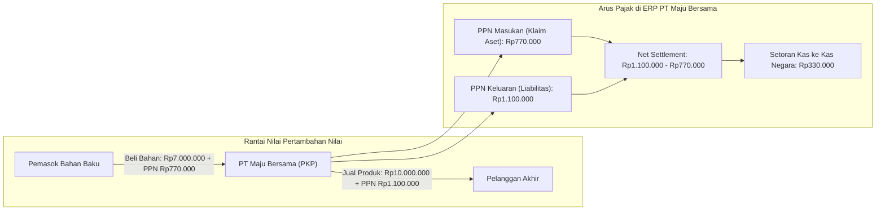

# VAT Fundamentals

## Definisi

**VAT Fundamentals (Fondasi Pajak Pertambahan Nilai / PPN)** adalah prinsip dasar dan mekanisme operasional di dalam ERP yang mengatur bagaimana Pajak Pertambahan Nilai (Value Added Tax / PPN) dipungut, dikreditkan, dan diselesaikan pada setiap mata rantai produksi serta distribusi barang atau jasa.

PPN merupakan **pajak tidak langsung atas konsumsi domestik** (*indirect consumption tax*). Karakteristik utama PPN yang dikelola oleh sistem ERP adalah:
1. **Multi-Stage Tax:** Dikenakan pada setiap titik penyerahan barang atau jasa, mulai dari pabrikan, distributor, pedagang besar, peritel, hingga konsumen akhir.
2. **Invoice Subtraction Method (Credit Method):** Beban pajak yang disetor oleh pelaku usaha bukanlah total nilai penjualan, melainkan selisih antara pajak yang dipungut saat menjual (PPN Keluaran / *Output VAT*) dengan pajak yang telah dibayar saat membeli faktor produksi (PPN Masukan / *Input VAT*).
3. **Pajak Netral bagi Pengusaha Kena Pajak (PKP):** Bagi perusahaan yang berstatus PKP, PPN bukan merupakan beban biaya (*expense*) maupun pendapatan (*revenue*), melainkan titipan kas negara di mana perusahaan bertindak sebagai agen pemungut (*withholding agent*). Beban ekonomi sesungguhnya ditanggung oleh konsumen akhir.

---

## Tujuan Bisnis (Purpose)

Pengelolaan modul PPN di dalam sistem ERP bertujuan untuk:
1. **Mendukung Akurasi Pengkreditan Pajak (Tax Credit Optimization):** Membantu memastikan seluruh PPN Masukan yang sah secara hukum dapat diidentifikasi dan dikreditkan tepat waktu untuk mengurangi kewajiban setor PPN Keluaran.
2. **Mitigasi Kerugian Arus Kas Akibat Faktur Cacat (Cash Loss Mitigation):** Memvalidasi kelengkapan faktur rekanan agar meminimalkan risiko koreksi negatif oleh fiskus saat pengawasan atau pemeriksaan pajak.
3. **Penyelarasan Saat Terutang (Tax Point Alignment):** Mencegah keterlambatan penerbitan dokumen pajak yang berisiko memicu sanksi denda administrasi (misalnya denda 1% dari DPP sesuai regulasi perpajakan Indonesia).
4. **Otomatisasi Kesiapan Pelaporan Masa:** Mengagregasi data transaksi penjualan dan pembelian bulanan secara otomatis ke dalam format pelaporan resmi otoritas perpajakan (portal Coretax DJP / formulir SPT Masa PPN).

---

## Konsep Inti PPN dalam ERP



Dalam sistem ERP, empat pilar konsep PPN diatur secara ketat:
1. **Pengusaha Kena Pajak (PKP):** Status hukum entitas yang wajib memungut, menyetor, dan melaporkan PPN karena peredaran bruto usahanya telah melampaui batasan omzet statutory (misalnya Rp4,8 miliar per tahun di Indonesia) atau memilih dikukuhkan sebagai PKP secara sukarela.
2. **Barang Kena Pajak (BKP) dan Jasa Kena Pajak (JKP):** Klasifikasi produk di dalam master data barang/jasa. Seluruh barang dan jasa dianggap terutang PPN secara baku, kecuali yang secara tegas dinyatakan bukan objek PPN oleh undang-undang (seperti kebutuhan pokok bernilai dasar, uang, emas batangan untuk cadangan devisa, dan surat berharga).
3. **Tempat Penyerahan (Place of Supply):** Lokasi geografis penyerahan yang menentukan apakah transaksi tunduk pada yurisdiksi PPN domestik, kawasan fasilitas (PPN Tidak Dipungut), atau ekspor (PPN Tarif 0%).
4. **Saat Terutang Pajak (Tax Point / Time of Supply):** Titik waktu legal di mana kewajiban memungut PPN timbul.

---

## Business Rules Penentuan Saat Terutang (Tax Point Rules)

1. **Earlier of Goods Delivery vs Invoice vs Payment:**
   Kewajiban penerbitan Faktur Pajak timbul pada saat peristiwa berikut terjadi terlebih dahulu:
   - Tanggal penyerahan fisik barang bergerak atau tanggal barang diserahkan kepada juru kirim/ekspedisi.
   - Tanggal penyelesaian pengerjaan atau penyediaan jasa.
   - Tanggal diterimanya pembayaran (baik uang muka / *down payment*, pembayaran bertahap, maupun pelunasan penuh) mendahului penyerahan fisik barang atau penyelesaian jasa.
   - Tanggal jatuh tempo penagihan termin dalam proyek konstruksi bertahap.
2. **Tax Invoice Integrity Rule:**
   Setiap transaksi penyerahan terutang PPN wajib menghasilkan dokumen faktur pajak yang sah. Pada sistem administrasi Coretax terkini, penomoran faktur pajak diterbitkan secara otomatis oleh sistem saat diunggah (*system-generated*). Pada alur tertentu atau alur historis, sistem ERP mengalokasikan Nomor Seri Faktur Pajak (NSFP) yang diperoleh dari e-Nofa secara berurutan sesuai kronologi tanggal transaksi.
3. **Creditable vs Non-Creditable Input VAT Rule:**
   PPN Masukan hanya dapat dikreditkan apabila:
   - Terkait langsung dengan kegiatan usaha untuk menghasilkan, memelihara, dan menagih pendapatan (3M).
   - Memiliki dokumen Faktur Pajak resmi yang valid secara substantif dan formal.
   - Pembelian bukan untuk pengeluaran yang secara tegas dilarang oleh regulasi (misalnya pembelian/pemeliharaan sedan penumpang bagi non-usaha sewa, atau perolehan barang sebelum dikukuhkan sebagai PKP).
4. **VAT Exemption vs Zero-Rated Rule:**
   - *Fasilitas PPN Dibebaskan (Exempt):* Penyerahan tidak dipungut PPN, namun PPN Masukan yang terkait langsung dengan penyerahan tersebut tidak dapat dikreditkan dan wajib dibiayakan.
   - *Fasilitas PPN 0% (Zero-Rated / Ekspor):* Penyerahan dikenakan tarif 0%, dan PPN Masukan yang berkaitan dengan perolehan faktor produksinya tetap memiliki hak penuh untuk dikreditkan.

---

## Dampak Akuntansi (Accounting Impact)

Dalam akuntansi ERP, PPN dikelola melalui akun-akun neraca (*Balance Sheet accounts*):

1. **Saat Pembelian dari Rekanan PKP:**
   Mencatat timbulnya klaim pajak kepada negara di sisi Aset Lancar.
   ```text
   (Db) Persediaan / Beban Operasional               [Nilai Bersih DPP]
   (Db) PPN Masukan (Prepaid VAT / Tax Asset)        [Nilai Pajak]
       (Cr) Utang Usaha (Accounts Payable)                            [Total Faktur]
   ```
2. **Saat Penjualan kepada Pelanggan:**
   Mencatat penerimaan titipan kas negara di sisi Liabilitas Lancar.
   ```text
   (Db) Piutang Usaha (Accounts Receivable)          [Total Tagihan]
       (Cr) Pendapatan Penjualan (Revenue)                            [Nilai Bersih DPP]
       (Cr) PPN Keluaran (VAT Output / Tax Liability)                 [Nilai Pajak]
   ```
3. **Saat Rekonsiliasi dan Kliring Akhir Masa Pajak (VAT Settlement):**
   Mempertemukan saldo akun PPN Keluaran dan PPN Masukan.
   ```text
   (Db) PPN Keluaran (Menghapus Saldo Liabilitas)    [Total PPN Keluaran]
       (Cr) PPN Masukan (Menghapus Saldo Aset)                        [Total PPN Masukan]
       (Cr) Utang PPN Kurang Bayar (VAT Clearing)                     [Selisih Kurang Bayar]
   ```
4. **Saat Penyetoran ke Kas Negara:**
   ```text
   (Db) Utang PPN Kurang Bayar (VAT Clearing)        [Nilai Setoran]
       (Cr) Kas dan Bank                                              [Nilai Setoran]
   ```

---

## Skenario Kanonikal: PT Maju Bersama

Melanjutkan skenario kanonikal `PT Maju Bersama`:
* **Tarif PPN yang berlaku:** 11% (asumsi pembelajaran ilustratif. Sesuai UU HPP jo PMK 131/2024 dan PMK 11/2025, tarif statutory PPN 12% dipadukan dengan formula DPP Nilai Lain 11/12 untuk BKP/JKP non-mewah menghasilkan beban pajak efektif 11%).

### 1. Pembelian Faktor Produksi (Laptop Pro)
* Pemasok: `PT Sumber Teknologi` (PKP).
* Nilai Beli: 10 unit @ Rp700.000 = Rp7.000.000 (DPP).
* PPN Masukan Terbit (11% ilustratif): Rp7.000.000 x 11% = Rp770.000.
* Total Tagihan Vendor: Rp7.770.000.

Pencatatan Jurnal Pembelian:
```text
(Db) Persediaan Laptop Pro                 Rp7.000.000
(Db) PPN Masukan                           Rp  770.000
    (Cr) Utang Usaha - PT Sumber Teknologi               Rp7.770.000
```

### 2. Penjualan Barang Dagang (Laptop Pro)
* Pembeli: Klien Korporasi (PKP).
* Nilai Jual: 10 unit @ Rp1.000.000 = Rp10.000.000 (DPP).
* PPN Keluaran Dipungut (11% ilustratif): Rp10.000.000 x 11% = Rp1.100.000.
* Total Tagihan Klien: Rp11.100.000.

Pencatatan Jurnal Penjualan:
```text
(Db) Piutang Usaha - Klien                 Rp11.100.000
    (Cr) Pendapatan Penjualan Laptop Pro                 Rp10.000.000
    (Cr) PPN Keluaran                                    Rp 1.100.000
```

### 3. Analisis Nilai Tambah dan Posisi Pajak Akhir Bulan
* Dasar Nilai Tambah (*Value Added*): Rp10.000.000 - Rp7.000.000 = Rp3.000.000.
* Beban Pajak atas Nilai Tambah: 11% x Rp3.000.000 = **Rp330.000**.
* Perhitungan Metode Kredit Pajak:
  - Saldo PPN Keluaran: Rp1.100.000
  - Saldo PPN Masukan: (Rp770.000)
  - **PPN Kurang Bayar (Wajib Setor):** **Rp330.000**.

Pencatatan Jurnal Settlement PPN Akhir Masa:
```text
(Db) PPN Keluaran                          Rp1.100.000
    (Cr) PPN Masukan                                     Rp  770.000
    (Cr) Utang PPN Kurang Bayar                          Rp  330.000
```
Pencatatan Jurnal Setor Kas ke Kas Negara (via Kode Billing DJP):
```text
(Db) Utang PPN Kurang Bayar                Rp  330.000
    (Cr) Kas dan Bank (Bank Operasional)                 Rp  330.000
```

---

## Implementasi ERP Universal

Dalam arsitektur modular ERP, komponen fundamental PPN mencakup:
1. **Tax Point Evaluator Service:** Layanan yang memonitor *Delivery Orders*, *Work Confirmation*, *Advance Invoices*, dan *Customer Payments* guna menentukan pemicu tanggal terutang pajak secara otomatis.
2. **Tax Ledger Subsystem:** Buku pembantu perpajakan (*Tax Subledger*) yang mencatat rincian setiap faktur pajak terbit maupun terima, menghubungkan nomor faktur komersial dengan nomor seri faktur pajak resmi otoritas negara.
3. **VAT Settlement Engine:** Mesin otomatis yang dijalankan setiap akhir bulan buku untuk mengunci transaksi masa pajak terkait, melakukan offset akun masukan dan keluaran, serta membentuk saldo utang PPN masa (*net VAT payable*).

---

## Perbandingan Software ERP

| Aspek Fundamental PPN | Odoo (v16 - v18) | ERPNext (v14 - v15) | Microsoft Dynamics 365 F&O |
|---|---|---|---|
| **Mekanisme PPN Masukan/Keluaran** | Dikonfigurasi dalam tipe pajak *Sales* vs *Purchase* pada master *Account Tax*. | Ditentukan melalui template terpisah (*Sales Taxes and Charges* vs *Purchase Taxes and Charges*). | Menggunakan *Sales Tax Codes* yang diklasifikasikan berdasarkan arah transaksi di *Tax Ledger Groups*. |
| **Tax Point Pemicu Faktur** | Dapat dikonfigurasi berdasarkan *Ordered Quantities* atau *Delivered Quantities* pada modul Sales. | Terpicu saat pembuatan *Sales Invoice* atau *Purchase Invoice*, terlepas dari tanggal *Delivery Note*. | Memiliki parameter penentu tanggal terutang (*Tax calculation date: Document date, Posting date, Delivery date*). |
| **Penyelesaian Masa Pajak (Settlement)** | Modul *Tax Report* menyediakan tombol *Close Period* yang membuat jurnal kliring otomatis. | Melalui pembuatan manual *Journal Entry* penutupan pajak atau menggunakan aplikasi regional. | Menggunakan proses otomatis *Sales Tax Settlement and Posting* yang memindahkan saldo ke akun vendor otoritas pajak. |
| **Pengelolaan Status PKP Rekanan** | Disimpan pada kolom *Tax ID* di kontak rekanan. | Disimpan pada kolom *Tax ID / GSTIN* pada dokumen Customer/Supplier. | Disimpan secara terstruktur pada *Tax Registration Numbers* di master buku alamat global (*GAB*). |

---

## Pertimbangan Desain Naventra (Naventra Consideration)

Pada pengembangan ERP Naventra, modul PPN fundamental dirancang dengan prinsip keandalan berikut:

1. **Otomatisasi Tax Point Trigger:**
   Naventra secara otomatis mendeteksi apakah penerimaan uang muka (*Customer Advance Receipt*) terjadi sebelum pengiriman fisik (*Goods Delivery*). Jika uang muka diterima, sistem mewajibkan penerbitan Faktur Pajak Uang Muka pada tanggal penerimaan kas tersebut.
2. **Pemisahan Tegas Akun Settlement:**
   Naventra tidak mengizinkan pembayaran kas dialokasikan langsung ke akun `PPN Keluaran`. Seluruh transaksi pelunasan PPN ke kas negara wajib melalui akun kliring `Utang PPN Settlement` yang terbentuk dari proses penutupan masa pajak resmi.
3. **Validasi Status PKP Internal dan Eksternal:**
   Jika entitas internal perusahaan belum berstatus PKP, Naventra menonaktifkan pemungutan PPN Keluaran pada modul Sales secara otomatis guna mencegah penagihan pajak ilegal.

---

## Referensi

* Undang-Undang Republik Indonesia No. 42 Tahun 2009 tentang Pajak Pertambahan Nilai dan Pajak Penjualan atas Barang Mewah beserta perubahannya pada UU No. 7 Tahun 2021 (UU Harmonisasi Peraturan Perpajakan).
* Peraturan Pemerintah Republik Indonesia No. 44 Tahun 2022 tentang Penerapan terhadap Pajak Pertambahan Nilai Barang dan Jasa dan Pajak Penjualan atas Barang Mewah.
* Peraturan Menteri Keuangan No. 131/PMK.03/2024 tentang Perlakuan PPN Sehubungan dengan Berlakunya Tarif PPN 12%.
* Peraturan Menteri Keuangan No. 11 Tahun 2025 tentang Perhitungan PPN dengan DPP Nilai Lain dan Besaran Tertentu.
* Direktorat Jenderal Pajak: *Panduan Sistem Inti Administrasi Perpajakan (Coretax DJP)*.
* International VAT/GST Guidelines (OECD, 2017).
* Microsoft Learn: *Sales Tax Settlement Process and Tax Authorities Configuration in Dynamics 365*.
* Frappe / ERPNext Documentation: *Managing Value Added Tax and Periodic Tax Closing*.
* Odoo Accounting User Guide: *Value Added Tax: Reporting, Closing and Payment*.
