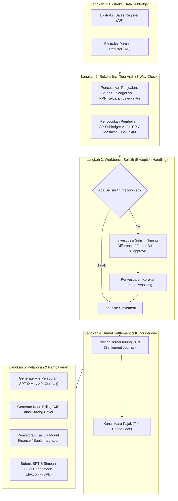

# VAT Return and Reconciliation

## Definisi

**VAT Return and Reconciliation (Surat Pemberitahuan Masa PPN dan Rekonsiliasi Pajak)** adalah prosedur penutupan berkala dan validasi silang di dalam sistem ERP yang memastikan keselarasan penuh antara transaksi operasional, saldo buku besar akuntansi (*General Ledger*), dan laporan pajak resmi (SPT Masa PPN 1111 / formulir Coretax) sebelum pelaporan dan penyetoran pajak ke kas negara dilakukan.

Dalam tata kelola keuangan modern, proses ini berpusat pada **Rekonsiliasi Tiga Arah (3-Way VAT Reconciliation)** yang mempertemukan:
1. **Buku Pembantu Operasional (Subledger):** Daftar Penjualan (*Sales Register*) dan Daftar Pembelian (*Purchase Register*).
2. **Buku Besar Keuangan (General Ledger):** Akun Neraca PPN Keluaran (`214100`) dan PPN Masukan (`115100`).
3. **Data Resmi Otoritas Pajak:** Data Faktur Pajak Elektronik yang tercatat pada sistem Direktorat Jenderal Pajak (DJP).

---

## Tujuan Bisnis (Purpose)

Pelaksanaan rekonsiliasi dan penutupan masa PPN di dalam ERP bertujuan untuk:
1. **Mitigasi Selisih Data Fiskal vs Komersial:** Membantu mendeteksi dan mengeliminasi perbedaan angka antara peredaran usaha komersial dan Dasar Pengenaan Pajak (DPP) pada SPT Masa yang berpotensi memicu timbulnya Surat Permintaan Penjelasan atas Data dan/atau Keterangan (SP2DK) dari otoritas pajak.
2. **Kepatuhan Terhadap Batas Waktu Pelaporan:** Mendukung kepatuhan pelaporan SPT Masa PPN tepat waktu (paling lambat akhir bulan berikutnya setelah berakhirnya masa pajak) guna menghindari sanksi denda keterlambatan (misalnya denda administrasi sesuai ketentuan perundang-undangan perpajakan yang berlaku).
3. **Otomatisasi Penjurnalan Kliring (Automated VAT Settlement):** Menutup saldo akun perantara pajak bulanan ke satu akun utang/piutang neto yang siap disetorkan atau dikompensasikan.
4. **Pengelolaan Restitusi dan Kompensasi Lebih Bayar:** Menyediakan mekanisme pelacakan saldo kelebihan bayar PPN untuk dikompensasikan ke masa pajak berikutnya atau dimohonkan pengembalian (*restitusi*).

---

## Alur Kerja Rekonsiliasi dan Pelaporan SPT Masa PPN



---

## Metodologi Rekonsiliasi Tiga Arah (3-Way VAT Reconciliation)

Sistem ERP membandingkan tiga sumber kebenaran data untuk masa pajak yang bersangkutan:

| Dimensi Rekonsiliasi | Sumber 1: Subledger Operasional | Sumber 2: Buku Besar (General Ledger) | Sumber 3: Portal Otoritas Pajak (DJP) |
|---|---|---|---|
| **Penjualan (PPN Keluaran)** | Laporan Faktur Penjualan (*Sales Invoice List*) dari modul O2C. | Saldo Kredit akun `PPN Keluaran` pada Neraca Percobaan (*Trial Balance*). | Total DPP dan PPN pada daftar Faktur Pajak Keluaran berstatus *Approval Sukses*. |
| **Pembelian (PPN Masukan)** | Laporan Tagihan Pemasok (*Vendor Bill Register*) dari modul P2P. | Saldo Debit akun `PPN Masukan` pada Neraca Percobaan. | Total Faktur Masukan berstatus dikreditkan pada formulir B2 aplikasi e-Faktur. |
| **Penyebab Selisih yang Umum** | Faktur penjualan komersial belum dibuatkan Faktur Pajak resmi di sistem pajak. | Terdapat jurnal manual langsung ke akun pajak tanpa melalui dokumen transaksi. | Faktur masukan rekanan di-reject oleh DJP, atau faktur dikreditkan pada masa pajak yang berbeda (aturan 3 bulan). |

---

## Business Rules Rekonsiliasi dan Pelaporan PPN

1. **Zero-Unexplained-Variance Rule:**
   Pengguna dilarang melakukan finalisasi dan penutupan masa pajak apabila masih terdapat selisih yang tidak terjelaskan antara saldo buku besar akuntansi dan total nilai pada SPT Masa. Seluruh selisih waktu (*timing differences*) wajib terdokumentasi dalam lembar kerja rekonsiliasi.
2. **Tax Period Lock Rule:**
   Setelah proses rekonsiliasi disetujui dan SPT Masa dilaporkan, modul perpajakan wajib mengunci masa pajak tersebut (*Tax Period Lock*). Sistem secara otomatis menolak pembuatan dokumen faktur baru, pengeditan, atau pembatalan transaksi yang memiliki tanggal di dalam periode yang telah dikunci.
3. **Amended Return Protocol (Aturan SPT Pembetulan):**
   Apabila terjadi perubahan transaksi pada periode yang telah dilaporkan (misalnya pembatalan penjualan atau penemuan faktur masukan susulan):
   - Perubahan hanya dapat diproses melalui pembuatan berkas **SPT Pembetulan** (Pembetulan ke-1, ke-2, dst.).
   - Sistem mencatat selisih kurang/lebih bayar tambahan yang timbul akibat pembetulan tersebut.
4. **Treatment of VAT Overpayment (Kelebihan Bayar):**
   Apabila PPN Masukan lebih besar daripada PPN Keluaran, sistem menghentikan pembuatan kode billing dan menyediakan dua opsi fiskal:
   - *Kompensasi:* Memindahkan saldo lebih bayar sebagai kredit pengurang pada SPT Masa Pajak berikutnya.
   - *Restitusi:* Memindahkan saldo ke akun `Piutang Restitusi Pajak` untuk diajukan pengembalian ke kas negara.

---

## Dampak Akuntansi (Accounting Impact)

Proses rekonsiliasi diakhiri dengan eksekusi Jurnal Kliring PPN (*VAT Settlement Journal*) yang mengeliminasi akun temporer PPN:

### 1. Jurnal Settlement Saat Posisi Kurang Bayar (Output > Input)
```text
(Db) PPN Keluaran (Menolkan Saldo Kredit)         Rp1.100.000
    (Cr) PPN Masukan (Menolkan Saldo Debit)                      Rp  770.000
    (Cr) Utang PPN Kurang Bayar (Settlement Account)             Rp  330.000
```

### 2. Jurnal Pembayaran ke Kas Negara via Bank
Ketika bagian Treasury menyetorkan pajak melalui Kode Billing DJP:
```text
(Db) Utang PPN Kurang Bayar                       Rp  330.000
    (Cr) Kas dan Bank (Bank Operasional)                         Rp  330.000
```

### 3. Jurnal Alternatif Saat Posisi Lebih Bayar (Input > Output)
Misalkan PPN Masukan Rp1.500.000 dan PPN Keluaran Rp1.000.000:
```text
(Db) PPN Keluaran                                 Rp1.000.000
(Db) PPN Lebih Bayar Dikompensasikan (Aset)       Rp  500.000
    (Cr) PPN Masukan                                             Rp1.500.000
```

---

## Skenario Kanonikal: PT Maju Bersama

Melanjutkan skenario kanonikal bulanan `PT Maju Bersama`:
* **Tarif PPN yang digunakan:** 11% (asumsi pembelajaran ilustratif).

### Lembar Rekonsiliasi Tiga Arah Masa Pajak Berjalan:

| Objek Pajak | (A) Subledger Operasional | (B) General Ledger (Buku Besar) | (C) Portal DJP (e-Faktur) | Selisih (A - C) |
|---|---|---|---|---|
| **Penjualan (DPP)** | Rp10.000.000 | Rp10.000.000 (Akun Revenue) | Rp10.000.000 (Faktur Keluaran) | Rp0 (Sempurna) |
| **PPN Keluaran** | Rp 1.100.000 | Rp 1.100.000 (Akun 214100) | Rp 1.100.000 (Faktur Approved) | Rp0 (Sempurna) |
| **Pembelian (DPP)** | Rp 7.000.000 | Rp 7.000.000 (Akun Persediaan) | Rp 7.000.000 (Faktur Masukan) | Rp0 (Sempurna) |
| **PPN Masukan** | Rp   770.000 | Rp   770.000 (Akun 115100) | Rp   770.000 (Formulir B2) | Rp0 (Sempurna) |
| **Net PPN Terutang** | **Rp 330.000** | **Rp 330.000** | **Rp 330.000** | **Rp0** |

### Eksekusi Penutupan di ERP:
1. **Posting Settlement Journal:**
   Akun PPN Keluaran (Rp1.100.000) didebit, Akun PPN Masukan (Rp770.000) dikredit, dan terbentuk Utang PPN Kurang Bayar (Rp330.000).
2. **Kunci Masa Pajak:** Status masa pajak pada ERP diubah menjadi `LOCKED`.
3. **Penyetoran Kas:** Diterbitkan Kode Billing DJP nomor `DUMMY-BILLING-001` (kode billing fiktif untuk ilustrasi pembelajaran) sebesar Rp330.000 dan dibayarkan melalui modul Treasury/Bank pada tanggal 28 bulan berikutnya dengan Nomor Transaksi Penerimaan Negara (NTPN) `DUMMY-NTPN-001`.
4. **Pelaporan SPT:** File SPT Masa PPN disampaikan ke portal DJP (Coretax / portal pajak) dan diperoleh Bukti Penerimaan Elektronik (BPE) bernomor `DUMMY-BPE-PPN-001`.

---

## Implementasi ERP Universal

Sistem ERP modern menyediakan modul otomatisasi rekonsiliasi:
1. **Automated Tax Reconciliation Engine:** Algoritma yang secara otomatis mencocokkan nomor faktur komersial dengan nomor faktur pajak (termasuk nomor faktur sistem Coretax maupun data historis) dan nomor transaksi bank menggunakan teknik pencocokan berbasis aturan (*rule-based matching*).
2. **Tax Exception Workbench:** Layanan antarmuka yang menampilkan daftar transaksi bermasalah (misalnya penerimaan barang tanpa faktur pajak, transaksi berulang, atau selisih pembulatan).
3. **Statutory Tax Return Generator:** Fasilitas pembuatan formulir SPT Masa otomatis yang terintegrasi dengan pertukaran data API langsung atau skema data platform Coretax DJP.

---

## Perbandingan Software ERP

| Aspek Rekonsiliasi & Pelaporan | Odoo (v16 - v18) | ERPNext (v14 - v15) | Microsoft Dynamics 365 F&O |
|---|---|---|---|
| **Laporan Rekonsiliasi Pajak** | Fitur *Tax Report* menyajikan rincian per akun pajak dengan kemampuan audit penelusuran balik (*drill-down*) ke baris jurnal. | Laporan *Sales and Purchase Tax Register* menyajikan rekapitulasi nilai DPP dan pajak per rekanan. | Menyediakan *Tax Reconciliation Report* dan *Sales Tax Specifications* yang sangat komprehensif. |
| **Proses Penutupan Masa (Settlement)** | Menu *Close Tax Period* membuat entri jurnal penutupan otomatis ke akun penampung pajak. | Dilakukan secara manual dengan membuat *Journal Entry* pembalik antar akun pajak. | Menggunakan fitur *Settle and Post Sales Tax* yang memproses pemindahan saldo secara otomatis dan terstruktur. |
| **Penguncian Periode Pajak** | Menggunakan fitur *Tax Lock Date* pada pengaturan akuntansi umum. | Menggunakan fitur *Closing Voucher* atau *Period Closing* global pada modul Accounting. | Memiliki konfigurasi *Settlement Period Status* (`Open`, `Closed`, `Re-opened`) khusus per yurisdiksi pajak. |
| **Dukungan Formulir Resmi SPT** | Menghasilkan ekspor data berbasis skema e-Faktur melalui modul lokalisasi Indonesia. | Memerlukan pembuatan kueri laporan khusus (*Custom Report*) atau modul regional Frappe. | Mendukung pemetaan format pelaporan terstandarisasi melalui *Electronic Reporting (ER)* engine. |

---

## Pertimbangan Desain Naventra (Naventra Consideration)

Pada pengembangan ERP Naventra, fitur rekonsiliasi dan pelaporan SPT Masa dirancang dengan kendali otomatisasi tinggi:

1. **Integrated 3-Way Reconciliation Screen:**
   Naventra menyediakan dasbor visual yang menampilkan perbandingan sisi berdampingan (*side-by-side comparison*) antara Subledger AR/AP, Akun Buku Besar Pajak, dan Register e-Faktur. Selisih numerik ditampilkan dengan penanda warna merah dan dapat ditelusuri langsung ke dokumen sumber.
2. **Two-Stage Period Locking Mechanism:**
   Naventra menerapkan penguncian dua tahap:
   - *Soft Lock:* Mengunci entri data bagi staf operasional saat proses rekonsiliasi dimulai oleh tim perpajakan.
   - *Hard Lock:* Mengunci seluruh dokumen secara permanen setelah nomor Bukti Penerimaan Elektronik (BPE) dan Nomor Transaksi Penerimaan Negara (NTPN) diinput ke dalam sistem.
3. **Automated SPT Pembetulan Tracking:**
   Ketika koreksi transaksi masa lampau disetujui, Naventra secara otomatis membuat draf *Tax Return Amendment* (SPT Pembetulan) dengan menghitung nilai inkremental kurang bayar beserta potensi sanksi bunga administrasi.

---

## Referensi

* Undang-Undang Republik Indonesia No. 28 Tahun 2007 tentang Ketentuan Umum dan Tata Cara Perpajakan (UU KUP) beserta perubahannya pada UU No. 7 Tahun 2021 (UU HPP).
* Peraturan Menteri Keuangan No. 243/PMK.03/2014 tentang Surat Pemberitahuan (SPT) sebagaimana telah diubah dengan PMK No. 9/PMK.03/2018.
* Peraturan Direktur Jenderal Pajak No. PER-29/PJ/2015 tentang Bentuk, Isi, dan Tata Cara Pengisian serta Penyampaian SPT Masa PPN.
* Microsoft Learn: *Settle and Post Sales Tax in Dynamics 365 Finance*.
* Odoo Documentation: *Tax Return Closing and Accounting Settlement Entries*.
* Frappe / ERPNext Documentation: *Periodic Tax Reconciliation and Ledger Auditing*.
