# VAT Transaction and Tax Invoice

## Definisi

**VAT Transaction and Tax Invoice (Transaksi PPN dan Faktur Pajak)** adalah proses bisnis dan arsitektur data di dalam ERP yang mengelola penyiapan data, validasi, pelaporan, dan pengarsipan bukti pungutan pajak resmi yang menjadi bukti sah bahwa Pengusaha Kena Pajak (PKP) telah memungut PPN atas penyerahan Barang Kena Pajak (BKP) atau Jasa Kena Pajak (JKP).

Dalam lanskap administrasi perpajakan Indonesia:
1. **Current Primary Context (Coretax DJP):** Pembuatan, validasi, dan pelaporan Faktur Pajak elektronik (*e-Tax Invoice*) diproses secara terpusat melalui portal dan API sistem Coretax DJP. Penomoran faktur pajak diterbitkan secara otomatis oleh sistem (*system-generated*) saat data diunggah dan disetujui, dan alur penyesuaian/pembatalan dikelola melalui mekanisme *Amend* terintegrasi.
2. **Historical & Legacy Context (e-Faktur Desktop / e-Nofa):** Sebelum penerapan Coretax secara penuh, PKP wajib mengajukan permohonan kuota Nomor Seri Faktur Pajak (NSFP) melalui aplikasi e-Nofa, mengimpor rentang nomor tersebut ke dalam ERP atau aplikasi *e-Faktur Client Desktop*, dan mengalokasikannya secara berurutan. Pemahaman alur legacy ini penting bagi arsitek ERP untuk menangani data historis dan integrasi migrasi sistem.

---

## Tujuan Bisnis (Purpose)

Pengelolaan transaksi Faktur Pajak di dalam ERP bertujuan untuk:
1. **Mendukung Validitas Data Faktur (Data Validation & Pre-Flight Check):** Memvalidasi kelengkapan data mitra (NPWP 16 digit / NIK / NITKU, alamat legal), Dasar Pengenaan Pajak (DPP), dan tarif sebelum data dikirimkan ke gateway administrasi perpajakan resmi.
2. **Kepatuhan Batas Waktu Pelaporan (Filing Deadline Compliance):** Membantu memastikan dokumen faktur pajak diproses dan disetujui sebelum batas waktu hukum yang berlaku untuk mencegah sanksi keterlambatan atau faktur dianggap tidak lengkap.
3. **Manajemen Integritas Dokumen (Document Immutability):** Menjaga jejak audit ketika terjadi revisi transaksi melalui alur Faktur Pengganti / Perubahan (*Amendment*) atau Pembatalan (*Cancellation*).
4. **Pencocokan Otomatis Faktur Masukan:** Memfasilitasi penerimaan dan validasi faktur pajak dari pemasok melalui sinkronisasi prapopulasi Coretax maupun pemindaian kode verifikasi resmi.

---

## Struktur Kode Transaksi Faktur Pajak

Meskipun mekanisme penerbitan nomor telah dimodernisasi dalam Coretax, klasifikasi kode transaksi dua digit tetap menjadi standar penentu perlakuan fiskal penyerahan di Indonesia:

| Kode Transaksi | Deskripsi Perlakuan Penyerahan |
|---|---|
| **01** | Penyerahan BKP/JKP kepada pihak selain Pemungut PPN (Penjualan Komersial Reguler). |
| **02** | Penyerahan BKP/JKP kepada Pemungut PPN Instansi Pemerintah. |
| **03** | Penyerahan BKP/JKP kepada Pemungut PPN BUMN atau Badan Usaha Tertentu. |
| **04** | Penyerahan BKP/JKP menggunakan Dasar Pengenaan Pajak (DPP) Nilai Lain (termasuk skema PMK 131/2024 jo PMK 11/2025). |
| **05** | Penyerahan BKP/JKP yang menggunakan skema PPN Besaran Tertentu (Pasal 9A UU PPN). |
| **06** | Penyerahan lainnya (misalnya penyerahan kepada turis asing atau skema khusus). |
| **07** | Penyerahan BKP/JKP yang mendapat fasilitas PPN Tidak Dipungut (misalnya ke Kawasan Berikat atau Batam). |
| **08** | Penyerahan BKP/JKP yang mendapat fasilitas PPN Dibebaskan (misalnya buku pelajaran, barang kebutuhan pokok tertentu). |
| **09** | Penyerahan Aktiva Tetap yang menurut tujuan semula tidak untuk diperjualbelikan (Pasal 16D UU PPN). |

*(Konteks Historis: Pada sistem NSFP lama, digit ke-3 menunjukkan kode status: `0` untuk Faktur Normal dan `1` untuk Faktur Pengganti)*.

---

## Alur Hidup Faktur Pajak: Coretax (Current) vs Legacy Workflow

```mermaid
flowchart TD
    subgraph CurrentWorkflow["Alur Utama Current (Coretax DJP)"]
        C1["Commercial Invoice Terbit di Modul Sales"] --> C2["Generate Payload Data Faktur Pajak"]
        C2 --> C3["Submit ke Coretax DJP (API / Portal Terintegrasi)"]
        C3 --> C4{"Validasi & Approval Coretax"}
        C4 -- "Sukses" --> C5["Status Approved + Nomor Faktur Diterbitkan Otomatis Sistem"]
        C4 -- "Reject" --> C6["Status Rejected + Tampilkan Pesan Validasi"]
        C5 --> C7["Distribusi Dokumen Pajak Resmi ke Pelanggan"]
    end

    subgraph LegacyWorkflow["Konteks Historis / Migrasi (e-Faktur Desktop & e-Nofa)"]
        L1["Permohonan Kuota NSFP ke Portal e-Nofa"] --> L2["Input Rentang NSFP ke Pool Penomoran ERP"]
        L2 --> L3["Alokasi Nomor NSFP Kronologis Manual/Semi-Otomatis"]
        L3 --> L4["Ekspor File CSV dari ERP"]
        L4 --> L5["Impor File ke Aplikasi e-Faktur Client Desktop"]
        L5 --> L6["Upload & Approval Manual via Desktop Client"]
    end
```



---

## Business Rules Transaksi Faktur Pajak

1. **Official System Approval Rule:**
   Faktur Pajak hanya diakui sah secara hukum setelah memperoleh status persetujuan (*Approved*) dari sistem administrasi perpajakan resmi (Coretax DJP). ERP bertindak sebagai sistem penyiap data transaksi dan pencatat nomor registrasi resmi yang diterbitkan otoritas.
2. **Immutability and Amendment Rule (Faktur Pengganti / Perubahan):**
   Faktur Pajak yang telah disetujui tidak dapat diedit secara langsung (*no in-place modification*). Jika terjadi perubahan kesepakatan komersial (misal revisi kuantitas, harga, atau spesifikasi barang):
   - Wajib diproses melalui fitur perubahan/penggantian (*Amendment*) pada portal perpajakan resmi.
   - Pada kondisi tertentu, perubahan faktur memerlukan konfirmasi atau persetujuan dari pihak pembeli.
   - Nilai PPN faktur lama digantikan oleh nilai faktur hasil penyesuaian, dan ERP membukukan selisih penyesuaian tersebut ke buku besar.
3. **Cancellation Rule (Pembatalan Faktur):**
   Apabila transaksi penjualan dibatalkan secara total (batal kirim atau kontrak dibatalkan):
   - Permohonan pembatalan diajukan ke otoritas perpajakan melalui fitur pembatalan resmi.
   - Setelah pembatalan disetujui, saldo PPN Keluaran yang telah terbentuk di buku besar dibalik secara otomatis melalui jurnal penyesuaian.
4. **Mandatory Taxpayer Identification Rule:**
   Penyerahan BKP/JKP wajib mencantumkan identitas pembeli yang valid: NPWP 16 digit untuk Wajib Pajak Badan dan Orang Pribadi, atau NIK yang telah terintegrasi, atau nomor paspor bagi warga negara asing.

---

## Dampak Akuntansi (Accounting Impact)

Penanganan akuntansi atas Faktur Pajak Keluaran normal, pengganti, dan pembatalan:

### 1. Penerbitan Faktur Normal
Penjualan komersial menghasilkan dokumen faktur pajak resmi:
```text
(Db) Piutang Usaha (AR)                    Rp11.100.000
    (Cr) Pendapatan Penjualan                            Rp10.000.000
    (Cr) PPN Keluaran                                    Rp 1.100.000
```

### 2. Penerbitan Faktur Pengganti / Penyesuaian (Nilai Bertambah)
Misalkan disepakati penambahan nilai DPP sebesar Rp2.000.000 (PPN bertambah Rp220.000 ilustratif):
```text
(Db) Piutang Usaha (AR - Tambahan Tagihan) Rp 2.220.000
    (Cr) Pendapatan Penjualan                            Rp 2.000.000
    (Cr) PPN Keluaran                                    Rp   220.000
```

### 3. Pembatalan Faktur
Jika transaksi dibatalkan sebelum pembayaran kas diterima:
```text
(Db) Pendapatan Penjualan                  Rp10.000.000
(Db) PPN Keluaran                          Rp 1.100.000
    (Cr) Piutang Usaha (AR)                              Rp11.100.000
```

---

## Skenario Kanonikal: PT Maju Bersama

Melanjutkan skenario kanonikal `PT Maju Bersama`:
* **Tarif PPN yang digunakan:** 11% (asumsi pembelajaran ilustratif. Mengacu pada UU HPP jo PMK 131/2024 dan PMK 11/2025, tarif statutory 12% dipadukan dengan formula DPP Nilai Lain 11/12 untuk BKP/JKP non-mewah menghasilkan beban pajak efektif 11%).

### 1. Data Transaksi Penjualan Normal
* Pelanggan: Klien Korporasi (PKP terdaftar).
* Barang: Laptop Pro 10 unit @ Rp1.000.000.
* DPP: Rp10.000.000, PPN Keluaran: Rp1.100.000, Total: Rp11.100.000.
* Nomor Identifikasi Faktur Pajak Resmi: `DUMMY-TAX-INVOICE-001` *(nomor fiktif untuk pembelajaran)*.
* Status Dokumen: Berhasil divalidasi dan disetujui di Coretax DJP (*Approved*).

### 2. Kasus Faktur Pengganti / Perubahan (Amendment)
Pelanggan meminta koreksi karena terdapat penyesuaian spesifikasi perangkat yang menambah nilai sebesar Rp1.000.000:
* DPP Baru: Rp11.000.000.
* PPN Baru: Rp1.210.000.
* Penerbitan Dokumen: Terbit dokumen perubahan dengan referensi: `DUMMY-TAX-INVOICE-001-REV` *(nomor fiktif untuk pembelajaran)*.
* Penyesuaian Akuntansi: Tambahan PPN Keluaran sebesar Rp110.000 dibukukan ke General Ledger.

---

## Pola Integrasi Sistem Perpajakan ERP (Architecture Patterns)

| Pola Integrasi | Mekanisme Teknis | Peran dalam Konteks 2026 |
|---|---|---|
| **1. Direct API / Coretax Gateway** | ERP berkomunikasi langsung dengan sistem Coretax DJP melalui protokol API resmi berbasis sertifikat elektronik dan otentikasi aman. | **Fokus Utama (Current):** Sinkronisasi data faktur, pembatalan, dan persetujuan secara *real-time*. |
| **2. Host-to-Host via PJAP Gateway** | ERP terhubung via REST API ke Penyedia Jasa Aplikasi Perpajakan (PJAP) resmi berizin otoritas pajak. | **Alternatif Terkelola:** Digunakan oleh korporasi yang memilih layanan pihak ketiga berizin untuk mengelola jembatan integrasi. |
| **3. Berkas Pertukaran (CSV / XML Import)** | Operator mengekspor berkas terstruktur dari ERP untuk diunggah secara batch ke portal pajak. | **Historical / Fallback:** Umum digunakan pada era aplikasi desktop client e-Faktur lama atau sebagai alur darurat jika koneksi API terputus. |

---

## Perbandingan Software ERP

| Aspek Faktur Pajak | Odoo (v16 - v18) | ERPNext (v14 - v15) | Microsoft Dynamics 365 F&O |
|---|---|---|---|
| **Manajemen Dokumen Pajak** | Modul lokalisasi Indonesia (*l10n_id*) mendukung pembuatan data e-Tax Invoice dan pengelolaan referensi dokumen resmi. | Menggunakan konfigurasi *Naming Series* terdedikasi atau modul regional Frappe pihak ketiga. | Menggunakan kerangka kerja *Electronic Invoicing Service* untuk integrasi data XML/JSON terenkripsi. |
| **Penanganan Faktur Pengganti** | Mendukung fitur *Credit Note* dan pembuatan faktur pengganti dengan mempertahankan tautan faktur asal. | Dikelola melalui mekanisme *Amended Document* dengan membuat dokumen revisi bertaut. | Memiliki alur kerja bawaan *Corrective Invoice* yang menyesuaikan referensi dokumen secara otomatis. |
| **Adaptasi Coretax Modernization** | Komunitas dan mitra resmi Odoo mengembangkan konektor API Coretax terpadu. | Dikembangkan melalui integrasi aplikasi regional Frappe untuk kepatuhan Coretax. | Microsoft menyediakan pembaruan berkala pada repositori *Electronic Reporting* global untuk skema Coretax DJP. |

---

## Pertimbangan Desain Naventra (Naventra Consideration)

Pada pengembangan modul Faktur Pajak di ERP Naventra, arsitektur dirancang dengan fokus pada kepatuhan modern:

1. **Direct Coretax API Adapter:**
   Naventra memprioritaskan integrasi langsung (*direct adapter*) ke sistem Coretax DJP untuk mengirimkan data faktur secara *real-time* dan menerima nomor faktur resmi yang dihasilkan sistem.
2. **Pre-Flight Validation Engine:**
   Sebelum berkas dikirimkan ke gateway pajak, Naventra menjalankan validasi internal:
   - Memastikan NPWP/NIK/NITKU valid dan terdaftar.
   - Memastikan tanggal dokumen selaras dengan aturan pisah batas (*tax point*).
   - Memvalidasi Dasar Pengenaan Pajak (apakah menggunakan DPP Standar atau DPP Nilai Lain 11/12).
3. **State Machine Faktur Terpadu:**
   Status faktur dikelola melalui siklus hidup: `Draft` -> `Queued for Submission` -> `Approved` -> `Amendment In Progress` -> `Cancelled`. Faktur berstatus `Approved` dikunci (*read-only*) permanen di buku besar komersial.

---

## Referensi

* Undang-Undang Republik Indonesia No. 42 Tahun 2009 tentang Pajak Pertambahan Nilai beserta perubahannya pada UU No. 7 Tahun 2021 (UU Harmonisasi Peraturan Perpajakan).
* Peraturan Menteri Keuangan No. 131/PMK.03/2024 tentang Perlakuan PPN Sehubungan dengan Berlakunya Tarif PPN 12%.
* Peraturan Menteri Keuangan No. 11 Tahun 2025 tentang Perhitungan PPN dengan DPP Nilai Lain dan Besaran Tertentu.
* Direktorat Jenderal Pajak: *Buku Panduan dan Pedoman Teknis Penggunaan Coretax DJP (e-Tax Invoice)*.
* Peraturan Direktur Jenderal Pajak No. PER-03/PJ/2022 tentang Faktur Pajak sebagaimana telah diubah dengan PER-11/PJ/2022 (Konteks Historis/Transisi).
* Microsoft Learn: *Electronic Invoicing Overview and Indonesian Localization in Dynamics 365 Finance*.
* Odoo Documentation: *Indonesian Electronic Invoicing Architecture*.
* Frappe / ERPNext Documentation: *Tax Document Management and Regional Compliance*.
