# Withholding Tax Management

## Definisi

**Withholding Tax Management (Manajemen Pajak Pemotongan dan Pemungutan / PPh Potput)** adalah tata kelola dan konfigurasi di dalam sistem ERP yang mengatur mekanisme pemotongan atau pemungutan pajak penghasilan di mana satu pihak (biasanya pembeli jasa atau pemberi kerja) memotong sejumlah persentase tertentu dari nilai transaksi pembayaran, membukukan kewajiban utang pajak ke kas negara, serta menerbitkan dokumen bukti pemotongan resmi kepada pihak yang dipotong.

Dalam skema perpajakan Indonesia, mekanisme potong-pungut (*Withholding Tax Scheme*) mencakup:
1. **Pajak Penghasilan (PPh) Pasal 23:** Pemotongan atas dividen, bunga, royalti, hadiah, sewa selain tanah/bangunan, serta imbalan jasa manajemen, jasa teknik, jasa konsultan, dan jasa lain (tarif baku 2% bagi pemilik NPWP, atau 4% tanpa NPWP).
2. **PPh Pasal 26:** Pemotongan atas penghasilan yang bersumber dari Indonesia yang dibayarkan kepada Wajib Pajak Luar Negeri (tarif baku 20% atau tarif reduksi berdasarkan Persetujuan Penghindaran Pajak Berganda / P3B dengan melampirkan *Certificate of Domicile* / Form DGT).
3. **PPh Final Pasal 4 ayat (2):** Pemotongan pajak bersifat final atas sewa tanah dan/atau bangunan (10%), jasa konstruksi (tarif 1,75% s.d. 4% sesuai kualifikasi sertifikasi jasa konstruksi), dan dividen orang pribadi.
4. **PPh Pasal 22:** Pemungutan atas transaksi pembelian barang oleh instansi pemerintah, BUMN, impor, atau perdagangan komoditas tertentu.
5. **PPh Pasal 21:** Pemotongan atas penghasilan pekerjaan pegawai dan orang pribadi (terintegrasi dengan modul Human Resources & Payroll - Phase 11).

---

## Tujuan Bisnis (Purpose)

Pengelolaan Withholding Tax di dalam ERP bertujuan untuk:
1. **Memastikan Pemenuhan Kewajiban Agen Pemungut (Withholding Agent Compliance):** Mencegah risiko denda dan tanggung jawab renteng atas kelalaian pemotongan pajak yang menjadi kewajiban hukum perusahaan.
2. **Otomatisasi Perhitungan Nilai Bersih Pembayaran (Net Payment Automation):** Menghitung nilai bersih yang dibayarkan kepada vendor secara otomatis setelah dikurangi potongan pajak (*deduction at source*).
3. **Penerbitan Bukti Potong Resmi Elektronik (e-Bupot Unifikasi):** Menghasilkan Bukti Pemotongan Berita Elektronik sesuai format baku Direktorat Jenderal Pajak (DJP) yang dapat dipertukarkan langsung dengan mitra bisnis.
4. **Pengelolaan Kredit Pajak Korporasi (Tax Credit Tracking):** Mencatat pemotongan pajak yang dilakukan oleh pelanggan atas penagihan piutang perusahaan sebagai Uang Muka PPh (*Prepaid Income Tax*) yang menjadi pengurang PPh Badan di akhir tahun buku.

---

## Alur Dua Arah Withholding Tax di ERP

Dalam operasional bisnis, ERP mengelola Withholding Tax dari dua perspektif yang berlawanan:

```mermaid
flowchart TD
    subgraph APTrack["Alur Pembelian / Pengeluaran (Kita Memotong Vendor)"]
        A1["Vendor Invoice Diterima (Tagihan Jasa)"] --> A2["Penerapan Tax Code PPh 23 / 4(2)"]
        A2 --> A3["Pengakuan Utang Pajak PPh & Net Utang Usaha (AP)"]
        A3 --> A4["Pelunasan Kas Bersih ke Vendor (Net Amount)"]
        A4 --> A5["Generate Bukti Potong (e-Bupot Unifikasi) & Kirim ke Vendor"]
        A5 --> A6["Penyetoran Kas Pajak ke Kas Negara via Billing DJP"]
        A6 --> A7["Pelaporan SPT Masa PPh Unifikasi"]
    end

    subgraph ARTrack["Alur Penjualan / Pendapatan (Pelanggan Memotong Kita)"]
        B1["Customer Invoice Terbit (Tagihan Jasa)"] --> B2["Pelanggan Membayar Nilai Bersih (Net Cash)"]
        B2 --> B3["Pengakuan Kas Diterima + Piutang Pajak (Uang Muka PPh)"]
        B3 --> B4["Terima Bukti Potong dari Pelanggan"]
        B4 --> B5["Rekonsiliasi Bukti Potong vs Akun Uang Muka PPh"]
        B5 --> B6["Kredit Pengurang PPh Badan di Akhir Tahun Fiskal"]
    end
```



---

## Perhitungan Reguler vs Skema Gross-Up

Dalam negosiasi kontrak bisnis, sering kali vendor jasa menolak dipotong pajak dan menuntut pembayaran nilai bersih (*net contract*). ERP harus mendukung dua formula kalkulasi:

### 1. Perhitungan Reguler (Potong Nilai Kontrak)
Beban pajak ditanggung sepenuhnya oleh penyedia jasa (vendor).
$$\text{DPP} = \text{Nilai Kontrak}$$
$$\text{Nilai PPh} = \text{DPP} \times \text{Tarif}$$
$$\text{Kas Dibayar ke Vendor} = \text{DPP} - \text{Nilai PPh}$$

### 2. Perhitungan Gross-Up (Pajak Ditanggung Perusahaan Pembeli)
Perusahaan menaikkan nilai tagihan komersial agar setelah dipotong pajak, vendor tetap menerima nilai bersih yang disepakati. Nilai tambahan gross-up dapat diakui sebagai biaya fiskal yang dapat dikurangkan (*deductible expense*).
$$\text{DPP Gross-Up} = \frac{\text{Nilai Bersih Disepakati}}{1 - \text{Tarif}}$$
$$\text{Nilai PPh} = \text{DPP Gross-Up} \times \text{Tarif}$$
$$\text{Kas Dibayar ke Vendor} = \text{DPP Gross-Up} - \text{Nilai PPh} = \text{Nilai Bersih Disepakati}$$

---

## Business Rules Withholding Tax

1. **NPWP Penalty Rule (Tarif Lebih Tinggi 100%):**
   Apabila rekanan penyedia jasa tidak memiliki NPWP (atau NIK yang tervalidasi), sistem secara otomatis menggandakan tarif pemotongan PPh Pasal 23 sebesar 100% lebih tinggi (misalnya tarif 2% naik menjadi 4%).
2. **Withholding Tax Point Rule:**
   Saat pemotongan pajak penghasilan terjadi pada akhir bulan dibayarkannya penghasilan, atau akhir bulan tersedianya penghasilan untuk dibayarkan, atau saat jatuh tempo pembayaran, mana yang terjadi lebih dahulu.
3. **e-Bupot Unifikasi Integration Rule (PER-24/PJ/2021):**
   Seluruh pemotongan PPh Pasal 23, PPh 26, PPh 22, dan PPh 4(2) wajib diadministrasikan melalui aplikasi Bukti Pemotongan Elektronik Unifikasi (e-Bupot Unifikasi). Sistem ERP harus menghasilkan nomor bukti potong unik berformat standar DJP beserta kode verifikasi QR Code.
4. **Tax Treaty Validation Rule (PPh 26):**
   Penerapan tarif reduksi PPh Pasal 26 berbasis *Tax Treaty* (P3B) dilarang diterapkan secara otomatis kecuali sistem mendeteksi adanya arsip digital Surat Keterangan Domisili (*Form DGT*) yang sah dan masih berlaku pada periode transaksi.

---

## Dampak Akuntansi (Accounting Impact)

Pencatatan akuntansi pemotongan pajak pada buku besar:

### 1. Saat Pemotongan Pemasok (Accounts Payable Side)

Terdapat dua kondisi umum pemotongan PPh Pasal 23 atas tagihan jasa vendor senilai Rp10.000.000:

**Kasus A: Tagihan Jasa dari Vendor Non-PKP (Tanpa PPN)**
Nilai tagihan komersial bersih yang dibayarkan ke vendor adalah nilai jasa dikurangi potongan PPh 23 (Rp10.000.000 - Rp200.000 = Rp9.800.000):
```text
(Db) Beban Pemeliharaan & Perbaikan               Rp10.000.000
    (Cr) Utang Usaha (AP Net ke Vendor)                          Rp 9.800.000
    (Cr) Utang PPh Pasal 23 (Current Liabilities)                Rp   200.000
```

**Kasus B: Tagihan Jasa dari Pengusaha Kena Pajak / PKP (Dengan PPN 11%)**
Faktur tagihan mencantumkan jasa Rp10.000.000 dan PPN Masukan Rp1.100.000 (total tagihan bruto Rp11.100.000). Kas bersih yang dibayarkan ke vendor adalah Rp11.100.000 - Rp200.000 = Rp10.900.000:
```text
(Db) Beban Pemeliharaan & Perbaikan               Rp10.000.000
(Db) PPN Masukan                                  Rp 1.100.000
    (Cr) Utang Usaha (AP Net ke Vendor)                          Rp10.900.000
    (Cr) Utang PPh Pasal 23 (Current Liabilities)                Rp   200.000
```

Saat penyetoran PPh 23 ke kas negara melalui sistem billing DJP/Coretax:
```text
(Db) Utang PPh Pasal 23                           Rp   200.000
    (Cr) Kas dan Bank                                            Rp   200.000
```

### 2. Saat Dipotong oleh Pelanggan (Accounts Receivable Side)
Perusahaan menagihkan jasa konsultasi Rp20.000.000. Pelanggan menyetor kas bersih dan menyerahkan bukti potong PPh 23 (2% = Rp400.000):
```text
(Db) Kas dan Bank (Penerimaan Bersih)             Rp19.600.000
(Db) Uang Muka PPh Pasal 23 (Prepaid Tax - Aset)  Rp   400.000
    (Cr) Piutang Usaha (AR Gross)                                Rp20.000.000
```

---

## Skenario Kanonikal: PT Maju Bersama

Melanjutkan skenario `PT Maju Bersama`:

### Skenario 1: Pembayaran Jasa Pemeliharaan IT Vendor (AP Withholding)
* Vendor: `PT Solusi Servis` (Memiliki NPWP valid).
* Transaksi: Jasa pemeliharaan perangkat server senilai Rp10.000.000 (belum termasuk PPN).
* Penentuan Pajak:
  - PPN Masukan (11% asumsi pembelajaran): Rp1.100.000.
  - PPh Pasal 23 (Tarif 2%): 2% x Rp10.000.000 = Rp200.000.
* Kalkulasi Pelunasan Vendor:
  - DPP Tagihan: Rp10.000.000
  - Tambah PPN Masukan: Rp1.100.000
  - Kurang Potongan PPh 23: (Rp200.000)
  - **Kas Bersih Dibayar ke Vendor:** **Rp10.900.000**.

Pencatatan di ERP:
```text
(Db) Beban Jasa Pemeliharaan Server        Rp10.000.000
(Db) PPN Masukan                           Rp 1.100.000
    (Cr) Utang Usaha - PT Solusi Servis                  Rp10.900.000
    (Cr) Utang PPh Pasal 23                              Rp   200.000
```
*Dokumen Terbit:* ERP membuat nomor Bukti Pemotongan Unifikasi resmi `DUMMY-BUPOT-001` (nomor fiktif untuk ilustrasi pembelajaran) melalui integrasi modul perpajakan / Coretax dan menyertakannya pada bukti pelunasan ke `PT Solusi Servis`.

### Skenario 2: Penerimaan Pembayaran Jasa Konsultasi dari Klien (AR Withholding)
* Transaksi: `PT Maju Bersama` memberikan jasa konsultasi implementasi ERP senilai Rp20.000.000 kepada Klien.
* PPN Keluaran Terutang (11%): Rp2.200.000 (Total Faktur: Rp22.200.000).
* Klien memotong PPh Pasal 23 (2%): 2% x Rp20.000.000 = Rp400.000.
* Pelunasan Kas Diterima dari Klien: Rp22.200.000 - Rp400.000 = **Rp21.800.000**.

Pencatatan di ERP:
```text
(Db) Kas dan Bank                          Rp21.800.000
(Db) Uang Muka PPh Pasal 23 (Kredit Pajak) Rp   400.000
    (Cr) Piutang Usaha - Klien                           Rp22.200.000
```

---

## Implementasi ERP Universal

Arsitektur modul Withholding Tax dalam ERP modern mencakup:
1. **Withholding Tax Processing Engine:** Menghitung potongan pajak secara terpisah dari PPN pada saat pencatatan tagihan (*posting invoice*) atau pada saat pembayaran kas (*payment execution*), sesuai kebijakan yurisdiksi.
2. **Unified Certificate Repository (e-Bupot Unifikasi Module):** Modul penerbitan dan penyimpanan sertifikat bukti pemotongan yang dapat menghasilkan format XML standar DJP atau terhubung melalui API e-Bupot.
3. **Prepaid Withholding Tax Clearing Workbench:** Antarmuka untuk mencocokkan dokumen fisik/PDF Bukti Potong yang diterima dari pelanggan dengan saldo akun Uang Muka PPh yang dicatat pada saat penerimaan pelunasan piutang.

---

## Perbandingan Software ERP

| Dimensi Withholding Tax | Odoo (v16 - v18) | ERPNext (v14 - v15) | Microsoft Dynamics 365 F&O |
|---|---|---|---|
| **Mekanisme Pemotongan** | Menggunakan fitur *Tax on Payment* atau aplikasi lokalisasi pihak ketiga untuk *Withholding Tax retention*. | Memiliki fitur bawaan *Withholding Tax Category* yang memotong saldo AP/AR secara otomatis saat submit tagihan. | Memiliki modul *Withholding Tax* resmi dengan grup pemotongan (*Withholding Tax Group*) yang komprehensif. |
| **Dukungan Skema Gross-Up** | Memerlukan pembuatan baris jurnal tambahan manual atau modul penyesuaian khusus. | Dikelola melalui penyesuaian harga atau skrip formulir kustom pada dokumen transaksi. | Mendukung konfigurasi kalkulasi *Gross-up* bawaan pada pengaturan kode pajak pemotongan. |
| **Integrasi e-Bupot Unifikasi** | Modul lokalisasi Indonesia enterprise menyediakan fitur ekspor berkas skema impor e-Bupot. | Tersedia melalui kustomisasi format ekspor data atau integrasi API melalui aplikasi Frappe pihak ketiga. | Menggunakan modul *Electronic Reporting* yang dikonfigurasi untuk skema dokumen XML/JSON DJP. |
| **Pemisahan Akun Uang Muka vs Utang** | Memerlukan pemetaan manual pada master akun pajak pemotongan. | Memetakan akun aset untuk pelanggan dan akun liabilitas untuk vendor pada konfigurasi template. | Memisahkan akun *Withholding Tax Payable* dan *Withholding Tax Offset/Asset* secara native di grup posting. |

---

## Pertimbangan Desain Naventra (Naventra Consideration)

Pada perancangan modul Withholding Tax di ERP Naventra, fitur-fitur berikut diimplementasikan:

1. **Dual-Trigger Withholding Engine:**
   Naventra mendukung konfigurasi saat pemotongan pajak:
   - *Option A (Default Indonesia):* Terpotong saat pengakuan faktur tagihan (*Invoice Posting*).
   - *Option B:* Terpotong saat eksekusi pembayaran kas (*Payment Settlement*).
2. **Automated Gross-Up Calculator:**
   Pada baris tagihan jasa vendor, disediakan sakelar (*toggle*) `Is Gross-Up`. Saat diaktifkan, sistem secara otomatis menghitung ulang nilai DPP dan PPh tanpa memerlukan perhitungan manual di luar sistem.
3. **Bukti Potong Reconciliation Matrix:**
   Naventra menyediakan tabel verifikasi bukti potong pelanggan (`customer_tax_withholding_slips`). Staf pajak dapat mencentang status verifikasi dokumen fisik sebelum kredit pajak diikutsertakan dalam rekonsiliasi SPT Tahunan PPh Badan.

---

## Referensi

* Undang-Undang Republik Indonesia No. 36 Tahun 2008 tentang Pajak Penghasilan beserta perubahannya pada UU No. 7 Tahun 2021 (UU Harmonisasi Peraturan Perpajakan).
* Peraturan Direktur Jenderal Pajak No. PER-24/PJ/2021 tentang Bentuk dan Tata Cara Pembuatan Bukti Pemotongan/Pemungutan Unifikasi serta SPT Masa PPh Unifikasi.
* Peraturan Menteri Keuangan No. 141/PMK.03/2015 tentang Jenis Jasa Lain Sebagaimana Dimaksud dalam Pasal 23 ayat (1) huruf c angka 2 UU PPh.
* Microsoft Learn: *Withholding Tax Setup and Calculations in Dynamics 365 Finance*.
* Frappe / ERPNext Documentation: *Applying Withholding Tax to Supplier Invoices*.
* Odoo Accounting User Guide: *Retention Taxes and Withholding Workflows*.
